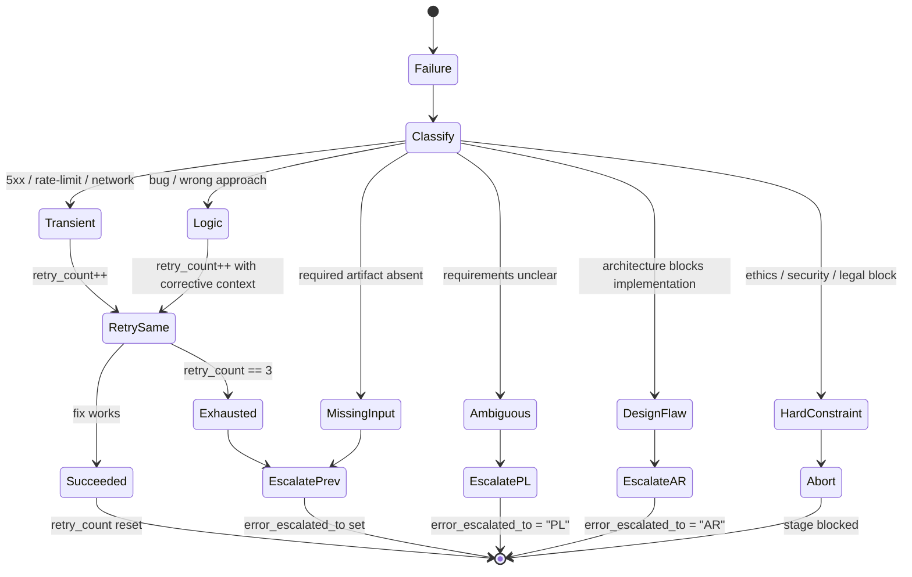

# Agent Coordination

Patterns for coordinating agents across worktask stages, managing handoffs, and handling errors.

**Stage codes and agents**: See `${CLAUDE_SKILL_DIR}/../shared/stage-codes.md`
**Task System tools**: See `${CLAUDE_SKILL_DIR}/../shared/task-system.md`

## Handoff Protocol

**Per-stage I/O contracts**: See `${CLAUDE_SKILL_DIR}/../shared/stage-contracts.md` for the full Inputs → Outputs → Validation table that every stage agent's Completion Verification references.

```
1. Current agent completes work (output matches stage-contracts Required Outputs)
2. Updates task: TaskUpdate({ taskId: "X", status: "completed" })
3. Creates stage artifact (e.g., `planning-0.md` for the first PL run, `planning-1.md` for the next; see `agents/product-manager.md § Plan File Naming`) with required sections
4. Writes compressed handoff (50-100 tokens)
5. Orchestrator validates against stage-contracts before transition
6. Next agent starts: TaskUpdate({ taskId: "Y", status: "in_progress" })
```

### Orchestrator → PL0 Handoff

Before PL0, the orchestrator creates `.context/exploration.md` with pre-explored
codebase facts. This eliminates PL0's need to re-explore the codebase.

The orchestrator's prompt to PL0 MUST include:
```
Read .context/exploration.md for codebase context.
Do NOT re-read files listed there unless you need additional detail.
```

#### `metadata.skip_exploration` Propagation

When PL0 has produced `.context/exploration.md`, every downstream task it creates (AR0, TL0, DV0, …) MUST receive:

| Metadata key | Type | Value |
|---|---|---|
| `skip_exploration` | boolean | `true` |
| `exploration_anchors` | string[] | List of `<file>#<anchor>` pointers — e.g. `["exploration.md#facts", "exploration.md#refs", "planning-0.md#requirements"]` |

##### Downstream honouring

Downstream agents (AR/TL/DV/DR) honour these by:

- Treating `exploration_anchors` as the authoritative pre-explored set.
- Not running Glob/Grep on the source tree for files already covered by the anchors.
- Reading only the listed anchors instead of full files.

##### Why & opt-out

**Why**: avoids redundant Glob/Grep cycles in AR/TL that PL has already paid the token cost for. Re-exploration is the largest avoidable AR/TL token expense after the cache prefix has been established.

**Opt-out**: an agent that needs to widen scope (e.g. AR detects an undeclared dependency) MAY ignore `skip_exploration` and explore further, but MUST log one `audit.jsonl` line `action: "exploration_extended"` with `metadata: {reason: "<why>"}` so reviewers can see the broadened scope.

### Stage Agent File Read Rules

| Stage | Read exploration.md | Read source files | Reason |
|-------|:------------------:|:-----------------:|--------|
| PL | Yes | No | Requirements only, no code changes |
| AR | Yes | Selective | Only files needing architectural analysis |
| TL | Yes | No | Coordination only |
| DV | Yes | Yes (modify targets) | Must read files it will modify |
| DR | Yes | Yes (changed files) | Must review actual changes |
| QA | Yes | Yes (changed files) | Must review actual changes |
| DC | Yes | No | Documentation from artifacts |

### Handoff Checklist

- [ ] Stage objectives completed
- [ ] Artifact created in `.context/`
- [ ] Task status updated
- [ ] Handoff summary prepared
- [ ] Open questions documented

## Error Handling

### Error Decision Tree



### Retry / Escalate Matrix

| Classification | Retry? | Max | Backoff | Escalation Target | Metadata Update |
|----------------|--------|-----|---------|-------------------|-----------------|
| `transient` | Yes | 3 | 2^n seconds | None (retry same agent) | `retry_count++` |
| `logic` | Yes | 2 | None | Same agent (add corrective context on retry 2) | `retry_count++` |
| `missing_input` | No | 0 | — | Previous stage per chain | `error_escalated_to` set |
| `ambiguous_requirements` | No | 0 | — | PL stage | `error_escalated_to = "PL"` |
| `design_flaw` | No | 0 | — | AR stage | `error_escalated_to = "AR"` |
| `hard_constraint` (ethics/security) | No | 0 | — | Abort + block human intervention | `error_escalated_to = "ST"` |
| `exhausted` (`retry_count == 3`) | No | — | — | Previous stage per chain | `error_escalated_to` set, `retry_count` reset on handoff |

#### Retry / Escalate Matrix — environmental contention

**QA-only** — DV's handful of executed tests cannot establish the trigger.

| Classification | Retry? | Max | Backoff | Escalation Target | Metadata Update |
|----------------|--------|-----|---------|-------------------|-----------------|
| `environmental_contention` | No | 0 | — | None — re-baseline once on a quiet machine | None; note in `testing-N.md § Notes`, no defect, no escalation |

**Trigger — all three, conjunctively:** failures confined to wall-clock/async-timing suites;
failing-set **membership** differs between two consecutive runs; no source change between them.

**Voiding branch (mandatory exit).** Membership "shifts" means the *set* differs — a member added
or dropped — not ordering, not duration. If the re-baseline run fails with the same members as the
previous run, the classification is **void**: reclassify as `logic` and escalate to DV.

### Escalation Chains

```
11-stage: ST→FN→RE→DC→QA→SR→DR→DV→TL→AR→PL→USER
9-stage:  ST→FN→DC→QA→DR→DV→TL→AR→PL→USER
Emergency: FN→RE→QA→DR→DV→IR→USER
Ethics: Any→ethics-reviewer→stakeholder→USER
```

### Error Documentation

Append to `.context/errors/<agent>.md` (per-agent, one file per `metadata.agent` basename). Single file shared across retries and task splits (DV0/DV1/DV2 → `developer.md`):

```markdown
## [STAGE][N] Retry [X/max] — [TIMESTAMP]
**Agent**: [agent name]
**Task ID**: [task_id]
**Classification**: [transient | logic | missing_input | ambiguous_requirements | design_flaw | hard_constraint | exhausted | environmental_contention]
### Problem
[Description]
### Resolution Path
- [ ] [Action]
```

Raw captures (build/test/monitor stdout) go to `.context/logs/` per `logging-conventions`.

## Parallel Execution

### Safe Combinations

| Pattern | Stages | Benefit |
|---------|--------|---------|
| Docs + QA | DC + QA | 30-40% time savings |
| Early Docs | DC during DV | Docs ready sooner |

### Worktree Parallelism

All megatask issues run in isolated worktrees. Each issue has its own working directory and branch, making safe parallelism unconditional:

| Pattern | Isolation | Safety |
|---------|-----------|--------|
| Parallel issues in megatask | Full source isolation per issue | Always safe |
| QA + DC parallel | Each has own copy | Always safe |
| Multiple DV stages across issues | Separate worktrees per issue | **SAFE** |
| Agent teams + megatask issues | Each teammate's own worktree | **Recommended** |

> Worktree isolation is always active — each DV stage and each megatask issue gets a separate working directory and branch, eliminating source-tree conflicts.

### Parallel Tool Call Safety

Failed `Read`, `WebFetch`, or `Glob` calls don't cancel sibling parallel tool calls. Failing read-only `Bash` calls (`grep`, `git diff`, `ls`, etc.) likewise don't cancel siblings — only mutating `Bash` errors cascade. This makes parallel reads, searches, and shell probes more reliable within agents.

### Never Parallelize

- AR before PL (needs requirements)
- DV before TL (needs coordination)
- QA before DV (can't test unwritten code)

## Audit Trail

Every material worktask action writes one JSONL line to `.context/logs/audit.jsonl`
(routed under the `logs/` folder per `logging-conventions` skill). The file is
append-only and outlives individual stage artifacts — on resume or incident
review, the audit tail is the single source of truth for what happened.

### Writers

| Actor | Action Examples |
|-------|-----------------|
| Orchestrator | `worktask_init`, `stage_transition`, `approval_received`, `resume`, `permission_mode_pinned`, `github_issue_created` |
| Stage agents | `artifact_created`, `error_recorded`, `retry_attempt`, `escalation`, `full_test_run`, `scoped_test_run` |
| `PermissionDenied` hook | `permission_denied` (auto-mode classifier blocks a tool) |

`full_test_run` / `scoped_test_run` are one row per test **invocation**, keyed on the invocation's
shape rather than the plan's mode: ≥1 `-only-testing:` flag → scoped, zero selection flags → full.
`build-only` runs invoke no tests and emit no row. `metadata: {stage, plan_mode, suites_selected,
run_index}` — carrying `plan_mode` alongside the shape is what makes "how often did we actually run
everything" answerable. **Audit-only, never a gate**: absence of a counter row must not block a
stage and must not appear in any completion checklist.

#### Writers — plugin hooks (authoritative)

| Actor | Action Examples |
|-------|-----------------|
| `hook:audit-subagent` (SubagentStop, plugin) **(authoritative)** | `subagent_stopped` (paired with cost-*.jsonl entry) — v3.10.0+. v3.10.6+ rows additionally carry `parent_agent_id`, `background_tasks_count`/`_ids`, `session_crons_count`/`_ids`, and `dedupe_key_extended` (see § Dedupe Key Migration below). |
| `hook:audit-tooluse` (PostToolUse, plugin) **(authoritative)** | `tool_invoked` for `TaskUpdate\|TaskCreate\|Write\|Edit` with `duration_ms` + `effort` — v3.10.0+ |
| `hook:precompact` (PreCompact, plugin) **(authoritative)** | `precompact_checkpoint` with `state_file` + `run_index` + `artifacts[]` — v3.10.0+ |
| `hook:agent-stop` (Stop, PL/FN/ST agents) **(authoritative)** | `stage_completion_hook` with `metadata.stage` — v3.10.0+. v3.10.6+ rows additionally carry `parent_agent_id`, `background_tasks_count`/`_ids`, `session_crons_count`/`_ids`, and `dedupe_key_extended`. |

#### Writers — external & adapters

| Actor | Action Examples |
|-------|-----------------|
| External dispatcher | `external_dispatch` (CI/cron/user-shell invoked a stage via `claude agents run` — see `references/headless-dispatch.md`) |
| `apple-canvas` adapter (in `dv-screenshot-capture`) | `canvas_render` (one row per phase ∈ scaffold\|complete\|retry — see `skills/dv-screenshot-capture/references/apple-canvas.md § Audit row schema`) |
| `preview-ensurer` skill | `preview_added` (one row per `#Preview` block written to source by SwiftSyntax driver — `metadata: {file, view_type, mock_strategy, lines_added}`) |
| QA visual-diff wrapper (`scripts/visual-diff.sh`) | `visual_diff_run` (one row per RMSE diff invocation — `metadata: {reference, candidate, metric:"RMSE", value_percent, threshold_percent, verdict}`) |

#### Hook authority + dedupe rule (v3.10.0+)

**Hook authority + dedupe rule (v3.10.0+):** rows emitted by plugin hooks carry `actor: "hook:<name>"` and `metadata.dedupe_key`. Agent-emitted rows for the same action remain forward-compatible (for installs where plugin hooks are disabled via `allowManagedHooksOnly: false` + plugin disabled) but are downgraded to **advisory**. Readers (`/cost-report`, resume protocol, incident-responder) MUST prefer the `hook:*` row when two rows share a `dedupe_key`. Dedupe-key shapes:

#### Dedupe-key shapes — tool & subagent

- `tool_invoked`: `"<session_id>:<tool_use_id>"`
- `subagent_stopped`: `"<session_id>:<agent_id>:<task_id>:stop"` (v3.10.1+; the `<task_id>` segment disambiguates back-to-back DV0/DV1 split-task retries where `agent_id` is constant. Pre-v3.10.1 producers may emit the legacy shape `"<session_id>:<agent_id>:stop"` — readers MUST treat both prefixes as the same key for a single `(session, agent, task)` row to preserve dedupe across the upgrade. Orchestrator populates `task_id` in hook stdin where the runtime exposes it; the hook degrades to legacy shape automatically when it is absent.)

#### Dedupe-key shapes — stage & issue

- `stage_completion_hook`: `"<session_id>:<agent_id>:stage:<PL|FN|ST>"`
- `github_issue_created`: `"<worktask_id>:<run_index>:gh_issue"` — collision on resume detects already-published; multi-track safety via `run_index` increment. Writer: orchestrator (via `skills/worktask/scripts/publish-pl-issue.sh` between PL approval and stage-loop entry).

### Dedupe Key Migration (v3.10.6+, auto-detecting)

v3.10.6 adds a second dedupe key — `metadata.dedupe_key_extended` — to every `subagent_stopped` and `stage_completion_hook` row. Both keys are written simultaneously; readers choose which to use based on a runtime auto-detection rule.

#### Key definitions

- `dedupe_key` (existing, BASE): `<session_id>:<agent_id>:stop` or `<session_id>:<agent_id>:stage:<stage>`. Compatibility-safe — every audit row carries this, every reader can grep it, every pre-v3.10.6 file is readable.
- `dedupe_key_extended` (v3.10.6+): prepends `<parent_agent_id>:` to the base key. Today evaluates to `none:…` everywhere (parent_agent_id is `"none"`), so dedupes identically to base. When CC starts populating `parent_agent_id` in hook stdin, gains parent-aware granularity automatically — useful for multi-track parallel runs where the same `agent_id` appears under different dispatch parents.

#### Auto-detection rule (full reader cut-over)

**Auto-detection rule (full reader cut-over):** readers MUST call the canonical helper `hooks/audit-dedup.sh --check-mode` (plugin root: `${CLAUDE_PLUGIN_ROOT}` if available, else resolve per `skills/shared/plugin-root-resolution.md`) which scans the tail of `.context/logs/audit.jsonl` and prints one word to stdout:

- `base` — when no rows in the rolling 100-row window have `metadata.parent_agent_id != "none"`. Reader dedups on `metadata.dedupe_key`.
- `extended` — when ≥1 row in the rolling 100-row window has a non-`"none"` `parent_agent_id`. Reader dedups on `metadata.dedupe_key_extended`.

#### Cut-over & reader contract

The helper handles cut-over transparently. On CC versions where parent_agent_id is unpopulated (today), it always returns `base`. The moment CC surfaces the field in hook stdin and a single row carries a real parent, all conforming readers switch to extended without redeploy.

**Reader contract**: anything that dedupes audit rows (`/cost-report`, manual `jq` scripts, future automation) calls the helper exactly once at startup and pins the result for the rest of the run. Mixed-mode dedup within a single run is forbidden.

#### Pre-v3.10.6 compat

**Pre-v3.10.6 compat**: pre-v3.10.6 audit.jsonl files lack `dedupe_key_extended` — the helper detects absence on the first row and falls back to `base` even if `parent_agent_id` shows up in later rows. This keeps existing audit files readable without migration.

The hook authority + dedupe rule from the previous paragraph still applies — `hook:*` rows remain authoritative; the only delta is which key (`dedupe_key` vs `dedupe_key_extended`) is used for the collision check.

### Schema

```jsonc
{
  "ts": "ISO-8601 UTC",
  "actor": "orchestrator|<agent-name>|hook:<name>",
  "action": "worktask_init|stage_transition|artifact_created|error_recorded|retry_attempt|escalation|approval_received|resume|permission_denied|subagent_stopped|tool_invoked|precompact_checkpoint|stage_completion_hook|permission_mode_pinned|external_dispatch|github_issue_created|canvas_render|preview_added|visual_diff_run|full_test_run|scoped_test_run",
  "subject": "task ID or artifact path",
  "result": "ok|error|deferred|blocked",
  "task_id": "optional — Task System ID",
  "artifact": "optional — .context/ path",
  "metadata": { "...": "action-specific extras" }
}
```

#### v3.10.6+ metadata fields

For `subagent_stopped` and `stage_completion_hook` rows written by plugin hooks (v3.10.6+), `metadata` carries these optional fields in addition to action-specific extras:

- `duration_ms` (subagent_stopped only): number
- `effort`: `"low"|"medium"|"high"|"xhigh"|"max"|"unknown"`
- `stage` (stage_completion_hook only): `"PL"|"FN"|"ST"`
- `parent_agent_id`: string — defaults to `"none"` when not in hook stdin
- `background_tasks_count`: integer ≥ 0
- `background_task_ids`: string[] — may contain `"unknown"` entries; see `references/hook-monitoring.md § BG-Task ID Schema Watch`
- `session_crons_count`: integer ≥ 0
- `session_cron_ids`: string[] — may contain `"unknown"` entries; see `references/hook-monitoring.md § BG-Task ID Schema Watch`
- `dedupe_key`: string (BASE shape, always present)
- `dedupe_key_extended`: string (v3.10.6+; see § Dedupe Key Migration)

### Append Pattern (Bash)

```bash
mkdir -p .context/logs
jq -c --arg ts "$(date -u +%FT%TZ)" \
  '. + {ts: $ts}' <<< '{"actor":"orchestrator","action":"stage_transition","subject":"DV0→DR0","result":"ok","task_id":"4"}' \
  >> .context/logs/audit.jsonl
```

### Retention

Follows `.context/` hygiene — cleared on task archival (FN stage or `/worktask`
completion). Do NOT rotate within a task; the full trail is required for
PostCompact recovery and incident post-mortems.

## Task Decomposition

When should a stage split into sub-tasks? The decision depends on *who* initiates
the split and *what* the dependency shape is. Pick one pattern — do not mix.

### Decision Table

| Condition | Pattern | Effect | Example |
|-----------|---------|--------|---------|
| Independent sub-scopes, different owners | **TL-initiated (parallel)** | DVN tasks blocked by TL0; all run concurrently; DR0 blocked by all DVN | `theme colors` + `theme switcher` + `dark assets` |
| Sequential discovery (later work depends on earlier) | **DV-initiated (sequential)** | DVN tasks blocked by DV0; run one after another | `implement auth` then `migrate existing users` then `deprecate old endpoints` |
| Single cohesive scope with <3 files | **No split** | DV0 handles entirely | `fix null check in login validator` |
#### Decision Table — refactor & retry rows

| Condition | Pattern | Effect | Example |
|-----------|---------|--------|---------|
| Cross-cutting refactor spanning many modules | **TL-initiated (parallel)** with `track` metadata | Each stream gets own worktree | `rename User → Account across auth/api/db` |
| Stage already failed and retry needs narrower scope | **DV-initiated (sequential)** | DV1 creates focused retry; retry_count resets | DV0 failed on full feature → DV1 focused on auth module only |

See `worktask/references/initialization-patterns.md § Stage Sub-Task Splitting`
for full code patterns.

### When NOT to Split

- **PL/FN/ST** — always singletons (PL0, FN0, ST0). Do not split.
- **Trivial scope** — splitting a 5-file change into 3 sub-tasks adds orchestration cost without benefit.
- **Shared mutable state** — if two streams need to edit the same file, serialize instead of parallelizing (merge conflicts cost more than the latency saved).

## Agent Selection

### Sub-Task Delegation

| Sub-Task | Delegate To | Model |
|----------|-------------|-------|
| Status check | Self | haiku |
| Code implementation | developer | opus |
| Architecture question | software-architector | opus |
| Platform architecture (apple/systems/android/web/backend/ai) | the platform's architect agent — roster in `skills/shared/compatible-plugins.md § Functional-role agents` | opus |
| Technical decision | technical-lead | opus |
| Test design | qa-engineer | sonnet |

> **Cross-plugin AR collaboration**: For platform projects, `software-architector` consults the platform's architect agent during AR stage for platform-specific architecture (pattern selection, DI, navigation, concurrency for Apple; the equivalent concerns per platform). See `agents/software-architector.md § Platform Architecture Collaboration` for the per-platform table and `cross-plugin-handoff` skill for the full protocol.

#### Nested delegation

> **Nested delegation**: sub-agents spawn their own sub-agents, up to **3 levels deep** by default (`CLAUDE_CODE_MAX_SUBAGENT_SPAWN_DEPTH`; `=1` disables nesting entirely). Depth counts **from the session root**, so the main session is depth 0 and its directly-dispatched stage agent is depth 1. The canonical DV chain — session → `developer` (1) → `apple-developer:ios-developer` (2) → `apple-developer:test-generator` (3) — sits exactly on the default ceiling; the orchestrator does not flatten Tier-2 dispatch into its own loop.

##### Depth budget sharing

> Foreground and background subagents share the same depth budget — a foreground chain plus a backgrounded child count against one cap. Budget accordingly: each level summarizes results upward, and `/cost-report`'s `dispatch_depth` column makes depth visible.

> **`/megatask` consumes a level**: a batch run dispatches a per-issue `/worktask` orchestrator as its own sub-agent (depth 1), pushing that same DV chain to depth 4 — one past the default. Raise `CLAUDE_CODE_MAX_SUBAGENT_SPAWN_DEPTH` before the batch, or accept a flattened Tier-2 dispatch. See `skills/megatask/SKILL.md § Nesting-depth budget`.

#### Pre-launch spawn classification

> **Pre-launch spawn classification**: in auto mode the permission classifier evaluates a subagent spawn **before** it launches, so a dispatch can be denied up front (`PermissionDenied` hook fires). The orchestrator must handle a refused spawn — treat a denied dispatch like a failed stage and route per the retry/escalate matrix rather than assuming every `Task(...)` starts.

#### Background-by-default dispatch

> **Background-by-default dispatch**: subagents run in the **background by default** — the dispatching agent keeps its turn and receives the child's result as a completion notification. Two consequences for the worktask loop: (1) a `Task()` launch acknowledgement is NOT stage completion — advance a stage (Step 6.5, `TaskUpdate(completed)`) only on the completion notification or the `subagent_stopped` audit row (`skills/worktask/SKILL.md § Orchestrator Execution Loop`); (2) unblocked sibling stages (parallel DVN tracks, DC+QA) genuinely overlap with no extra orchestration.

##### Depth accounting & background permission prompts

> Depth accounting stays correct across resume: resumed subagents restore their original spawn depth and forked subagents count toward the depth cap. A resumed background agent also restores its **own prompt and tool restrictions** rather than reverting to the default agent, so a reattached stage row is still that stage's agent — reattach is safe, re-dispatch is not required for identity reasons alone. Permission prompts from background subagents surface in the main session — dialog names the asking agent; Esc denies just that tool — instead of being auto-denied, so an unattended run parks on them (see the resume `waitingFor` branch table).

##### Per-session subagent spawn cap

> A session caps total subagent spawns at **200** by default (`CLAUDE_CODE_MAX_SUBAGENTS_PER_SESSION`; raise it before a run known to exceed the cap). Distinct from the nesting-depth budget above — this is a running *count* of every spawn in the session regardless of depth. `/clear` resets the counter. A single `/megatask` run is the plugin's most likely path to the default cap — see `skills/megatask/SKILL.md § Track Derivation` for the per-batch spawn estimate and when to raise the env var or split the batch.

##### Three independent ceilings

> A dispatch can be refused by any one of three caps; they are counted separately and raised separately. Check all three before a wide fan-out, not just the one that bit last time.

| Ceiling | Default | Env override | Counts |
|---------|---------|--------------|--------|
| Nesting depth | 3 | `CLAUDE_CODE_MAX_SUBAGENT_SPAWN_DEPTH` | Levels below the session root; `=1` disables nesting |
| Concurrently running | 20 | `CLAUDE_CODE_MAX_CONCURRENT_SUBAGENTS` | Agents alive *right now*, at every depth |
| Total per session | 200 | `CLAUDE_CODE_MAX_SUBAGENTS_PER_SESSION` | Every spawn since session start; `/clear` resets |

###### Concurrency is the easy one to hit

> Background-by-default dispatch keeps stage agents alive simultaneously that would once have been sequential, and each nested Tier-2 specialist counts while it runs. `/megatask` is the worst case — `parallel_tracks` per-issue orchestrators, each with a live stage agent and its nested children. Project peak concurrency, not just the total, at the R1 gate.

###### Budget halts are not stage failures

> When `--max-budget-usd` trips, new spawns are denied *and running background subagents are halted*. A stage that disappears mid-work under a budget stop must be re-dispatched after the budget is raised — it must **not** consume one of that stage's 3 retries, which are reserved for genuine stage failures (see `skills/worktask/references/resume.md`).

### Model Selection

```
Mechanical/rule-based → haiku
Multi-step reasoning → sonnet
Tradeoff analysis → opus
Architectural implications → opus
```

**Rule**: Prefer reading artifacts over agent invocation when possible.

### Per-Invocation Model Override

The Task tool `model` parameter allows per-invocation overrides:

```
Task({ subagent_type: "igrsoft:developer", model: "opus" })
```

> **Parameterized permission syntax**: permission rules accept a `Tool(param:value)` form with `*` wildcard support — e.g. `Agent(model:opus)` permits only opus-model spawns, `Agent(model:*)` permits any model override. Use this to constrain which dispatch overrides auto mode may take without hand-listing every agent. `Agent(type)` deny rules and `Agent(x,y)` allowed-types restrictions are enforced for **named** subagent spawns too.

#### Model aliases, allowlists & @-mentions

> Agent teams inherit the leader's model. Teammates use the parent session's model unless explicitly overridden. Model aliases (`fable`/`opus`/`sonnet`/`haiku`) work correctly across all providers (Anthropic, Bedrock, Vertex, Foundry). Allowlist caveat: a managed `availableModels` list constrains subagent model overrides too, and `enforceAvailableModels` constrains the Default model — a valid alias may silently resolve to a different model; see `skills/worktask/SKILL.md § Pre-Stage Validation` step 6.

> Named subagents appear in `@`-mention typeahead suggestions, making it easier to reference and communicate with running agents via `SendMessage`.

#### SendMessage authority hardening

> **SendMessage authority hardening**: a relayed `SendMessage` does not carry the originating user's authority. Receivers **refuse relayed permission requests**, and auto mode blocks them outright. A reattach can *nudge* a parked agent (re-prompt, supply an awaited answer) but cannot *authorize* a permission escalation. Permission escalations remain operator-owned — never satisfy them via a relayed message. (The PL gate is operator-owned and cannot be satisfied by a relayed message; this caveat covers both permission escalations and the PL approval gate.)

#### Skill discovery & subagent_type resolution

> Subagents discover project + user + plugin skills natively. Orchestrators do not need to inline-load skill instructions before delegation — the child can resolve `Skill("name")` from any source the parent could. This holds at every nesting depth: a Level-3 child resolves skills the same way a Level-1 child does.

> `subagent_type` matching is case- and separator-insensitive. `Task({ subagent_type: "IGRSoft:Developer" })` resolves to the same agent as `igrsoft:developer`. Bare-name → `igrsoft:` prefix convention still applies for resolution priority, but typos in case/separator no longer fail-stop the call.

#### Dispatch flags & /agents UI

> `claude agents` dispatch flags (`--cwd`, `--add-dir`, `--settings`, `--mcp-config`, `--plugin-dir`, `--permission-mode`, `--model`, `--effort`, `--dangerously-skip-permissions`) are mapped to `task.metadata` fields per the **`references/headless-dispatch.md`** translation table. PL0 populates the optional fields per `agents/product-manager.md § Optional dispatch metadata`; external runners consume them via the canonical one-liner in `commands/worktask.md § Headless dispatch`.

> `/agents` displays a tabbed layout (Running/Library tabs) with a `* N running` indicator next to agent types with live instances.

### Agent Naming & Collision Avoidance

Claude Code keys installed agents by the YAML frontmatter `name`, so two plugins shipping the same agent name silently overwrite each other when installed together. Common collision-prone stems include `developer`, `qa-engineer`, `incident-responder`, `designer`, `technical-writer` — all generic across marketplaces. (Source: ai-research PR #554.)

#### Naming mitigation & authoring audit

For new agents, prefer **plugin-scoped names** (`<plugin>-<role>`, e.g. `igrsoft-developer`) when the role is generic. For the 16 existing igrsoft agents, the orchestrator disambiguates today via `igrsoft:<name>` prefixes (see USER `CLAUDE.md § Orchestrator Rules` — bare names prepend `igrsoft:`; qualified names like `apple-developer:ios-developer` are used as-is), so no rename is forced — renaming would cascade into every `Task(subagent_type=…)` reference (high blast radius).

When authoring new agents via `/create-agent` / `/optimize-agent`, audit the `name:` field against known marketplace stems (`apple-developer:`, `security-scanning:`, `debugging-toolkit:`) before merging. `/optimize-agent § Frontmatter Audit` flags this as P1.

### Monitor Tool for Background Events

The `Monitor` tool streams events (stdout lines) from background scripts started
via Bash with `run_in_background`. Event-driven — no polling loops. Tee the
background stream into `.context/logs/monitor-<agent>-<timestamp>.log` so the
capture persists after the Monitor session ends — see `logging-conventions` skill.

#### Per-Stage Monitor Usage

| Stage | Scenario | Background Command | Monitor Purpose |
|-------|----------|--------------------|-----------------|
| DV | Build iteration during implementation | `xcodebuild … 2>&1 \| tee .context/logs/build-<slug>-<ts>.log` | Watch compile errors live; abort early on first failure |
| DV | Swift Package resolution | `swift build 2>&1 \| tee .context/logs/build-spm-<ts>.log` | Detect dependency resolution issues |
| QA | XCTest run | `xcodebuild test … 2>&1 \| tee .context/logs/test-<slug>-<ts>.log` | Stream pass/fail per test; stop on first red |
| QA | Simulator app logs | `xcrun simctl spawn … log stream … \| tee .context/logs/sim-<dev>-<ts>.log` | Watch runtime behavior during manual test |

##### Monitor usage — IR/DR/SR/RE/FN

| Stage | Scenario | Background Command | Monitor Purpose |
|-------|----------|--------------------|-----------------|
| IR | Production log tail | `ssh prod tail -f /var/log/app.log \| tee .context/logs/incident-<ts>.log` | Identify recurring error pattern |
| DR/SR | Static analysis | `swiftlint --reporter json 2>&1 \| tee .context/logs/monitor-lint-<ts>.log` | Stream warnings to triage severity in real time |
| RE | Release build | `xcodebuild archive … 2>&1 \| tee .context/logs/build-release-<ts>.log` | Watch signing / archive steps; abort on signing failure |
| FN | CI run after push | `gh run watch <run-id> \| tee .context/logs/monitor-ci-<ts>.log` | Watch PR checks progress |

##### Common pattern

**Common pattern**: start background Bash with `run_in_background: true`, note
the returned shell ID, then attach `Monitor` to that ID. When Monitor detaches
(timeout, stage transition), the `.log` file is still readable via `Read`.

#### Stall Timeout

Subagents stalled for more than 10 minutes fail with a clear error rather
than hanging indefinitely. Monitor sessions inherit this guard — if the
background process stops producing output for >10min, treat as failure and
escalate per `Error Handling § Retry / Escalate Matrix`.

Idle background shells may additionally be reaped under memory pressure —
set `CLAUDE_CODE_DISABLE_BG_SHELL_PRESSURE_REAP=1` on hosts
where a long-lived monitor or `tee` pipe must survive; the `tee`'d
`.context/logs/*.log` file remains the durable record either way.

### MCP Large Result Handling

MCP servers can annotate tool results with `_meta["anthropic/maxResultSizeChars"]` to allow results up to 500K characters without truncation. Useful for large outputs like database schemas or build logs from XcodeBuildMCP.

### MCP Auto-Background

Any MCP tool call running past the auto-background threshold (default **2 minutes**; tune or disable with `CLAUDE_CODE_MCP_AUTO_BACKGROUND_MS` — per-dispatch scoping is only real for an external headless dispatch launched with its own environment; in-process `Task()` dispatches share the session's setting) is moved to the background by Claude Code itself — the calling agent gets back a background-task handle, not the terminal result. Handle it exactly like a backgrounded `Task()` dispatch (`§ Background-by-default dispatch` above):

#### Handling a backgrounded MCP call

- Do NOT parse the handle/acknowledgement as the build/test outcome — await the completion notification (or poll the task) before reading results.
- Any completion gate that reads a log or artifact the MCP call produces (e.g., `developer § D1`'s `build-developer-*.log`) MUST wait for the real completion signal — a log still being written is not "done"; file presence alone proves nothing.
#### MCP auto-background threshold tuning

- XcodeBuildMCP `build_sim` / `build_run_sim` / `test_sim` routinely exceed 2 minutes — DV/DR/QA flows that chain on their results must await between steps.
- Raise or disable the threshold only when a run genuinely needs a synchronous result within one turn (e.g., DV's edit-batch-build fix-up cycle diagnosing a full log in one pass) — practical only for external headless dispatches with their own environment; avoid raising it session-wide, since every other MCP call in that session loses the safety net.

### MCP Tool Inheritance

Subagents inherit MCP tools from MCP servers that are **already running** in the parent session at delegation time. Cross-plugin MCP tools (XcodeBuildMCP, Pencil, etc.) are available to stage agents without explicit `tools:` frontmatter entries for each MCP tool — **provided the parent has already spawned the server**.

#### Lazy-spawn warmup requirement

For lazy-spawned servers — anything registered as `npx -y …` over stdio (XcodeBuildMCP, Pencil, etc.) — Claude Code starts the process only on the first tool call in a given session. Subagents inherit the server reference but inheritance does NOT trigger a spawn. If the orchestrator delegates before any tool call, the child (especially under `isolation: worktree`) inherits an unstarted reference and the first `mcp__<server>__*` call fails with "tool not available".

The orchestrator MUST issue one warmup call before delegating to a child that needs a lazy-spawned server. See `worktask § Pre-DV MCP warmup` for the canonical pattern (trigger conditions, retry budget, audit lines, fallback banner). The pattern generalises to any new lazy-spawn MCP — add a new trigger block when introducing one.

### MCP Unavailability Detection

Both warmup sites (`worktask § Pre-DV MCP warmup`, `developer § MCP Build Verification`) classify warmup failures with one canonical regex. Match against the normalised error message — `String(err.message ?? err).slice(0, 500)`, case-insensitive:

```
MCP_UNAVAILABLE_RE = /(tool not available|server (not reachable|unavailable)|connection refused|ECONNREFUSED|EPIPE|ETIMEDOUT|timed? ?out|spawn ENOENT|command not found|InputValidationError)/i
```

This is a **closed list of known-transient outages**, not a catch-all. Errors outside the list (e.g., `TypeError`, schema-validation failures, assertion errors) are real bugs and MUST propagate — do not retry, do not fall back. New lazy-spawn MCPs that surface a new transient error string SHOULD extend this regex here rather than redefine the match locally.

### Subagent Worktree Access

Sub-agents in isolated worktrees automatically receive Read/Edit access to their own worktree directory. No explicit tool grant needed.

#### Git isolation is runtime-enforced

> A worktree-isolated subagent **cannot** redirect git at the shared checkout — `git -C <shared path>`, `--git-dir`, `GIT_DIR`, and `GIT_WORK_TREE` are all blocked. Worktree isolation is an enforced boundary, not a convention the DV agent is trusted to honor, so an escape attempt fails loudly instead of silently polluting the parent tree.
>
> The inverse direction is still allowed: a **parent** session may reach into a worktree with `git -C .worktrees/…` (that is what `skills/shared/milestone-helpers/SKILL.md § Git Commands Reference` documents). Inside a worktree, use plain `git` against the inherited cwd. A worktree session also no longer lands in another project's leftover worktree when the working directory does not match the selected project.

### Background Subagent Partial Progress

Background subagents that fail report partial progress instead of returning nothing. Orchestrators can inspect partial results for recovery.

Error propagation is trustworthy: a subagent cut off by a rate limit or server error returns its **partial work** to the parent; an API error (e.g. usage limit reached) is reported to the parent as an **error** rather than a successful-looking result; and a cutoff before any text fails cleanly instead of returning an empty result. A teammate that dies on an API error reports `failed` to the lead. Classify these as `transient` per § Retry / Escalate Matrix — never treat an errored return as stage completion (see `skills/worktask/SKILL.md` Step 6.5 completion-signal rule).

### Forked Subagents

External builds of Claude Code can enable forked subagents by setting `CLAUDE_CODE_FORK_SUBAGENT=1`. This also works in non-interactive sessions (SDK and `claude -p`). Use forked subagents when a stage needs a deterministic snapshot of the parent's context rather than a fresh session.

> Command-surface note: the `/fork` slash command copies the conversation into a new **background session** (its own row in `claude agents`); the in-session forked-subagent behavior it used to launch lives at `/subtask`. Neither replaces the env-var mechanism above.

### Subagent Worktree Isolation Reuse

Agent tool with `isolation: "worktree"` never reuses **stale** worktrees from prior sessions — each delegation gets a fresh worktree. Removes the failure mode where a previous run's untracked files leaked into a new stage.

### Subagent cwd Restoration on Resume

Subagents resumed via `SendMessage` correctly restore the explicit `cwd` they were spawned with. Stages that resume mid-task do not fall back to the parent's cwd unexpectedly.

### TaskList Sort Order

`TaskList` returns tasks **sorted by ID**. Stage agents can rely on iteration order matching creation order for stable handoff math (e.g., "the latest DV task is the highest-numbered DVN").

## Coordination Patterns

### Sequential Pipeline (Default)
```
PL→AR→TL→DV→DR→QA→DC→FN→ST
```

This is the full reference pipeline, not the set that runs. PL0 sizes the actual stage set; **AR** and **TL** are optional (`skills/estimation-methodology/SKILL.md § Stage Inclusion Criteria`), so the live chain may be `PL→AR→DV→…` or `PL→DV→…`.

### Parallel Documentation
```
       ┌→ DC ─┐
DR →──┤       ├→ FN
       └→ QA ─┘
```

### Quick Worktask
```
PL → DV → DR → QA
```

### Micro Execution
```
[Figma capture if URL provided] → Present plan → DV only
```

## Handoff Message Format

```markdown
## [FROM]→[TO] Handoff

**Summary**: [One sentence]

**Deliverables**:
- [Artifact]: [purpose]

**Open Items**:
- [Question for next stage]
```

## Escalation Message Format

```markdown
## Escalation: [FROM]→[TO]

**Type**: [dependency|architecture|requirements]
**Severity**: [blocking|degraded]

**Problem**: [Description]
**Attempted**: [What was tried]
**Needed**: [Specific ask]
```

## Stage-Specific Handoffs

### DV → SR (Security Review)
```markdown
**Security-Sensitive Areas**:
- [Area]: [why relevant]
**Recommended Focus**: Auth, data handling, APIs
```

### SR → QA
```markdown
**Security Status**: [Approved|Blocked|Conditional]
**Critical/High Findings**: [count]
**Security Tests Recommended**: [list]
```

### DC → RE (Release Engineering)
```markdown
**Commit Summary**: [feat/fix list]
**Recommended Version Bump**: [MAJOR|MINOR|PATCH]
```

### IR → DV (Emergency)
```markdown
**Incident ID**: INC-[N]
**Severity**: P[0-3]
**Required Fix**: [specific change]
**Constraints**: Minimal change, no refactoring
```

## Constitutional Coordination

Ethics-reviewer can be invoked at any stage:
- Optional: `--ethics-review` flag
- Mandatory: High-risk feature detected
- Escalation: Agent flags concern
- Hard constraint: Immediate stop

### Honesty in Handoffs

| Property | Requirement |
|----------|-------------|
| Truthful | Accurate status claims |
| Calibrated | Appropriate uncertainty |
| Transparent | No hidden issues |

## Multi-Reviewer Coordination

### Review Dimension Allocation

| Dimension | Focus | Include When |
|-----------|-------|-------------|
| **Security** | Vulnerabilities, auth, input validation | Code handling user input or auth |
| **Performance** | Query efficiency, memory, caching | Data access or hot path changes |
| **Architecture** | SOLID, coupling, patterns | Structural changes or new modules |
| **Testing** | Coverage, quality, edge cases | New functionality added |
| **Accessibility** | WCAG, ARIA, keyboard nav | UI/frontend changes |

### Recommended Review Combinations

| Scenario | Dimensions |
|----------|-----------|
| API endpoint changes | Security, Performance, Architecture |
| UI component changes | Architecture, Testing, Accessibility |
| Data model changes | Security, Performance, Architecture |
| New feature (full) | Security, Performance, Architecture, Testing |

### Finding Consolidation

When multiple reviewers report findings:
1. **Deduplicate**: Merge findings at same file:line
2. **Resolve conflicts**: Use higher severity when reviewers disagree
3. **Organize by severity**: Group as Critical > High > Medium > Low
4. **Cross-reference**: Note findings appearing in multiple dimensions

### Severity Calibration

| Severity | Criteria | Action |
|----------|----------|--------|
| Critical | Exploitable, high impact, easy to find | Block release |
| High | Exploitable or significant impact | Fix before merge |
| Medium | Potential risk, moderate impact | Track, fix soon |
| Low | Minor risk, defense in depth | Advisory |

## Task Decomposition for Parallel Work

### File Ownership Boundaries

When decomposing work for parallel agents:
1. Assign exclusive file ownership per agent — no overlap
2. Define interface contracts at ownership boundaries
3. Create shared types/interfaces before parallel execution
4. Never modify files owned by another agent without team-lead approval

### TL-Initiated DV Splitting

TL can split DV0 into parallel streams (DV0, DV1, DV2...) during coordination. Each stream runs in its own worktree after TL completes. The orchestrator picks up new tasks via `TaskList()` refresh — no loop changes needed.

**Split criteria**: 2+ independent file groups with cleanly separable ownership and small interface surface between streams.

**Anti-patterns**:
- Splitting tightly coupled files across streams (causes merge conflicts)
- Splitting small scope work (coordination overhead exceeds time saved)
- Missing DR0 rewiring (DR0 must depend on ALL DVN tasks, not just DV0)

**Coordination artifact**: TL documents the split in `.context/coordination-N.md` with a "Parallel Streams" section listing each stream's scope, file ownership, and interface contracts.

### Hypothesis-Driven Debugging

For complex bugs with multiple potential causes:
1. Generate N hypotheses covering different failure categories
2. Assign each hypothesis to an investigator agent
3. Each investigator gathers confirming/falsifying evidence
4. Arbitrate across findings, rank by confidence and evidence strength

See references/ for hook-based monitoring (including PermissionDenied, StopFailure, CwdChanged, FileChanged, TaskCreated, WorktreeCreate hooks, PreToolUse defer/blocking, conditional `if` field for hook filtering, PostToolUse format-on-save safety, MCP-tool-typed hooks, `duration_ms` in PostToolUse payload, and PostToolUse output replacement via `updatedToolOutput`), agent teams comparison, MCP elicitation patterns, and team communication protocols (message types, anti-patterns, deadlock resolution).

## Native Dynamic Workflows vs igrsoft Staged Worktask

Claude Code ships a native `/workflows` command and Workflow tool for **dynamic workflows** — ad-hoc background fan-out to tens-to-hundreds of concurrent agents with lightweight coordination. This is complementary to (not a replacement for) the igrsoft 11-stage worktask system:

### Comparison

| Dimension | Native dynamic workflows (`/workflows`) | igrsoft staged worktask |
|---|---|---|
| **Scale** | Tens–hundreds of parallel agents | 11 governed sequential/parallel stages |
| **Governance** | Ad-hoc, minimal overhead | Stage contracts, artifact audit trail, DR/SR/QA quality gates |
| **Use case** | One-off fan-out (e.g. scan 500 files in parallel) | Full feature development with DR/SR/QA quality gates |
| **State management** | Orchestrator-in-context | `.context/state.json`, Task System, audit.jsonl |
| **Resume / rollback** | Manual | Resume Procedure, state.checkpoint-*.json |

### When to reach for each

- Reach for native dynamic workflows when you need quick parallelism without governance overhead (e.g., batch linting, parallel research, one-off data transforms).
- Reach for the igrsoft worktask when work requires security review, QA sign-off, documentation, or any multi-stage handoff contract with audit trail. Worktasks have two human checkpoints — the PL gate (plan approval after PL0) and the FN gate (finalization approval, which STOPs before commit/push/PR by default); both are bypassed by `--emergency`, the PL gate also by `--auto-plan` and the FN gate also by `--auto-finalization`. A batch orchestrator (`/megatask`) stamps `plan_gate`/`fn_gate: "bypass"` directly on each per-issue PL0.

### Composition & workflow sizing

They can compose: a DV agent inside an igrsoft worktask may itself spin up a native dynamic workflow to parallelize sub-tasks, then consolidate results before its DR handoff.

#### Workflow size guideline

> Naming note: the `/config` **"Dynamic workflow size"** setting (advisory agent counts) governs **native dynamic workflows** only — it is unrelated to PL0 dynamic *sizing* (complexity-scored stage selection). It defaults to **medium** (aim for fewer than 15 agents), is settable from any settings file via `workflowSizeGuideline`, and the active default appears in the running-workflow status line. An 11-stage worktask is not "oversized" by this guideline — but a DV fan-out composed *on top of* a worktask is, and it spends from the same 20-concurrent / 200-total spawn budgets.

> Workflow-spawned agents carry `workflow.run_id`/`workflow.name` OpenTelemetry attributes, so a composed DV fan-out can be reconstructed from OTel data alongside the plugin's audit trail.

### Gate prompts (AskUserQuestion)

> Claude reserves multiple-choice / AskUserQuestion prompts for genuine decisions that require user input. After the PL plan-approval gate, stage transitions are automatic — the PL gate itself is the one `AskUserQuestion` checkpoint; intra-loop transitions proceed without user confirmation. `AskUserQuestion` dialogs do not auto-continue on idle by default — a PL/FN gate park holds indefinitely until the operator answers; the idle-timeout auto-continue is an explicit `/config` opt-in and MUST stay off on hosts running gated worktasks.

