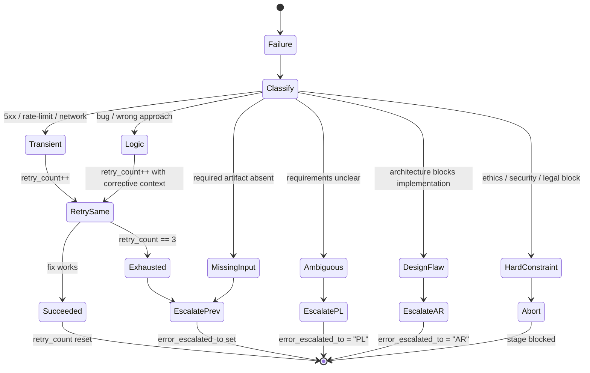

# Agent Coordination

Patterns for coordinating agents across workflow stages, managing handoffs, and handling errors.

**Stage codes and agents**: See `${CLAUDE_SKILL_DIR}/../shared/stage-codes.md`
**Task System tools**: See `${CLAUDE_SKILL_DIR}/../shared/task-system.md`

## Handoff Protocol

**Per-stage I/O contracts**: See `${CLAUDE_SKILL_DIR}/../shared/stage-contracts.md` for the full Inputs → Outputs → Validation table that every stage agent's Completion Verification references.

```
1. Current agent completes work (output matches stage-contracts Required Outputs)
2. Updates task: TaskUpdate({ taskId: "X", status: "completed" })
3. Creates stage artifact (e.g., `planning-0.md` for the first PL run, `planning-1.md` for the next; see `agents/product-manager.md § Plan File Naming`) with required sections
4. Writes compressed handoff (50-100 tokens)
5. Orchestrator validates against stage-contracts before transition
6. Next agent starts: TaskUpdate({ taskId: "Y", status: "in_progress" })
```

### Orchestrator → PL0 Handoff

Before PL0, the orchestrator creates `.context/exploration.md` with pre-explored
codebase facts. This eliminates PL0's need to re-explore the codebase.

The orchestrator's prompt to PL0 MUST include:
```
Read .context/exploration.md for codebase context.
Do NOT re-read files listed there unless you need additional detail.
```

#### `metadata.skip_exploration` Propagation

When PL0 has produced `.context/exploration.md`, every downstream task it creates (AR0, TL0, DV0, …) MUST receive:

| Metadata key | Type | Value |
|---|---|---|
| `skip_exploration` | boolean | `true` |
| `exploration_anchors` | string[] | List of `<file>#<anchor>` pointers — e.g. `["exploration.md#facts", "exploration.md#refs", "planning-0.md#requirements"]` |

Downstream agents (AR/TL/DV/DR) honour these by:

- Treating `exploration_anchors` as the authoritative pre-explored set.
- Not running Glob/Grep on the source tree for files already covered by the anchors.
- Reading only the listed anchors instead of full files.

**Why**: avoids redundant Glob/Grep cycles in AR/TL that PL has already paid the token cost for. Re-exploration is the largest avoidable AR/TL token expense after the cache prefix has been established.

**Opt-out**: an agent that needs to widen scope (e.g. AR detects an undeclared dependency) MAY ignore `skip_exploration` and explore further, but MUST log one `audit.jsonl` line `action: "exploration_extended"` with `metadata: {reason: "<why>"}` so reviewers can see the broadened scope.

### Stage Agent File Read Rules

| Stage | Read exploration.md | Read source files | Reason |
|-------|:------------------:|:-----------------:|--------|
| PL | Yes | No | Requirements only, no code changes |
| AR | Yes | Selective | Only files needing architectural analysis |
| TL | Yes | No | Coordination only |
| DV | Yes | Yes (modify targets) | Must read files it will modify |
| DR | Yes | Yes (changed files) | Must review actual changes |
| QA | Yes | Yes (changed files) | Must review actual changes |
| DC | Yes | No | Documentation from artifacts |

### Handoff Checklist

- [ ] Stage objectives completed
- [ ] Artifact created in `.context/`
- [ ] Task status updated
- [ ] Handoff summary prepared
- [ ] Open questions documented

## Error Handling

### Error Decision Tree



### Retry / Escalate Matrix

| Classification | Retry? | Max | Backoff | Escalation Target | Metadata Update |
|----------------|--------|-----|---------|-------------------|-----------------|
| `transient` | Yes | 3 | 2^n seconds | None (retry same agent) | `retry_count++` |
| `logic` | Yes | 2 | None | Same agent (add corrective context on retry 2) | `retry_count++` |
| `missing_input` | No | 0 | — | Previous stage per chain | `error_escalated_to` set |
| `ambiguous_requirements` | No | 0 | — | PL stage | `error_escalated_to = "PL"` |
| `design_flaw` | No | 0 | — | AR stage | `error_escalated_to = "AR"` |
| `hard_constraint` (ethics/security) | No | 0 | — | Abort + block human intervention | `error_escalated_to = "ST"` |
| `exhausted` (`retry_count == 3`) | No | — | — | Previous stage per chain | `error_escalated_to` set, `retry_count` reset on handoff |

### Escalation Chains

```
11-stage: ST→FN→RE→DC→QA→SR→DR→DV→TL→AR→PL→USER
9-stage:  ST→FN→DC→QA→DR→DV→TL→AR→PL→USER
Emergency: FN→RE→QA→DR→DV→IR→USER
Ethics: Any→ethics-reviewer→stakeholder→USER
```

### Error Documentation

Append to `.context/errors/<agent>.md` (per-agent, one file per `metadata.agent` basename). Single file shared across retries and task splits (DV0/DV1/DV2 → `developer.md`):

```markdown
## [STAGE][N] Retry [X/max] — [TIMESTAMP]
**Agent**: [agent name]
**Task ID**: [task_id]
**Classification**: [transient | logic | missing_input | ambiguous_requirements | design_flaw | hard_constraint | exhausted]
### Problem
[Description]
### Resolution Path
- [ ] [Action]
```

Raw captures (build/test/monitor stdout) go to `.context/logs/` per `logging-conventions`.

## Parallel Execution

### Safe Combinations

| Pattern | Stages | Benefit |
|---------|--------|---------|
| Docs + QA | DC + QA | 30-40% time savings |
| Early Docs | DC during DV | Docs ready sooner |

### Worktree-Enabled Parallelism

With `--worktree` mode, additional parallelism becomes safe because each issue has its own working directory:

| Pattern | Without Worktree | With Worktree |
|---------|------------------|---------------|
| Parallel issues in milestone | Artifact-only isolation (branch conflicts) | Full source isolation per issue |
| QA + DC parallel | Safe (mostly read-only) | Safe (each has own copy) |
| Multiple DV stages across issues | **NOT SAFE** (shared source tree) | **SAFE** (separate worktrees) |
| Agent teams + milestone issues | Risky (branch switching conflicts) | **Recommended** |

> When two agents need to modify source files simultaneously (e.g., parallel DV stages for different milestone issues), worktree mode prevents conflicts by giving each a separate working directory and branch.

### Parallel Tool Call Safety

Failed `Read`, `WebFetch`, or `Glob` calls don't cancel sibling parallel tool calls. As of **v2.1.128**, failing read-only `Bash` calls (`grep`, `git diff`, `ls`, etc.) also no longer cancel siblings — only mutating `Bash` errors cascade. This makes parallel reads, searches, and shell probes more reliable within agents.

### Never Parallelize

- AR before PL (needs requirements)
- DV before TL (needs coordination)
- QA before DV (can't test unwritten code)

## Audit Trail

Every material workflow action writes one JSONL line to `.context/logs/audit.jsonl`
(routed under the `logs/` folder per `logging-conventions` skill). The file is
append-only and outlives individual stage artifacts — on resume or incident
review, the audit tail is the single source of truth for what happened.

### Writers

| Actor | Action Examples |
|-------|-----------------|
| Orchestrator | `workflow_init`, `stage_transition`, `approval_received`, `resume`, `permission_mode_pinned`, `github_issue_created` |
| Stage agents | `artifact_created`, `error_recorded`, `retry_attempt`, `escalation` |
| `PermissionDenied` hook | `permission_denied` (auto-mode classifier blocks a tool) |
| `hook:audit-subagent` (SubagentStop, plugin) **(authoritative)** | `subagent_stopped` (paired with cost-*.jsonl entry) — v3.10.0+. v3.10.6+ rows additionally carry `parent_agent_id`, `background_tasks_count`/`_ids`, `session_crons_count`/`_ids`, and `dedupe_key_extended` (see § Dedupe Key Migration below). |
| `hook:audit-tooluse` (PostToolUse, plugin) **(authoritative)** | `tool_invoked` for `TaskUpdate\|TaskCreate\|Write\|Edit` with `duration_ms` + `effort` — v3.10.0+ |
| `hook:precompact` (PreCompact, plugin) **(authoritative)** | `precompact_checkpoint` with `state_file` + `run_index` + `artifacts[]` — v3.10.0+ |
| `hook:agent-stop` (Stop, PL/FN/ST agents) **(authoritative)** | `stage_completion_hook` with `metadata.stage` — v3.10.0+. v3.10.6+ rows additionally carry `parent_agent_id`, `background_tasks_count`/`_ids`, `session_crons_count`/`_ids`, and `dedupe_key_extended`. |
| External dispatcher | `external_dispatch` (CI/cron/user-shell invoked a stage via `claude agents run` — see `references/headless-dispatch.md`) |

**Hook authority + dedupe rule (v3.10.0+):** rows emitted by plugin hooks carry `actor: "hook:<name>"` and `metadata.dedupe_key`. Agent-emitted rows for the same action remain forward-compatible (for installs where plugin hooks are disabled via `allowManagedHooksOnly: false` + plugin disabled) but are downgraded to **advisory**. Readers (`/cost-report`, resume protocol, incident-responder) MUST prefer the `hook:*` row when two rows share a `dedupe_key`. Dedupe-key shapes:

- `tool_invoked`: `"<session_id>:<tool_use_id>"`
- `subagent_stopped`: `"<session_id>:<agent_id>:<task_id>:stop"` (v3.10.1+; the `<task_id>` segment disambiguates back-to-back DV0/DV1 split-task retries where `agent_id` is constant. Pre-v3.10.1 producers may emit the legacy shape `"<session_id>:<agent_id>:stop"` — readers MUST treat both prefixes as the same key for a single `(session, agent, task)` row to preserve dedupe across the upgrade. Orchestrator populates `task_id` in hook stdin where the runtime exposes it; on older CC builds the hook degrades to legacy shape automatically.)
- `stage_completion_hook`: `"<session_id>:<agent_id>:stage:<PL|FN|ST>"`
- `github_issue_created`: `"<workflow_id>:<run_index>:gh_issue"` — collision on resume detects already-published; multi-track safety via `run_index` increment. Writer: orchestrator (via `skills/workflow/references/publish-pl-issue.sh` between PL approval and stage-loop entry).

### Dedupe Key Migration (v3.10.6+, auto-detecting)

v3.10.6 adds a second dedupe key — `metadata.dedupe_key_extended` — to every `subagent_stopped` and `stage_completion_hook` row. Both keys are written simultaneously; readers choose which to use based on a runtime auto-detection rule.

**Key definitions:**

- `dedupe_key` (existing, BASE): `<session_id>:<agent_id>:stop` or `<session_id>:<agent_id>:stage:<stage>`. Compatibility-safe — every audit row carries this, every reader can grep it, every pre-v3.10.6 file is readable.
- `dedupe_key_extended` (v3.10.6+): prepends `<parent_agent_id>:` to the base key. Today evaluates to `none:…` everywhere (parent_agent_id is `"none"`), so dedupes identically to base. When CC starts populating `parent_agent_id` in hook stdin, gains parent-aware granularity automatically — useful for multi-track parallel runs where the same `agent_id` appears under different dispatch parents.

**Auto-detection rule (full reader cut-over):** readers MUST call the canonical helper `${CLAUDE_PLUGIN_ROOT}/hooks/audit-dedup.sh --check-mode` which scans the tail of `.context/logs/audit.jsonl` and prints one word to stdout:

- `base` — when no rows in the rolling 100-row window have `metadata.parent_agent_id != "none"`. Reader dedups on `metadata.dedupe_key`.
- `extended` — when ≥1 row in the rolling 100-row window has a non-`"none"` `parent_agent_id`. Reader dedups on `metadata.dedupe_key_extended`.

The helper handles cut-over transparently. On CC versions where parent_agent_id is unpopulated (today), it always returns `base`. The moment CC surfaces the field in hook stdin and a single row carries a real parent, all conforming readers switch to extended without redeploy.

**Reader contract**: anything that dedupes audit rows (`/cost-report`, manual `jq` scripts, future automation) calls the helper exactly once at startup and pins the result for the rest of the run. Mixed-mode dedup within a single run is forbidden.

**Pre-v3.10.6 compat**: pre-v3.10.6 audit.jsonl files lack `dedupe_key_extended` — the helper detects absence on the first row and falls back to `base` even if `parent_agent_id` shows up in later rows. This keeps existing audit files readable without migration.

The hook authority + dedupe rule from the previous paragraph still applies — `hook:*` rows remain authoritative; the only delta is which key (`dedupe_key` vs `dedupe_key_extended`) is used for the collision check.

### Schema

```jsonc
{
  "ts": "ISO-8601 UTC",
  "actor": "orchestrator|<agent-name>|hook:<name>",
  "action": "workflow_init|stage_transition|artifact_created|error_recorded|retry_attempt|escalation|approval_received|resume|permission_denied|subagent_stopped|tool_invoked|precompact_checkpoint|stage_completion_hook|permission_mode_pinned|external_dispatch|github_issue_created",
  "subject": "task ID or artifact path",
  "result": "ok|error|deferred|blocked",
  "task_id": "optional — Task System ID",
  "artifact": "optional — .context/ path",
  "metadata": { "...": "action-specific extras" }
}
```

For `subagent_stopped` and `stage_completion_hook` rows written by plugin hooks (v3.10.6+), `metadata` carries these optional fields in addition to action-specific extras:

- `duration_ms` (subagent_stopped only): number
- `effort`: `"low"|"medium"|"high"|"xhigh"|"max"|"unknown"`
- `stage` (stage_completion_hook only): `"PL"|"FN"|"ST"`
- `parent_agent_id`: string — defaults to `"none"` when not in hook stdin
- `background_tasks_count`: integer ≥ 0
- `background_task_ids`: string[] — may contain `"unknown"` entries; see `references/hook-monitoring.md § BG-Task ID Schema Watch`
- `session_crons_count`: integer ≥ 0
- `session_cron_ids`: string[] — may contain `"unknown"` entries; see `references/hook-monitoring.md § BG-Task ID Schema Watch`
- `dedupe_key`: string (BASE shape, always present)
- `dedupe_key_extended`: string (v3.10.6+; see § Dedupe Key Migration)

### Append Pattern (Bash)

```bash
mkdir -p .context/logs
jq -c --arg ts "$(date -u +%FT%TZ)" \
  '. + {ts: $ts}' <<< '{"actor":"orchestrator","action":"stage_transition","subject":"DV0→DR0","result":"ok","task_id":"4"}' \
  >> .context/logs/audit.jsonl
```

### Retention

Follows `.context/` hygiene — cleared on task archival (FN stage or `/workflow`
completion). Do NOT rotate within a task; the full trail is required for
PostCompact recovery and incident post-mortems.

## Task Decomposition

When should a stage split into sub-tasks? The decision depends on *who* initiates
the split and *what* the dependency shape is. Pick one pattern — do not mix.

### Decision Table

| Condition | Pattern | Effect | Example |
|-----------|---------|--------|---------|
| Independent sub-scopes, different owners | **TL-initiated (parallel)** | DVN tasks blocked by TL0; all run concurrently; DR0 blocked by all DVN | `theme colors` + `theme switcher` + `dark assets` |
| Sequential discovery (later work depends on earlier) | **DV-initiated (sequential)** | DVN tasks blocked by DV0; run one after another | `implement auth` then `migrate existing users` then `deprecate old endpoints` |
| Single cohesive scope with <3 files | **No split** | DV0 handles entirely | `fix null check in login validator` |
| Cross-cutting refactor spanning many modules | **TL-initiated (parallel)** with `track` metadata | Each stream gets own worktree (if `--worktree`) | `rename User → Account across auth/api/db` |
| Stage already failed and retry needs narrower scope | **DV-initiated (sequential)** | DV1 creates focused retry; retry_count resets | DV0 failed on full feature → DV1 focused on auth module only |

See `workflow/references/initialization-patterns.md § Stage Sub-Task Splitting`
for full code patterns.

### When NOT to Split

- **PL/FN/ST** — always singletons (PL0, FN0, ST0). Do not split.
- **Trivial scope** — splitting a 5-file change into 3 sub-tasks adds orchestration cost without benefit.
- **Shared mutable state** — if two streams need to edit the same file, serialize instead of parallelizing (merge conflicts cost more than the latency saved).

## Agent Selection

### Sub-Task Delegation

| Sub-Task | Delegate To | Model |
|----------|-------------|-------|
| Status check | Self | haiku |
| Code implementation | developer | opus |
| Architecture question | software-architector | opus |
| Apple/Swift architecture | apple-developer:apple-architector | opus |
| Technical decision | technical-lead | opus |
| Test design | qa-engineer | sonnet |

> **Cross-plugin AR collaboration**: For Apple platform projects, `software-architector` consults `apple-developer:apple-architector` during AR stage for Swift app architecture (pattern selection, DI, navigation, concurrency). See `cross-plugin-handoff` skill for the full protocol.

### Model Selection

```
Mechanical/rule-based → haiku
Multi-step reasoning → sonnet
Tradeoff analysis → opus
Architectural implications → opus
```

**Rule**: Prefer reading artifacts over agent invocation when possible.

### Per-Invocation Model Override

The Task tool `model` parameter allows per-invocation overrides:

```
Task({ subagent_type: "igrsoft:developer", model: "opus" })
```

> Agent teams inherit the leader's model. Teammates use the parent session's model unless explicitly overridden. Model aliases (`opus`/`sonnet`/`haiku`) work correctly across all providers (Anthropic, Bedrock, Vertex, Foundry).

> Named subagents appear in `@`-mention typeahead suggestions (v2.1.89+), making it easier to reference and communicate with running agents via `SendMessage`.

> Subagents now discover project + user + plugin skills natively (v2.1.133 fix). Orchestrators no longer need to inline-load skill instructions before delegation — the child can resolve `Skill("name")` from any source the parent could.

> `subagent_type` matching is case- and separator-insensitive (v2.1.140). `Task({ subagent_type: "IGRSoft:Developer" })` resolves to the same agent as `igrsoft:developer`. Bare-name → `igrsoft:` prefix convention still applies for resolution priority, but typos in case/separator no longer fail-stop the call.

> `claude agents` dispatch flags (v2.1.141 `--cwd`; v2.1.142 `--add-dir`, `--settings`, `--mcp-config`, `--plugin-dir`, `--permission-mode`, `--model`, `--effort`, `--dangerously-skip-permissions`) are mapped to `task.metadata` fields per the **`references/headless-dispatch.md`** translation table. PL0 populates the optional fields per `agents/product-manager.md § Optional dispatch metadata`; external runners consume them via the canonical one-liner in `commands/workflow.md § Headless dispatch`.

> `/agents` displays a tabbed layout (Running/Library tabs) with a `* N running` indicator next to agent types with live instances (v2.1.97/2.1.98).

### Monitor Tool for Background Events (v2.1.98+)

The `Monitor` tool streams events (stdout lines) from background scripts started
via Bash with `run_in_background`. Event-driven — no polling loops. Tee the
background stream into `.context/logs/monitor-<agent>-<timestamp>.log` so the
capture persists after the Monitor session ends — see `logging-conventions` skill.

#### Per-Stage Monitor Usage

| Stage | Scenario | Background Command | Monitor Purpose |
|-------|----------|--------------------|-----------------|
| DV | Build iteration during implementation | `xcodebuild … 2>&1 \| tee .context/logs/build-<slug>-<ts>.log` | Watch compile errors live; abort early on first failure |
| DV | Swift Package resolution | `swift build 2>&1 \| tee .context/logs/build-spm-<ts>.log` | Detect dependency resolution issues |
| QA | XCTest run | `xcodebuild test … 2>&1 \| tee .context/logs/test-<slug>-<ts>.log` | Stream pass/fail per test; stop on first red |
| QA | Simulator app logs | `xcrun simctl spawn … log stream … \| tee .context/logs/sim-<dev>-<ts>.log` | Watch runtime behavior during manual test |
| IR | Production log tail | `ssh prod tail -f /var/log/app.log \| tee .context/logs/incident-<ts>.log` | Identify recurring error pattern |
| DR/SR | Static analysis | `swiftlint --reporter json 2>&1 \| tee .context/logs/monitor-lint-<ts>.log` | Stream warnings to triage severity in real time |
| RE | Release build | `xcodebuild archive … 2>&1 \| tee .context/logs/build-release-<ts>.log` | Watch signing / archive steps; abort on signing failure |
| FN | CI run after push | `gh run watch <run-id> \| tee .context/logs/monitor-ci-<ts>.log` | Watch PR checks progress |

**Common pattern**: start background Bash with `run_in_background: true`, note
the returned shell ID, then attach `Monitor` to that ID. When Monitor detaches
(timeout, stage transition), the `.log` file is still readable via `Read`.

#### Stall Timeout (v2.1.113+)

Subagents stalled for more than 10 minutes now fail with a clear error rather
than hanging indefinitely. Monitor sessions inherit this guard — if the
background process stops producing output for >10min, treat as failure and
escalate per `Error Handling § Retry / Escalate Matrix`.

### MCP Large Result Handling

MCP servers can annotate tool results with `_meta["anthropic/maxResultSizeChars"]` to allow results up to 500K characters without truncation (v2.1.91+). Useful for large outputs like database schemas or build logs from XcodeBuildMCP.

### MCP Tool Inheritance (v2.1.101+)

Subagents inherit MCP tools from MCP servers that are **already running** in the parent session at delegation time. Cross-plugin MCP tools (XcodeBuildMCP, Pencil, etc.) are available to stage agents without explicit `tools:` frontmatter entries for each MCP tool — **provided the parent has already spawned the server**.

For lazy-spawned servers — anything registered as `npx -y …` over stdio (XcodeBuildMCP, Pencil, etc.) — Claude Code starts the process only on the first tool call in a given session. Subagents inherit the server reference but inheritance does NOT trigger a spawn. If the orchestrator delegates before any tool call, the child (especially under `isolation: worktree`) inherits an unstarted reference and the first `mcp__<server>__*` call fails with "tool not available".

The orchestrator MUST issue one warmup call before delegating to a child that needs a lazy-spawned server. See `workflow § Pre-DV MCP warmup` for the canonical pattern (trigger conditions, retry budget, audit lines, fallback banner). The pattern generalises to any new lazy-spawn MCP — add a new trigger block when introducing one.

### MCP Unavailability Detection

Both warmup sites (`workflow § Pre-DV MCP warmup`, `developer § MCP Build Verification`) classify warmup failures with one canonical regex. Match against the normalised error message — `String(err.message ?? err).slice(0, 500)`, case-insensitive:

```
MCP_UNAVAILABLE_RE = /(tool not available|server (not reachable|unavailable)|connection refused|ECONNREFUSED|EPIPE|ETIMEDOUT|timed? ?out|spawn ENOENT|command not found|InputValidationError)/i
```

This is a **closed list of known-transient outages**, not a catch-all. Errors outside the list (e.g., `TypeError`, schema-validation failures, assertion errors) are real bugs and MUST propagate — do not retry, do not fall back. New lazy-spawn MCPs that surface a new transient error string SHOULD extend this regex here rather than redefine the match locally.

### Subagent Worktree Access (v2.1.101+)

Sub-agents in isolated worktrees automatically receive Read/Edit access to their own worktree directory. No explicit tool grant needed.

### Background Subagent Partial Progress (v2.1.98+)

Background subagents that fail now report partial progress instead of returning nothing. Orchestrators can inspect partial results for recovery.

### Forked Subagents (v2.1.117+)

External builds of Claude Code can enable forked subagents by setting `CLAUDE_CODE_FORK_SUBAGENT=1`. As of v2.1.121 this also works in non-interactive sessions (SDK and `claude -p`). Use forked subagents when a stage needs a deterministic snapshot of the parent's context rather than a fresh session.

### Subagent Worktree Isolation Reuse (v2.1.119+)

Agent tool with `isolation: "worktree"` no longer reuses **stale** worktrees from prior sessions — each delegation gets a fresh worktree. Removes the failure mode where a previous run's untracked files leaked into a new stage.

### Subagent cwd Restoration on Resume (v2.1.118+)

Subagents resumed via `SendMessage` now correctly restore the explicit `cwd` they were spawned with. Stages that resume mid-task no longer fall back to the parent's cwd unexpectedly.

### TaskList Sort Order (v2.1.119+)

`TaskList` now returns tasks **sorted by ID** (was: arbitrary filesystem order). Stage agents can rely on iteration order matching creation order for stable handoff math (e.g., "the latest DV task is the highest-numbered DVN").

## Coordination Patterns

### Sequential Pipeline (Default)
```
PL→AR→TL→DV→DR→QA→DC→FN→ST
```

### Parallel Documentation
```
       ┌→ DC ─┐
DR →──┤       ├→ FN
       └→ QA ─┘
```

### Quick Workflow
```
PL → DV → DR → QA
```

### Micro Execution
```
[Figma capture if URL provided] → Present plan → Approval gate → DV only
```

## Handoff Message Format

```markdown
## [FROM]→[TO] Handoff

**Summary**: [One sentence]

**Deliverables**:
- [Artifact]: [purpose]

**Open Items**:
- [Question for next stage]
```

## Escalation Message Format

```markdown
## Escalation: [FROM]→[TO]

**Type**: [dependency|architecture|requirements]
**Severity**: [blocking|degraded]

**Problem**: [Description]
**Attempted**: [What was tried]
**Needed**: [Specific ask]
```

## Stage-Specific Handoffs

### DV → SR (Security Review)
```markdown
**Security-Sensitive Areas**:
- [Area]: [why relevant]
**Recommended Focus**: Auth, data handling, APIs
```

### SR → QA
```markdown
**Security Status**: [Approved|Blocked|Conditional]
**Critical/High Findings**: [count]
**Security Tests Recommended**: [list]
```

### DC → RE (Release Engineering)
```markdown
**Commit Summary**: [feat/fix list]
**Recommended Version Bump**: [MAJOR|MINOR|PATCH]
```

### IR → DV (Emergency)
```markdown
**Incident ID**: INC-[N]
**Severity**: P[0-3]
**Required Fix**: [specific change]
**Constraints**: Minimal change, no refactoring
```

## Constitutional Coordination

Ethics-reviewer can be invoked at any stage:
- Optional: `--ethics-review` flag
- Mandatory: High-risk feature detected
- Escalation: Agent flags concern
- Hard constraint: Immediate stop

### Honesty in Handoffs

| Property | Requirement |
|----------|-------------|
| Truthful | Accurate status claims |
| Calibrated | Appropriate uncertainty |
| Transparent | No hidden issues |

## Multi-Reviewer Coordination

### Review Dimension Allocation

| Dimension | Focus | Include When |
|-----------|-------|-------------|
| **Security** | Vulnerabilities, auth, input validation | Code handling user input or auth |
| **Performance** | Query efficiency, memory, caching | Data access or hot path changes |
| **Architecture** | SOLID, coupling, patterns | Structural changes or new modules |
| **Testing** | Coverage, quality, edge cases | New functionality added |
| **Accessibility** | WCAG, ARIA, keyboard nav | UI/frontend changes |

### Recommended Review Combinations

| Scenario | Dimensions |
|----------|-----------|
| API endpoint changes | Security, Performance, Architecture |
| UI component changes | Architecture, Testing, Accessibility |
| Data model changes | Security, Performance, Architecture |
| New feature (full) | Security, Performance, Architecture, Testing |

### Finding Consolidation

When multiple reviewers report findings:
1. **Deduplicate**: Merge findings at same file:line
2. **Resolve conflicts**: Use higher severity when reviewers disagree
3. **Organize by severity**: Group as Critical > High > Medium > Low
4. **Cross-reference**: Note findings appearing in multiple dimensions

### Severity Calibration

| Severity | Criteria | Action |
|----------|----------|--------|
| Critical | Exploitable, high impact, easy to find | Block release |
| High | Exploitable or significant impact | Fix before merge |
| Medium | Potential risk, moderate impact | Track, fix soon |
| Low | Minor risk, defense in depth | Advisory |

## Task Decomposition for Parallel Work

### File Ownership Boundaries

When decomposing work for parallel agents:
1. Assign exclusive file ownership per agent — no overlap
2. Define interface contracts at ownership boundaries
3. Create shared types/interfaces before parallel execution
4. Never modify files owned by another agent without team-lead approval

### TL-Initiated DV Splitting

TL can split DV0 into parallel streams (DV0, DV1, DV2...) during coordination. Each stream runs in its own worktree after TL completes. The orchestrator picks up new tasks via `TaskList()` refresh — no loop changes needed.

**Split criteria**: 2+ independent file groups with cleanly separable ownership and small interface surface between streams.

**Anti-patterns**:
- Splitting tightly coupled files across streams (causes merge conflicts)
- Splitting small scope work (coordination overhead exceeds time saved)
- Missing DR0 rewiring (DR0 must depend on ALL DVN tasks, not just DV0)

**Coordination artifact**: TL documents the split in `.context/coordination-N.md` with a "Parallel Streams" section listing each stream's scope, file ownership, and interface contracts.

### Hypothesis-Driven Debugging

For complex bugs with multiple potential causes:
1. Generate N hypotheses covering different failure categories
2. Assign each hypothesis to an investigator agent
3. Each investigator gathers confirming/falsifying evidence
4. Arbitrate across findings, rank by confidence and evidence strength

See references/ for hook-based monitoring (including PermissionDenied, StopFailure, CwdChanged, FileChanged, TaskCreated, WorktreeCreate hooks, PreToolUse defer/blocking, conditional `if` field for hook filtering, PostToolUse format-on-save safety, MCP-tool-typed hooks (v2.1.118), `duration_ms` in PostToolUse payload (v2.1.119), and PostToolUse output replacement via `updatedToolOutput` (v2.1.121)), agent teams comparison, MCP elicitation patterns, and team communication protocols (message types, anti-patterns, deadlock resolution).

## Related

- `workflow.md` - Workflow system
- `claude-constitution.md` - Constitutional principles
- `security-review-process.md` - Security checklists
- `release-engineering.md` - Versioning
- `incident-response.md` - Incident triage
