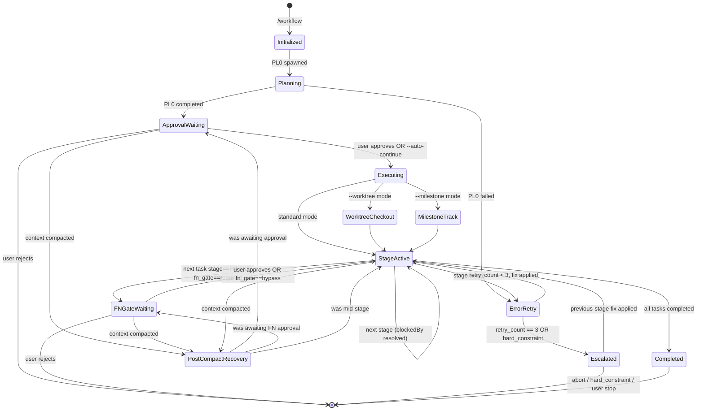

# Workflow System

Single source of truth for task workflow management using the Task System.

## Workflow Evolution (v2.0)

```
9-stage:   PL → AR → TL → DV → DR → QA → DC → FN → ST
11-stage:  PL → AR → TL → DV → DR → SR → QA → DC → RE → FN → ST
                              ↑              ↑
                        Developer Review  Security Review (optional)
```

### State Machine



**Stage codes and triggers**: See `${CLAUDE_SKILL_DIR}/../shared/stage-codes.md` and `${CLAUDE_SKILL_DIR}/../shared/workflow-triggers.md`

**Task System integration**: See `${CLAUDE_SKILL_DIR}/../shared/task-system.md`

## Dynamic Workflow Sizing

PL0 assesses complexity and creates only the stages needed. No pre-creation or deletion — PL builds the task list from scratch.

### Complexity Assessment

| Factor | Low (0-2) | Medium (3-5) | High (6-10) |
|--------|-----------|--------------|-------------|
| **New patterns** | None | 1-2 new | 3+ new |
| **Integration points** | 1-2 | 3-5 | 6+ |
| **Cross-cutting concerns** | None | 1 area | Multiple |
| **Risk level** | Minimal | Moderate | High |
| **Documentation needs** | Inline | README | ADR + API docs |

**Scoring**: Sum factor scores (0-50 total)

### Decision Rules

| Score | Complexity | PL0 Creates |
|-------|------------|-------------|
| 0-10 | Low | DV0, DR0, QA0 |
| 11-20 | Medium | AR0, DV0, DR0, QA0 |
| 21-30 | Moderate | AR0, TL0, DV0, DR0, QA0 |
| 31-40 | High | AR0, TL0, DV0, DR0, QA0, DC0, FN0, ST0 |
| 41-50 | Critical | AR0, TL0, DV0, DR0, SR0, QA0, DC0, RE0, FN0, ST0 |

**Security-sensitive features** auto-include SR0:
- Authentication/authorization, payment processing, PII handling
- Cryptographic operations, external API secrets, file uploads

Each task includes `metadata.agent` for executor resolution. See `initialization-patterns.md § PL Creates Subsequent Tasks`.

## Workspace Mode

When using `--milestone:N`, each ticket executes in an isolated workspace.

### Workspace Detection

```typescript
const task = TaskGet({ taskId: currentTaskId });
const workspacePath = task.metadata?.workspace_path;
const isolation = task.metadata?.isolation;  // 'worktree' or undefined

if (isolation === 'worktree') {
  // WORKTREE MODE: workspace_path IS the worktree directory
  // All git operations happen inside the worktree
  // .context/ lives inside the worktree alongside source files
  const contextPath = `${workspacePath}/.context`;
} else if (workspacePath) {
  // LEGACY WORKSPACE MODE: directory-based artifact isolation only
  const contextPath = `${workspacePath}/.context`;
} else {
  // STANDARD MODE: project root
  const contextPath = '.context';
}
```

### Path Resolution

| Mode | Base Path | Git Operations | Source Isolation |
|------|-----------|----------------|------------------|
| Standard | `.context/` | Main working directory | None |
| Workspace (legacy) | `.workspaces/milestone-{N}/{issue#}/.context/` | Shared working directory | Artifacts only |
| Worktree | `.worktrees/milestone-{N}/{issue#}/.context/` | Dedicated worktree | Full (git + artifacts) |

### Task ID Namespacing

| Track | Task IDs |
|-------|----------|
| Track 1 | `t1-1`, `t1-2`, ... |
| Track N | `t{N}-1`, `t{N}-2`, ... |

See `milestone-workflow.md` for full workspace documentation.

## Parallel Execution

### W + Q Parallel (Default)

```typescript
TaskUpdate({ taskId: "5", addBlockedBy: ["4"] });  // DR ← DV
TaskUpdate({ taskId: "6", addBlockedBy: ["5"] });  // QA ← DR
TaskUpdate({ taskId: "7", addBlockedBy: ["5"] });  // DC ← DR
TaskUpdate({ taskId: "8", addBlockedBy: ["6", "7"] });  // FN ← QA AND DC
```

Use `--sequential` when DC requires test results.

### Monitor Tool Integration (v2.1.98+)

Use the `Monitor` tool to stream events from background processes during workflow stages. Replaces polling patterns for build output, test progress, and log streaming. Available to any agent with Bash access. Persist raw stream output to `.context/logs/<kind>-<scope>-<timestamp>.log` per the `logging-conventions` skill.

### Never Parallelize

- AR before PL (needs requirements)
- DV before TL (needs coordination)
- DR before DV (can't review unwritten code)
- QA before DR (DR must review code before QA tests)

## Error Handling

### Retry Logic

Each stage: max 3 retries. Track via `metadata.retry_count` (per-task) and append a narrative entry to `.context/errors/<agent>.md` (per-agent — see `task-folder-organization` skill § Per-Agent Error Files). Raw stdout/stderr goes to `.context/logs/retry-<stage>-<ts>.log` per `logging-conventions`.

### Escalation Chains

```
11-stage: ST → FN → RE → DC → QA → SR → DR → DV → TL → AR → PL → USER
9-stage:  ST → FN → DC → QA → DR → DV → TL → AR → PL → USER
Emergency: FN → RE → QA → DR → DV → IR → USER
```

Document errors in `.context/errors/<agent>.md` (per-agent, append-only; one `## Retry N — <ts>` section per failure) with problem, classification, root cause, attempted solutions. Raw captures belong in `.context/logs/` per `logging-conventions`.

## Rule Checks

| Rule | Required Before |
|------|-----------------|
| Test Strategy | PL → AR |
| Test Architecture | AR → TL |
| Code Format | DV complete |
| Build Pass | DV → DR |
| Unit Tests Written + Pass | DV → DR |
| Developer Review Pass | DR → QA |
| All Tests Pass (Unit + Integration + E2E) | QA → DC |

## Optimization Hooks

### Pre-Stage

| Check | Threshold | Action |
|-------|-----------|--------|
| Context size | > 50% window (standard) or > 30% (1M window) | Compress previous stages |
| Budget usage | > 75% | Alert user |

### Post-Stage

- Compress context for handoff (50-100 tokens)
- Log token usage in task metadata
- Validate artifacts created
- `PostCompact` hook fires after auto-compaction — use to re-inject critical workflow state

> On Opus 4.6/4.7 with Max/Team/Enterprise, context window is 1M tokens. Compression still recommended at stage boundaries for cost efficiency even with larger windows.

See references/ for initialization code, stage details, and agent teams integration.

## Pre-Stage Validation

Before executing any workflow stage, the orchestrator MUST validate:

1. **TaskList check**: Call `TaskList()` and verify at least one task exists with `metadata.workflow_id` matching the current workflow
2. **PL0 exists**: Verify a task with subject starting with `PL0:` exists
3. **Stage tasks exist**: After PL0 completes, verify PL0 created subsequent stage tasks (at minimum DV0, DR0, and QA0 for any complexity level)
4. **Stage contract check**: Verify upstream outputs match the next stage's Required Inputs per `shared/stage-contracts.md` (file exists + required sections present)
5. **Metadata schema check**: Validate next task's metadata against `shared/task-system.md` § JSON Schema (non-PL tasks require `stage`, `agent`, `model`, `error_file`)
6. **Model alias check**: `metadata.model ∈ {opus, sonnet, haiku}` — reject unknown aliases before `Task()` delegation
7. **Workspace existence** (milestone/worktree mode only): verify `metadata.workspace_path` directory exists and `workspace.json` is readable

If validation fails:
- No tasks exist → Workflow not initialized. Re-run initialization (TaskCreate PL0)
- PL0 exists but no subsequent tasks → PL0 did not complete properly. Re-run PL0
- Tasks exist but are orphaned (no workflow_id) → Log warning and attempt to match by subject pattern
- Contract violation → Do NOT transition. Append `missing_input` entry to next stage's `.context/errors/<agent>.md` and block.

## Orchestrator Execution Loop

### Cache-Friendly Prompt Layout & state.json (handoff-protocol)

The orchestrator builds every delegation prompt in a **binding** order so consecutive `Task()` calls within the same `workflow_id` share a byte-identical prefix and benefit from Anthropic's prompt cache. Spec source: `skills/workflow/references/handoff-protocol.md#cache-prefix`.

**Preamble layout (binding)**:

```
[1] Plugin/agent contract reminder         ← stable across ALL stages (cacheable)
[2] Workflow header (id, plan, exploration)← stable across ALL stages (cacheable)
[3] state.json blob (inlined JSON)         ← evolves per stage
[4] Stage contract excerpt                 ← stable WITHIN stage type (cacheable)
─────── (cache prefix boundary) ───────
[5] task.description                       ← dynamic per delegation
[6] retry hints (if retry_count > 0)       ← dynamic per delegation
[7] Stage-specific banners (DR Skill, FN Conductor, MCP fallback) ← SUFFIX, dynamic
```

**Step 0 (NEW) — Read state.json before each delegation**:

```typescript
const stateRaw = fs.existsSync(".context/state.json")
  ? fs.readFileSync(".context/state.json", "utf8")
  : null;
// stateRaw goes inline into preamble section [3] as a fenced JSON code block.
// If null, F1 fallback applies: orchestrator uses metadata.context_files only,
// no cache-friendly preamble (legacy mode).
```

**Artifact path helper** (resolves numbered path with fallback):

```typescript
const ARTIFACT_BASE: Record<string, string> = {
  PL: "planning", AR: "analyzing", TL: "coordination",
  DV: "development", DR: "developer-review", SR: "security-review",
  QA: "testing", DC: "documentation", RE: "release",
  FN: "complete-summary", ST: "retrospective", IR: "incident",
  ET: "ethics-review",
};
function stageArtifactPath(code: string, runIndex: number): string {
  const base = ARTIFACT_BASE[code];
  const numbered = `.context/${base}-${runIndex}.md`;
  if (fs.existsSync(numbered)) return numbered;
  // Newest-glob fallback (covers legacy or out-of-band writes)
  const matches = glob.sync(`.context/${base}-*.md`).sort((a, b) => {
    const n = (f: string) => parseInt(f.match(/-([0-9]+)\.md$/)?.[1] ?? "0", 10);
    return n(a) - n(b);
  });
  if (matches.length > 0) return matches.pop()!;
  // Legacy unnumbered fallback (one release cycle)
  return `.context/${base}.md`;
}
```

**Step 6.5 (NEW) — After Task() returns, patch state.json from artifact frontmatter**:

```typescript
// Re-read state.json (in-agent write should already have happened).
const stagePost = JSON.parse(fs.readFileSync(".context/state.json", "utf8"));
const code = full.metadata.stage;
if (stagePost.stages?.[code]?.status !== "completed") {
  // Agent forgot to patch the ledger. Parse the artifact's `handoff:` frontmatter
  // (yq or awk fallback per handoff-protocol.md#fallback-paths F2/F3) and
  // atomic-merge into state.json. This is the orchestrator's belt-and-suspenders
  // layer (the third, after in-agent write and the optional SubagentStop hook).
  const runIndex = full.metadata.run_index ?? 0;
  const artifactPath = stageArtifactPath(code, runIndex);  // e.g. "DV" → ".context/development-0.md"
  const handoff = parseFrontmatter(artifactPath);  // null if missing → F3 fallback
  const patch = handoff
    ? buildPatchFromHandoff(code, handoff)
    : { stages: { [code]: { status: "completed", artifact: artifactPath, verdict: "ok" } } };
  atomicMergeStateJson(patch);  // read → merge → temp → fsync → rename
}
```

**Banner relocation (R3)**: stage-specific banners (DR Skill, FN Conductor, MCP fallback warning) are appended AFTER `full.description` (suffix), not prepended. Prefixes [1][2][3][4] stay byte-identical across stages so the cache prefix boundary stretches as far as possible.

The preamble assembler MUST exclude forbidden tokens from sections [1][2][4]: timestamps, ENV expansions that vary per call, random IDs, retry counters, file mtimes, agent names beyond `workflow_id`. CI lint (`skills/workflow/references/cache-lint.sh`) asserts byte-stability across consecutive stages of the same `workflow_id`.

### CRITICAL: Delegation-Only Rule

The orchestrator NEVER writes implementation code directly. ALL stage work is delegated to stage agents via the Agent tool. Using Edit/Write on source files, running build commands, or marking tasks completed without first delegating to an agent are all violations. The orchestrator's job is to manage the loop — read tasks, resolve agents, delegate, track status. If you find yourself editing source code, STOP — delegate to the stage agent instead.

### PRECONDITION CHECK
Before entering this loop, verify BOTH signals:
- **Signal 1 (TaskList audit)**: Call `TaskList()`, find the PL0 task, verify its status is `completed`. If PL0 does not exist or is not completed, STOP — workflow not initialized or planning incomplete.
- **Signal 2 (Human approval)**: The HUMAN USER has sent an explicit approval message ("approve", "proceed", "go", "yes", "continue") AFTER PL0 was marked completed. PL0 completion alone is NOT approval. A subagent returning results is NOT approval. A tool succeeding is NOT approval. Only the human user's explicit text message qualifies.
If either signal is missing, DO NOT enter this loop.

After PL0 completes and creates stage tasks, the orchestrator MUST:

1. **Present PL0 results** to the user: complexity score, stages created (with agents), dependency chain, and key planning decisions
2. **STOP IMMEDIATELY**. Do NOT call Write, Edit, Task, or Bash with any file-modifying commands. STOP generating your response entirely.
3. **Wait for EXPLICIT user approval**. Silence is NOT approval. Asking a question is NOT approval.
4. The user may adjust stages, re-prioritize, or skip stages before approving
5. Only after the user explicitly confirms, execute the stage loop below:
6. **Re-validate before executing**: Call `TaskList()` to get all stage tasks. For each task, verify `metadata.agent` and `metadata.model` are set. This checkpoint prevents drift — the orchestrator re-grounds itself in the delegation rules before touching any stage.

Unless `--auto-continue` flag was provided — in that case, skip the approval gate and proceed directly.

```typescript
// 1. Get all tasks for this workflow
let tasks = TaskList();

// 2. Loop until all tasks are completed
while (tasks.some(t => t.status !== "completed")) {
  // 3. Find unblocked pending tasks
  const ready = tasks.filter(t =>
    t.status === "pending" &&
    (t.blockedBy ?? []).every(dep => tasks.find(d => d.id === dep)?.status === "completed")
  );

  for (const task of ready) {
    // 4. Get full task details
    const full = TaskGet({ taskId: task.id });
    const agentType = full.metadata.agent;
    const model = full.metadata.model;

    // Resolve plugin:
    //   bare (no `:`)        e.g. "developer"                 → "igrsoft:developer"
    //   2-part ("plugin:name") e.g. "apple-developer:ios-developer" → used as-is
    //   3-part ("a:b:c")     → UNSUPPORTED. Orchestrator MUST error out:
    //     "Invalid agent reference '{agentType}': only bare or plugin-qualified names supported."
    //   The basename for .context/errors/<basename>.md is the last `:`-separated segment.
    const colonCount = (agentType.match(/:/g) ?? []).length;
    if (colonCount > 1) {
      throw new Error(`Invalid agent reference '${agentType}': only bare or plugin-qualified names supported.`);
    }
    const subagentType = colonCount === 1 ? agentType : `igrsoft:${agentType}`;

    // 4.5. Soft context_files validation — warn, don't abort
    //      Low-complexity workflows legitimately skip upstream stages,
    //      so a missing listed file is a warning appended to the prompt.
    //      Exception: error_file absence is expected on first attempt
    //      (retry_count === 0) — suppress that specific warning.
    if (full.metadata.context_files) {
      const listed = full.metadata.context_files.split(',').map(s => s.trim());
      const retryCount = full.metadata.retry_count ?? 0;
      const missing = listed.filter(p =>
        !fs.existsSync(p) &&
        !(p === full.metadata.error_file && retryCount === 0)
      );
      if (missing.length > 0) {
        full.description =
          `NOTE: Expected context files missing: ${missing.join(', ')}. ` +
          `Proceed using what is available; do not fabricate content.\n\n` +
          full.description;
      }
    }

    // 4.9. FN approval gate — STOP before any FN-stage task unless bypassed
    //      See § FN Gate below for the pre-FN summary template.
    if (full.metadata.stage === "FN") {
      const pl0 = tasks.find(t => t.metadata?.stage === "PL");
      const gateMode = pl0?.metadata?.fn_gate ?? "required";  // default safe
      if (gateMode !== "bypass") {
        // (a) Build pre-FN summary from the resolved plan file
        //     (`task.metadata.plan_file`; fallback: newest `.context/planning-*.md`,
        //     then legacy `.context/planning.md`),
        //     .context/developer-review-N.md, .context/testing-N.md.
        // (b) Print summary to user. Do NOT call TaskUpdate.
        //     Do NOT delegate. FN task stays `pending`.
        // (c) Write `fn_gate_waiting` audit line.

        // 4.9.1. Pre-gate Conductor-attachments writer
        //        See § Pre-gate Conductor-attachments writer for the imperative checklist.

        // (d) End the orchestrator turn — wait for HUMAN approval.
        return;  // exits the entire execution loop; resume happens in a fresh turn
      }
      // bypass branch:
      // (a) Write `fn_gate_bypass` audit line with reason derived from
      //     PL0.metadata (auto-continue | milestone | worktree).
      // (b) Fall through to normal delegation.
    }

    // 5. Mark in_progress
    TaskUpdate({ taskId: task.id, status: "in_progress" });

    // 5a. Resolve embedded commands for DV stages
    //     If workflow has embedded_commands metadata, inject Skill invocation into DV prompt
    if (full.metadata.stage === "DV" && workflow_embedded_commands) {
      const skillInvocation = `IMPORTANT: Before implementing, invoke the embedded command via Skill tool: Skill("${embedded_cmd}", args="${embedded_args}")`;
      full.description = skillInvocation + "\n\n" + full.description;
    }

    // 5b. Inject code-review-dev Skill invocation for DR stages.
    //     handoff-protocol: APPEND as suffix (section [7]) so the preamble
    //     prefix [1][2][3][4][5] stays byte-identical with neighbour stages
    //     and the prompt cache prefix boundary is preserved.
    if (full.metadata.stage === "DR") {
      const runIndex = full.metadata.run_index ?? 0;
      const reviewInvocation = `IMPORTANT: Execute developer code review via Skill tool: Skill("code-review-dev"). Save findings summary to .context/developer-review-${runIndex}.md`;
      full.description = full.description + "\n\n" + reviewInvocation;
    }

    // 5c. Pre-warm XcodeBuildMCP for Apple DV/DR/QA stages
    //     XcodeBuildMCP is registered globally as `npx -y xcodebuildmcp@latest mcp`
    //     (stdio, lazy-spawn). Subagents only inherit MCP servers that are
    //     ALREADY RUNNING in the parent session at delegation time. If we
    //     delegate before the parent has issued any XcodeBuildMCP call, the
    //     child (especially in worktree isolation) inherits an unstarted
    //     reference and the first tool call fails with "tool not available".
    //     Warm the server in the parent ONCE per workflow before the first
    //     Apple-platform stage that needs it.
    const APPLE_STAGES = new Set(["DV","DR","QA"]);
    const APPLE_AGENTS = /^(developer|technical-lead|qa-engineer)$/;
    const isAppleStage =
      APPLE_STAGES.has(full.metadata.stage) &&
      ( full.metadata.platform === "apple" ||
        ( !full.metadata.platform &&
          APPLE_AGENTS.test(agentType.split(":").pop()) &&
          // workspace contains Apple markers
          ["*.xcodeproj","*.xcworkspace","Package.swift"]
            .some(g => glob.sync(g, { cwd: process.cwd(), dot: false }).length > 0)
        )
      );
    if (isAppleStage && !state.xcodeMcpWarmed) {
      // See `agent-coordination § MCP Unavailability Detection` for the canonical regex.
      const MCP_UNAVAILABLE_RE = /(tool not available|server (not reachable|unavailable)|connection refused|ECONNREFUSED|EPIPE|ETIMEDOUT|timed? ?out|spawn ENOENT|command not found|InputValidationError)/i;
      let warmed = false;
      for (let attempt = 1; attempt <= 3 && !warmed; attempt++) {
        try {
          await mcp__XcodeBuildMCP__session_show_defaults({});
          warmed = true;
          appendAudit({ action: "mcp_warmup_attempt",
                        metadata: { server: "XcodeBuildMCP", attempt, result: "ok" } });
        } catch (err) {
          const reason = String(err?.message ?? err).slice(0, 500);
          const classified = MCP_UNAVAILABLE_RE.test(reason) ? "transient" : "fatal";
          appendAudit({ action: "mcp_warmup_attempt",
                        metadata: { server: "XcodeBuildMCP", attempt, result: "fail",
                                    classified, reason: reason.slice(0, 200) } });
          if (classified === "fatal") throw err;        // real bug — don't burn the budget
          if (attempt < 3) await sleep(8000);            // npx cold-start budget (P95 ~16s over 2 sleeps)
        }
      }
      state.xcodeMcpWarmed = warmed;
      if (!warmed) {
        appendAudit({ action: "mcp_warmup_failed",
                      metadata: { server: "XcodeBuildMCP" } });
        const runIndex = full.metadata.run_index ?? 0;
        const banner =
          `IMPORTANT: XcodeBuildMCP warmup failed in the orchestrator. ` +
          `Treat mcp__XcodeBuildMCP__* as UNAVAILABLE. Fall back to ` +
          `xcodebuild via Bash for build/test (tee output to the same ` +
          `.context/logs/* paths) and record the fallback in ` +
          `.context/development-${runIndex}.md § Decisions so QA/DR see it.`;
        // handoff-protocol: SUFFIX banner (section [7]) — preserves the
        // cache prefix boundary at the [1][2][3][4][5] line.
        full.description = full.description + "\n\n" + banner;
      }
      // warmup succeeded → child inherits a live XcodeBuildMCP server.
    }

    // 5d. Inject Conductor-attachments requirement for FN stages
    //     Ensures project-manager always creates .context/attachments/ files
    //     regardless of how PL0 described the FN task. Mirrors 5b (DR injection).
    //     Templates: skills/workflow/references/conductor-attachments.md
    if (full.metadata.stage === "FN") {
      const fnInjection = [
        "IMPORTANT — Conductor attachments (FN-stage requirement, non-optional):",
        "Before running `gh pr create`, write both files per",
        "`skills/workflow/references/conductor-attachments.md`:",
        "  • `.context/attachments/PR instructions.md`",
        "  • `.context/attachments/Review request.md`",
        "Run `mkdir -p .context/attachments` first.",
        "Also write `.context/complete-summary-N.md` (workflow summary + Stage Timings; N = task.metadata.run_index).",
        "Then read `PR instructions.md` and follow it as the PR-creation script.",
      ].join("\n");
      full.description = full.description + "\n\n" + fnInjection;
    }

    // 6. Delegate to stage agent
    Task({ subagent_type: subagentType, model: model, prompt: full.description });

    // 6.5. handoff-protocol: patch state.json from artifact frontmatter if the
    //      agent didn't already do so. Belt-and-suspenders layer #3 (after
    //      in-agent atomic write and the optional SubagentStop hook).
    //      See handoff-protocol.md#fallback-paths F2/F3.
    if (fs.existsSync(".context/state.json")) {
      const post = JSON.parse(fs.readFileSync(".context/state.json", "utf8"));
      const code = full.metadata.stage;
      if (post.stages?.[code]?.status !== "completed") {
        const runIndex = full.metadata.run_index ?? 0;
        const artifactPath = stageArtifactPath(code, runIndex);  // e.g. ".context/development-0.md"
        const handoff = parseFrontmatter(artifactPath);  // null → F3 fallback
        const patch = handoff
          ? buildPatchFromHandoff(code, handoff)
          : { stages: { [code]: { status: "completed", artifact: artifactPath, verdict: "ok" } } };
        atomicMergeStateJson(patch);
      }
    }

    // 7. Mark completed
    TaskUpdate({ taskId: task.id, status: "completed" });
  }

  // Refresh task list
  tasks = TaskList();
}
```

**Key rules**:
- NEVER skip TaskUpdate calls (both in_progress and completed)
- NEVER execute a stage without checking blockedBy dependencies are completed
- ALWAYS pass `model` from task metadata to the Agent tool — if task has `model: opus`, the Agent call MUST include `model: "opus"`. Omitting or mismatching is a violation. Do NOT rely on agent frontmatter inheritance
- `metadata.agent` accepts bare names (`"developer"` → `igrsoft:developer`) or fully-qualified plugin names (`"apple-developer:ios-developer"` → used as-is). Detection: presence of `:`
- If a stage agent fails after 3 retries, escalate per the error handling chain
- NEVER mark a task `completed` without first delegating to an agent and receiving its results — completion without delegation is the most common violation
- The orchestrator uses ONLY TaskCreate, TaskUpdate, TaskGet, TaskList, and Agent tools. Edit/Write/Bash on source files belong to stage agents, not the orchestrator
- The orchestrator owns the loop; stage agents own their stage's work

### Pre-DV MCP warmup

XcodeBuildMCP (and any MCP server registered as `npx -y …` over stdio) is
**lazy-spawned**: Claude Code only starts the process on the first tool
call. Subagents inherit MCP servers that were already running in the
parent at delegation time (`agent-coordination § MCP Tool Inheritance`)
— but they do NOT trigger a spawn on inheritance. If the orchestrator
delegates DV before issuing any XcodeBuildMCP call, the child agent
(especially in `isolation: worktree`) inherits an unstarted reference
and the first `mcp__XcodeBuildMCP__*` call fails with "tool not
available."

Step `5c` in the execution loop above warms the server in the parent
session before the first Apple-platform stage. Contract:

- **Trigger**: `metadata.stage ∈ {DV,DR,QA}` AND
  (`metadata.platform === "apple"` OR
   `metadata.subagent` matches `^(developer|technical-lead|qa-engineer)$`
   AND the workspace contains an Apple marker — `*.xcodeproj`,
   `*.xcworkspace`, or `Package.swift`).
- **Action**: up to 3 calls to `mcp__XcodeBuildMCP__session_show_defaults`,
  with 8-second backoffs between attempts (covers npx first-fetch P95).
  Failure messages are classified against
  `agent-coordination § MCP Unavailability Detection` — only matches retry,
  non-matches re-throw immediately as real bugs.
- **Audit**: every attempt writes one
  `audit.jsonl` line `action: "mcp_warmup_attempt"` with
  `metadata: {server, attempt, result, classified, reason?}`. On final failure,
  one additional `action: "mcp_warmup_failed"` line.
- **Failure mode**: do NOT abort the stage. Inject a banner at the
  top of `full.description` instructing the agent to use Bash
  `xcodebuild` fallback and to record the fallback in
  `.context/development-N.md § Decisions`.
- **Idempotency**: cache `state.xcodeMcpWarmed = true` after the
  first successful call so the orchestrator does not re-warm on each
  Apple stage in the same workflow run.

This pattern generalises to any lazy-spawn `npx`-based MCP. Add a
new trigger block when introducing one (e.g., Pencil, Sosumi).

## FN Gate

A second human-in-the-loop checkpoint immediately before any FN-stage task. The orchestrator MUST present a pre-FN summary and STOP unless the PL0 task carries `metadata.fn_gate = "bypass"`.

### Gate semantics

- **Carrier**: `PL0.metadata.fn_gate ∈ {"required", "bypass"}`. PL0 sets the value at workflow init based on invocation flags (see `commands/workflow.md` Phase 1, step 4).
- **Default**: missing or unrecognized value → treat as `"required"` (`?? "required"`). This makes in-flight workflows safe across the change.
- **Bypass triggers**: `--auto-continue`, `--milestone:N`, `--worktree`. (`/emergency` is a documented TODO — not yet wired.)
- **Trigger condition**: gate fires when the next ready task has `metadata.stage === "FN"` AND `gateMode !== "bypass"`.
- **Effect, in order**:
  1. Run the **Pre-gate Conductor-attachments writer** (§ below) — produces `.context/attachments/PR instructions.md` and `.context/attachments/Review request.md`.
  2. Print the pre-FN summary to the user.
  3. Append `fn_gate_waiting` audit entry.
  4. `return` from the execution loop. The FN task stays `pending`. The orchestrator MUST NOT call `TaskUpdate` for the FN task.

### Pre-gate Conductor-attachments writer

Runs **before** printing the pre-FN summary, on the gated path only (bypass path falls through to FN-agent writer #2). Idempotent: every FN-gate entry overwrites both files from scratch.

Steps (orchestrator executes directly; do NOT delegate):

1. `Bash: mkdir -p .context/attachments`
2. `Bash: git rev-parse --abbrev-ref HEAD`              → BRANCH
3. `Bash: git symbolic-ref refs/remotes/origin/HEAD`   → BASE_BRANCH (default `main` on failure)
4. `Bash: git status --porcelain | wc -l`              → UNCOMMITTED
5. `Bash: git rev-parse --abbrev-ref --symbolic-full-name @{u}` → UPSTREAM (or "no upstream" on non-zero exit)
6. `Read: <plan_file>` (resolve via `FN0.metadata.plan_file`; fallback newest `.context/planning-*.md`) → derive COMMIT_TYPE from first match of `\b(fix|refactor|perf|docs|chore|test|ci|build|style|feat)\b` (default `feat`)
7. `Read: .context/developer-review-N.md` (N = `FN0.metadata.run_index`) → DR_VERDICT, DR_CONCERNS (defensive default `verdict: unknown` / `(none flagged)` if file absent)
8. `Read: .context/testing-N.md` → QA_VERDICT, QA_NOTES (defensive default `verdict: unknown` / `(none)` if file absent)
9. `Write: .context/attachments/PR instructions.md` using template in `skills/workflow/references/conductor-attachments.md § Template — PR instructions.md`
10. `Write: .context/attachments/Review request.md` using template in `skills/workflow/references/conductor-attachments.md § Template — Review request.md`
11. **Verify**: `Bash: test -f ".context/attachments/PR instructions.md" && test -f ".context/attachments/Review request.md"`
    - On success → append `fn_attachments_preseed` audit line
    - On failure → append `fn_attachments_preseed_failed` audit line AND prepend a `> WARN: pre-seed failed — Conductor will use built-in defaults.` line to the pre-FN summary so the user sees it before approving

Each `Read` step is independently fault-tolerant. Do NOT wrap the whole sequence in a single try/catch — failure of one input must not skip the writes.

### `return` vs `continue`

The gate uses `return` (exit the loop), not `continue` (skip to next iteration). Rationale: any other ready task would also re-enter the loop on the next turn anyway, and exiting avoids partial side-effects (e.g., starting a sibling task while the user is reviewing the FN summary). Mirrors the PL0 gate pattern.

### Resume after approval

On the next orchestrator turn (triggered by the user's `approve`/`go`/`yes`/`continue`/`proceed` message):

1. Re-enter the loop. The FN task is still `pending`.
2. The gate check runs again. If the user adjusted PL0 metadata (e.g., set `fn_gate = "bypass"`), the gate now passes.
3. Otherwise: treat the user's most recent approval message as FN approval and proceed past the gate. Disambiguation: only one gate can be active at a time — PL0 is `completed` and no stage task is `in_progress`, so the approval can only be FN.
4. Write an `approval_received` audit entry with `subject: "FN"`.

### Pre-FN summary template

Before printing this summary, complete the **Pre-gate Conductor-attachments writer** above. Replace each `- [ ]` with `- [x]` for any Planned FN action whose output already exists on disk (the two attachment writes should be `[x]`).

Build directly from artifacts written by upstream stages — no agent roundtrip needed.

```
## FN gate — review before push

### Change surface
- N commits on branch `<branch>`: <short shas + titles>
- Target: PR against `<base-branch>`
- Net diff: +X / -Y lines across N files

### Quality evidence
- QA verdict: <GO/NO-GO>           (.context/testing-N.md)
- DR verdict: <PASS/CONCERNS>      (.context/developer-review-N.md)
- Tests: <M passed / N failed>

### Planned FN actions
- [ ] Write `.context/attachments/PR instructions.md` (Conductor attachment)
- [ ] Write `.context/attachments/Review request.md` (Conductor attachment)
- [ ] Write `.context/complete-summary-N.md` (workflow summary + stage timings)
- [ ] Create commit(s) with conventional-format messages
- [ ] Push branch with upstream tracking
- [ ] Open PR against <base-branch> with Motivation / Changes / Notes

Reply `approve` to proceed, or describe any changes needed.
```

Source files (per `skills/shared/stage-contracts.md`):

| Field | Source |
|-------|--------|
| Branch / commits | `git status` + `git log <base>..HEAD --oneline` |
| QA verdict | `.context/testing-N.md` (GO/NO-GO line; N from run_index) |
| DR verdict | `.context/developer-review-N.md` (PASS/CONCERNS; N from run_index) |
| Diff stats | `git diff <base>..HEAD --shortstat` |
| Base branch | `workspace.json § base_branch` (milestone) or repo default |

### User amendment at the gate

If the user replies with edits instead of `approve` (e.g., "change the commit message to X"), the orchestrator:

1. Updates the FN task description via `TaskUpdate({taskId, description: ...})`.
2. Re-builds and re-presents the pre-FN summary.
3. STOPs again. The FN task remains `pending` throughout.

### Post-amendment audit

Each gate transition writes an audit line:

```json
{"actor":"orchestrator","action":"fn_gate_waiting","subject":"FN0","result":"pending"}
{"actor":"orchestrator","action":"approval_received","subject":"FN0","result":"ok"}
```

Bypassed gates write a single line:

```json
{"actor":"orchestrator","action":"fn_gate_bypass","subject":"FN0","result":"ok","reason":"auto-continue|milestone|worktree"}
```

## Post-Workflow Self-Improvement

After the execution loop exits (all tasks completed, including ST), the orchestrator runs a final check to handle any learnings captured at ST.

### Post-ST Procedure

1. **Check for learnings artifact:** `fs.existsSync(".context/learnings.md")`.
   - Absent → nothing to do. Workflow complete.
   - Present → continue.

2. **Surface to user:** read `.context/learnings.md` and present it to the user. Focus attention on the `## Proposed Updates` checklist.

3. **Wait for user approval decisions.** The user indicates which proposals to accept by checking boxes (`- [ ]` → `- [x]`). The orchestrator MUST NOT auto-check boxes or assume approval.

4. **Read checked items:** parse `.context/learnings.md` for lines matching `- [x]` under `## Proposed Updates`. Each checked item is a proposal to apply.
   - If zero checked items → skip to step 6.

5. **Delegate to prompt-engineer** with one `Agent` call carrying the full list of checked proposals:
   ```typescript
   Task({
     subagent_type: "igrsoft:prompt-engineer",
     model: "opus",
     prompt: `Apply self-improvement learnings from .context/learnings.md.
              Apply ONLY checked items (- [x]). Follow the Apply Protocol in your agent definition.
              Do not propose new changes; only apply approved ones.
              Return a summary of applied/skipped proposals and the commit SHAs created.`
   });
   ```
   The prompt-engineer applies each proposal as its own commit with a `version:` bump (see `agents/prompt-engineer.md § Self-Improvement Patch Application`).

6. **Audit entry:** append one line to `.context/logs/audit.jsonl`:
   ```json
   {"actor": "orchestrator", "action": "self_improvement_applied", "subject": "<workflow_id>", "applied_count": N, "skipped_count": M, "result": "ok"}
   ```

7. **Terminate.** Workflow is now fully complete. Do not re-enter the execution loop.

### Safety invariants

- DO NOT apply proposals the user did not explicitly check.
- DO NOT re-run self-improvement on the orchestrator's own post-ST activity (no recursion).
- DO NOT modify `.context/learnings.md` after ST produced it; the prompt-engineer only reads it.
- If `learnings.md` is malformed (no `## Proposed Updates` section) → log warning, skip apply, continue to terminate.

## Resume After Interruption

The orchestrator loop is restartable. On reattach (PostCompact, session crash,
`--resume` flag), diagnose state via `TaskList()` + `.context/logs/audit.jsonl` tail
before resuming.

### State → Action Table

| TaskList Shape | Audit Tail | Action |
|----------------|------------|--------|
| No tasks | — | Workflow never initialized. Start over with `/workflow <task>` |
| PL0 only, `pending` | — | PL0 not started. Delegate PL0 and wait for approval |
| PL0 only, `in_progress` | no `subagent_stopped` for PL0 | PL0 crashed mid-stage. Re-delegate PL0 (idempotent) |
| PL0 `completed`, no stage tasks | — | PL0 did not create stages. Re-run PL0 |
| PL0 `completed`, stage tasks `pending`, no `approval_received` line | — | Awaiting user approval. STOP and prompt user |
| PL0 `completed`, `approval_received` present, some stages `in_progress` | most recent `subagent_stopped` `result: error` | Mid-stage failure. Read `.context/errors/<agent>.md`, honor `retry_count` |
| PL0 `completed`, all stages `completed` except FN, FN `pending`, audit tail has `fn_gate_waiting` for FN | — | At FN gate. Re-present pre-FN summary; STOP and wait for human approval (unless `PL0.metadata.fn_gate == "bypass"`) |
| PL0 `completed`, all stages `completed` except FN | — | Near-done. Re-enter loop; FN gate check decides whether to STOP or proceed |
| Stages `in_progress` with no `metadata.retry_count` | missing audit lines | Stale task state. Re-derive from most recent `.context/logs/` capture |

### Resume Procedure

1. `tail -n 50 .context/logs/audit.jsonl | jq .` — last 50 audit lines
2. `TaskList()` — current Task System state
3. Cross-reference with `stage-contracts.md` — identify first incomplete stage
4. Re-read that stage's `.context/*.md` artifact (if partial)
5. If `metadata.retry_count > 0`, read `.context/errors/<agent>.md` for retry history
6. Continue from the execution loop's `while (tasks.some(...))` — no need to replay completed stages
7. Write a `resume` audit entry: `{actor: "orchestrator", action: "resume", subject: "<workflow_id>", result: "ok"}`

See `context-compression.md § PostCompact Recovery` for the compaction-specific flow.

## Approval Gate Hook

The approval gates (PL0 and FN) are currently honor-system — the orchestrator
is expected to `STOP IMMEDIATELY` and wait for the user. `PreToolUse` hooks
(v2.1.85+) can enforce each gate programmatically. Each hook scopes its grep
by `subject` so that PL0 approval does not satisfy the FN predicate (and vice
versa).

### Advisory Rollout (Phase 1)

```json
{
  "hooks": {
    "PreToolUse": [
      {
        "matcher": "Write|Edit|Bash",
        "if": "test -f .context/logs/audit.jsonl && ! grep -q 'approval_received.*\"subject\":\"PL0\"' .context/logs/audit.jsonl",
        "command": ".claude/hooks/approval-gate.sh",
        "mode": "warn"
      },
      {
        "matcher": "Bash",
        "if": "test -f .context/logs/audit.jsonl && grep -q 'fn_gate_waiting.*\"subject\":\"FN0\"' .context/logs/audit.jsonl && ! grep -q 'approval_received.*\"subject\":\"FN0\"' .context/logs/audit.jsonl && ! grep -q 'fn_gate_bypass.*\"subject\":\"FN0\"' .context/logs/audit.jsonl",
        "command": ".claude/hooks/approval-gate.sh",
        "mode": "warn"
      }
    ]
  }
}
```

The second stanza only fires once `fn_gate_waiting` has been written (so it
is dormant before FN is reached) and clears once either `approval_received`
or `fn_gate_bypass` is written for `FN0`. The `Bash` matcher covers FN's
commit/push/PR calls without blocking earlier stages' write/edit activity.

### Blocking Rollout (Phase 2, after observation)

Change `mode: "warn"` to `mode: "deny"`. The hook returns `defer` (v2.1.89+)
with guidance: "Workflow awaiting user approval after PL0. Reply 'approve',
'proceed', 'go', 'yes', or 'continue' to unblock."

### `--auto-continue` Short-Circuit

When `/workflow --auto-continue` is used, the orchestrator sets
`TaskUpdate({taskId: "PL0", metadata: {approved: "auto", fn_gate: "bypass"}})`
and writes an `approval_received` audit line with `subject: "PL0"` and
`result: "auto"`. The PL0 hook's `if` expression evaluates false and execution
proceeds without user input.

The `fn_gate: "bypass"` value is read by the FN gate check in the execution
loop (see § FN Gate). When bypass fires, the orchestrator writes an
`fn_gate_bypass` audit line with `subject: "FN0"` and the triggering `reason`,
which clears the FN hook predicate. The same bypass flag is set by
`--milestone:N` and `--worktree` so per-issue or unattended runs do not stall
at FN.

### Safety Valve

If the hook misfires (blocks legitimate post-approval work), the user can
always remove the hook stanza from `settings.json` and retry. No persistent
state is stored in the hook itself — the Task System metadata + audit log
remain authoritative.

## Related

- `milestone-workflow.md` - GitHub milestone integration
- `agent-coordination.md` - Multi-agent coordination
- `cost-optimization.md` - Budget management
- `context-compression.md` - Context compression
