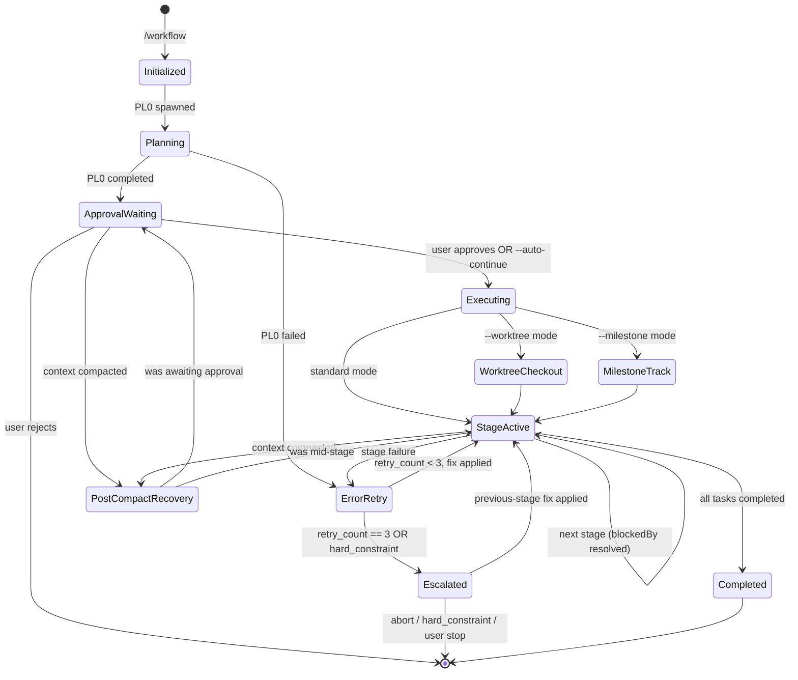

# Workflow System

Single source of truth for task workflow management using the Task System.

## Workflow Evolution (v2.0)

```
9-stage:   PL → AR → TL → DV → DR → QA → DC → FN → ST
11-stage:  PL → AR → TL → DV → DR → SR → QA → DC → RE → FN → ST
                              ↑              ↑
                        Developer Review  Security Review (optional)
```

### State Machine



**Stage codes and triggers**: See `${CLAUDE_SKILL_DIR}/../shared/stage-codes.md` and `${CLAUDE_SKILL_DIR}/../shared/workflow-triggers.md`

**Task System integration**: See `${CLAUDE_SKILL_DIR}/../shared/task-system.md`

## Dynamic Workflow Sizing

PL0 assesses complexity and creates only the stages needed. No pre-creation or deletion — PL builds the task list from scratch.

### Complexity Assessment

| Factor | Low (0-2) | Medium (3-5) | High (6-10) |
|--------|-----------|--------------|-------------|
| **New patterns** | None | 1-2 new | 3+ new |
| **Integration points** | 1-2 | 3-5 | 6+ |
| **Cross-cutting concerns** | None | 1 area | Multiple |
| **Risk level** | Minimal | Moderate | High |
| **Documentation needs** | Inline | README | ADR + API docs |

**Scoring**: Sum factor scores (0-50 total)

### Decision Rules

| Score | Complexity | PL0 Creates |
|-------|------------|-------------|
| 0-10 | Low | DV0, DR0, QA0 |
| 11-20 | Medium | AR0, DV0, DR0, QA0 |
| 21-30 | Moderate | AR0, TL0, DV0, DR0, QA0 |
| 31-40 | High | AR0, TL0, DV0, DR0, QA0, DC0, FN0, ST0 |
| 41-50 | Critical | AR0, TL0, DV0, DR0, SR0, QA0, DC0, RE0, FN0, ST0 |

**Security-sensitive features** auto-include SR0:
- Authentication/authorization, payment processing, PII handling
- Cryptographic operations, external API secrets, file uploads

Each task includes `metadata.agent` for executor resolution. See `initialization-patterns.md § PL Creates Subsequent Tasks`.

## Workspace Mode

When using `--milestone:N`, each ticket executes in an isolated workspace.

### Workspace Detection

```typescript
const task = TaskGet({ taskId: currentTaskId });
const workspacePath = task.metadata?.workspace_path;
const isolation = task.metadata?.isolation;  // 'worktree' or undefined

if (isolation === 'worktree') {
  // WORKTREE MODE: workspace_path IS the worktree directory
  // All git operations happen inside the worktree
  // .context/ lives inside the worktree alongside source files
  const contextPath = `${workspacePath}/.context`;
} else if (workspacePath) {
  // LEGACY WORKSPACE MODE: directory-based artifact isolation only
  const contextPath = `${workspacePath}/.context`;
} else {
  // STANDARD MODE: project root
  const contextPath = '.context';
}
```

### Path Resolution

| Mode | Base Path | Git Operations | Source Isolation |
|------|-----------|----------------|------------------|
| Standard | `.context/` | Main working directory | None |
| Workspace (legacy) | `.workspaces/milestone-{N}/{issue#}/.context/` | Shared working directory | Artifacts only |
| Worktree | `.worktrees/milestone-{N}/{issue#}/.context/` | Dedicated worktree | Full (git + artifacts) |

### Task ID Namespacing

| Track | Task IDs |
|-------|----------|
| Track 1 | `t1-1`, `t1-2`, ... |
| Track N | `t{N}-1`, `t{N}-2`, ... |

See `milestone-workflow.md` for full workspace documentation.

## Parallel Execution

### W + Q Parallel (Default)

```typescript
TaskUpdate({ taskId: "5", addBlockedBy: ["4"] });  // DR ← DV
TaskUpdate({ taskId: "6", addBlockedBy: ["5"] });  // QA ← DR
TaskUpdate({ taskId: "7", addBlockedBy: ["5"] });  // DC ← DR
TaskUpdate({ taskId: "8", addBlockedBy: ["6", "7"] });  // FN ← QA AND DC
```

Use `--sequential` when DC requires test results.

### Monitor Tool Integration (v2.1.98+)

Use the `Monitor` tool to stream events from background processes during workflow stages. Replaces polling patterns for build output, test progress, and log streaming. Available to any agent with Bash access. Persist raw stream output to `.context/logs/<kind>-<scope>-<timestamp>.log` per the `logging-conventions` skill.

### Never Parallelize

- AR before PL (needs requirements)
- DV before TL (needs coordination)
- DR before DV (can't review unwritten code)
- QA before DR (DR must review code before QA tests)

## Error Handling

### Retry Logic

Each stage: max 3 retries. Track via `metadata.retry_count` (per-task) and append a narrative entry to `.context/errors/<agent>.md` (per-agent — see `task-folder-organization` skill § Per-Agent Error Files). Raw stdout/stderr goes to `.context/logs/retry-<stage>-<ts>.log` per `logging-conventions`.

### Escalation Chains

```
11-stage: ST → FN → RE → DC → QA → SR → DR → DV → TL → AR → PL → USER
9-stage:  ST → FN → DC → QA → DR → DV → TL → AR → PL → USER
Emergency: FN → RE → QA → DR → DV → IR → USER
```

Document errors in `.context/errors/<agent>.md` (per-agent, append-only; one `## Retry N — <ts>` section per failure) with problem, classification, root cause, attempted solutions. Raw captures belong in `.context/logs/` per `logging-conventions`.

## Rule Checks

| Rule | Required Before |
|------|-----------------|
| Test Strategy | PL → AR |
| Test Architecture | AR → TL |
| Code Format | DV complete |
| Build Pass | DV → DR |
| Unit Tests Written + Pass | DV → DR |
| Developer Review Pass | DR → QA |
| All Tests Pass (Unit + Integration + E2E) | QA → DC |

## Optimization Hooks

### Pre-Stage

| Check | Threshold | Action |
|-------|-----------|--------|
| Context size | > 50% window (standard) or > 30% (1M window) | Compress previous stages |
| Budget usage | > 75% | Alert user |

### Post-Stage

- Compress context for handoff (50-100 tokens)
- Log token usage in task metadata
- Validate artifacts created
- `PostCompact` hook fires after auto-compaction — use to re-inject critical workflow state

> On Opus 4.6/4.7 with Max/Team/Enterprise, context window is 1M tokens. Compression still recommended at stage boundaries for cost efficiency even with larger windows.

See references/ for initialization code, stage details, and agent teams integration.

## Pre-Stage Validation

Before executing any workflow stage, the orchestrator MUST validate:

1. **TaskList check**: Call `TaskList()` and verify at least one task exists with `metadata.workflow_id` matching the current workflow
2. **PL0 exists**: Verify a task with subject starting with `PL0:` exists
3. **Stage tasks exist**: After PL0 completes, verify PL0 created subsequent stage tasks (at minimum DV0, DR0, and QA0 for any complexity level)
4. **Stage contract check**: Verify upstream outputs match the next stage's Required Inputs per `shared/stage-contracts.md` (file exists + required sections present)
5. **Metadata schema check**: Validate next task's metadata against `shared/task-system.md` § JSON Schema (non-PL tasks require `stage`, `agent`, `model`, `error_file`)
6. **Model alias check**: `metadata.model ∈ {opus, sonnet, haiku}` — reject unknown aliases before `Task()` delegation
7. **Workspace existence** (milestone/worktree mode only): verify `metadata.workspace_path` directory exists and `workspace.json` is readable

If validation fails:
- No tasks exist → Workflow not initialized. Re-run initialization (TaskCreate PL0)
- PL0 exists but no subsequent tasks → PL0 did not complete properly. Re-run PL0
- Tasks exist but are orphaned (no workflow_id) → Log warning and attempt to match by subject pattern
- Contract violation → Do NOT transition. Append `missing_input` entry to next stage's `.context/errors/<agent>.md` and block.

## Orchestrator Execution Loop

### CRITICAL: Delegation-Only Rule

The orchestrator NEVER writes implementation code directly. ALL stage work is delegated to stage agents via the Agent tool. Using Edit/Write on source files, running build commands, or marking tasks completed without first delegating to an agent are all violations. The orchestrator's job is to manage the loop — read tasks, resolve agents, delegate, track status. If you find yourself editing source code, STOP — delegate to the stage agent instead.

### PRECONDITION CHECK
Before entering this loop, verify BOTH signals:
- **Signal 1 (TaskList audit)**: Call `TaskList()`, find the PL0 task, verify its status is `completed`. If PL0 does not exist or is not completed, STOP — workflow not initialized or planning incomplete.
- **Signal 2 (Human approval)**: The HUMAN USER has sent an explicit approval message ("approve", "proceed", "go", "yes", "continue") AFTER PL0 was marked completed. PL0 completion alone is NOT approval. A subagent returning results is NOT approval. A tool succeeding is NOT approval. Only the human user's explicit text message qualifies.
If either signal is missing, DO NOT enter this loop.

After PL0 completes and creates stage tasks, the orchestrator MUST:

1. **Present PL0 results** to the user: complexity score, stages created (with agents), dependency chain, and key planning decisions
2. **STOP IMMEDIATELY**. Do NOT call Write, Edit, Task, or Bash with any file-modifying commands. STOP generating your response entirely.
3. **Wait for EXPLICIT user approval**. Silence is NOT approval. Asking a question is NOT approval.
4. The user may adjust stages, re-prioritize, or skip stages before approving
5. Only after the user explicitly confirms, execute the stage loop below:
6. **Re-validate before executing**: Call `TaskList()` to get all stage tasks. For each task, verify `metadata.agent` and `metadata.model` are set. This checkpoint prevents drift — the orchestrator re-grounds itself in the delegation rules before touching any stage.

Unless `--auto-continue` flag was provided — in that case, skip the approval gate and proceed directly.

```typescript
// 1. Get all tasks for this workflow
let tasks = TaskList();

// 2. Loop until all tasks are completed
while (tasks.some(t => t.status !== "completed")) {
  // 3. Find unblocked pending tasks
  const ready = tasks.filter(t =>
    t.status === "pending" &&
    (t.blockedBy ?? []).every(dep => tasks.find(d => d.id === dep)?.status === "completed")
  );

  for (const task of ready) {
    // 4. Get full task details
    const full = TaskGet({ taskId: task.id });
    const agentType = full.metadata.agent;
    const model = full.metadata.model;

    // Resolve plugin:
    //   bare (no `:`)        e.g. "developer"                 → "igrsoft:developer"
    //   2-part ("plugin:name") e.g. "apple-developer:ios-developer" → used as-is
    //   3-part ("a:b:c")     → UNSUPPORTED. Orchestrator MUST error out:
    //     "Invalid agent reference '{agentType}': only bare or plugin-qualified names supported."
    //   The basename for .context/errors/<basename>.md is the last `:`-separated segment.
    const colonCount = (agentType.match(/:/g) ?? []).length;
    if (colonCount > 1) {
      throw new Error(`Invalid agent reference '${agentType}': only bare or plugin-qualified names supported.`);
    }
    const subagentType = colonCount === 1 ? agentType : `igrsoft:${agentType}`;

    // 4.5. Soft context_files validation — warn, don't abort
    //      Low-complexity workflows legitimately skip upstream stages,
    //      so a missing listed file is a warning appended to the prompt.
    //      Exception: error_file absence is expected on first attempt
    //      (retry_count === 0) — suppress that specific warning.
    if (full.metadata.context_files) {
      const listed = full.metadata.context_files.split(',').map(s => s.trim());
      const retryCount = full.metadata.retry_count ?? 0;
      const missing = listed.filter(p =>
        !fs.existsSync(p) &&
        !(p === full.metadata.error_file && retryCount === 0)
      );
      if (missing.length > 0) {
        full.description =
          `NOTE: Expected context files missing: ${missing.join(', ')}. ` +
          `Proceed using what is available; do not fabricate content.\n\n` +
          full.description;
      }
    }

    // 5. Mark in_progress
    TaskUpdate({ taskId: task.id, status: "in_progress" });

    // 5a. Resolve embedded commands for DV stages
    //     If workflow has embedded_commands metadata, inject Skill invocation into DV prompt
    if (full.metadata.stage === "DV" && workflow_embedded_commands) {
      const skillInvocation = `IMPORTANT: Before implementing, invoke the embedded command via Skill tool: Skill("${embedded_cmd}", args="${embedded_args}")`;
      full.description = skillInvocation + "\n\n" + full.description;
    }

    // 5b. Inject code-review-dev Skill invocation for DR stages
    if (full.metadata.stage === "DR") {
      const reviewInvocation = `IMPORTANT: Execute developer code review via Skill tool: Skill("code-review-dev"). Save findings summary to .context/developer-review.md`;
      full.description = reviewInvocation + "\n\n" + full.description;
    }

    // 6. Delegate to stage agent
    Task({ subagent_type: subagentType, model: model, prompt: full.description });

    // 7. Mark completed
    TaskUpdate({ taskId: task.id, status: "completed" });
  }

  // Refresh task list
  tasks = TaskList();
}
```

**Key rules**:
- NEVER skip TaskUpdate calls (both in_progress and completed)
- NEVER execute a stage without checking blockedBy dependencies are completed
- ALWAYS pass `model` from task metadata to the Agent tool — if task has `model: opus`, the Agent call MUST include `model: "opus"`. Omitting or mismatching is a violation. Do NOT rely on agent frontmatter inheritance
- `metadata.agent` accepts bare names (`"developer"` → `igrsoft:developer`) or fully-qualified plugin names (`"apple-developer:ios-developer"` → used as-is). Detection: presence of `:`
- If a stage agent fails after 3 retries, escalate per the error handling chain
- NEVER mark a task `completed` without first delegating to an agent and receiving its results — completion without delegation is the most common violation
- The orchestrator uses ONLY TaskCreate, TaskUpdate, TaskGet, TaskList, and Agent tools. Edit/Write/Bash on source files belong to stage agents, not the orchestrator
- The orchestrator owns the loop; stage agents own their stage's work

## Post-Workflow Self-Improvement

After the execution loop exits (all tasks completed, including ST), the orchestrator runs a final check to handle any learnings captured at ST.

### Post-ST Procedure

1. **Check for learnings artifact:** `fs.existsSync(".context/learnings.md")`.
   - Absent → nothing to do. Workflow complete.
   - Present → continue.

2. **Surface to user:** read `.context/learnings.md` and present it to the user. Focus attention on the `## Proposed Updates` checklist.

3. **Wait for user approval decisions.** The user indicates which proposals to accept by checking boxes (`- [ ]` → `- [x]`). The orchestrator MUST NOT auto-check boxes or assume approval.

4. **Read checked items:** parse `.context/learnings.md` for lines matching `- [x]` under `## Proposed Updates`. Each checked item is a proposal to apply.
   - If zero checked items → skip to step 6.

5. **Delegate to prompt-engineer** with one `Agent` call carrying the full list of checked proposals:
   ```typescript
   Task({
     subagent_type: "igrsoft:prompt-engineer",
     model: "opus",
     prompt: `Apply self-improvement learnings from .context/learnings.md.
              Apply ONLY checked items (- [x]). Follow the Apply Protocol in your agent definition.
              Do not propose new changes; only apply approved ones.
              Return a summary of applied/skipped proposals and the commit SHAs created.`
   });
   ```
   The prompt-engineer applies each proposal as its own commit with a `version:` bump (see `agents/prompt-engineer.md § Self-Improvement Patch Application`).

6. **Audit entry:** append one line to `.context/logs/audit.jsonl`:
   ```json
   {"actor": "orchestrator", "action": "self_improvement_applied", "subject": "<workflow_id>", "applied_count": N, "skipped_count": M, "result": "ok"}
   ```

7. **Terminate.** Workflow is now fully complete. Do not re-enter the execution loop.

### Safety invariants

- DO NOT apply proposals the user did not explicitly check.
- DO NOT re-run self-improvement on the orchestrator's own post-ST activity (no recursion).
- DO NOT modify `.context/learnings.md` after ST produced it; the prompt-engineer only reads it.
- If `learnings.md` is malformed (no `## Proposed Updates` section) → log warning, skip apply, continue to terminate.

## Resume After Interruption

The orchestrator loop is restartable. On reattach (PostCompact, session crash,
`--resume` flag), diagnose state via `TaskList()` + `.context/logs/audit.jsonl` tail
before resuming.

### State → Action Table

| TaskList Shape | Audit Tail | Action |
|----------------|------------|--------|
| No tasks | — | Workflow never initialized. Start over with `/workflow <task>` |
| PL0 only, `pending` | — | PL0 not started. Delegate PL0 and wait for approval |
| PL0 only, `in_progress` | no `subagent_stopped` for PL0 | PL0 crashed mid-stage. Re-delegate PL0 (idempotent) |
| PL0 `completed`, no stage tasks | — | PL0 did not create stages. Re-run PL0 |
| PL0 `completed`, stage tasks `pending`, no `approval_received` line | — | Awaiting user approval. STOP and prompt user |
| PL0 `completed`, `approval_received` present, some stages `in_progress` | most recent `subagent_stopped` `result: error` | Mid-stage failure. Read `.context/errors/<agent>.md`, honor `retry_count` |
| PL0 `completed`, all stages `completed` except FN | — | Near-done. Resume at FN to create `complete.md` + PR |
| Stages `in_progress` with no `metadata.retry_count` | missing audit lines | Stale task state. Re-derive from most recent `.context/logs/` capture |

### Resume Procedure

1. `tail -n 50 .context/logs/audit.jsonl | jq .` — last 50 audit lines
2. `TaskList()` — current Task System state
3. Cross-reference with `stage-contracts.md` — identify first incomplete stage
4. Re-read that stage's `.context/*.md` artifact (if partial)
5. If `metadata.retry_count > 0`, read `.context/errors/<agent>.md` for retry history
6. Continue from the execution loop's `while (tasks.some(...))` — no need to replay completed stages
7. Write a `resume` audit entry: `{actor: "orchestrator", action: "resume", subject: "<workflow_id>", result: "ok"}`

See `context-compression.md § PostCompact Recovery` for the compaction-specific flow.

## Approval Gate Hook

The approval gate between PL0 and stage execution is currently honor-system —
the orchestrator is expected to `STOP IMMEDIATELY` and wait for the user. A
`PreToolUse` hook (v2.1.85+) can enforce this programmatically.

### Advisory Rollout (Phase 1)

```json
{
  "hooks": {
    "PreToolUse": [
      {
        "matcher": "Write|Edit|Bash",
        "if": "test -f .context/logs/audit.jsonl && ! grep -q approval_received .context/logs/audit.jsonl",
        "command": ".claude/hooks/approval-gate.sh",
        "mode": "warn"
      }
    ]
  }
}
```

### Blocking Rollout (Phase 2, after observation)

Change `mode: "warn"` to `mode: "deny"`. The hook returns `defer` (v2.1.89+)
with guidance: "Workflow awaiting user approval after PL0. Reply 'approve',
'proceed', 'go', 'yes', or 'continue' to unblock."

### `--auto-continue` Short-Circuit

When `/workflow --auto-continue` is used, the orchestrator sets
`TaskUpdate({taskId: "PL0", metadata: {approved: "auto"}})` and writes an
`approval_received` audit line with `result: "auto"`. The hook's `if`
expression evaluates false and execution proceeds without user input.

### Safety Valve

If the hook misfires (blocks legitimate post-approval work), the user can
always remove the hook stanza from `settings.json` and retry. No persistent
state is stored in the hook itself — the Task System metadata + audit log
remain authoritative.

## Related

- `milestone-workflow.md` - GitHub milestone integration
- `agent-coordination.md` - Multi-agent coordination
- `cost-optimization.md` - Budget management
- `context-compression.md` - Context compression
