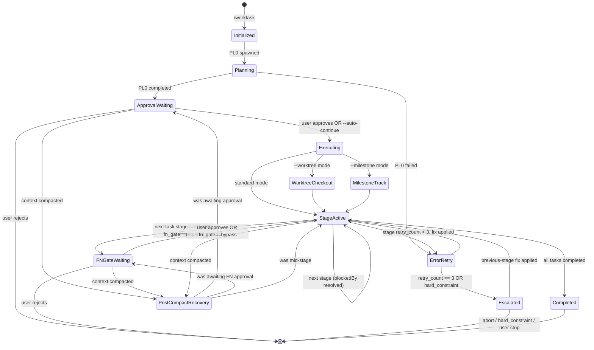

# Worktask System

Single source of truth for task worktask management using the Task System.

## Worktask Evolution (v2.0)

```
9-stage:   PL → AR → TL → DV → DR → QA → DC → FN → ST
11-stage:  PL → AR → TL → DV → DR → SR → QA → DC → RE → FN → ST
                              ↑              ↑
                        Developer Review  Security Review (optional)
```

### State Machine



**Stage codes and triggers**: See `${CLAUDE_SKILL_DIR}/../shared/stage-codes.md` and `${CLAUDE_SKILL_DIR}/../shared/worktask-triggers.md`

**Task System integration**: See `${CLAUDE_SKILL_DIR}/../shared/task-system.md`

## Dynamic Worktask Sizing

PL0 assesses complexity and creates only the stages needed. No pre-creation or deletion — PL builds the task list from scratch.

### Complexity Assessment

| Factor | Low (0-2) | Medium (3-5) | High (6-10) |
|--------|-----------|--------------|-------------|
| **New patterns** | None | 1-2 new | 3+ new |
| **Integration points** | 1-2 | 3-5 | 6+ |
| **Cross-cutting concerns** | None | 1 area | Multiple |
| **Risk level** | Minimal | Moderate | High |
| **Documentation needs** | Inline | README | ADR + API docs |

**Scoring**: Sum factor scores (0-50 total)

### Decision Rules

| Score | Complexity | PL0 Creates |
|-------|------------|-------------|
| 0-10 | Low | DV0, DR0, QA0 |
| 11-20 | Medium | AR0, DV0, DR0, QA0 |
| 21-30 | Moderate | AR0, TL0, DV0, DR0, QA0 |
| 31-40 | High | AR0, TL0, DV0, DR0, QA0, DC0, FN0, ST0 |
| 41-50 | Critical | AR0, TL0, DV0, DR0, SR0, QA0, DC0, RE0, FN0, ST0 |

**Security-sensitive features** auto-include SR0:
- Authentication/authorization, payment processing, PII handling
- Cryptographic operations, external API secrets, file uploads

Each task includes `metadata.agent` for executor resolution. See `initialization-patterns.md § PL Creates Subsequent Tasks`.

### Budget estimate (dynamic mode)

Dynamic mode only: PL0 emits a per-stage budget estimate at `state.json.workflow.budget.estimate_usd`; the orchestrator derives a `ceiling_usd` headroom for the engine (reaching it pauses, not kills, the run). Best-effort — bounds spend, does not guarantee completion. Detail: `references/dynamic-workflow.md#budget`. Unused in manual mode.

## Workspace Mode

`--milestone:N` tickets run in isolated workspaces. `.context/` base path by mode (resolve via `task.metadata.workspace_path` + `metadata.isolation`):

| Mode | `.context/` base |
|------|------------------|
| Standard | `.context/` |
| Workspace (legacy) | `.workspaces/milestone-{N}/{issue#}/.context/` |
| Worktree | `.worktrees/milestone-{N}/{issue#}/.context/` |

**WHEN in milestone/worktree mode, inside a Conductor workspace clone, or on any cwd↔workspace_path mismatch: Read `references/workspace-modes.md`** (detection snippet, Conductor sibling-repo rule, task-ID namespacing). Binding enforcement (workspace-root cross-check + `WORKSPACE_ROOT` banner injection) lives in `commands/worktask.md` Phase 2. Full milestone docs: `../worktask-milestone/SKILL.md`.

## Parallel Execution

### W + Q Parallel (Default)

```typescript
TaskUpdate({ taskId: "5", addBlockedBy: ["4"] });  // DR ← DV
TaskUpdate({ taskId: "6", addBlockedBy: ["5"] });  // QA ← DR
TaskUpdate({ taskId: "7", addBlockedBy: ["5"] });  // DC ← DR
TaskUpdate({ taskId: "8", addBlockedBy: ["6", "7"] });  // FN ← QA AND DC
```

Use `--sequential` when DC requires test results.

### Monitor Tool Integration

Use the `Monitor` tool to stream events from background processes during worktask stages. Replaces polling patterns for build output, test progress, and log streaming. Available to any agent with Bash access. Persist raw stream output to `.context/logs/<kind>-<scope>-<timestamp>.log` per the `logging-conventions` skill.

### Never Parallelize

- AR before PL (needs requirements)
- DV before TL (needs coordination)
- DR before DV (can't review unwritten code)
- QA before DR (DR must review code before QA tests)

## Error Handling

### Retry Logic

Each stage: max 3 retries. Track via `metadata.retry_count` (per-task) and append a narrative entry to `.context/errors/<agent>.md` (per-agent — see `task-folder-organization` skill § Per-Agent Error Files). Raw stdout/stderr goes to `.context/logs/retry-<stage>-<ts>.log` per `logging-conventions`.

### Escalation Chains

```
11-stage: ST → FN → RE → DC → QA → SR → DR → DV → TL → AR → PL → USER
9-stage:  ST → FN → DC → QA → DR → DV → TL → AR → PL → USER
Emergency: FN → RE → QA → DR → DV → IR → USER
```

Document errors in `.context/errors/<agent>.md` (per-agent, append-only; one `## Retry N — <ts>` section per failure) with problem, classification, root cause, attempted solutions. Raw captures belong in `.context/logs/` per `logging-conventions`.

## Rule Checks

| Rule | Required Before |
|------|-----------------|
| Test Strategy | PL → AR |
| Test Architecture | AR → TL |
| Code Format | DV complete |
| Build Pass | DV → DR |
| Unit Tests Written + Pass | DV → DR |
| Developer Review Pass | DR → QA |
| All Tests Pass (Unit + Integration + E2E) | QA → DC |

## Optimization Hooks

### Pre-Stage

| Check | Threshold | Action |
|-------|-----------|--------|
| Context size | > 50% window (standard) or > 30% (1M window) | Compress previous stages |
| Budget usage | > 75% | Alert user |
| Free disk space | < 5 GB before a build stage (AR/DV/QA/SR/RE) | Halt with remediation — see § Pre-Stage Disk Guard |
| Free disk space | < 8 GB before a build stage | Warn; run `swift package clean` hygiene before delegating |

### Pre-Stage Disk Guard (ENOSPC)

Stages that invoke `swift build` / `xcodebuild` — **AR, DV, QA, SR, RE** — accumulate `.build/` and DerivedData artifacts across runs. With no pre-flight disk check, an exhausted filesystem kills the build harness mid-stage. In the `tokamak-reconciler-unification` run (#14) ENOSPC killed the harness twice: AR partially (recovered) and SR fully (the orchestrator could only persist the stage from the artifact frontmatter, noting `"agent hit ENOSPC"` in state.json). Before delegating any of those five stages, assert free space on the workspace filesystem:

```bash
# Threshold is configurable via DISK_MIN_GB (hard halt, default 5) and
# DISK_WARN_GB (hygiene warn, default 8).
MIN_GB="${DISK_MIN_GB:-5}"; WARN_GB="${DISK_WARN_GB:-8}"
AVAIL_GB=$(df -Pg "${WORKSPACE_ROOT:-.}" 2>/dev/null | awk 'NR==2 {print $4+0}')
if [ -n "$AVAIL_GB" ] && [ "$AVAIL_GB" -lt "$MIN_GB" ]; then
  appendAudit action=pre_stage_disk_halt result=blocked \
    metadata="{\"stage\":\"$CODE\",\"avail_gb\":$AVAIL_GB,\"min_gb\":$MIN_GB}"
  echo "HALT: only ${AVAIL_GB} GB free (< ${MIN_GB} GB) before $CODE." \
       "Reclaim space, then resume:" \
       "  swift package clean   # drops .build/" \
       "  rm -rf ~/Library/Developer/Xcode/DerivedData/*   # drops DerivedData" >&2
  # Do NOT delegate the stage — return to the user for remediation.
elif [ -n "$AVAIL_GB" ] && [ "$AVAIL_GB" -lt "$WARN_GB" ]; then
  appendAudit action=pre_stage_disk_warn result=ok \
    metadata="{\"stage\":\"$CODE\",\"avail_gb\":$AVAIL_GB,\"warn_gb\":$WARN_GB}"
  # Optional hygiene before DV: swift package clean to reclaim build artifacts.
fi
```

- **Hard halt** (< `DISK_MIN_GB`, default 5): do NOT delegate; surface the remediation and return — a halted run is recoverable, an ENOSPC-killed harness mid-stage is not.
- **Warn** (< `DISK_WARN_GB`, default 8): proceed, but run `swift package clean` as a pre-DV hygiene step to reclaim `.build/` first.
- `df -Pg` (`-g` = whole GiB blocks; `-P` = portable single-line rows) is POSIX-portable on macOS and Linux; the guard degrades to a no-op (skips the check, proceeds) if `df` output is unparseable, so it never blocks a run on a measurement failure.

### Post-Stage

- Compress context for handoff (50-100 tokens)
- Log token usage in task metadata
- Validate artifacts created
- `PostCompact` hook fires after auto-compaction — use to re-inject critical worktask state

> On Opus 4.6/4.7/4.8 with Max/Team/Enterprise, context window is 1M tokens. Compression still recommended at stage boundaries for cost efficiency even with larger windows.

See references/ for initialization code, stage details, and agent teams integration.

## Pre-Stage Validation

Before executing any worktask stage, the orchestrator MUST validate:

1. **TaskList check**: Call `TaskList()` and verify at least one task exists with `metadata.worktask_id` matching the current worktask
2. **PL0 exists**: Verify a task with subject starting with `PL0:` exists
3. **Stage tasks exist**: After PL0 completes, verify PL0 created subsequent stage tasks (at minimum DV0, DR0, and QA0 for any complexity level)
4. **Stage contract check**: Verify upstream outputs match the next stage's Required Inputs per `shared/stage-contracts.md` (file exists + required sections present)
5. **Metadata schema check**: Validate next task's metadata against `shared/task-system.md` § JSON Schema (non-PL tasks require `stage`, `agent`, `model`, `error_file`)
6. **Model alias check**: `metadata.model ∈ {fable, opus, sonnet, haiku}` — reject unknown aliases before `Task()` delegation. Caveat (CC ≥ 2.1.172/2.1.175): under a managed `availableModels` allowlist (now applied to subagent model overrides too) or `enforceAvailableModels`, a *valid* alias may silently resolve to a different model at dispatch — emit a `model_resolution_constrained` audit row when a managed allowlist is in effect; do NOT hard-block
7. **Workspace existence** (milestone/worktree mode only): verify `metadata.workspace_path` directory exists and `workspace.json` is readable
8. **Artifact path resolution check** (non-blocking): for the next task's `metadata.run_index`, resolve the upstream artifact via the `stageArtifactPath()` helper below. Emit one `artifact_path_resolved` audit row with `result ∈ {ok, fallback_glob, fallback_legacy, miss}` and `metadata.resolved_path`. A `miss` result means the upstream stage produced no artifact and is treated by F3 in `references/handoff-protocol.md#fallback-paths` — warn but proceed. Catches run_index drift early (off-by-one between PL0 and stage tasks) before downstream stages burn tokens on fallback reads.
9. **Hook installation check** (first stage only): Verify `state-merge.sh` SubagentStop hook is operational. Check: (a) `.claude/hooks/state-merge.sh` exists and is executable, OR (b) the plugin's `plugin.json` registers the SubagentStop hook entry. If neither is true, emit a warning: `"⚠ state-merge.sh hook not installed — run hook-install.sh"`. Do NOT block — the orchestrator's Step 6.5 provides Layer 3 coverage. See `references/initialization-patterns.md#hook-installation`.

If validation fails:
- No tasks exist → Worktask not initialized. Re-run initialization (TaskCreate PL0)
- PL0 exists but no subsequent tasks → PL0 did not complete properly. Re-run PL0
- Tasks exist but are orphaned (no worktask_id) → Log warning and attempt to match by subject pattern
- Contract violation → Do NOT transition. Append `missing_input` entry to next stage's `.context/errors/<agent>.md` and block.

## Orchestrator Execution Loop

> **This loop is the MANUAL execution mode** — the default. It dispatches one `Task()` per ready stage
> in-process. When the worktask was started with `--dynamic` AND the native `Workflow` tool is present
> (`PL0.metadata.execution_mode == "dynamic"`), the autonomous span (AR→…→QA/DC/RE) runs on the native
> Workflow engine instead — see `skills/worktask/references/dynamic-workflow.md`. In dynamic mode the
> AR→DC/RE stage execution is delegated to that reference, but the **PL0 precondition (below), the FN gate
> (§ FN Gate), and the on-return boundary reconciliation stay orchestrator-owned**. If `--dynamic` was
> requested but the `Workflow` tool is absent, the orchestrator writes a `dynamic_fallback` audit row and
> runs this manual loop unchanged. Everything else in this section is mode-agnostic.

> **Figma asset persistence is NOT an orchestrator step.** Figma screenshots are captured AND persisted to
> the canonical `.context/designs/` directory entirely within the PL turn (Phase 1) by the product-manager
> via its narrowly-scoped `Bash(curl:*)` tool — `get_screenshot` returns a short-lived URL that must be
> fetched while still valid, before the post-approval Bash window opens. The orchestrator MUST NOT add a
> post-PL0/pre-approval download step (it would collide with the Phase-1 Bash prohibition in
> `commands/worktask.md` and race the expiring URL). See `agents/product-manager.md § Capture Workflow`.

### Cache-Friendly Prompt Layout & state.json (handoff-protocol)

The orchestrator builds every delegation prompt in a **binding** order so consecutive `Task()` calls within the same `worktask_id` share a byte-identical prefix and benefit from Anthropic's prompt cache. Spec source: `skills/worktask/references/handoff-protocol.md#cache-prefix`.

**Preamble layout (binding)**:

```
[1] Plugin/agent contract reminder         ← stable across ALL stages (cacheable)
[2] Worktask header (id, plan, exploration)← stable across ALL stages (cacheable)
[3] state.json blob (inlined JSON)         ← evolves per stage
[4] Stage contract excerpt                 ← stable WITHIN stage type (cacheable)
─────── (cache prefix boundary) ───────
[5] task.description                       ← dynamic per delegation
[6] retry hints + gate remediation (if retry_count > 0) ← dynamic per delegation
[7] Stage-specific banners (DR Skill, FN Conductor, MCP fallback) ← SUFFIX, dynamic
```

**Step 0 (NEW) — Read state.json before each delegation**:

```typescript
const stateRaw = fs.existsSync(".context/state.json")
  ? fs.readFileSync(".context/state.json", "utf8")
  : null;
// stateRaw goes inline into preamble section [3] as a fenced JSON code block.
// If null, F1 fallback applies: orchestrator uses metadata.context_files only,
// no cache-friendly preamble (legacy mode).
```

**Artifact path helper** (resolves numbered path with fallback):

```typescript
const ARTIFACT_BASE: Record<string, string> = {
  PL: "planning", AR: "analyzing", TL: "coordination",
  DV: "development", DR: "developer-review", SR: "security-review",
  QA: "testing", DC: "documentation", RE: "release",
  FN: "complete-summary", ST: "retrospective", IR: "incident",
  ET: "ethics-review",
};
function stageArtifactPath(code: string, runIndex: number): string {
  const base = ARTIFACT_BASE[code];
  const numbered = `.context/${base}-${runIndex}.md`;
  if (fs.existsSync(numbered)) return numbered;
  // Newest-glob fallback (covers legacy or out-of-band writes)
  const matches = glob.sync(`.context/${base}-*.md`).sort((a, b) => {
    const n = (f: string) => parseInt(f.match(/-([0-9]+)\.md$/)?.[1] ?? "0", 10);
    return n(a) - n(b);
  });
  if (matches.length > 0) return matches.pop()!;
  // No artifact on disk: return the canonical numbered path so the
  // caller's existence check surfaces the miss at the expected location.
  return numbered;
}
```

**Step 6.5 — After Task() returns, enforce state.json patch (MANDATORY)**:

After every `Task()` return and BEFORE `TaskUpdate(stage→completed)`, execute this three-layer check:

```typescript
// Layer check: re-read state.json.
const statePost = JSON.parse(fs.readFileSync(".context/state.json", "utf8"));
const code = full.metadata.stage;
const runIndex = full.metadata.run_index ?? 0;
const artifactPath = stageArtifactPath(code, runIndex);

if (statePost.stages?.[code]?.status !== "completed") {
  // Layer 1 (agent self-patch) missed. Invoke Layer 2 (state-merge hook) synchronously.
  // This fires even if the SubagentStop hook event was not delivered.
  // Uses Bash tool: CLAUDE_ARTIFACT_PATH=<path> CLAUDE_TASK_METADATA_STAGE=<code> bash .claude/hooks/state-merge.sh
  runStateMergeHook(artifactPath, code);

  // Re-read after hook.
  const statePost2 = JSON.parse(fs.readFileSync(".context/state.json", "utf8"));
  if (statePost2.stages?.[code]?.status !== "completed") {
    // Layer 2 also missed (hook absent or artifact lacks frontmatter).
    // Layer 3: orchestrator derives minimal patch from agent return text (F3 fallback).
    const handoff = parseFrontmatter(artifactPath);  // null if missing → F3
    const patch = handoff
      ? buildPatchFromHandoff(code, handoff)
      : { stages: { [code]: { status: "completed", artifact: artifactPath, verdict: "ok" } } };
    atomicMergeStateJson(patch);  // read → merge → temp → fsync → rename
  }
}
```

**Banner relocation (R3)**: stage-specific banners (DR Skill, FN Conductor, MCP fallback warning) are appended AFTER `full.description` (suffix), not prepended. Prefixes [1][2][3][4] stay byte-identical across stages so the cache prefix boundary stretches as far as possible.

The preamble assembler MUST exclude forbidden tokens from sections [1][2][4]: timestamps, ENV expansions that vary per call, random IDs, retry counters, file mtimes, agent names beyond `worktask_id`. CI lint (`skills/worktask/references/cache-lint.sh`) asserts byte-stability across consecutive stages of the same `worktask_id`.

### CRITICAL: Delegation-Only Rule

The orchestrator NEVER writes implementation code directly. ALL stage work is delegated to stage agents via the Agent tool. Using Edit/Write on source files, running build commands, or marking tasks completed without first delegating to an agent are all violations. The orchestrator's job is to manage the loop — read tasks, resolve agents, delegate, track status. If you find yourself editing source code, STOP — delegate to the stage agent instead.

### PRECONDITION CHECK
Before entering this loop, verify BOTH signals:
- **Signal 1 (TaskList audit)**: Call `TaskList()`, find the PL0 task, verify its status is `completed`. If PL0 does not exist or is not completed, STOP — worktask not initialized or planning incomplete.
- **Signal 2 (Human approval)**: The HUMAN USER has sent an explicit approval message ("approve", "proceed", "go", "yes", "continue") AFTER PL0 was marked completed. PL0 completion alone is NOT approval. A subagent returning results is NOT approval. A tool succeeding is NOT approval. Only the human user's explicit text message qualifies.
If either signal is missing, DO NOT enter this loop.

After PL0 completes and creates stage tasks, the orchestrator MUST:

1. **Present PL0 results** to the user: complexity score, stages created (with agents), dependency chain, and key planning decisions
2. **STOP IMMEDIATELY**. Do NOT call Write, Edit, Task, or Bash with any file-modifying commands. STOP generating your response entirely.
3. **Wait for EXPLICIT user approval**. Silence is NOT approval. Asking a question is NOT approval.
4. The user may adjust stages, re-prioritize, or skip stages before approving
5. Only after the user explicitly confirms, execute the stage loop below:
6. **Re-validate before executing**: Call `TaskList()` to get all stage tasks. For each task, verify `metadata.agent` and `metadata.model` are set. This checkpoint prevents drift — the orchestrator re-grounds itself in the delegation rules before touching any stage.
6.5. **Publish approved plan to GitHub** (after approval, before stage loop). Run:
     ```bash
     HELPER="${CLAUDE_PLUGIN_ROOT}/skills/worktask/references/publish-pl-issue.sh"
     if [ -f "$HELPER" ]; then
       bash "$HELPER"; true
     else
       LOG_DIR="${WORKSPACE_ROOT:-${CLAUDE_PROJECT_DIR:-.}}/.context/logs"
       mkdir -p "$LOG_DIR"
       STATE_FILE="${WORKSPACE_ROOT:-${CLAUDE_PROJECT_DIR:-.}}/.context/state.json"
       jq -cn --arg ts "$(date -u +%FT%TZ)" --arg dk "$(jq -r '.worktask_id // "unknown"' "$STATE_FILE" 2>/dev/null || echo unknown):$(jq -r '.run_index // 0' "$STATE_FILE" 2>/dev/null || echo 0):gh_issue" \
         '{ts:$ts, actor:"orchestrator", action:"github_issue_created", subject:"PL0", result:"deferred", task_id:"1", metadata:{via:"publish-pl-issue.sh", reason:"helper_not_found", dedupe_key:$dk}}' \
         >> "$LOG_DIR/audit.jsonl"; true
     fi
     ```
     The trailing `; true` masks the helper's exit code — a helper failure (catastrophic exit 1, deferred exit 0, network error, etc.) MUST NEVER propagate as orchestrator failure. Skip entirely when `--no-gh-issue` was supplied on the CLI (PL0 sets `task.metadata.no_gh_issue: true`; the helper short-circuits internally and audits `deferred`/`opted_out`). Under milestone mode (`--milestone:N`, `state.json:metadata.milestone` set, or `workspace.json` present), the helper exits `0` immediately with `reason: "milestone_mode"` — no `gh` API call of any kind is made. See `### PL Issue Publish` below for sanitiser rules and the non-blocking guarantee.

Unless `--auto-continue` flag was provided — in that case, skip the approval gate and proceed directly.

```typescript
// 1. Get all tasks for this worktask
let tasks = TaskList();

// 2. Loop until all tasks are completed
while (tasks.some(t => t.status !== "completed")) {
  // 3. Find unblocked pending tasks
  const ready = tasks.filter(t =>
    t.status === "pending" &&
    (t.blockedBy ?? []).every(dep => tasks.find(d => d.id === dep)?.status === "completed")
  );

  for (const task of ready) {
    // 4. Get full task details
    const full = TaskGet({ taskId: task.id });
    const agentType = full.metadata.agent;
    const model = full.metadata.model;

    // Resolve plugin:
    //   bare (no `:`)        e.g. "developer"                 → "igrsoft:developer"
    //   2-part ("plugin:name") e.g. "apple-developer:ios-developer" → used as-is
    //   3-part ("a:b:c")     → UNSUPPORTED. Orchestrator MUST error out:
    //     "Invalid agent reference '{agentType}': only bare or plugin-qualified names supported."
    //   The basename for .context/errors/<basename>.md is the last `:`-separated segment.
    //   This validator applies at EVERY nesting depth (CC ≥ 2.1.172 allows sub-agents to
    //   spawn sub-agents, 5 levels deep) — depth never legitimizes a 3-part name.
    const colonCount = (agentType.match(/:/g) ?? []).length;
    if (colonCount > 1) {
      throw new Error(`Invalid agent reference '${agentType}': only bare or plugin-qualified names supported.`);
    }
    const subagentType = colonCount === 1 ? agentType : `igrsoft:${agentType}`;

    // 4.5. Soft context_files validation — warn, don't abort
    //      Low-complexity worktasks legitimately skip upstream stages,
    //      so a missing listed file is a warning appended to the prompt.
    //      Exception: error_file absence is expected on first attempt
    //      (retry_count === 0) — suppress that specific warning.
    if (full.metadata.context_files) {
      const listed = full.metadata.context_files.split(',').map(s => s.trim());
      const retryCount = full.metadata.retry_count ?? 0;
      const missing = listed.filter(p =>
        !fs.existsSync(p) &&
        !(p === full.metadata.error_file && retryCount === 0)
      );
      if (missing.length > 0) {
        full.description =
          `NOTE: Expected context files missing: ${missing.join(', ')}. ` +
          `Proceed using what is available; do not fabricate content.\n\n` +
          full.description;
      }
    }

    // 4.6. Gate-feedback injection — DR→DV / QA→DV loop-back (gate-feedback contract).
    //      When the previous DR returned `verdict:fail` or QA returned `verdict:no-go`,
    //      the orchestrator re-dispatches DV (run_index bumped, retry_count++). This
    //      step carries the upstream remediation VERBATIM into the retry prompt so the
    //      re-run targets *those* findings instead of re-inferring the fix — the
    //      orchestrator surface of the gate-feedback contract (the hook surface is
    //      `hookSpecificOutput.additionalContext`; see
    //      skills/agent-coordination/references/hook-monitoring.md §"Gate-feedback contract").
    //      Symmetric with dv-screenshot-gate.sh's block-path additionalContext.
    if (full.metadata.stage === "DV" && (full.metadata.retry_count ?? 0) > 0) {
      // Read the upstream gate handoff for this run: DR `.context/developer-review-N.md`
      // (DRHandoff.blockers[]) and/or QA `.context/testing-N.md` (QAHandoff.blocking_defects[]),
      // N = the failing upstream run_index. Embed whichever is present as a remediation block.
      const fromStage = full.metadata.gate_from_stage; // "DR" | "QA" (set by the loop-back)
      const blockers = full.metadata.gate_blockers ?? []; // blockers[] | blocking_defects[]
      if (fromStage && blockers.length > 0) {
        const remediation =
          `REMEDIATION (from ${fromStage} gate — fix these specific findings before re-stop):\n` +
          blockers.map((b, i) => `  ${i + 1}. ${b}`).join("\n");
        full.description = remediation + "\n\n" + full.description;
        appendAudit({
          actor: "orchestrator",
          action: "gate_remediation_injected",
          subject: full.metadata.stage,
          result: "ok",
          metadata: { from_stage: fromStage, to_stage: "DV", count: blockers.length }
        });
      }
    }

    // 4.7. DV checkpoint resume — restart DV from its last budget-aware checkpoint.
    //       When a prior DV run exhausted its budget mid-implementation, it wrote a
    //       partial `development-N.md` (+ `## Blockers`) and recorded the completed
    //       sub-batches at `state.json → stages.DV.progress` rather than emitting a
    //       progress narration (see agents/developer.md § Budget-Aware Checkpointing).
    //       On re-dispatch, carry the checkpoint forward so the re-run resumes from
    //       `next_batch` instead of redoing applied work. Friction precedent:
    //       tokamak-reconciler-unification (#14) — DV hit its budget twice and the
    //       orchestrator had to reconstruct partial state by hand.
    if (full.metadata.stage === "DV") {
      const dvProgress = state.stages?.DV?.progress;  // {completed_batches, next_batch, updated_at}
      if (dvProgress && (dvProgress.completed_batches?.length ?? 0) > 0) {
        const resume =
          `RESUME (DV checkpoint — prior run completed batches ` +
          `[${dvProgress.completed_batches.join(", ")}]; resume from ` +
          `${dvProgress.next_batch ?? "the next pending batch"}). Do NOT redo applied ` +
          `batches — read the partial development-N.md and continue forward.`;
        full.description = resume + "\n\n" + full.description;
        appendAudit({
          actor: "orchestrator",
          action: "dv_checkpoint_resume",
          subject: "DV",
          result: "ok",
          metadata: {
            completed: dvProgress.completed_batches,
            next_batch: dvProgress.next_batch ?? null
          }
        });
      }
    }

    // 4.8. DV worktree-isolation enforcement — inject the isolation pre-condition.
    //       When `--worktree` is set (task.metadata.isolation === "worktree") OR the
    //       worktask complexity is ≥ 30, DV must run in an isolated worktree before
    //       writing files (see agents/developer.md § D0.0). Carry that requirement into
    //       the DV prompt so the agent confirms isolation, creates a worktree, or flags
    //       the deviation and returns — instead of silently editing the shared checkout.
    //       Friction precedent: tokamak-reconciler-unification (#14, decision dv6) ran DV
    //       in the main baton-rouge workspace, risking cross-contamination and weakening
    //       branch-exclusion constraints. DR rejects a DV handoff carrying `worktree:false`
    //       when isolation was expected, unless the orchestrator explicitly waives it.
    if (full.metadata.stage === "DV") {
      const complexity = full.metadata.complexity
        ?? state.stages?.PL?.complexity ?? 0;
      const worktreeExpected =
        full.metadata.isolation === "worktree" || complexity >= 30;
      if (worktreeExpected) {
        const enforce =
          `WORKTREE ISOLATION REQUIRED (--worktree set or complexity ${complexity} ≥ 30): ` +
          `confirm you are in an isolated worktree before any Edit/Write (D0.0). ` +
          `If not, EnterWorktree and proceed, or flag worktree_isolation_missing and ` +
          `return verdict:blocked. Set handoff frontmatter \`worktree: true|false\` truthfully.`;
        full.description = full.description + "\n\n" + enforce;
        appendAudit({
          actor: "orchestrator",
          action: "dv_worktree_enforced",
          subject: "DV",
          result: "ok",
          metadata: { complexity, isolation: full.metadata.isolation ?? null }
        });
      }
    }

    // 4.9. FN approval gate — STOP before any FN-stage task unless bypassed
    //      See § FN Gate stub below — Read references/fn-gate.md at gate time
    //      for the 6-step procedure and the pre-FN summary template.
    if (full.metadata.stage === "FN") {
      const pl0 = tasks.find(t => t.metadata?.stage === "PL");
      const gateModeRaw = pl0?.metadata?.fn_gate;
      const gateMode = gateModeRaw ?? "required";  // default safe (fail-closed)
      // Validate gate value. Anything outside the closed set falls through
      // to required behaviour (the `!== "bypass"` branch), but silent
      // fall-through masks misconfiguration. Audit unrecognized values so
      // PL0 writer drift surfaces in cost-report / incident review.
      if (gateModeRaw !== undefined && gateModeRaw !== "required" && gateModeRaw !== "bypass") {
        appendAudit({
          actor: "orchestrator",
          action: "fn_gate_invalid_value",
          subject: "FN0",
          result: "fallback_required",
          metadata: {
            observed: String(gateModeRaw).slice(0, 64),
            pl0_task_id: pl0?.id ?? null,
            note: "PL0.metadata.fn_gate must be 'required' or 'bypass' (see commands/worktask.md Phase 1 step 4). Treating as 'required'."
          }
        });
      }
      if (gateMode !== "bypass") {
        // (a) Build pre-FN summary from the resolved plan file
        //     (`task.metadata.plan_file`; fallback: newest `.context/planning-*.md`),
        //     .context/developer-review-N.md, .context/testing-N.md.
        // (b) Print summary to user. Do NOT call TaskUpdate.
        //     Do NOT delegate. FN task stays `pending`.
        // (c) Write `fn_gate_waiting` audit line.

        // 4.9.1. Pre-gate Conductor-attachments writer
        //        Imperative checklist: references/fn-gate.md § Pre-gate
        //        Conductor-attachments writer (Read at gate time, step 1 of 6).

        // (d) End the orchestrator turn — wait for HUMAN approval.
        return;  // exits the entire execution loop; resume happens in a fresh turn
      }
      // bypass branch:
      // (a) Write `fn_gate_bypass` audit line with reason derived from
      //     PL0.metadata (auto-continue | milestone | worktree).
      // (b) Fall through to normal delegation.
    }

    // 5. Mark in_progress
    TaskUpdate({ taskId: task.id, status: "in_progress" });

    // 5a. Resolve embedded commands for DV stages
    //     If worktask has embedded_commands metadata, inject Skill invocation into DV prompt
    if (full.metadata.stage === "DV" && worktask_embedded_commands) {
      const skillInvocation = `IMPORTANT: Before implementing, invoke the embedded command via Skill tool: Skill("${embedded_cmd}", args="${embedded_args}")`;
      full.description = skillInvocation + "\n\n" + full.description;
    }

    // 5b. Inject code-review-dev Skill invocation for DR stages.
    //     handoff-protocol: APPEND as suffix (section [7]) so the preamble
    //     prefix [1][2][3][4][5] stays byte-identical with neighbour stages
    //     and the prompt cache prefix boundary is preserved.
    if (full.metadata.stage === "DR") {
      const runIndex = full.metadata.run_index ?? 0;
      const reviewInvocation = `IMPORTANT: Execute developer code review via Skill tool: Skill("code-review-dev"). Save findings summary to .context/developer-review-${runIndex}.md`;
      full.description = full.description + "\n\n" + reviewInvocation;
    }

    // 5c. Pre-warm XcodeBuildMCP for Apple DV/DR/QA stages
    //     XcodeBuildMCP is registered globally as `npx -y xcodebuildmcp@latest mcp`
    //     (stdio, lazy-spawn). Subagents only inherit MCP servers that are
    //     ALREADY RUNNING in the parent session at delegation time. If we
    //     delegate before the parent has issued any XcodeBuildMCP call, the
    //     child (especially in worktree isolation) inherits an unstarted
    //     reference and the first tool call fails with "tool not available".
    //     Warm the server in the parent ONCE per worktask before the first
    //     Apple-platform stage that needs it.
    const APPLE_STAGES = new Set(["DV","DR","QA"]);
    const APPLE_AGENTS = /^(developer|technical-lead|qa-engineer)$/;
    const isAppleStage =
      APPLE_STAGES.has(full.metadata.stage) &&
      ( full.metadata.platform === "apple" ||
        ( !full.metadata.platform &&
          APPLE_AGENTS.test(agentType.split(":").pop()) &&
          // workspace contains Apple markers
          ["*.xcodeproj","*.xcworkspace","Package.swift"]
            .some(g => glob.sync(g, { cwd: process.cwd(), dot: false }).length > 0)
        )
      );
    if (isAppleStage && !state.xcodeMcpWarmed) {
      // See `agent-coordination § MCP Unavailability Detection` for the canonical regex.
      const MCP_UNAVAILABLE_RE = /(tool not available|server (not reachable|unavailable)|connection refused|ECONNREFUSED|EPIPE|ETIMEDOUT|timed? ?out|spawn ENOENT|command not found|InputValidationError)/i;
      let warmed = false;
      for (let attempt = 1; attempt <= 3 && !warmed; attempt++) {
        try {
          await mcp__XcodeBuildMCP__session_show_defaults({});
          warmed = true;
          appendAudit({ action: "mcp_warmup_attempt",
                        metadata: { server: "XcodeBuildMCP", attempt, result: "ok" } });
        } catch (err) {
          const reason = String(err?.message ?? err).slice(0, 500);
          const classified = MCP_UNAVAILABLE_RE.test(reason) ? "transient" : "fatal";
          appendAudit({ action: "mcp_warmup_attempt",
                        metadata: { server: "XcodeBuildMCP", attempt, result: "fail",
                                    classified, reason: reason.slice(0, 200) } });
          if (classified === "fatal") throw err;        // real bug — don't burn the budget
          if (attempt < 3) await sleep(8000);            // npx cold-start budget (P95 ~16s over 2 sleeps)
        }
      }
      state.xcodeMcpWarmed = warmed;

      // Cache session state in state.json so DV/DR/QA skip redundant queries
      if (warmed && fs.existsSync(".context/state.json")) {
        try {
          const defaults = await mcp__XcodeBuildMCP__session_show_defaults({});
          atomicMergeStateJson({
            mcp_session: {
              xcode_defaults: defaults,
              warmed_at: new Date().toISOString()
            }
          });
        } catch (_) { /* non-critical — agents fall back to live calls */ }
      }

      if (!warmed) {
        appendAudit({ action: "mcp_warmup_failed",
                      metadata: { server: "XcodeBuildMCP" } });
        const runIndex = full.metadata.run_index ?? 0;
        const banner =
          `IMPORTANT: XcodeBuildMCP warmup failed in the orchestrator. ` +
          `Treat mcp__XcodeBuildMCP__* as UNAVAILABLE. Fall back to ` +
          `xcodebuild via Bash for build/test (tee output to the same ` +
          `.context/logs/* paths) and record the fallback in ` +
          `.context/development-${runIndex}.md § Decisions so QA/DR see it.`;
        // handoff-protocol: SUFFIX banner (section [7]) — preserves the
        // cache prefix boundary at the [1][2][3][4][5] line.
        full.description = full.description + "\n\n" + banner;
      }
      // warmup succeeded → child inherits a live XcodeBuildMCP server.
    }

    // 5d. Inject Conductor-attachments requirement for FN stages
    //     Ensures project-manager always creates .context/attachments/ files
    //     regardless of how PL0 described the FN task. Mirrors 5b (DR injection).
    //     Templates: skills/worktask/references/conductor-attachments.md
    if (full.metadata.stage === "FN") {
      const fnInjection = [
        "IMPORTANT — Conductor attachments (FN-stage requirement, non-optional):",
        "Before running `gh pr create`, write both files per",
        "`skills/worktask/references/conductor-attachments.md`:",
        "  • `.context/attachments/PR instructions.md`",
        "  • `.context/attachments/Review request.md`",
        "Run `mkdir -p .context/attachments` first.",
        "Also write `.context/complete-summary-N.md` (worktask summary + Stage Timings; N = task.metadata.run_index).",
        "Then read `PR instructions.md` and follow it as the PR-creation script.",
      ].join("\n");
      full.description = full.description + "\n\n" + fnInjection;
    }

    // 5e. Permission-Mode Pinning (in-process honour of task.metadata.permission_mode)
    //     When PL0 set `permission_mode: "default"` on this task (typically SR/FN under
    //     --secure/--full/fworktask), the orchestrator MUST NOT propagate
    //     --dangerously-skip-permissions or equivalent shorthand into descendant Task()
    //     calls or nested Bash invocations for this stage, and MUST audit the boundary.
    //     The Task() tool has no permission-mode parameter today — this is a procedural
    //     constraint backed by audit, not a runtime enforcement. See
    //     skills/agent-coordination/references/headless-dispatch.md § Permission-Mode Pinning.
    if (full.metadata.permission_mode === "default") {
      appendAudit({
        action: "permission_mode_pinned",
        subject: task.id,
        result: "ok",
        metadata: { stage: full.metadata.stage, mode: "default" }
      });
    }

    // 6. Delegate to stage agent
    Task({ subagent_type: subagentType, model: model, prompt: full.description });

    // 6.5. handoff-protocol: patch state.json from artifact frontmatter if the
    //      agent didn't already do so. Belt-and-suspenders layer #3 (after
    //      in-agent atomic write and the optional SubagentStop hook).
    //      See handoff-protocol.md#fallback-paths F2/F3.
    if (fs.existsSync(".context/state.json")) {
      const post = JSON.parse(fs.readFileSync(".context/state.json", "utf8"));
      const code = full.metadata.stage;
      if (post.stages?.[code]?.status !== "completed") {
        const runIndex = full.metadata.run_index ?? 0;
        const artifactPath = stageArtifactPath(code, runIndex);  // e.g. ".context/development-0.md"
        const handoff = parseFrontmatter(artifactPath);  // null → F3 fallback
        const patch = handoff
          ? buildPatchFromHandoff(code, handoff)
          : { stages: { [code]: { status: "completed", artifact: artifactPath, verdict: "ok" } } };
        atomicMergeStateJson(patch);
      }
    }

    // 7. Mark completed
    TaskUpdate({ taskId: task.id, status: "completed" });
  }

  // Refresh task list
  tasks = TaskList();
}
```

**Key rules**:
- NEVER skip TaskUpdate calls (both in_progress and completed)
- NEVER execute a stage without checking blockedBy dependencies are completed
- ALWAYS pass `model` from task metadata to the Agent tool — if task has `model: opus`, the Agent call MUST include `model: "opus"`. Omitting or mismatching is a violation. Do NOT rely on agent frontmatter inheritance
- `metadata.agent` accepts bare names (`"developer"` → `igrsoft:developer`) or fully-qualified plugin names (`"apple-developer:ios-developer"` → used as-is). Detection: presence of `:`
- If a stage agent fails after 3 retries, escalate per the error handling chain
- NEVER mark a task `completed` without first delegating to an agent and receiving its results — completion without delegation is the most common violation
- The orchestrator uses ONLY TaskCreate, TaskUpdate, TaskGet, TaskList, and Agent tools. Edit/Write/Bash on source files belong to stage agents, not the orchestrator
- The orchestrator owns the loop; stage agents own their stage's work
- Prefer in-memory task tracking over `TaskList()` polling. Call `TaskList()` only on first loop entry, after TL/DV stages (which may create sub-tasks), and every 3rd iteration as a consistency check. For linear pipelines, update the local task array from `TaskUpdate` results instead of re-fetching all tasks

### PL Issue Publish

Step 6.5 invokes `skills/worktask/references/publish-pl-issue.sh` between the PL approval gate and the stage-loop entry. The helper is **non-blocking by contract** (default): orchestrator wraps it in a `; true` so a non-zero exit is never propagated, and the helper itself returns `0` for every operational outcome (success, deferred, network error, sanitiser abort) — only catastrophic bugs (`jq` missing, `audit_dir_unwritable`, `state_corrupt`, `plan_unreadable`) raise `1`. Each outcome is recorded as one `github_issue_created` row in `.context/logs/audit.jsonl` with `result ∈ {ok, deferred, failed, error}` and `metadata.reason ∈ {gh_not_installed, auth_missing, no_remote, network_error, sanitiser_aborted, already_published, opted_out, milestone_mode, helper_not_found, label_create_failed, gh_api_error, gh_timeout, permission_denied, repo_not_found}` (mode is always implicit `create` on success — comment-mode was removed in favour of milestone-mode skip). The `helper_not_found` reason is not raised by the helper itself — the orchestrator emits this directly when the helper file is unreachable. The `network_error` reason is reserved for genuine transport-failure stderr (`could not resolve host`, `connection refused`, `timeout`); label/auth/api failures are mapped to their specific reason instead of being bucketed as network errors. Dedupe-key shape: `<worktask_id>:<run_index>:gh_issue`.

**Strict mode opt-in.** Passing `--strict` to the helper, or stamping `metadata.gh_issue.strict: true` on the state.json, flips operational failures from non-blocking `result: "deferred"` to blocking `result: "failed"` with `exit 1`. Use when an unpublished issue is unacceptable (e.g., compliance-tracked runs). Default behaviour stays unchanged so the existing fixture corpus and casual runs are unaffected.

**External-ticket extraction.** The helper extracts a `^[A-Z][A-Z0-9]+-[0-9]+` prefix from `facts.goal` (falls back to upper-cased `worktask_id`). On match it (a) ensures the issue title starts with the prefix without double-prefixing, (b) appends a `ticket:<PREFIX>` label (auto-provisioned via the same `ensure_labels()` path as the canonical set), (c) persists the prefix to `state.json:metadata.external_ticket`, (d) includes `external_ticket` in the success audit row. When `ensure_labels()` cannot create one of the canonical or ticket labels, the offending label is dropped from the `--label` argument and recorded in the audit row under `metadata.labels_dropped` (array).

**Sanitiser rules summary (two-pass).** Pass 1 drops entire lines matching any of nine rules (L1–L9): `.context/` paths, absolute filesystem paths (`/Users/`, `/home/`, `/tmp/`, `/var/`, `/opt/`, `/etc/`, `/root/`), `~/`-prefixed paths, `conductor/workspaces/<id>` directories, the literal tokens `workspace_path`/`plan_file`/`run_index`/`artifact_path`, every numbered artifact filename (`planning-N.md`, `analyzing-N.md`, `coordination-N.md`, `development-N.md`, `developer-review-N.md`, `testing-N.md`, `documentation-N.md`, `release-N.md`, `complete-summary-N.md`, `retrospective-N.md`, `incident-N.md`, `ethics-review-N.md`), and `./` / `../` relative paths. Pass 2 strips filename-shaped tokens like `MyClass.swift` UNLESS at least one allow-list rule fires (A1: token is inside a fenced code block; A2: token is inside inline-code backticks; A3: token follows a `symbol:` prefix; A4: token sits on a narrative-bullet line labelled `class`/`type`/`protocol`/`struct`/`enum`/`function`/`fn`/`func`/`method`; A5: extension is outside the deny-list `.md/.json/.jsonl/.swift/.ts/.py/.yml/.yaml/.sh/.bash/.go/.rs/.kt/.java/.rb/.cpp/.c/.h/.hpp/.m/.mm`). The full grammar lives in `analyzing-0.md#sanitiser-regex` (per-release plan history).

**Strip-ratio abort.** If sanitiser removes more than 50% of the body length, the helper refuses to publish, persists the (still partially-sanitised) body to `.context/logs/issue-body-<run_index>.aborted.tmp` for operator inspection, and audits `result: "deferred"`, `reason: "sanitiser_aborted"`, `metadata.strip_ratio: <int>`. Operators investigate the aborted body and amend the plan's `## requirements`/`## acceptance-criteria`/`## scope`/`## complexity` anchors to reduce path-like noise.

**Opt-out: `--no-gh-issue`.** When the CLI invocation carries `--no-gh-issue`, PL0 stamps `metadata.no_gh_issue: true` on its own task and propagates the field through. The helper exits `0` immediately with `result: "deferred"`, `reason: "opted_out"` — no `gh` API call is issued. The state-loop entry proceeds unchanged.

**Milestone-mode skip.** When the worktask runs under `--milestone:N` (state.json `metadata.milestone` set, or a `workspace.json` exists at `$PWD`/`$WORKSPACE_ROOT`), the helper exits `0` immediately with `result: "deferred"`, `reason: "milestone_mode"` — **no `gh issue create`, no `gh issue comment`, no API call of any kind**. Rationale: the parent milestone issue is the canonical record; auto-posting plan-approval comments fragments the review surface. PR linkage (FN stage or manual) ties the implementation back to the milestone. Detection signals (highest priority first): `MILESTONE_MODE=1` env override (tests), `state.json:metadata.milestone` non-empty, `workspace.json` present at either discovery path.

**HARD GUARANTEE** — the published GitHub issue contains **no local-file paths**, no `.context/` references, no `planning-N.md` or any other artifact filename, no absolute or relative source paths, no Conductor workspace IDs, and no `workspace_path`/`plan_file`/`run_index`/`artifact_path` literals are EVER written to the published GitHub issue body, under any circumstances. The sanitiser is defence-in-depth: PL0 authoring hygiene is the primary defence (see `agents/product-manager.md § Anchor-content hygiene`), the two-pass sanitiser is the runtime safety net, and the >50% strip-ratio abort is the final brake when both fail.

**Non-blocking guarantee.** Helper exit 1 (catastrophic), exit 0 with `result: "deferred"` (any reason), `gh` hang past `GH_TIMEOUT` (default 30s), or `state.json` write failure after a successful `gh` call — none of these cause the orchestrator to halt, retry the publish step, or branch to a different code path. After the helper returns, the orchestrator's only post-helper action is to read one optional `published_url=<url>` line from helper stdout (for terminal UX) and unconditionally continue to the stage-loop entry. See `analyzing-0.md#sequence-diagram` for the canonical sequence.

### Pre-DV MCP warmup

XcodeBuildMCP (and any MCP server registered as `npx -y …` over stdio) is
**lazy-spawned**: Claude Code only starts the process on the first tool
call. Subagents inherit MCP servers that were already running in the
parent at delegation time (`agent-coordination § MCP Tool Inheritance`)
— but they do NOT trigger a spawn on inheritance. If the orchestrator
delegates DV before issuing any XcodeBuildMCP call, the child agent
(especially in `isolation: worktree`) inherits an unstarted reference
and the first `mcp__XcodeBuildMCP__*` call fails with "tool not
available."

Step `5c` in the execution loop above warms the server in the parent
session before the first Apple-platform stage. Contract:

- **Trigger**: `metadata.stage ∈ {DV,DR,QA}` AND
  (`metadata.platform === "apple"` OR
   `metadata.subagent` matches `^(developer|technical-lead|qa-engineer)$`
   AND the workspace contains an Apple marker — `*.xcodeproj`,
   `*.xcworkspace`, or `Package.swift`).
- **Action**: up to 3 calls to `mcp__XcodeBuildMCP__session_show_defaults`,
  with 8-second backoffs between attempts (covers npx first-fetch P95).
  Failure messages are classified against
  `agent-coordination § MCP Unavailability Detection` — only matches retry,
  non-matches re-throw immediately as real bugs.
- **Audit**: every attempt writes one
  `audit.jsonl` line `action: "mcp_warmup_attempt"` with
  `metadata: {server, attempt, result, classified, reason?}`. On final failure,
  one additional `action: "mcp_warmup_failed"` line.
- **Failure mode**: do NOT abort the stage. Inject a banner at the
  top of `full.description` instructing the agent to use Bash
  `xcodebuild` fallback and to record the fallback in
  `.context/development-N.md § Decisions`.
- **Idempotency**: cache `state.xcodeMcpWarmed = true` after the
  first successful call so the orchestrator does not re-warm on each
  Apple stage in the same worktask run.

This pattern generalises to any lazy-spawn `npx`-based MCP. Add a
new trigger block when introducing one (e.g., Pencil, Sosumi).

## FN Gate

A second human-in-the-loop checkpoint immediately before any FN-stage task: present the pre-FN summary and STOP unless `PL0.metadata.fn_gate == "bypass"` (default `required`, fail-closed; bypass set by `--auto-continue` / `--milestone:N` / `--worktree`). Detection + bypass-audit logic is complete in loop step 4.9 above; in dynamic mode the gate fires on workflow return with identical ownership, bypass semantics, and template.

**WHEN the gate fires — Read `references/fn-gate.md` BEFORE printing anything** and follow its 6-step "Effect, in order" list (pre-gate attachments writer → verify pre-seed → summary precondition → pre-FN summary → `fn_gate_waiting` → re-verify + `return`). The same file covers the Pre-gate Conductor-attachments writer, `return` vs `continue`, resume-after-approval, user amendment, and gate audit lines.

## Post-capture issue update (Visual evidence)

After the execution loop exits (all stage tasks completed — this runs whether or not the stage set includes FN, and after the FN push when it does so the raw asset tier sees a reachable ref): post the DV screenshot captures to the GitHub issue as a marker-deduped comment. Mirrors Step 6.5's invocation discipline exactly — **non-blocking by contract** (`; true`; helper exits 0 on every operational outcome):

```bash
HELPER="${CLAUDE_PLUGIN_ROOT}/skills/worktask/references/attach-visual-evidence.sh"
if [ -f "$HELPER" ]; then
  bash "$HELPER" --post issue; true
else
  LOG_DIR="${WORKSPACE_ROOT:-${CLAUDE_PROJECT_DIR:-.}}/.context/logs"
  mkdir -p "$LOG_DIR"
  STATE_FILE="${WORKSPACE_ROOT:-${CLAUDE_PROJECT_DIR:-.}}/.context/state.json"
  jq -cn --arg ts "$(date -u +%FT%TZ)" --arg dk "$(jq -r '.worktask_id // "unknown"' "$STATE_FILE" 2>/dev/null || echo unknown):$(jq -r '.run_index // 0' "$STATE_FILE" 2>/dev/null || echo 0):visual_evidence:issue" \
    '{ts:$ts, actor:"orchestrator", action:"visual_evidence_issue_commented", result:"deferred", metadata:{via:"attach-visual-evidence.sh", reason:"helper_not_found", dedupe_key:$dk}}' \
    >> "$LOG_DIR/audit.jsonl"; true
fi
```

The helper self-gates: it skips silently when `metadata.requires_screenshots == false` or no captures exist, defers when `metadata.github_issue_url` is absent (publish deferred / failed at Step 6.5) or under milestone mode, and dedupes on the HTML marker `<!-- visual-evidence:<worktask_id>:<run_index> -->` so a retry never double-posts. Each outcome is one `visual_evidence_issue_commented` audit row (`result ∈ {ok, skipped, deferred}`). The PR-body counterpart (`--emit pr`) is owned by the FN stage during PR composition, not here — see `agents/project-manager.md` and `references/conductor-attachments.md`.

## Post-Worktask Self-Improvement

After the execution loop exits (all tasks completed, including ST): if `.context/learnings.md` exists, Read `references/fn-gate.md § Post-Worktask Self-Improvement` and follow the Post-ST procedure (surface learnings → user checks boxes → delegate checked items to prompt-engineer → audit → terminate). Absent → worktask complete. Never apply unchecked proposals.

## Resume After Interruption

The orchestrator loop is restartable. **WHEN reattaching** (PostCompact, session crash, `--resume`, or stale `in_progress` tasks found at session start): **Read `references/resume.md` FIRST** — it maps TaskList shape + audit tail → exact action, including the live-agent `claude agents --json --all` pre-check that forbids blind re-delegation of a live, busy, or parked subagent. Never re-delegate before consulting it. Compaction-specific flow: `context-compression.md § PostCompact Recovery`.

## Approval Gate Hook

Both gates (PL0, FN) are honor-system; optional `PreToolUse` hooks can warn on / deny gate violations. **WHEN installing or troubleshooting gate hooks** (`approval-gate.sh`, warn→deny rollout, hook predicates): Read `references/approval-gate-hook.md`.

Operative regardless of hooks: `--auto-continue` sets PL0 `{approved: "auto", fn_gate: "bypass"}` via `TaskUpdate` and writes an `approval_received` audit line (`subject: "PL0"`, `result: "auto"`); the same bypass flag is set by `--milestone:N` and `--worktree` so per-issue or unattended runs do not stall at FN. When bypass fires at FN, the orchestrator writes `fn_gate_bypass` with the triggering reason (see § FN Gate).

## Related

- `references/fn-gate.md` - FN gate full procedure + post-worktask self-improvement (Read at gate time)
- `references/resume.md` - Resume-after-interruption state table + procedure (Read on reattach)
- `references/workspace-modes.md` - Milestone/worktree/Conductor workspace rules (Read in workspace modes)
- `references/approval-gate-hook.md` - Optional gate-enforcement hooks (Read when installing hooks)
- `../worktask-milestone/SKILL.md` - GitHub milestone integration
- `agent-coordination.md` - Multi-agent coordination
- `cost-optimization.md` - Budget management
- `context-compression.md` - Context compression
