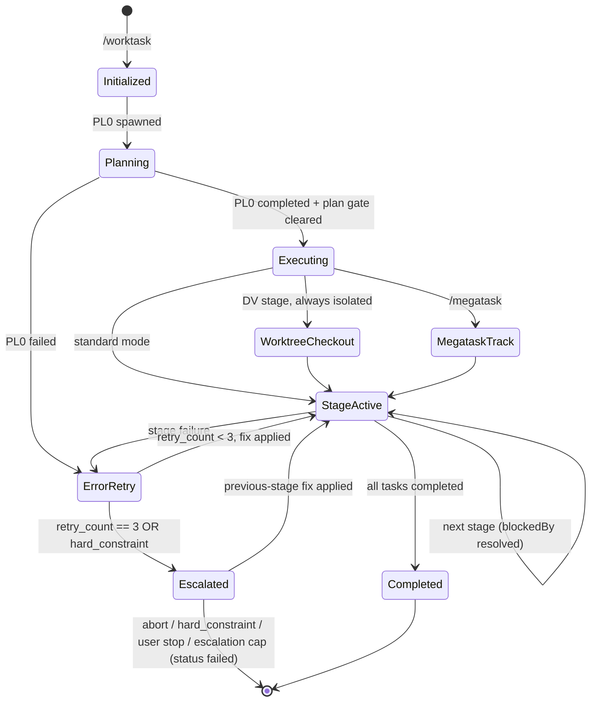
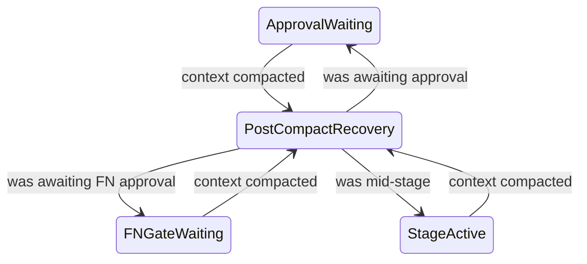

> **INVOCATION GATE**: a worktask the user asked for runs through `/worktask` or
> `Skill({skill:"corpflow:worktask"})` (`../shared/worktask-invocation.md § BLOCKING`). If you
> reached this file by a direct Read/Task/Grep to run one, tell the user and restart through that
> entry point instead of continuing.

# Worktask System

## Pipelines

```
9-stage:   PL → AR → TL → DV → DR → QA → DC → FN → ST
11-stage:  PL → AR → TL → DV → DR → SR → QA → DC → RE → FN → ST
                              ↑              ↑
                        Developer Review  Security Review (optional)
```

AR and TL are optional: AR is a tier default PL0 may override in either direction; TL runs only
when PL0 splits the work across ≥2 developers. Criteria canon:
`skills/estimation-methodology/SKILL.md § Stage Inclusion Criteria (PL0 authority)`.

### State Machine



#### Post-compact recovery states



#### State-machine references

Stage codes + invocation: `../shared/stage-codes.md`, `../shared/worktask-invocation.md`. State
ledger: `../shared/state-ledger.md`.

## Dynamic Worktask Sizing

PL0 assesses complexity and builds the task list from scratch, creating only the stages needed.

### Complexity Assessment

| Factor | Low (0-2) | Medium (3-5) | High (6-10) |
|--------|-----------|--------------|-------------|
| **New patterns** | None | 1-2 new | 3+ new |
| **Integration points** | 1-2 | 3-5 | 6+ |
| **Cross-cutting concerns** | None | 1 area | Multiple |
| **Risk level** | Minimal | Moderate | High |
| **Documentation needs** | Inline | README | ADR + API docs |

**Scoring**: Sum factor scores (0-50 total)

### Decision Rules

The score picks the stage set from the tier table in `skills/estimation-methodology/SKILL.md § PL0
Stage-Set & Test-Mode by Complexity Score`; its `§ Stage Inclusion Criteria (PL0 authority)` owns the
AR0/TL0 overrides.

#### Recording skipped and added stages

PL0 stamps `metadata.skipped_stages` (`{stage, reason}`) for every stage of the full 9-stage
pipeline it omits and `metadata.added_stages` (same shape) for every stage beyond the tier default
(`references/pl0-procedure.md § Dynamic Worktask Sizing (PL0 Stage)`); check 3b validates them.

Security-sensitive features auto-include SR0: authentication/authorization, payment processing, PII
handling, cryptographic operations, external API secrets, file uploads.

Each task carries `metadata.agent` for executor resolution
(`references/initialization-patterns.md § PL Creates Subsequent Tasks`).

#### Mid-run escalation — the orchestrator is the consumer

A stage may return `requests_stage_escalation` in its artifact `handoff:` frontmatter, and
nothing else reads it. At Step 6.5, after `Task()` returns and before the `completed` patch,
the orchestrator reads the object; validate it against the four fire conditions, the
stage-validity list, and the structural caps — canonical in
`skills/estimation-methodology/SKILL.md § Mid-run re-sizing`, never restated here; on accept,
create the stage with `state-patch.sh --task-create` / `--task-block` and record `{stage, reason}`
in the existing `metadata.added_stages`; on reject, name the failed condition and continue the run
unchanged. One accepted per run — a second means the plan itself is wrong, so stop at the
human gate instead of growing the pipeline. ST0 audits `added_stages` for escalation entries.

## Workspace Mode

Megatask (per-issue) tickets run in isolated workspaces. `.context/` base by mode (resolve via `task.metadata.workspace_path` + `metadata.isolation`):

| Mode | `.context/` base |
|------|------------------|
| Standard | `.context/` (main checkout — orchestrator + non-isolated stages) |
| Worktree | `.worktrees/milestone-{N}/{issue#}/.context/` |

In megatask per-issue/worktree mode, inside a Conductor workspace clone, or on any cwd↔workspace_path mismatch, read `references/workspace-modes.md` (detection snippet, Conductor sibling-repo rule, task-ID namespacing). Enforcement (workspace-root cross-check + `WORKSPACE_ROOT` banner injection) lives in `commands/worktask.md` Phase 2. Full megatask docs: `../megatask/SKILL.md`.

## Parallel Execution

### DC + QA Parallel (Default)

```bash
bash ${CLAUDE_PLUGIN_ROOT}/skills/worktask/scripts/state-patch.sh --task-block DR0 --on DV0   # DR ← DV
bash ${CLAUDE_PLUGIN_ROOT}/skills/worktask/scripts/state-patch.sh --task-block QA0 --on DR0   # QA ← DR
bash ${CLAUDE_PLUGIN_ROOT}/skills/worktask/scripts/state-patch.sh --task-block DC0 --on DR0   # DC ← DR
bash ${CLAUDE_PLUGIN_ROOT}/skills/worktask/scripts/state-patch.sh --task-block FN0 --on QA0,DC0   # FN ← QA AND DC
```

Use `--sequential` when DC requires test results.

### Monitor Tool Integration

Use `Monitor` to stream background-process events (builds, tests, logs) instead of polling. Persist raw stream output to `.context/logs/<kind>-<scope>-<timestamp>.log` per the `logging-conventions` skill.

### Never Parallelize

Rows apply only to stages present in the plan; a stage PL0 excluded imposes no ordering constraint.

- AR before PL (needs requirements)
- DV before TL (needs coordination)
- DR before DV (can't review unwritten code)
- QA before DR (DR must review code before QA tests)

## Error Handling

### Retry Logic

Each stage: max 3 retries, tracked in `metadata.retry_count`. Append one `## Retry N — <ts>` section per failure to `.context/errors/<agent>.md` (per-agent, append-only — `task-folder-organization` skill § Per-Agent Error Files) with problem, classification, root cause, attempted solutions. Raw stdout/stderr goes to `.context/logs/retry-<stage>-<ts>.log` per `logging-conventions`.

### Escalation Chains

```
11-stage: ST → FN → RE → DC → QA → SR → DR → DV → TL → AR → PL → USER
9-stage:  ST → FN → DC → QA → DR → DV → TL → AR → PL → USER
Emergency: FN → RE → QA → DR → DV → IR → USER
```

Stages absent from the plan drop out of the chain — escalation from DV goes to TL if TL ran, else
AR if AR ran, else PL.

## Rule Checks

| Rule | Required Before |
|------|-----------------|
| Test Strategy | PL → AR (when AR runs; else PL owns it) |
| Test Architecture | AR → TL when both run; AR → DV when TL is excluded (the default shape at every tier — see Stage Inclusion Criteria); PL → DV when AR is excluded too |
| Code Format | DV complete |
| Build Pass | DV → DR |
| Unit Tests Written + Pass | DV → DR |
| Developer Review Pass | DR → QA |
| All Tests Pass (Unit + Integration + E2E) | QA → DC |

## Optimization Hooks

### Pre-Stage

| Check | Threshold | Action |
|-------|-----------|--------|
| Context size | > 50% window (standard) or > 30% (1M window) | Compress previous stages |
| Budget usage | > 75% | Alert user |
| Free disk space | < 5 GB before a build stage (AR/DV/QA/SR/RE) | Halt with remediation — see § Pre-Stage Disk Guard |
| Free disk space | < 8 GB before a build stage | Warn; run `swift package clean` hygiene before delegating |

### Pre-Stage Disk Guard (ENOSPC)

Build stages — **AR, DV, QA, SR, RE** — accumulate `.build/` and DerivedData across runs, and an
exhausted filesystem kills the build harness mid-stage. Assert free space before delegating any of
the five. Implementation: `scripts/state-patch.sh --disk-check <root>`.

```bash
MIN_GB="${DISK_MIN_GB:-5}"; WARN_GB="${DISK_WARN_GB:-8}"   # hard halt / hygiene warn
AVAIL_GB=$(df -Pg "${WORKSPACE_ROOT:-.}" 2>/dev/null | awk 'NR==2 {print $4+0}')
```

#### Disk guard — semantics

- **Hard halt** (`AVAIL_GB < MIN_GB`): audit `pre_stage_disk_halt result=blocked` with
  `metadata={"stage":"$CODE","avail_gb":…,"min_gb":…}`, print the remediation (`swift package
  clean`; `rm -rf ~/Library/Developer/Xcode/DerivedData/*`), and don't delegate — a halted run is
  recoverable, an ENOSPC-killed harness is not.
- **Warn** (`AVAIL_GB < WARN_GB`): audit `pre_stage_disk_warn result=ok` with the same shape
  (`warn_gb` instead of `min_gb`), proceed, run `swift package clean` as pre-DV hygiene.
- `df -Pg` is POSIX-portable (macOS + Linux); unparseable output degrades to a no-op, so a
  measurement failure never blocks a run.

### Post-Stage

- Compress context for handoff (50-100 tokens)
- Log token usage in task metadata
- Validate artifacts created
- `PostCompact` hook fires after auto-compaction — use to re-inject critical worktask state

## Pre-Stage Validation

Before executing any worktask stage, the orchestrator validates:

### Validation checks 1–5

1. **Ledger check**: `.context/state.json` is `version: 2` and holds ≥1 `tasks{}` entry whose `metadata.worktask_id` matches this worktask
2. **PL0 exists**: a task with subject starting `PL0:`
3. **Stage tasks exist**: after PL0 completes, it created subsequent stage tasks (minimum DV0, DR0, QA0 at any complexity)
3b. **Inclusion decisions are reasoned**: every `metadata.skipped_stages` / `metadata.added_stages` entry carries a non-empty, decision-shaped `reason`; a bare score restatement or a missing reason fails
4. **Stage contract check**: upstream outputs match the next stage's Required Inputs per `shared/stage-contracts.md` (file exists + required sections present)
5. **Metadata schema check**: next task's metadata validates against `shared/state-ledger.md` § JSON Schema (non-PL tasks require `stage`, `agent`, `model`, `error_file`)

### Validation checks 6–7

6. **Model alias check**: `metadata.model ∈ {fable, opus, sonnet, haiku}` — reject unknown aliases before `Task()` delegation. Caveat: under a managed `availableModels` allowlist (it constrains subagent model overrides too) or `enforceAvailableModels`, a *valid* alias may silently resolve to a different model at dispatch — emit a `model_resolution_constrained` audit row when a managed allowlist is in effect; don't block
6a. **Effort tier check**: `metadata.effort ∈ EFFORT_ENUM` (`scripts/effort-ladder.sh`), which `state-patch.sh` enforces at the write. Absent is not fatal — Step C.0a skips the stage (`resolver_skipped`/`effort_unstamped`), costing a round-trip rather than the run
7. **Workspace existence** (megatask per-issue/worktree mode only): `metadata.workspace_path` directory exists and `workspace.json` is readable

### Validation check 8

8. **Artifact path resolution** (non-blocking): resolve the upstream artifact for the next task's `metadata.run_index` via `stageArtifactPath()` below. Emit one `artifact_path_resolved` audit row with `result ∈ {ok, fallback_glob, miss}` and `metadata.resolved_path`. `miss` = upstream produced no artifact, handled by F3 in `references/handoff-protocol.md#fallback-paths` — warn but proceed. Catches run_index drift (PL0 ↔ stage-task off-by-one) early.

### Validation check 9

9. **Hook installation** (first stage only): either `.claude/hooks/state-merge.sh` exists and is executable, or the plugin's `plugin.json` registers the SubagentStop hook entry. Neither → warn `"⚠ state-merge.sh hook not installed — run hook-install.sh"` without blocking — Step 6.5 provides Layer 3 coverage. See `references/initialization-patterns.md#hook-installation`.

### Validation check 10

10. **Branch naming** (first stage only, after the state.json seed and before seeding PL0): run `bash ${CLAUDE_PLUGIN_ROOT}/skills/worktask/scripts/branch-name.sh --goal "<concise imperative title>"` — the only point in the pipeline a worktask branch is renamed (once-only rule, `skills/shared/git-conventions.md § Branch Naming`). Always run it, including for branches created outside the pipeline: the "already conventional" arm is a no-op, and only `branch_is_conventional()` (queryable as `--check <name>`) decides conventionality, not the eye. Every outcome exits 0; the step self-disables under `/megatask`/`--emergency` routing.

### Validation check 10 — pass a title, preview freely

Pass a title, not the raw task description: the goal becomes a 48-character slug and the overflow is dropped silently, so a multi-sentence description ends mid-phrase (`commands/worktask.md § Step 3c — the input is a title`). Preview with `BRANCH_NAME_PRINT=1` — renames nothing, writes no audit row; `--check`/`--print-types`/`--print-target` are free for the same reason. The *planned* ledger name may later be refined once, without any git mutation (`commands/worktask.md § Step A.4b`).

### Validation check 10 — stamping and post-check

Capture both stdout key=value lines — `target_branch=<name>` (the name the PR head should carry) and the final `branch=<name>` (the local branch as it stands) — verify the value matches `^[A-Za-z0-9._/-]+$` before stamping (a failing value is stamped empty, not as-is), and stamp `facts.branch` on the ledger (the script never writes state.json — `references/handoff-protocol.md § branch`). When `branch=` is empty or fails `--check` but `target_branch=` is non-empty, stamp the target — the local name may be blocked from changing (upstream tracked, target exists) while the PR head is still ours to name.

### Validation check 10 — post-check and the host rule

Run the non-blocking post-check (`commands/worktask.md § Step 3c — post-check`): a stamped name failing `--check` emits one `branch_convention_check` warning row naming the actual and derived target, and never blocks planning. Invoking `/worktask` authorizes the rename against a host's no-rename session rule — don't revert it or re-ask (`references/workspace-modes.md § Host session authorization`).

### Validation check 11

11. **Dispatch-depth projection** (non-blocking): project the deepest dispatch chain the next stage will open against `CLAUDE_CODE_MAX_SUBAGENT_SPAWN_DEPTH` (default 3) — `/megatask`'s R1 projection applied per-stage instead of once per batch. `skills/megatask/SKILL.md § Nesting-depth budget` holds the canonical level table both must agree with:

```
projected_depth = orchestrator_offset      # 1 under /megatask (it spends a level), else 0
                + 1                        # the stage agent itself
                + 1 if that agent routes through a platform router
                + 1 if the router dispatches a Tier-2 specialist
headroom = cap - projected_depth
```

Emit one `dispatch_depth_projected` audit row with `metadata: {projected_depth, cap, headroom, chain}` — `chain` naming the agents level by level, so a later `dispatch_flattened` row can be read against the forecast.

### Validation check 11 — what warns, and what stays quiet

Warn on the console only when `headroom < 0`; at `headroom >= 0` the row is written and nothing prints. The canonical DV chain — session → `developer` (1) → platform router (2) → Tier-2 specialist (3) — lands exactly on the cap, so warning at zero headroom would fire on every DV stage. A projection that does not compute `3` for that chain is wrong.

#### Never blocks; forecast, not observation

A hard gate would fail that same legal chain. When it warns, name megatask's two remediations: raise the env var, or flatten Tier-2 dispatch (`skills/megatask/SKILL.md § Depth remediations`). An unanticipated hop past the cap is caught after the fact by the refused agent's own `dispatch_flattened` row (`skills/agent-coordination/SKILL.md § Depth-refusal self-report`).

### Validation check 12 — Routing resolution

12. **Routing resolution** (first stage only, after the state.json seed): read `CORPFLOW.md § Routing` at the project root, if present, and merge its `| Alias | Target |` rows over the defaults in `skills/shared/routing-matrix.md § Matrix`. Stamp the resolved map on the ledger as `state.routing: {"<alias>": "<plugin:agent>", …}` (only aliases that differ from the default need stamping; an absent map means all-default) plus `state.routing_source: "matrix" | "project-override"`. Emit one `routing_override` audit row per overridden alias, `metadata: {alias, default_target, override_target}`; when an entry alias is overridden but its platform's role aliases are not, add one `routing_override_partial` row. Stages resolve through `state.routing` first (`routing-matrix.md § Resolution`), so a mid-worktask edit of the project file never splits routing across stages. No `CORPFLOW.md` or no `## Routing` heading → all-default, no rows, no warning.

### Validation check 13 — Model/effort resolution

13. **Model/effort resolution** (first stage only, right after check 12): run `state-patch.sh
    --resolve-models` before PL0 is dispatched. Merges `CORPFLOW.md § Models`, fail-open per row,
    over the built-in matrix, via `model-matrix-lib.sh`. Stamps `state.models` for all sixteen
    agents (unlike check 12's differences-only map) plus `state.models_source`. PL0 reads this
    map itself: `model-matrix.sh --resolve <agent>` (`product-manager.md`'s dedicated Bash grant)
    checks `state.models` first, then `CORPFLOW.md`, then the matrix, and PL0 pastes the pair into
    `--task-create`'s `--metadata`; `--task-create` does not fill it from the map. No
    `CORPFLOW.md`/`## Models` → all rows `"matrix"`.

### On validation failure

- No tasks exist → not initialized. Re-run initialization (seed PL0)
- PL0 exists but no subsequent tasks → PL0 did not complete. Re-run PL0
- Tasks orphaned (no worktask_id) → log a warning, match by subject pattern
- Contract violation → don't transition. Append a `missing_input` entry to the next stage's `.context/errors/<agent>.md` and block.

## Orchestrator Execution Loop

This loop dispatches one `Task()` per ready stage in-process, from the PL0 precondition (below)
through the FN gate (§ FN Gate), advancing stages as their `blockedBy` dependencies resolve.

Figma asset persistence is not an orchestrator step: the product-manager captures and persists
screenshots to `.context/designs/` inside the PL turn via its `Bash(curl:*)` grant, because
`get_screenshot` returns a short-lived URL. Don't add a post-PL0 download step — it collides with
the Phase-1 Bash prohibition in `commands/worktask.md` and races the expiring URL
(`skills/shared/figma-capture.md § Capture Workflow`).

### Before this loop — autonomy preflight (Phase 1)

An unattended launch (`--auto` containing `plan` or `finalization`) runs
`scripts/autonomy-preflight.sh` before Step 3 creates `.context/`, with its output buffered under
`$TMPDIR`. Any failed permission grant, evidence tool or toolchain check stops the run there, in a
single message, before anything is seeded; a pass is recorded after the Step 3a seed as
`metadata.preflight` (`references/handoff-protocol.md § metadata.preflight`). Megatask per-issue
runs skip it. Canon, including `--accept-absent` and the non-interactive Step 2a scan:
`commands/worktask.md § Step 2a-pre` and `§ Step 3a — record the autonomy preflight`.

### Delegation-only

The orchestrator never writes code, tests or docs during a worktask, and never runs build commands
or marks a task completed without delegating. Every change is made by the stage agent that owns it,
through `Task()` — including one-line fixes, because an orchestrator edit lands in no stage's
`files_touched`, is reviewed by no DR or SR, and appears in no artifact. Reading is unrestricted.
When a stage returns work that is nearly right, re-dispatch it with the correction instead of
patching it here. The orchestrator's job is the loop: read tasks, resolve agents, delegate, track
status.

#### Delegation-only — the build-tooling corollary

The orchestrator holds no build or test tooling; DV/DR/QA delegate to the detected platform's
`/<plugin>:build-test` (§ Platform tooling ownership). Don't re-add a platform's MCP grants
(`mcp__XcodeBuildMCP__*` and the like) to a stage agent to work around this; the plugin that owns the
toolchain owns its lifecycle.

### Dispatch on the same turn

Verify a boundary and dispatch the next ready stage in the same turn; report after dispatching, not
instead of it. A running background `Task` does not block the orchestrator, so "an agent is working"
is no reason to stop, and ending a turn with "next: DC → RE → FN" while those stages are
dispatchable leaves the pipeline idle until a human asks. Exactly four things justify stopping
mid-pipeline: the plan gate (`commands/worktask.md § Step A.5`), an `escalate`-class sweep item, the
prompt for a parked permission denial or typed need (§ Step 7a, asked only after every ready stage
is dispatched), and the FN gate (§ FN Gate).

#### Readiness is mechanical, not a judgement call

> Between stages, ask the ledger:
>
> ```bash
> jq -r '.tasks as $t | $t | to_entries[]
>   | select(.value.status == "pending")
>   | select([(.value.blocked_by // [])[] | $t[.].status] | all(. == "completed"))
>   | .key' .context/state.json
> ```
>
> A `stale` row answers neither filter: it is not `pending`, so it is never returned, and it is not
> `completed`, so a row blocked by it is not returned either. It leaves that query only when
> § Step 6.5d settles it (`skills/shared/state-ledger.md § Status Values`).
>
> A name returned with nothing live means there is work to do — dispatch it, including right after a
> big green result, which is a handoff, not a completion.

### Cache-Friendly Prompt Layout & state.json (handoff-protocol)

Every delegation prompt is built in a fixed order so consecutive `Task()` calls within one `worktask_id` share a byte-identical prefix and hit the prompt cache. Spec source: `references/handoff-protocol.md#cache-prefix`.

Each section opens with its own `<<<marker>>>` line and runs to the next marker — that is what `scripts/cache-lint.sh` parses. Section [1] is copied verbatim from `references/contract-reminder.md`. Section [3] is the ledger pointer plus readiness digest that `scripts/ledger-digest.sh` prints, never the ledger JSON: stage agents read `.context/state.json` from disk. Section [4b] is the per-model discipline block, copied verbatim from `skills/shared/model-prompting.md` and selected by `task.metadata.model`; `haiku` emits the marker with an empty body. `brief-compose.sh` copies these blocks verbatim; the orchestrator never writes them.

#### Composing the brief

Build every stage prompt by running `bash ${CLAUDE_PLUGIN_ROOT}/skills/worktask/scripts/brief-compose.sh <TASK_ID> --orch-root <orch root>` and dispatching its stdout. The orchestrator is its only caller. The composer emits all eight markers: [1]–[5] complete, [6] empty, and [7] opening with the task's `WORKSPACE_ROOT=` line. The Steps 4.5–5e injections write only into [6] and [7]; nothing edits [1]–[5]. Exit 1 (guard failure) or exit 2 (usage, unknown task id, unreadable ledger, missing jq or canon, failed ledger digest) leaves stdout empty: do not call `Task()` — surface stderr and treat the row as a blocked dispatch (Step 6).

#### Preamble layout

```
[1] Contract reminder (references/contract-reminder.md) ← stable across ALL stages (cacheable)
[2] Worktask header (id, plan, exploration)← stable across ALL stages (cacheable)
[3] Ledger pointer + readiness digest (from ledger-digest.sh) ← evolves per stage
[4] Stage contract excerpt                 ← stable WITHIN stage type (cacheable)
[4b] Model discipline block                ← stable WITHIN stage type (cacheable)
─────── (cache prefix boundary) ───────
[5] Task identifiers + ref: lines          ← dynamic per delegation
[6] retry hints + gate remediation (if retry_count > 0 or fix_round > 0) ← dynamic per delegation
[7] Stage-specific banners (DR Skill, FN Conductor, MCP fallback) ← SUFFIX, dynamic
```

[5]'s lines and ref shapes: `references/handoff-protocol.md § Section [5] — task identifiers and refs`.

#### Step 0 — section [3] comes from ledger-digest.sh

```typescript
// Section [3] body: the ledger pointer plus readiness digest, grammar in
// references/handoff-protocol.md#cache-prefix. brief-compose.sh (Step 6) makes this call for
// every delegation and is its only caller, so [3] cannot drift from the lint that checks it.
const digest = execFileSync("bash", ["skills/worktask/scripts/ledger-digest.sh",
                                     "--state", ".context/state.json"], { encoding: "utf8" });
// Exit 3 means the ledger is missing or unparseable: the composer exits 2 and nothing is
// dispatched — a hard failure, not a degraded mode.
```

#### Artifact path helper

Resolves the numbered artifact path with fallback:

```typescript
const ARTIFACT_BASE: Record<string, string> = {
  PL: "planning", AR: "architecture", TL: "coordination",
  DV: "development", DR: "developer-review", SR: "security-review",
  QA: "testing", DC: "documentation", RE: "release",
  FN: "complete-summary", ST: "retrospective", IR: "incident",
  ET: "ethics-review",
};
```

##### stageArtifactPath()

```typescript
// …continued: uses ARTIFACT_BASE above
function stageArtifactPath(code: string, runIndex: number, row?: TaskRow): string {
  // A row naming its artifact wins: a DV stream's suffix cannot be composed from `code`.
  const named = row?.artifact ?? row?.metadata?.artifact;
  if (named) return named;
  const base = ARTIFACT_BASE[code];
  const numbered = `.context/${base}-${runIndex}.md`;
  if (fs.existsSync(numbered)) return numbered;
  // Newest-glob fallback (covers out-of-band writes)
  const matches = glob.sync(`.context/${base}-*.md`).sort((a, b) => {
    const n = (f: string) => parseInt(f.match(/-([0-9]+)\.md$/)?.[1] ?? "0", 10);
    return n(a) - n(b);
  });
  if (matches.length > 0) return matches.pop()!;
  // No artifact on disk: return the canonical numbered path so the
  // caller's existence check surfaces the miss at the expected location.
  return numbered;
}
```

#### Step 6.5 — After Task() returns, enforce state.json patch

After every `Task()` return and before Step 7 settles the row, first read any
`requests_stage_escalation` in the artifact frontmatter (§ Mid-run escalation — the orchestrator
is the consumer), then run the three-layer check: Layer 1 (agent self-patch) → Layer 2
(`state-patch.sh --via step6_5`) → Layer 3 (F3 derivation). Code and semantics: loop § Step 6.5
below.

##### Completion signal (subagents run in the background by default)

"`Task()` return" means the completed stage result, not the launch acknowledgement: the result arrives as a completion notification while the orchestrator keeps its turn. Run Step 6.5 (and the Step 7 settle that follows) only once that notification — or the stage's `subagent_stopped` audit row — has arrived. Don't fire Layer 3 (F3) while the stage's `agent_id` is still live in `claude agents --json`: F3 would stamp a status over a running stage. An errored return (rate limit, API cut-off) reports the error with partial work preserved: classify it per `skills/agent-coordination/SKILL.md § Retry / Escalate Matrix` (`transient`) and skip the completion patch.

###### Dispatch-tracking helpers (steps 6a/6.5 — ledger writes; [3] only points at the ledger)

```typescript
// markDispatchStatus — dispatched_agents[] with the task_id entry flipped to `status`,
// optionally backfilling model_resolved. Replace-array semantics (jq `. * $patch` overwrites
// arrays). Absent entry → array unchanged (defensive).
function markDispatchStatus(state, taskId, status, modelResolved) {
  return (state.facts?.dispatched_agents ?? []).map(a =>
    a.task_id === taskId
      ? { ...a, status, ...(modelResolved ? { model_resolved: modelResolved } : {}) }
      : a);
}
// classifyError — map an errored Task() return onto the EXISTING retry taxonomy
// (agent-coordination § Retry / Escalate Matrix); no new vocabulary. Rate-limit / API
// cut-off = `transient`; other classes come from the artifact or return text.
// errorBasename — last ":"-segment of subagent_type (corpflow:developer → developer).
```

###### Banner relocation & cache-prefix hygiene

Stage-specific banners (DR Skill, FN Conductor, MCP fallback warning) are appended after `full.description` (suffix), never prepended, so prefixes [1][2][3][4] stay byte-identical across stages.

Sections [1][2][4][4b] carry no timestamps, per-call ENV expansions, random IDs, retry counters, file mtimes, or agent names beyond `worktask_id`. `scripts/cache-lint.sh` asserts that byte-stability across consecutive stages of one `worktask_id`.

### PRECONDITION CHECK
Before entering this loop, verify:

#### Signals 1–3 (incl. 2b)

- **Signal 1 (ledger audit)**: `tasks.PL0` in `.context/state.json` has status `completed`. Missing or incomplete → stop: worktask not initialized, or planning incomplete.

**Signal 2 (plan gate)**: `PL0.metadata.plan_gate` (default `"checkpoint"`).
- `"checkpoint"` (default): require both PL0 `completed` and an `approval_received` audit line with
  `subject:"PL<run_index>"` in `.context/logs/audit.jsonl` before loop entry. Line absent → stop and
  return to `commands/worktask.md § Step A.5` to fulfil the gate.
- `"bypass"` (`--auto=[plan]` / `--emergency`, or stamped per-issue by the `/megatask` batch orchestrator): PL0 `completed` alone suffices, no approval line — except for Signal 2b escalated items, whose `approval_received` row is still required.

##### Signal 2b (decision gate)

`PL0.metadata.decision_gate` (default `"user"`) selects WHO answers PL0's `open_questions[]` at the
plan gate; `"auto"` (stamped by `--auto=[decision]`) routes them through the Fable-model
auto-decision pre-pass (`commands/worktask.md § Step A.4` is canon). Verify before loop entry: when
`decision_gate == "auto"` and `facts.open_questions[]` holds any `sw-PL<N>-*` item with
`status != "resolved"`, an `auto_decision_resolved` audit row with `subject:"PL<run_index>"` must
exist, and any `escalate` items need an `approval_received` resolution — absent → stop and return to
Step A.4. The carrier bypasses neither `plan_gate` nor `fn_gate`.

##### Signal 3 (FN gate)

FN dispatch is gated mid-loop on `PL0.metadata.fn_gate` (default `"checkpoint"`): stop immediately before the FN `Task()` delegation for finalization approval unless the carrier is `"bypass"` (`--auto=[finalization]` / `--emergency`, or stamped per-issue by the `/megatask` batch orchestrator). See loop step 4.9 and § FN Gate.

#### After PL0 — steps 1–3

After PL0 completes and creates stage tasks, the orchestrator:

1. **Present PL0 results** to the user: complexity score, stages created (with agents), dependency chain, key planning decisions (at the Step A.5 plan gate; on a `checkpoint` gate execution proceeds only after approval).
2. **Re-validate before executing**: re-read `tasks{}`; verify `metadata.agent` and `metadata.model` are set on each.
3. **Publish plan to GitHub** (before stage loop). Run:

##### Step 3 — publish snippet

     ```bash
     pub_rc=0
     bash ${CLAUDE_PLUGIN_ROOT}/skills/worktask/scripts/publish-pl-issue.sh || pub_rc=$?
     ```

##### Step 3 — publish fallback (helper_not_found)

     ```bash
     # …continued: exit 127 means bash found no helper → audit one deferred github_issue_created row
     if [ "$pub_rc" -eq 127 ]; then
       LOG_DIR="${WORKSPACE_ROOT:-${CLAUDE_PROJECT_DIR:-.}}/.context/logs"
       mkdir -p "$LOG_DIR"
       STATE_FILE="${WORKSPACE_ROOT:-${CLAUDE_PROJECT_DIR:-.}}/.context/state.json"
       jq -cn --arg ts "$(date -u +%FT%TZ)" --arg dk "$(jq -r '.worktask_id // "unknown"' "$STATE_FILE" 2>/dev/null || echo unknown):$(jq -r '.run_index // 0' "$STATE_FILE" 2>/dev/null || echo 0):gh_issue" \
         '{ts:$ts, actor:"orchestrator", action:"github_issue_created", subject:"PL0", result:"deferred", task_id:"1", metadata:{via:"publish-pl-issue.sh", reason:"helper_not_found", dedupe_key:$dk}}' \
         >> "$LOG_DIR/audit.jsonl"; true
     fi; true
     ```

##### Step 3 — non-blocking & skip rules

     The `|| pub_rc=$?` capture and the trailing `; true` mask the helper's exit code, so a helper failure (catastrophic exit 1, deferred exit 0, network error) never becomes an orchestrator failure. Skip the step entirely when `--no-gh-issue` was supplied (PL0 stamps `task.metadata.no_gh_issue: true`; the helper also short-circuits internally). The helper self-gates the rest: megatask per-issue mode skips every `gh` call, and a second-or-later run in the same `.context/` comments instead of opening a duplicate. Semantics, sanitiser rules and the non-blocking guarantee: § PL Issue Publish.

#### Steps 1–3

```typescript
// 1. Read the ledger — tasks{} keyed by stage id (PL0, DV0, DV1…).
let state = JSON.parse(fs.readFileSync(".context/state.json", "utf8"));
if (state.version !== 2) throw new Error(`state.json version ${state.version}; expected 2`);
let tasks = Object.entries(state.tasks).map(([id, t]) => ({ id, ...t }));
```

##### HANDOFF_SCHEMA

```typescript
// Typed-return schemas — SSOT: references/handoff-protocol.md#handoff-schemas.
// Read that SSOT ONCE at loop entry and materialize all 13 entries VERBATIM, keyed by stage code:
//   const HANDOFF_SCHEMA: Record<string, object> = { PL: {…PLHandoff}, AR: …, TL, DV, DR, SR,
//                                                    QA, DC, RE, FN, ST, IR, ET };
// A missing key leaves stageSchema undefined → schema param omitted → today's frontmatter path.
```

##### Steps 2–3 — completion loop & ready filter

```typescript
// 2. Loop until every task has settled. "skipped" and "failed" are terminal like "completed":
//    a task nothing will dispatch again must settle, or the loop spins with an empty ready set.
//    "stale" is deliberately absent: a parked consumer of a re-opened task is neither settled nor
//    ready, so its own dependents stay unready and the loop stays open until § Step 6.5d settles
//    it back to pending or completed (skills/shared/state-ledger.md § Status Values).
const SETTLED = new Set(["completed", "skipped", "failed"]);
while (tasks.some(t => !SETTLED.has(t.status))) {
  // 3. Find unblocked pending tasks
  const ready = tasks.filter(t =>
    t.status === "pending" &&
    (t.blocked_by ?? []).every(dep => SETTLED.has(state.tasks[dep]?.status))
  );

  for (const task of ready) {
```

#### Step 4.0

```typescript
    // 4.0. Re-read the live ledger every iteration — dispatched_agents[], last_error and
    //      facts.capabilities evolve per stage. state.json is ≤500 tokens; an unreadable
    //      ledger is a hard failure, never a degraded mode.
    state = JSON.parse(fs.readFileSync(".context/state.json", "utf8"));

    // 4. Full task details come from the ledger entry itself.
    const full = state.tasks[task.id];
    const agentType = full.metadata.agent;
    const model = full.metadata.model;
    // [5] is the composer's, so the ledger text is never dispatched. full.description becomes the
    // injection buffer: text prepended before the sentinel is [6], text appended after it is [7].
    const INJECTION_SPLIT = "@@injection-split@@";  // no injection text contains it
    full.description = INJECTION_SPLIT;
```

##### Agent-type resolution

```typescript
    // bare → "corpflow:<name>"; "plugin:name" → as-is; 3-part "a:b:c" → UNSUPPORTED, throw.
    //   .context/errors/<basename>.md basename = the last `:`-segment. Depth never legitimizes
    //   a 3-part name, and CC rejects `:` in an agent file's own frontmatter `name:` — the
    //   qualified form exists only at the call site, never in the file.
    const colonCount = (agentType.match(/:/g) ?? []).length;
    if (colonCount > 1) {
      throw new Error(`Invalid agent reference '${agentType}': only bare or plugin-qualified names supported.`);
    }
    const subagentType = colonCount === 1 ? agentType : `corpflow:${agentType}`;
```

#### Step 4.5

```typescript
    // 4.5. Soft context_refs validation — warn, don't abort: low-complexity worktasks
    //      legitimately skip upstream stages, and error_file absence on the first
    //      attempt (retry_count === 0) is expected, not a warning.
    if (full.metadata.context_refs) {
      const listed = JSON.parse(full.metadata.context_refs)
        .map(r => r.split('#')[0].trim());
      const retryCount = full.metadata.retry_count ?? 0;
      const missing = listed.filter(p =>
        !fs.existsSync(p.startsWith('.context/') ? p : `.context/${p}`) &&
        !(p === full.metadata.error_file && retryCount === 0)
      );
      if (missing.length > 0) {
        full.description =
          `NOTE: Expected context files missing: ${missing.join(', ')}. ` +
          `Proceed using what is available; do not fabricate content.\n\n` +
          full.description;
      }
    }
```

#### Step 4.6-pre

```typescript
    // 4.6-pre. last_error hint — on a retry, prepend one line summarizing the prior errored
    //          return (class + partial + ref) so the re-dispatch targets the recorded failure
    //          instead of re-inferring it. Reads tasks.<ID>.last_error written by Step 6.5a.
    if ((full.metadata.retry_count ?? 0) > 0) {
      const le = state.tasks?.[task.id]?.last_error;
      if (le) {
        full.description =
          `PRIOR ERROR (class=${le.class}` +
          `${le.partial ? ", partial work preserved" : ""}` +
          `${le.ref ? `, see ${le.ref}` : ""}). Resume/repair from that point.\n\n` +
          full.description;
      }
    }

```

#### Prompt-injection steps 4.6–4.8b — shared rules

These steps mutate only `full.description`: remediation/resume blocks are prepended (dynamic
section [6]), enforcement banners appended (suffix [7]) — cache prefix [1][2][4][4b] is never touched.
Each fires one `appendAudit` row, whose absence for a dispatch shows the loop was bypassed. Readers
(DR, TL) surface a missing row as an advisory finding, not a hard fail, because a stale plugin cache
serving an older loop would otherwise block a blameless DV.

#### Step 4.6

```typescript
    // 4.6. Gate-feedback injection — the one remediation brief builder, for a target of ANY stage.
    //      Two sources write the row it reads. A gate loop-back: a prior DR `verdict:fail` /
    //      QA `verdict:no-go` re-dispatches DV (run_index unchanged, retry_count up by 1) carrying the
    //      upstream remediation VERBATIM. Source for N = the failing upstream run_index:
    //      `.context/developer-review-N.md` (DRHandoff.blockers[]) and/or `.context/testing-N.md`
    //      (QAHandoff.blocking_defects[]). Or a typed correction: `--task-reopen` wrote the same two
    //      keys on the re-opened target and raised `fix_round` (§ Step 6.5a3 — the correction arm).
    //      Hook surface: hookSpecificOutput.additionalContext —
    //      skills/agent-coordination/references/hook-monitoring.md §"Gate-feedback contract".
```

##### Step 4.6 — remediation injection & audit

Correction re-opens a task of any stage; gate loop-back reaches DV. When `fix_round` > 0 or `retry_count` > 0, inject remediation brief:

###### Remediation injection code

```typescript
    // The stage code that raised it: "DR" | "QA" copied by the Step 7 loop-back from the gate
    // row, or the correcting stage's own code written by --task-reopen. state-patch.sh writes both.
    const fromStage = full.metadata.gate_from_stage;
    const blockers = full.metadata.gate_blockers ?? []; // blockers[] | blocking_defects[] | [finding]
    if (fromStage && blockers.length > 0) {
      full.description =
        `REMEDIATION (from ${fromStage} gate — fix these specific findings before re-stop):\n` +
        blockers.map((b, i) => `  ${i + 1}. ${b}`).join("\n") + "\n\n" + full.description;
      appendAudit({ actor: "orchestrator", action: "gate_remediation_injected",
                    subject: full.metadata.stage, result: "ok",
                    metadata: { from_stage: fromStage, to_stage: full.metadata.stage,
                                count: blockers.length } });
    }
```

#### Step 4.7

```typescript
    // 4.7. DV checkpoint resume, per DV row — a budget-exhausted run left a partial artifact
    //      at that row's artifact path (+ `## Blockers`) and completed sub-batches at
    //      tasks.<ID>.progress (agents/developer.md § Budget-Aware Checkpointing). Carry it
    //      forward so the re-run resumes from next_batch instead of redoing applied work.
```

##### Step 4.7 — resume injection

```typescript
    if (full.metadata.stage === "DV") {
      const dvRow = state.tasks?.[task.id];
      const dvProgress = dvRow?.progress;  // {completed_batches, next_batch, updated_at}
      if (dvProgress && (dvProgress.completed_batches?.length ?? 0) > 0) {
        const partial = stageArtifactPath("DV", full.metadata.run_index ?? 0, dvRow);
        full.description =
          `RESUME (DV checkpoint — prior run completed batches ` +
          `[${dvProgress.completed_batches.join(", ")}]; resume from ` +
          `${dvProgress.next_batch ?? "the next pending batch"}). Do NOT redo applied ` +
          `batches — read the partial ${partial} and continue forward.` +
          "\n\n" + full.description;
```

##### Step 4.7 — resume audit

```typescript
        // …continued: step 4.7 body — keyed by the row, so sibling DV rows resume independently
        appendAudit({ actor: "orchestrator", action: "dv_checkpoint_resume", subject: task.id,
                      result: "ok",
                      metadata: { completed: dvProgress.completed_batches,
                                  next_batch: dvProgress.next_batch ?? null } });
      }
    }
```

#### Step 4.7a

AR writes design outputs — an OpenAPI contract, a schema, a generated header — into the shared
checkout, untracked. DV then forks its worktree from `task.metadata.base_ref`, a committed ref, so
those files would be absent at the path every architecture reference cites. No stage can fix it: AR
holds no git grant, DV is inside the broken tree, FN runs last.

```typescript
    // 4.7a. AR contract landing — runs when the NEXT stage is DV and AR left untracked or
    //       unstaged non-.context/ writes in the shared checkout. Commit them onto the ref
    //       DV's worktree will fork from, so the tree DV receives contains what AR's
    //       artifact says it contains. The orchestrator does this because it is the only
    //       actor holding git that is not itself inside the tree under repair.
```

##### Step 4.7a — the stray set

```typescript
    if (full.metadata.stage === "DV" && state.tasks?.AR0?.status === "completed") {
      // .context/ is the ledger's own tree and never lands here: it is not what DV reads
      // through an architecture reference, and committing it would put run bookkeeping in
      // the payload's history. Landed files are a DV producer's to ship, not AR's: subtract
      // them from untracked entries only, listed per file, since the default porcelain
      // folds a new directory into one `?? dir/` line.
      // `land-artifacts.sh --list-landed --tree "$(git rev-parse --show-toplevel)"`; failure = empty set
      const landed = new Set(listLanded(gitToplevel()));
      const stray = gitPorcelain()           // `git status --porcelain --untracked-files=all`
        .filter(f => !f.path.startsWith(".context/"))
        .filter(f => f.worktreeDirty || (f.untracked && !landed.has(f.path)));
```

##### Step 4.7a — landing and audit

```typescript
      // …continued: step 4.7a body
      if (stray.length > 0) {
        gitCommit(stray.map(f => f.path),
                  `AR contract landing for ${task.id} (run ${state.run_index})`);
        appendAudit({ actor: "orchestrator", action: "ar_contract_landed", subject: "AR0",
                      result: "ok",
                      metadata: { files: stray.map(f => f.path), next_stage: "DV" } });
      }
    }
```

##### Step 4.7a — why the orchestrator, and not a stash

Land, don't stash: a stash leaves the files invisible to a worktree forked from the ref. Don't
widen AR's grants instead — no narrow commit grant exists. If the landing fails, return `blocked`
naming the paths: a DV dispatched into a tree missing its contract cannot succeed.

#### Step 4.8

Two banners, because isolation and assignment are two claims: a stale worktree of a different
clone is isolated, satisfies D0.0, and is still the wrong tree — the case `dv-tree-preflight.sh`
catches. Neither banner is the `WORKSPACE_ROOT=` line:
Step 6's composer emits that as [7]'s first line from the same script, after the re-stamp below.

```typescript
    // 4.8. DV worktree-isolation enforcement — isolation is ALWAYS expected: every DV stage
    //      runs in an isolated worktree before writing files (agents/developer.md § D0.0), so
    //      the agent confirms isolation, creates a worktree, or flags the deviation and returns
    //      instead of silently editing the shared checkout. DR rejects a DV handoff carrying
    //      `worktree:false` absent an explicit waiver (`worktree_isolation_waived` audit /
    //      task.metadata.worktree_waived).
```

##### Step 4.8 — isolation banner

```typescript
    if (full.metadata.stage === "DV") {
      const enforce =
        `WORKTREE ISOLATION REQUIRED (always): ` +
        `confirm you are in an isolated worktree before any Edit/Write (D0.0). ` +
        `If not, EnterWorktree and proceed, or flag worktree_isolation_missing and ` +
        `return verdict:blocked. Set handoff frontmatter \`worktree: true\` (false is a hard DR fail).`;
      full.description = full.description + "\n\n" + enforce;
```

##### Step 4.8 — pin the tree

The row's tree is fixed here, before `Task()`, so this banner and the Step 6 dispatch read one path.
The code implements `references/handoff-protocol.md § Pinning a row's tree`.

```typescript
      // …continued: step 4.8 body. Concurrent = no transitive blocked_by path either way.
      const reaches = (from, to) => {
        const seen = new Set(), stack = [...(state.tasks[from]?.blocked_by ?? [])];
        while (stack.length) {
          const id = stack.pop();
          if (id === to) return true;
          if (!seen.has(id)) { seen.add(id); stack.push(...(state.tasks[id]?.blocked_by ?? [])); }
        }
        return false;
      };
      const sharedWithConcurrent = Object.entries(state.tasks ?? {}).some(([id, t]) =>
        id !== task.id && t.metadata?.stage === "DV" &&
        t.metadata?.workspace_path === full.metadata.workspace_path &&
        !reaches(task.id, id) && !reaches(id, task.id));
```

##### Step 4.8 — re-stamp, then read the banner path

```typescript
      // …continued: step 4.8 body. Argv form, never a shell string: a path may contain `'`.
      if (full.metadata.stream && sharedWithConcurrent) {
        const tree = ensureStreamWorktree(task);  // this stream's own worktree, off metadata.base_ref
        execFileSync("bash", ["skills/worktask/scripts/state-patch.sh", "--task-meta", task.id,
                              "--set", JSON.stringify({ workspace_path: tree })]);
      }
      // After the re-stamp: the script reads the row's path, falling back to the orchestrator
      // root, never the ledger-level path, which would hand a stream row the orchestrator's tree.
      const assigned = execFileSync("bash", ["skills/worktask/scripts/workspace-root-banner.sh",
                                             "--task", task.id], { encoding: "utf8" })
                         .trim().replace(/^WORKSPACE_ROOT=/, "");
```

##### Step 4.8 — land consumed artifacts

After any re-pin and before Step 5 stamps `in_progress`, a row that declares `consumes` has every
consumed pair landed again into the tree it will run in. A re-pinned stream holds a fresh tree the
boundary pass (§ Step 6.5d) never reached; an unchanged tree is a no-op that writes nothing.

```typescript
      // …continued: step 4.8 body
      const consumes = full.metadata.consumes ?? [];
      if (consumes.length > 0) {
        const land = spawnSync("bash", ["skills/worktask/scripts/land-artifacts.sh",
                                        "--consumer", task.id]);
        if (land.status !== 0 && land.status !== 1) blockOnToolError(task.id);  // 1: already blocked
        if (land.status !== 0) { queueLandingBlock(land, task.id); continue; }  // never Task()
        full.description += "\n\nLANDED (read-only, never edit or stage): " +
          consumes.flatMap(c => c.paths).join(", ");
      }
```

##### Step 4.8 — a refused landing, and its release

`blockOnToolError` exists because every status other than 0 or 1 records nothing — exit 2, or a
signal or crash that bypassed the script's own mapping to 2 — and a row left `pending` is
re-dispatched every pass. It runs `state-patch.sh --task-meta <ID> --set '{"landing_error":{"reason":"tool_error"}}'`,
then `--task-status <ID> blocked`; if either write fails, stop per § Error Handling. Exit 1 needs
neither, since the script already blocked the row. `queueLandingBlock` reports it as § Step 6.5d does.

Release, once the cause is fixed: `state-patch.sh --task-meta <ID> --set '{"landing_error":null}'`,
then `--task-status <ID> pending`. The next ready pass reaches this gate, which re-lands every pair.

##### Step 4.8 — assigned-tree banner & audit

```typescript
      // …continued: step 4.8 body
      const assertTree =
        `ASSIGNED TREE REQUIRED: before your first Edit/Write run ` +
        `\`bash skills/worktask/scripts/dv-tree-preflight.sh --assigned "$WORKSPACE_ROOT"\` ` +
        `(WORKSPACE_ROOT = ${assigned}). ` +
        `Exit 1 is BLOCKING: do not edit, log workspace_path_mismatch, return verdict:blocked ` +
        `quoting both paths it printed. Warnings are advisory. Isolation (above) is a different ` +
        `claim — a stale worktree passes it and is still the wrong tree.`;
      full.description = full.description + "\n\n" + assertTree;
      appendAudit({ actor: "orchestrator", action: "dv_worktree_enforced", subject: task.id,
                    result: "ok", metadata: { isolation: "worktree", workspace_path: assigned } });
    }
```

#### Step 4.8a

```typescript
    // 4.8a. DV test-scope enforcement — DV-only, never QA (QA's full-suite run IS the sanctioned
    //       regression gate, agents/qa-engineer.md § Q1 Three-Mode Dispatcher).
    if (full.metadata.stage === "DV") {
      let mode = full.metadata.test_mode ?? state.metadata?.test_mode;
      if (mode == null) {  // PL0 stamps test_mode; a silent default would hide the missing stamp
        appendAudit({ actor: "orchestrator", action: "dv_test_scope_enforced", subject: task.id,
                      result: "warn", metadata: { test_mode: "scoped", reason: "test_mode_unstamped" } });
        mode = "scoped";
      }
```

##### Step 4.8a — scope banner

```typescript
      // …continued: step 4.8a body
      const scope =
        `TEST SCOPE (mode: ${mode}): run ONLY \`Executed Tests (DV)\` per ` +
        `agents/developer.md D2. DO NOT re-run the full suite to reverify a fix between ` +
        `iterations — full-suite regression is QA's gate, not DV's. Apple test identifiers ` +
        `are suite-terminal (\`-only-testing:<Target>/<Suite>\`); per-function identifiers ` +
        `are forbidden — they select nothing and degrade to a full run. Record the resolved ` +
        `mode in your artifact's \`§ Decisions\` (your row's \`metadata.artifact\`).`;
```

##### Step 4.8a — inject & audit

```typescript
      // …continued: step 4.8a body
      full.description = full.description + "\n\n" + scope;
      appendAudit({ actor: "orchestrator", action: "dv_test_scope_enforced", subject: task.id,
                    result: "ok", metadata: { test_mode: mode } });
    }
```

#### Step 4.8b

```typescript
    // 4.8b. Stage test-execution ban — every stage NOT in {DV, QA}, which are exempt because
    //       they hold execution authority (scoped/full). Canon:
    //       skills/shared/testing-strategy.md § Test-Execution Authority. This banner teaches
    //       (a blocked agent sees the rule instead of retrying); hooks/test-execution-gate.sh
    //       is the mechanical backstop and the ONLY layer covering a nested delegate's leaf
    //       Bash call and the orchestrator's own shell.
```

##### Step 4.8b — ban banner & audit

```typescript
    if (full.metadata.stage !== "DV" && full.metadata.stage !== "QA") {
      const ban =
        `NO TEST EXECUTION at this stage (${full.metadata.stage}): authority is stage-scoped, ` +
        `see \`skills/shared/testing-strategy.md § Test-Execution Authority\`. Build-only ` +
        `verification (\`/<plugin>:build-test --no-test\`) stays permitted. Need runtime ` +
        `evidence → record \`requests_test_evidence: <what and why>\` in this stage's artifact ` +
        `(non-blocking) or return \`verdict: blocked\` + \`error_escalated_to: "DV"\` (blocking, ` +
        `existing error-handling loop — no new machinery).`;
      full.description = full.description + "\n\n" + ban;
      appendAudit({ actor: "orchestrator", action: "stage_test_ban_enforced",
                    subject: full.metadata.stage, result: "ok",
                    metadata: { stage: full.metadata.stage } });
    }
```

#### Step 4.9

```typescript
    // 4.9. FN gate — PL0.metadata.fn_gate (default "checkpoint"). The gate sits BEFORE the FN
    //      Task() delegation so nothing remote happens pre-approval. N = state.json.run_index
    //      (default 0). § FN Gate below; Read references/fn-gate.md at FN time for the procedure.
    if (full.metadata.stage === "FN") {
      const fnGate = pl0.metadata.fn_gate ?? "checkpoint";
      const N = state.run_index ?? 0;
      // (a) Run the Pre-gate Conductor-attachments writer (checkpoint path only;
      //     references/fn-gate.md § Pre-gate Conductor-attachments writer) — local writes only.
      //     The bypass path falls through to FN-agent Writer 2 inside the FN stage.
```

##### Step 4.9 — sweep collection and classification (a1)(a2)

```typescript
      // …continued: step 4.9, after (a)
      // (a1) Collect the closing elicitation sweep: read facts.open_questions[] and keep the
      //      class-bearing items whose status != "resolved". Status is the WHOLE filter —
      //      items answered at their own boundary (step 6.6) or at the plan gate are already
      //      resolved. Never filter on stage: under blocks_next_stage any stage can be
      //      answered at its own boundary. Resolve each item's `ref` anchor to its full
      //      options[] body. Stage comes from the id's pinned sw-<TASK_ID>-<n> prefix and is
      //      used for GROUPING only; an explicit `stage` field wins when present, but it is
      //      optional, so never require it.
```

##### Step 4.9 — classify, then auto-answer (a2)

```typescript
      // …continued: step 4.9, after (a1)
      // (a2) Classify, then auto-answer. The raise-only guard runs FIRST, on every item
      //      (commands/worktask.md § Escalation guard — raise-only self-labels); only then,
      //      and only when decision_gate == "auto", does the Fable delegate answer the
      //      effective-decision items. No item reaches the delegate un-reclassified.
```

##### Step 4.9 — checkpoint and bypass paths

```typescript
      if (fnGate === "checkpoint") {
        // (b) fn_gate_waiting subject:"FN<N>".
        appendAudit({ actor: "orchestrator", action: "fn_gate_waiting",
                      subject: `FN${N}`, result: "ok" });
        // (c) Present the pre-FN summary: branch, resolved base branch, commit type,
        //     changed-file count, DR/QA verdicts, PR target + Closes #<issue>.
```

##### Step 4.9 — sweep render, then the unmoved STOP (c+)(d)

```typescript
      // …continued: step 4.9 checkpoint arm, after (c)
        // (c+) Render the collected sweep, grouped by originating stage, in AskUserQuestion
        //      calls of <=4 questions each (the tool's per-call ceiling). These PRECEDE the
        //      approve/reject call below and never merge into it: merging would overflow at
        //      4+ items and entangle sweep answers with the gate's reject/resume path.
        //      Question text comes from the resolved ref anchor body, not the stub (which
        //      carries no summary). Record each answer into the item itself — status =
        //      "resolved" plus resolution = "<answer>" — and append a sweep_resolved audit
        //      row (subject: `FN<N>`). NOT facts.decisions[] — stage-contracts.md
        //      § Closing Elicitation Sweep states why that destination is refused.
```

##### Step 4.9 — the approve/reject STOP (d), unmoved

```typescript
      // …continued: step 4.9 checkpoint arm, after (c+)
        // (d) AskUserQuestion: approve → append `approval_received subject:"FN<N>"` and fall
        //     through to delegate FN. Reject → append `approval_rejected subject:"FN<N>"`,
        //     result:"rejected", and STOP (do NOT delegate FN); surface the feedback, then
        //     resume per § FN gate rejection — resume path (fix routed to its owning stage,
        //     run_index frozen, this gate re-presented on completion).
```

##### Step 4.9 — bypass path

```typescript
      // …continued: step 4.9 else-arm
      } else {  // "bypass" — --auto=[finalization] / --emergency, or per-issue by /megatask
        // (e0) Bypass records decision-class items only: audit `sweep_recorded` for them.
        //      Effective-escalate items take the lane order in commands/worktask.md
        //      § Escalation guard — escalate stops at every boundary: /megatask per-issue
        //      PARKS and STOPs (no FN); a no-human lane (CORPFLOW_NONINTERACTIVE=1, headless)
        //      audits `sweep_escalation_unprompted` {id, stage, ref} per item; any other lane
        //      renders them as (c+) does and records the answers before (e).
        // (e) fn_gate_bypass, then delegate FN unattended (commit/push/PR).
        appendAudit({ actor: "orchestrator", action: "fn_gate_bypass",
                      subject: `FN${N}`, result: "ok", reason: "unattended" });
      }
    }
```

#### Steps 5–5a

```typescript
    // 5. Mark in_progress. hooks/test-execution-gate.sh resolves the acting stage from this one
    //    write (never agent_type or an env var, so nested delegates inherit it).
    sh(`state-patch.sh --task-status ${task.id} in_progress`);

    // 5a. Embedded commands (DV) — APPENDED as suffix [7] when the worktask carries
    //     embedded_commands metadata.
    if (full.metadata.stage === "DV" && worktask_embedded_commands) {
      const skillInvocation = `IMPORTANT: Before implementing, invoke the embedded command via Skill tool: Skill("${embedded_cmd}", args="${embedded_args}")`;
      full.description = full.description + "\n\n" + skillInvocation;
    }
```

#### Step 5b

```typescript
    // 5b. tech-code-review invocation (DR) — APPENDED as suffix [7] so the prefix
    //     [1][2][3][4][5] stays byte-identical with neighbour stages. The review is a
    //     COMMAND, not a skill: there is no skills/tech-code-review/ to invoke, so name
    //     the file and let the stage read it.
    if (full.metadata.stage === "DR") {
      const reviewInvocation = `IMPORTANT: Execute developer code review per commands/tech-code-review.md (plugin-root-relative). Save the findings summary to the path on this brief's \`artifact:\` line.`;
      full.description = full.description + "\n\n" + reviewInvocation;
    }
```

#### Step 5c — no platform warm-up

Nothing to warm: corpflow holds no platform build/test grants — DV/DR/QA delegate to `/<plugin>:build-test` and each plugin owns its toolchain lifecycle (§ Platform tooling ownership).

#### Step 5d

```typescript
    // 5d. Conductor-attachments for FN stages — project-manager always creates .context/attachments/
    //     files regardless of PL0's FN-task wording. Mirrors 5b; templates: references/conductor-attachments.md
    if (full.metadata.stage === "FN") {
      const fnInjection = [
        "IMPORTANT — Conductor attachments (FN-stage requirement, non-optional):",
        "Before running `gh pr create`, write both files per",
        "`skills/worktask/references/conductor-attachments.md`:",
        "  • `.context/attachments/PR instructions.md`",
        "  • `.context/attachments/Review request.md`",
        "Run `mkdir -p .context/attachments` first.",
        "Also write the worktask summary + Stage Timings to the path on this brief's `artifact:` line.",
        "Then read `PR instructions.md` and follow it as the PR-creation script.",
      ].join("\n");
      full.description = full.description + "\n\n" + fnInjection;
    }

```

#### Step 5e

```typescript
    // 5e. Permission-Mode Pinning — when PL0 set `permission_mode: "default"` (typically SR/FN
    //     under --secure/--full), don't propagate --dangerously-skip-permissions into this
    //     stage's descendant Task()/Bash calls, and audit the boundary. Subagents natively
    //     inherit the parent session's mode (Task()'s deprecated `mode` param is ignored), so
    //     pinning = not widening the inherited mode and the row records that it held. See
    //     skills/agent-coordination/references/headless-dispatch.md § Permission-Mode Pinning.
    if (full.metadata.permission_mode === "default") {
      appendAudit({ action: "permission_mode_pinned", subject: task.id, result: "ok",
                    metadata: { stage: full.metadata.stage, mode: "default" } });
    }
```

#### Step 6 — typed-schema dispatch

```typescript
    // 6. Delegate to the stage agent. Pass the stage's `<CODE>Handoff` schema
    //     (references/handoff-protocol.md#handoff-schemas) as a Task() ARGUMENT. When the runtime
    //     honors it, the validated typed return maps onto state.json via
    //     `handoff-protocol.md#schema-to-state-map` and SUPERSEDES the post-hoc frontmatter grep
    //     (stage-contracts.md § Validation Protocol step 2 + Step 6.5 below).
```

##### Step 6 — degrade path & cache-prefix

```typescript
    //     DEGRADE: `schema` is optional on the wire. If the runtime Task() primitive does not
    //     accept it, the agent still writes its artifact with `handoff:` frontmatter, the
    //     Step-6.5 scrape runs, and F3 remains the fallback. Artifact + frontmatter are written
    //     either way (durability/compression + F4 source); the typed return never replaces them.
    //     CACHE-PREFIX: `schema` is a Task() argument, not preamble text — never in
    //     [1][2][4][4b] nor `full.description` — so the cacheable prefix stays byte-identical.
```

##### Step 5f — model resolution

```typescript
    // 5f. Model resolution — consult facts.capabilities BEFORE a fable-tier dispatch. Fable 5
    //     dispatch fails hard without 1M credits (model-selection.md); a prior hard-fail is
    //     cached there, so skip re-hitting it and fall back to "opus" (Opus 5: 1M, ungated),
    //     recording model_requested/model_resolved on the dispatch entry below.
    const modelRequested = model;
    let effectiveModel = model;
    if (model === "fable" && state.facts?.capabilities?.fable_dispatch === "credit_blocked") {
      effectiveModel = "opus";
      appendAudit({ actor: "orchestrator", action: "model_resolution_constrained",
                    subject: task.id, result: "ok",
                    metadata: { requested: "fable", resolved: "opus", reason: "capabilities.fable_dispatch=credit_blocked" } });
    }
```

##### Step 6 — compose the brief

```typescript
    // …continued: step 6 body. Runs after Step 4.8's re-stamp, so [7]'s WORKSPACE_ROOT= line and
    // Step 4.8's banner read one row. _orch_root is set in commands/worktask.md
    // § Workspace-root cross-check. Contract: § Composing the brief.
    const composed = spawnSync("bash", ["skills/worktask/scripts/brief-compose.sh", task.id,
                                        "--orch-root", _orch_root], { encoding: "utf8" });
    if (composed.status !== 0) {  // 1 = guard failure, 2 = usage/ledger/canon; stdout is empty
      sh(`state-patch.sh --task-status ${task.id} blocked`);
      appendAudit({ actor: "orchestrator", action: "brief_compose_failed", subject: task.id,
                    result: "blocked", metadata: { exit: composed.status, stderr: composed.stderr.trim() } });
      continue;  // no Task(): surface the stderr per § Escalation Chains
    }
```

##### Step 6 — splice the injections

```typescript
    // …continued: step 6 body. Each injection keeps its section; [1]–[5] stay as composed.
    const [hints, banners] = full.description.split(INJECTION_SPLIT).map(s => s.trim());
    const HINTS = "<<<retry-hints>>>\n";
    const cut = composed.stdout.lastIndexOf(HINTS) + HINTS.length;
    const prompt = composed.stdout.slice(0, cut) + (hints ? `${hints}\n` : "") +
                   composed.stdout.slice(cut) + (banners ? `\n${banners}\n` : "");
```

##### Step 6 — Task() dispatch

```typescript
    const stageSchema = HANDOFF_SCHEMA[full.metadata.stage];  // from handoff-protocol.md#handoff-schemas; may be undefined
    // A DV row's tree is fixed at dispatch by the dispatcher: Step 4.8 settled
    // tasks.<ID>.metadata.workspace_path (re-pinned if a concurrent row shared it) before this
    // call, and the composed [7] banner carries it. No
    // `isolation: "worktree"` argument — the Agent tool's fork is a tree the ledger never
    // recorded, and dv-tree-preflight.sh --assigned blocks every edit inside it.
    const launchAck = Task({
      subagent_type: subagentType,
      model: effectiveModel,
      prompt,  // the composer's stdout with [6]/[7] spliced in, never full.description
      ...(stageSchema ? { schema: stageSchema } : {}),  // omitted entirely when the runtime lacks schema support → exactly today's path
    });

```

#### Step 6a

```typescript
    // 6a. dispatched_agents[] — one entry per task_id; writer = orchestrator ONLY, through
    //     `state-patch.sh --dispatch <TASK_ID> <agent_id> <status>` (upserts by task_id, clamps
    //     the array). status:"launched" now, flipped to completed/failed by Step 6.5. Read by
    //     resume.md step 0. Ledger only; [3] digests it. The dispatched agent claims its own row with
    //     `state-patch.sh --claim <TASK_ID>` (agents/developer.md § D0.0b), never the orchestrator.
    if (fs.existsSync(".context/state.json")) {
      if (launchAck?.agent_id) {
        execFileSync("bash", ["skills/worktask/scripts/state-patch.sh", "--dispatch",
                              task.id, launchAck.agent_id, "launched"]);
```

##### Step 6a — id-less entry

```typescript
      // …continued: step 6a body. No agent_id surfaced → --dispatch cannot run (exit 2), so the
      // entry is merged without one: resume.md step 0 adopts an id-less row by subagent_type,
      // and a missing row would re-delegate a stage that may still be live.
      } else {
        const cur = JSON.parse(fs.readFileSync(".context/state.json", "utf8")).facts?.dispatched_agents ?? [];
        atomicMergeStateJson({ facts: { dispatched_agents: [...cur.filter(a => a.task_id !== task.id),
          { stage: full.metadata.stage, task_id: task.id, subagent_type: subagentType,
            model_requested: modelRequested, status: "launched" }] } });
      }
```

##### Step 6a — keys --dispatch does not write

```typescript
      // --dispatch writes stage, task_id, subagent_type, agent_id, status, model_requested.
      // `name` and `model_resolved` are merged onto that entry only when they apply;
      // dispatched_agents is a REPLACE-array (jq `. * $patch` overwrites arrays), so the whole
      // mapped list is swapped in. See handoff-protocol.md#atomic-write.
      const extra = {
        ...(full.metadata.spawn_name ? { name: full.metadata.spawn_name } : {}),
        ...(effectiveModel !== modelRequested ? { model_resolved: effectiveModel } : {}),
      };
      if (Object.keys(extra).length > 0) {
        const agents = JSON.parse(fs.readFileSync(".context/state.json", "utf8")).facts.dispatched_agents;
        atomicMergeStateJson({ facts: { dispatched_agents:
          agents.map(a => (a.task_id === task.id ? { ...a, ...extra } : a)) } });
      }
    }

```

#### Step 6.5

```typescript
    // 6.5-pre. Read handoff.requests_stage_escalation from the artifact frontmatter BEFORE any
    //          status stamp lands (Layer 2/3 below stamp the verdict-mapped status) — validate, then
    //          accept (--task-create/--task-block + metadata.added_stages) or reject naming the
    //          failed condition. Semantics: § Mid-run escalation — the orchestrator is the consumer.
    // 6.5. Patch state.json from artifact frontmatter if the agent didn't — layer #3 after the
    //      in-agent atomic write and the optional SubagentStop hook.
    //      See handoff-protocol.md#fallback-paths F2/F3.
    if (fs.existsSync(".context/state.json")) {
      const post = JSON.parse(fs.readFileSync(".context/state.json", "utf8"));
      const code = full.metadata.stage;

```

##### Step 6.5a — errored return

```typescript
      // 6.5a. Errored return (errors propagate with partial work): classify per
      //       agent-coordination § Retry / Escalate Matrix, write tasks.<ID>.last_error, flip the
      //       dispatch entry to "failed", route to the retry matrix — never the completion patch.
      if (launchAck?.result === "error" || launchAck?.errored) {
        const cls = classifyError(launchAck);  // existing taxonomy, no new vocabulary
        const runIndex = full.metadata.run_index ?? 0;
        const stateForFailed = JSON.parse(fs.readFileSync(".context/state.json", "utf8"));
```

##### Step 6.5a — last_error patch

```typescript
        // …continued: step 6.5a body
        const esc = escalationBookkeeping(stateForFailed, task, cls);  // see 6.5a1
        atomicMergeStateJson({
          tasks: {
            [task.id]: {
              ...(esc.terminal ? { status: "failed" } : {}),
              last_error: {
                class: esc.terminal ? "exhausted" : cls,
                partial: Boolean(launchAck?.partial),    // partial work preserved
                at: new Date().toISOString(),
                ref: `.context/errors/${errorBasename(subagentType)}.md#retry-${runIndex}`,
              },
              metadata: esc.metadata,                    // escalation_counts, never reset here
            },
          },
          facts: {
            dispatched_agents: markDispatchStatus(stateForFailed, task.id, "failed"),
          },
        });
```

##### Step 6.5a — why the arm ends in continue

```typescript
        // …continued: step 6.5a body
        // Routing is the next iteration's ready filter reading the patch just written; this
        // continue is what guarantees an errored return never falls through to the completion
        // patch, which would record a failure as a success.
        continue;
      }

```

##### Step 6.5a1 — the escalation target

```typescript
// The Escalate-to column of agent-coordination § Retry / Escalate Matrix, as data. That
// table stays the SSOT — status-enum-parity.bats diffs this map against it, so the two
// cannot drift. `transient` and `logic` are absent: they retry the same agent, so there is
// no edge. `hard_constraint` is absent too — it aborts for a human rather than re-entering
// the loop, and capping an abort would be meaningless.
const ESCALATE_TO = {
  missing_input: "PREV", exhausted: "PREV",
  ambiguous_requirements: "PL", design_flaw: "AR",
};
```

##### Step 6.5a1 — the per-edge escalation cap

```typescript
function escalationBookkeeping(state, task, cls) {
  const meta = { ...(state.tasks[task.id].metadata ?? {}) };
  const code = ESCALATE_TO[cls];  // one patch; routing stays the next iteration's ready filter
  if (!code) return { terminal: false, metadata: meta };   // same-agent retry, or abort
  // Full task id, never a bare code: DV0→AR0 must not share a counter with DV3→AR0.
  const target = code === "PREV"
    ? (task.blocked_by ?? []).slice(-1)[0]    // previous stage per chain
    : Object.keys(state.tasks).find(id => id.startsWith(code));
  if (!target) return { terminal: false, metadata: meta };
```

##### Step 6.5a1 — the cap, and the reset that must not reach it

```typescript
// …continued: escalationBookkeeping body
  const counts = { ...(meta.escalation_counts ?? {}) };
  counts[target] = (counts[target] ?? 0) + 1;
  meta.escalation_counts = counts;            // survives the reset below
  if (counts[target] > 2) return { terminal: true, metadata: meta };  // cap 2
  meta.retry_count = 0;                       // reset at handoff — retry_count ALONE
  meta.error_escalated_to = target.replace(/[0-9]+$/, "");
  return { terminal: false, metadata: meta };
}
```

##### Step 6.5a2 — why a mid-stage yield needs its own arm

An agent that yields mid-sentence with budget remaining has **not** errored, so 6.5a does not fire
and control falls through to Layer 3 and Step 7, which settle the row from a verdict written before
the stage finished — corrupting the ledger in the one direction nothing downstream re-checks — or
escalate a stage that only needed resuming. This arm keys on *evidence* (artifact absent, or
present with no `handoff.verdict`), never on the shape of the return message, so a
normally-completed stage still takes Layer 2.

##### Step 6.5a2 — incomplete return (mid-stage yield)

```typescript
      // 6.5a2. The stage yielded without finishing its handoff. Precondition — the agent is NOT
      //        live (Step 6.5's liveness rule forbids this block while agent_id is live).
      const incArtifact = stageArtifactPath(code, full.metadata.run_index ?? 0, post.tasks?.[task.id]);
      const incHandoff = fs.existsSync(incArtifact) ? parseFrontmatter(incArtifact) : null;
      const selfPatched = post.tasks?.[task.id]?.status === "completed"
                          && Boolean(post.tasks[task.id].verdict);
      // Incomplete even WITH a verdict: a maxTurns stop can land after the frontmatter is
      // written. Field name unconfirmed — read defensively, re-check at the next /cc-update.
      const maxTurnsPartial = Boolean(launchAck?.partial);
      const incomplete = maxTurnsPartial || (!selfPatched && !incHandoff?.verdict);
```

##### Step 6.5a2 — mark & audit

```typescript
      // …continued: step 6.5a2 body
      if (incomplete) {
        atomicMergeStateJson({ tasks: { [task.id]: { status: "in_progress" } } });
        appendAudit({
          actor: "orchestrator", action: "stage_returned_incomplete", subject: code,
          result: "blocked",
          metadata: {
            artifact: incArtifact,
            artifact_present: fs.existsSync(incArtifact),
            reason: maxTurnsPartial ? "max_turns_partial"
                    : fs.existsSync(incArtifact) ? "handoff_verdict_missing" : "artifact_absent",
          },
        });
```

##### Step 6.5a2 — resume, never re-delegate

The agent holds the half-done work; a fresh dispatch would redo it against a tree it already
edited. Same branch as a parked agent in `references/resume.md § State → Action Table`.

```typescript
        // …continued: step 6.5a2 body. A stage message, so it carries a msg_id (Step 6.5a4).
        sendStageMessage(state, task, subagentType,
          `Stage ${code} returned without a completed handoff. Finish the work, write ${incArtifact} with a handoff verdict, and return. Do not restart from scratch.`);
        continue;   // never falls through to the completion patch
      }
```

##### Step 6.5a3 — why a typed blocked return needs its own arm

A stage that cannot continue without something it cannot produce returns `verdict: "blocked"` with
one `handoff.blocked_on` (`references/handoff-protocol.md § Schema — blocked_on`). Read as an
ordinary blocked verdict, that return burns a retry on a stage that never failed, and routed by
judgement it takes a new improvised route each time. So every kind goes through one table and one
router, and each writes a fixed set of audit legs.

##### Step 6.5a3 — the dispatch table — kinds and routing

Route every `blocked` return by `kind`.

###### Dispatch table

| kind | Orchestrator action | Audit legs | Fallback |
|---|---|---|---|
| `user_decision` | ask `question` with `options` at § Step 7a; resume with hook row's `ud-` id | asked / answered / resumed | none |
| `user_action` | show `request` and `!` line at § Step 7a | requested / verified | none |
| `permission` | park through § Step 6.5a4 | denied / granted / resumed | none |
| `peer_session` | write request, send pointer, relay validated reply | sent / delivered / answered / relayed / expired | `user_action` (mailbox unavailable); `user_decision` (expiry) |
| `artifact` | resume once `path` in stage tree's landed set | landed | `user_action` until `path` lands |
| `correction` | re-open `target_task`, park consumers `stale` | opened / closed | none |
| `host_environment` | re-probe `check` | probed | `user_action` while failing |

###### Step 6.5a3 — landing an arm

Every kind is landed (owner issues: § blocked-on-lib.sh — the arm table). A kind added later starts
pending and routes to its fallback until its owner lands; landing it changes its row here and its
landed flag in `scripts/blocked-on-lib.sh` together.

##### Step 6.5a3 — route every typed blocked return

```typescript
      // …continued: after the 6.5a2 block; ROUTER = scripts/blocked-on-dispatch.sh. No branch
      // picks an arm by hand: the router reads the table above from blocked-on-lib.sh.
      const typedNeed = !incomplete && incHandoff?.verdict === "blocked"
        && Boolean(incHandoff?.blocked_on ?? incHandoff?.cross_session_ask);   // legacy alias
      const routed = !typedNeed ? null : spawnSync("bash", [ROUTER, "route", "--task-id", task.id,
        "--payload", JSON.stringify(incHandoff)], { encoding: "utf8" });
```

##### Step 6.5a3 — what the route result decides

```typescript
      // …continued. Exit 1 is a malformed need: re-dispatch with its fail: line, as § Step 6.5c.
      if (routed?.status === 1) { redispatch(task.id, { suffix: routed.stderr }); continue; }
      if (routed && routed.status !== 0) { escalate(task.id); continue; }   // 2: § Error Handling
      const out = routed ? JSON.parse(routed.stdout) : null;
      const rb = out?.resume_block;   // a host_environment re-probe that passed, or an artifact already landed
      if (rb) { deliverResume(rb, rb.instruction); continue; }
      if (out?.arm === "peer_session") { deliverAsk(out); continue; }   // next section
      if (out && out.arm !== "permission") continue;   // parked; § Step 7a asks
      // A permission need, or a blocked return with no typed need, goes on to § Step 6.5a4.
```

###### Step 6.5a3 — deliverAsk, one transport per ask

```typescript
// MB = scripts/mailbox.sh. `route` wrote the request and parked the task; this sends the pointer.
function deliverAsk(out) {
  const led = JSON.parse(fs.readFileSync(".context/state.json", "utf8"));   // route just parked it
  const to = led.tasks[out.task_id].metadata.blocked_on.detail.to;
  const one = ListAgents().filter(a => a.name === to);   // exactly one row ⇒ the message transport
  if (one.length !== 1) return spawnSync("bash", [MB, "comment", "--task-id", out.task_id]);
  const leg = (...a) => spawnSync("bash", [MB, "leg", "--task-id", out.task_id, "--ask-id",
    out.ask_id, "--transport", "message", ...a], { encoding: "utf8" });
  if (!JSON.parse(leg("--leg", "sent").stdout).written) return;   // sent already: never re-send
  const r = SendMessage({ to, message: out.message, notify_when_idle: true });
  leg("--leg", "delivered", "--result", r.result);
}
```

###### Step 6.5a3 — why the transport is chosen once

`comment` writes its own `sent` and `delivered` legs, so the two transports never both run for one
ask. `leg` dedupes on `(task, ask_id, leg)`: `written: false` means a prior turn already sent this
ask, and `SendMessage` is not idempotent — a second send asks the peer the same question twice. A
`queued` or `refused` result is recorded and left to the deadline, never retried on another channel.

##### Step 6.5a3 — the fallback arm

`route` parks a need as a `user_action` when the need's own arm cannot clear it: a landed arm whose
check misses (below), a mailbox that is unavailable, or a kind still waiting on its owner — none
today. The ledger keeps the stage's original `blocked_on`, and the `requested` row adds
`fallback_from`, plus `owner_issue` only for that last case, so no fallback carries one while every
kind is landed. At § Step 7a, `batch` shows a fixed lead line for the kind with the detail keys
fenced as data. Only a native `user_action` offers a `!` line.

- `peer_session` falls back only when the mailbox is unavailable: `fallback_from`, no `owner_issue`,
  `ask_id: null`, and the user relays that peer's reply. An ask that reaches its deadline instead
  takes one `expired` leg and re-routes as a `user_decision` carrying its question and options.
- `permission` never falls back. § Step 6.5a4 parks it, and the router writes no row for it.

###### Step 6.5a3 — a landed arm that checks before it parks

A miss on either check below parks the need as a `user_action` with `fallback_from` and no
`owner_issue`.

- `host_environment`: `route` re-runs the autonomy preflight in check mode and writes `probed`. The
  need clears only when `check` reads `pass`.
- `artifact`: `route` checks `path` against the landed set of the stage's tree, once the path ladder
  admits it. A hit clears the need with the ok `landed` row and a `resume_block`; a miss, or a path
  no landing can produce such as a `.context/` artifact, writes no `landed` row.

###### Step 6.5a3 — the correction arm — invocation

A `correction` names a defect in work another task owns. Route re-opens target and parks source. Orchestrator makes one `route` call; `route` makes one `state-patch.sh --task-reopen <target> --from <source>` call carrying every mutation, then parks source and writes `opened` leg (`references/scripts.md § blocked-on-dispatch.sh — route, the correction arm — invocation`).

###### Step 6.5a3 — the correction arm — guards and mutations

Router checks: target exists, not source, is `completed`; refuses with `fail:` line and untouched ledger. Op re-checks under its lock. Retried turn caught by `opened` leg in log, so `fix_round` moves once per correction. Target becomes `pending` with `fix_round` +1, `gate_from_stage` = source stage code, `gate_blockers` = rework text. Every `completed` consumer becomes `stale`, keeping verdict, artifact, handoff. Ops: `references/handoff-protocol.md § tasks — re-open and settle — guards and invocation`.

###### Step 6.5a3 — what the target and its consumers do next

The target's next dispatch carries the finding through the § Step 4.6 remediation injection, which
`fix_round` alone triggers, whatever stage the target is — there is no second brief builder. It
renders as the one `gate_blockers[]` string: the finding byte-for-byte, then its `evidence_ref:` and
`source_task:` lines. Its `stale` consumers wait for the target's own completion boundary, where § Step 6.5d
settles each of them; settling at the correcting stage's resume instead would judge them against an
artifact not yet corrected.

##### Step 6.5a4 — why delivered is not acknowledged

A `reattach_send_result` of `ok` proves the harness accepted a message, not that the stage read it:
a message waiting on the stage's next tool round misses a stage that returns first. So every
orchestrator message to a stage carries a `msg_id`. The stage runs the `--ack` line it carries as
its first tool call and names the message it followed in `handoff.acted_on_msg_id`
(`skills/shared/stage-contracts.md § Orchestrator messages — ack first`). `ack-check.sh` joins the
send rows, the `message_ack` rows and that field.

The instruction a stage followed is the one its ack rows and `acted_on_msg_id` prove, not the latest
amendment; message order proves nothing. Send rows without a `msg_id` are exempt. Exit → action: `references/resume.md § Reattach rows — one resend, then
escalate`.

##### Step 6.5a4 — message ack check

```typescript
      // …continued: after the 6.5a3 block. Reached by a completed return, or a blocked one 6.5a3
      // did not park; 6.5a2, 6.5a3 and 7a sends are checked at the return they provoke. A fix
      // round reuses the task key, so --run-index keeps an earlier dispatch's messages out.
      const ack = spawnSync("bash", ["skills/worktask/scripts/ack-check.sh", "--task", task.id,
        "--run-index", String(full.metadata.run_index ?? 0),
        ...(fs.existsSync(incArtifact) ? ["--artifact", incArtifact] : [])], { encoding: "utf8" });
      if (ack.status !== 0) {   // 1 not delivered, 3 acted_on mismatch, 2 the check itself failed
        atomicMergeStateJson({ tasks: { [task.id]: { status: "in_progress" } } });
        resendOnceOrEscalate(state, task, subagentType, ack);
        continue;   // judged again at the next boundary; never falls through to Layer 2
      }
```

##### Step 6.5a4 — why a permission denial needs its own arm

An auto-mode classifier denial is not a stage failure: the stage stopped where it should, and the
session's permission posture said no. Read as an ordinary blocked or errored return it spends a
retry or escalates a stage that never failed; left to the orchestrator it becomes an ad-hoc stop
and a hand-landed command that no stage, review or audit row records. This arm parks the task, § Step 7a asks the user once
per boundary, and only the denied step resumes.

##### Step 6.5a4 — detect and park (permission denial)

```typescript
      // …continued: after the 6.5a4 ack check; PARK = scripts/permission-park.sh.
      // A completing or failing verdict never reaches classify (next section).
      const parkable = !incomplete && ["blocked","escalate"].includes(incHandoff?.verdict);
      const typed = parkable && Boolean(incHandoff?.blocked_on);
      const pd = !parkable ? null : spawnSync("bash",
        [PARK, "classify", ...(typed ? ["--payload", JSON.stringify(incHandoff)] : [])],
        { input: typed ? "" : stageReturnText });
      if (pd?.status === 0) {
        // Ledger via state-patch.sh plus one deduped, redacted permission_denied row; retry_count,
        // escalation_counts and last_error stay untouched.
        spawnSync("bash", [PARK, "park", "--task-id", task.id, "--detail", pd.stdout.trim()]);
        continue;   // siblings keep moving; § Step 7a asks
      }
```

###### Step 6.5a4 — which returns reach classify

Only a `blocked` or `escalate` verdict reaches the arm, and a handoff that carries `blocked_on`
passes it as `--payload`. A completing verdict (`ok`, `pass`, `go`, `approve`) or a failing one
(`fail`, `reject`, `no-go`) never reaches classify, even when its text quotes classifier wording:
that return settles through § Step 6.5 as usual. The returned text is the fallback, since
PermissionDenied firing inside a subagent is unverified. `--tool` and `--command` are optional on
that path, because classify recovers both from the last Tool(...) line at or before the classifier
wording, so a completed call quoted above the denied one never names the command. If it cannot
recover a tool it exits 1, and the return stays an ordinary blocked return for § Step 7.

###### Step 6.5a4 — a resumed stage meets the ack check first

§ Step 7a resumes a live stage through `sendStageMessage`, so the resume carries a `msg_id` like
every other stage message. The stage's next return passes the ack check above before it reaches
this arm: denied again after acknowledging, it parks again here; a resume it never acknowledged
reads not delivered and takes one resend, then escalation, without reaching classify. A
re-dispatched stage gets the instruction as prompt suffix [7], which is not a message.

##### Step 6.5a4 — what the orchestrator never does with a denial

- Never land the denied command yourself, nor anything with the same effect. § Delegation-only
  already forbids it, and a hand-landed command carries no grant: it is the workaround the stage
  was told not to take, moved up one level.
- Never spend a retry on it: no `retry_count` increment, no `last_error`, no `classifyError`, no
  Escalate-to edge (`agent-coordination § Retry / Escalate Matrix`, row `permission_denied`).
- Never grant. "Grant and continue" means the user grants in Claude Code's own permission UI;
  corpflow writes no allow rule or setting, and if the resumed call is denied again the stage
  simply parks again.

##### Step 6.5a4 — rationalizations

| Excuse | Reality |
|---|---|
| "One merge; landing it myself beats asking" | The classifier refused it for this session. Landed by hand it is the same action with no grant, no reviewer and no stage record. |
| "Re-dispatch and let it try again" | The denial stands until the user acts, and a retry walks a stage that never failed toward `exhausted`. |
| "Ask first, dispatch the ready stages after" | The question waits on a human. Dispatch first (§ Dispatch on the same turn), then ask. |

##### Step 6.5a4 — one resend, then escalate

```typescript
// Exit 1 resends only `send=ok` misses. Any other send result had its turn at send time in
// resume.md § Reattach rows — the result table — delivered and refusals, so the boundary escalates it; `queued` included.
function resendOnceOrEscalate(state, task, subagentType, ack) {
  if (ack.status === 2) return escalate(task.id);   // a failed check is never clear
  const misses = [...ack.stdout.matchAll(/^msg (\S+) not-delivered send=(\S+)$/gm)];
  const ids = ack.status === 1
    ? misses.filter(m => m[2] === "ok").map(m => m[1])
    : [ack.stdout.match(/^acted_on \S+ expected=(\S+) mismatch$/m)[1]];
  if (ack.status === 1 && ids.length === 0) return escalate(task.id);
```

##### Step 6.5a4 — every id judged before any resend

```typescript
  // …continued. Nothing is sent until every id is judged, so no resend precedes an escalation.
  // A non-ok miss beside an ok one escalates; so does a second miss, a message that already
  // supersedes another: no third send.
  const secondMiss = id => id === "none"
    || Boolean(sendRows(task.id).find(r => r.metadata.msg_id === id)?.metadata.supersedes);
  if (ids.length < misses.length || ids.some(secondMiss)) return escalate(task.id);
  // When the original message text is not in context, escalate rather than paraphrase.
  const texts = ids.map(restate);   // the text first sent as each id; null once out of context
  if (texts.includes(null)) return escalate(task.id);
  ids.forEach((id, i) => sendStageMessage(state, task, subagentType, texts[i], id));
}
```

##### Step 6.5a4 — every stage message carries a msg_id

One path for every orchestrator → stage SendMessage: 6.5a2 nudge, 7a permission, typed-need resumes, reattaches, amendments, resends. Resend/retry omitting `supersedes` leaves replaced message reading not-delivered.

###### Message ID assignment code

```typescript
// k counts this task's msg_id-bearing send rows over the whole log, so a replay never reuses one.
function sendStageMessage(state, task, subagentType, body, supersedes = null) {
  const msg_id = `${task.id}-m${sendRows(task.id).length + 1}`;
  const sent = SendMessage({ to: dispatchEntry(state, task.id).agent_id ?? subagentType,
    message: [`msg_id: ${msg_id}`, ...(supersedes ? [`supersedes: ${supersedes}`] : []),
      `First tool call: bash ${CLAUDE_PLUGIN_ROOT}/skills/worktask/scripts/state-patch.sh --ack ${task.id} ${msg_id}`,
      "Set handoff.acted_on_msg_id to the newest msg_id you acted on.", "", body].join("\n") });
```

##### Step 6.5a4 — the send row

```typescript
  // …continued: sendStageMessage body. One row per attempt, result never omitted
  // (references/resume.md § Reattach rows — the SendMessage has a result too). run_index is the
  // dispatch scope ack-check.sh --run-index filters on; an integer, so the check can read it.
  appendAudit({
    actor: "orchestrator", action: "reattach_send_result", subject: task.id, task_id: task.id,
    result: sent.delivered ? "ok" : "blocked",
    metadata: { msg_id, run_index: state.tasks[task.id].metadata.run_index ?? 0,
                ...(supersedes ? { supersedes } : {}),
                ...(sent.delivered ? {} : { reason: sent.reason }) },   // refused | dropped | … | queued
  });
}

// Matched on task_id, falling back to subject: the same join ack-check.sh uses.
const sendRows = id => auditRows(id, "reattach_send_result").filter(r => r.metadata?.msg_id);
```

##### Step 6.5 — verdict → status

```typescript
// Mirror of state-patch.sh verdict_status, which stays the SSOT — status-enum-parity.bats diffs
// the two. A verdict absent here is refused by the writer (exit 3); never default one.
const VERDICT_STATUS = {
  ok: "completed", pass: "completed", go: "completed", approve: "completed",
  blocked: "blocked", escalate: "blocked",
  fail: "pending", reject: "pending", "no-go": "pending",
};
const rowMatchesHandoff = (row, h) =>
  Boolean(h?.verdict) && row?.verdict === h.verdict && row?.status === VERDICT_STATUS[h.verdict];
```

##### Step 6.5 — Layer 2 (synchronous patch)

```typescript
      if (!rowMatchesHandoff(post.tasks?.[task.id], incHandoff)) {
        const runIndex = full.metadata.run_index ?? 0;
        const artifactPath = stageArtifactPath(code, runIndex, post.tasks?.[task.id]);  // the row's artifact when it names one
        // Layer 2 (synchronous): state-patch.sh is the single implementation (hooks/state-merge.sh
        // is a thin wrapper); `--via step6_5` stamps completed_via=step6_5 vs the hook default:
        //   bash ${CLAUDE_PLUGIN_ROOT}/skills/worktask/scripts/state-patch.sh --stage <code> --task-id ${task.id} --artifact <path> --via step6_5
        // (equivalently: STATE_MERGE_VIA=step6_5 bash hooks/state-merge.sh)
        runStateMergeHook(artifactPath, code, /* via */ "step6_5");
```

##### Step 6.5 — Layer 3 (F3)

```typescript
        const post2 = JSON.parse(fs.readFileSync(".context/state.json", "utf8"));
        const handoff = parseFrontmatter(artifactPath);
        const status = VERDICT_STATUS[handoff?.verdict];
        // Layer 3 (F3): only a mapped verdict is stamped. No handoff, or a verdict the writer
        // refused, writes nothing — 6.5a2 resumes the first, Step 7 escalates the second.
        if (status && !rowMatchesHandoff(post2.tasks?.[task.id], handoff)) {
          const patch = buildPatchFromHandoff(code, handoff);
          const entry = patch.tasks[task.id];
          entry.status = status;
          entry.completed_via ??= "f3";
          if (status === "pending") entry.metadata = { ...entry.metadata, gate_from_stage: code };
          atomicMergeStateJson(patch);
        }
      }

```

##### Step 6.5b — dispatch entry completed

```typescript
      // 6.5b. Flip the dispatch entry to "completed", backfilling model_resolved when the runtime
      //       surfaced it. Re-read state here (not the stale step-4.0 snapshot) so this maps over
      //       the fresh dispatched_agents[] that step 6a appended the `launched` entry to.
      //       Two paths make resolved differ from requested: a managed-allowlist step-down, and a
      //       first-call 404 falling through the session's fallback-model chain. Attribute this
      //       stage's cost to model_resolved, never to model_requested.
      const stateForDispatch = JSON.parse(fs.readFileSync(".context/state.json", "utf8"));
      atomicMergeStateJson({
        facts: {
          dispatched_agents: markDispatchStatus(stateForDispatch, task.id, "completed", launchAck?.model_resolved),
        },
      });
    }
```

#### Step 6.5c — sweep checks, before anything reads the sweep

```typescript
    // 6.5c. After 6.5b and BEFORE 6.6: run the handoff harness on this stage's artifact with
    //       --state (commands/worktask.md § Step B.1). It hard-fails a class-bearing stub with
    //       no ref, a dangling ref anchor, a stub absent from facts.open_questions[] — the
    //       transport 6.6 and step 4.9(a1) read — and an unreadable ledger. Exit 0 → audit
    //       `sweep_check` ok. Non-zero with a `fail:` line → audit `sweep_check` fail and treat
    //       it as a missing_input contract violation on this stage: skip 6.6, do NOT dispatch
    //       the next stage, re-dispatch this stage with the fail line verbatim. For DV this is
    //       the same call as § Step B (the AR-reference arm rides on it); run it once.
```

##### Step 6.5d — land the producer's artifacts

```typescript
    // 6.5d. After 6.5c and BEFORE the next ready-filter pass: copy this DV row's staged
    //       `produces` into each consumer's tree (handoff-protocol.md § Landing consumed
    //       artifacts). Landing at the producer's boundary is what keeps a consumer whose
    //       landing failed out of the ready set; the ready filter itself is unchanged.
    const producer = JSON.parse(fs.readFileSync(".context/state.json", "utf8")).tasks[task.id];
    if (producer?.status === "completed" && producer.metadata?.stage === "DV" && sweepCheckPassed) {
      const land = spawnSync("bash", ["skills/worktask/scripts/land-artifacts.sh",
                                      "--producer", task.id]);
      // exit 1: consumers already blocked; any other non-zero is reported, never blocked here
      if (land.status !== 0) queueLandingBlock(land);
    }
```

##### Step 6.5d — resume a stage parked on this producer's artifact

```typescript
    // …continued, whatever the landing exited. ROUTER as in § Step 6.5a3.
    if (producer?.status === "completed" && producer.metadata?.stage === "DV" && sweepCheckPassed) {
      const tasks = JSON.parse(fs.readFileSync(".context/state.json", "utf8")).tasks;
      for (const [id, t] of Object.entries(tasks)) {
        const need = t.metadata?.blocked_on;
        if (t.status !== "blocked" || need?.kind !== "artifact"
            || need.detail?.producer_task !== task.id) continue;
        const r = spawnSync("bash", [ROUTER, "resume", "--task-id", id, "--leg", "landed"]);
        if (r.status === 0) { const rb = JSON.parse(r.stdout).resume_block; deliverResume(rb, rb.instruction); }
        else if (r.status !== 1) escalate(id);
      }
    }
```

Exit 0 delivers the resume, exit 1 leaves the stage parked for § Step 7a, and any other exit goes to
§ Error Handling.

###### Step 6.5d — a parked stage is never landed into

The boundary pass skips a `blocked` consumer, so `resume --leg landed` succeeds here only when
`path` is already in the parked stage's tree's landed set; otherwise the user answers at § Step 7a.

##### Step 6.5d — reporting a refused landing

`queueLandingBlock` reports each blocked consumer's `metadata.landing_error` (`reason`, `path`,
`producer`) to the user per § Escalation Chains → USER, after the other ready rows are dispatched.
Step 7 cannot surface it: it reads the returning producer's row, which stays `completed`.

On any status other than 0 or 1 (exit 2 for usage, ledger, missing tool or failed ledger write; or a
signal) the script recorded nothing about any consumer, so the report carries its stderr instead.
Nothing is blocked here; the consumer's own § Step 4.8 — land consumed artifacts gate refuses its
dispatch later.

A producer re-run (a DR rework) can reach a consumer that is no longer `pending`. The pass leaves
that row untouched and exits 0 with one `warn` `contract_landed` row whose reason is
`consumer_not_pending`, so a rework never flips a running or finished stream to `blocked`.

##### Step 6.5d — settle the consumers of a re-opened task

At re-opened target's own completion boundary (after landing pass, before next ready-filter). The correcting stage resumed earlier when corrected artifact did not exist. Any stage, not just DV.

###### Step 6.5d — settle invocation

```typescript
    const done = JSON.parse(fs.readFileSync(".context/state.json", "utf8")).tasks[task.id];
    if (done?.status === "completed" && (done.metadata?.fix_round ?? 0) > 0) {
      const st = spawnSync("bash", ["skills/worktask/scripts/state-patch.sh",
                                    "--task-settle-stale", task.id], { encoding: "utf8" });
      if (st.status !== 0) escalate(task.id);
    }
```

Script decides each `stale` dependent: back to `pending` when corrected change set intersects cited refs; back to `completed` when it doesn't; `pending` when either set unreadable/empty. Prints `{"settled":[{"task","to","reason"}]}`. Orchestrator runs it; both sets, normalisation, fail-safe direction: `references/handoff-protocol.md § tasks — re-open and settle — guards and invocation`. Re-opened target never completing leaves dependents `stale`, keeping loop open.

###### Step 6.5d — resume the stage that raised the correction

```typescript
    if (done?.status === "completed" && (done.metadata?.fix_round ?? 0) > 0) {
      const parked = JSON.parse(fs.readFileSync(".context/state.json", "utf8")).tasks;
      for (const [id, t] of Object.entries(parked)) {
        const need = t.metadata?.blocked_on;
        if (t.status !== "blocked" || need?.kind !== "correction" || need.detail?.target_task !== task.id) continue;
        const r = spawnSync("bash", [ROUTER, "resume", "--task-id", id, "--leg", "closed"]);
        if (r.status === 0) { const rb = JSON.parse(r.stdout).resume_block; deliverResume(rb, rb.instruction); }
        else escalate(id);
      }
    }
```

###### Step 6.5d — notes

Corrected artifact exists only now; source resumes here not at route that parked it. Non-zero exit: row not parked or ledger write refused → § Error Handling. Unreached stays parked for § Step 7a.

#### Step 6.6 — blocking sweep items, before the next dispatch

```typescript
    // 6.6. After the completed patch lands and BEFORE the next stage is dispatched, deal with
    //      this stage's blocking sweep items: facts.open_questions[] entries this stage wrote
    //      with blocks_next_stage == true and status != "resolved". Two passes, in order.
```

##### Step 6.6a — resolve

```typescript
    // 6.6a RESOLVE (commands/worktask.md § Step C.0a). Skipped for PL/FN/ST/IR, and when
    //      decision_gate != "auto". Otherwise run C.2's raise-only join FIRST, then hand the
    //      surviving effective_class == "decision" items to the emitting stage's OWN agent on
    //      its OWN model, at effort_for_resolver(metadata.effort, metadata.model) from
    //      scripts/effort-ladder.sh. One dispatch for the whole set. No metadata.effort on the
    //      row => audit resolver_skipped/effort_unstamped and fall through; never guess a tier.
    //      The bump is a dispatch flag headlessly, advisory in-process: audit effort_transport
    //      ("none" in-process, since no in-process effort transport exists) either way.
    //      In-process the row records effort_resolved "requested, not applied". Never swap
    //      in a different agent to make it real.
```

##### Step 6.6b — render the remainder

```typescript
    // 6.6b RENDER (commands/worktask.md § Step C.0) whatever 6.6a left: every escalate item,
    //      everything the resolver declined, and every item on the four exception stages. It
    //      reuses C.2-C.5 verbatim, audit subject `<CODE><N>` rather than `FN<N>`.
    //      Not a gate: the same render, moved earlier for items whose answers the next
    //      stage needs. Bypass records decision items only; escalate items stop, park, or —
    //      in a no-human lane only — are recorded (commands/worktask.md § Escalation guard —
    //      escalate stops at every boundary), so nothing deadlocks.
```

#### Step 7

```typescript
    // 7. Settle by the status Step 6.5 derived from the verdict. Stamping over it would undo
    //    the writer's map; re-read, since Layers 2/3 wrote after the step-4.0 snapshot.
    const ledger = JSON.parse(fs.readFileSync(".context/state.json", "utf8"));
    const row = ledger.tasks[task.id];
    if (row.status === "blocked") {
      // blocked | escalate needs outside input: surface per § Escalation Chains, no stamp. A
      // typed or permission park never reaches here: 6.5a3 or 6.5a4 continued, § Step 7a asks.
    } else if (row.status === "pending" && row.metadata?.gate_from_stage) {
      loopBackToDV(ledger, task.id, row);  // fail | reject | no-go: the loop-back arm below
    } else if (row.status !== "completed") {
      // No mapped verdict landed (the writer refused it): escalate per § Error Handling.
    }
  }
```

##### Step 7a — the mailbox round, before both batches

```typescript
  // …continued: after the for-loop, inside the while. A reply relayed here never reaches the
  // boundary prompt, and an expiry routed here does, as the user_decision it became.
  const scan = JSON.parse(spawnSync("bash", [MB, "scan"]).stdout);   // writes the answered leg
  for (const r of scan.replied) {
    const rr = spawnSync("bash", [ROUTER, "resume", "--task-id", r.task_id, "--leg", "relayed"],
      { encoding: "utf8" });
    if (rr.status !== 0) { reportRefusedResume(r, "relayed", rr.stderr); continue; }
    const { resume_block: rb } = JSON.parse(rr.stdout);
    deliverResume(rb, rb.instruction);   // the answer is already fenced as data inside it
  }
  spawnSync("bash", [MB, "sweep"]);   // one expired leg, then the user_decision the batch shows
```

##### Step 7a — permission batch, at the boundary

```typescript
  // …continued: after the mailbox round, inside the while
  // 7a. Once per boundary, after every ready stage is dispatched: ≤4 parked needs per
  //     AskUserQuestion call, answered only by the user (commands/worktask.md § Boundary
  //     permission prompt). ROUTER's batch holds every other parked need: a user_decision as
  //     its own question, any other kind as a user_action.
  const batch = JSON.parse(spawnSync("bash", [PARK, "batch"]).stdout);
  const typed = JSON.parse(spawnSync("bash", [ROUTER, "batch"]).stdout);
  for (const b of [batch, typed])   // both ran first, so a megatask park records every need
    if (b.mode === "megatask_park" && b.park) return stopParked(b.park);
```

##### Step 7a — one prompt, then each resume

```typescript
  // …continued: permission needs and typed needs are asked in the same round.
  const answers = [...batch.payloads, ...typed.payloads].flatMap(p => AskUserQuestion(p));
  for (const need of batch.needs) {
    const answer = answerFor(answers, need.task_id);
    if (answer === "manual") waitForUserRun(need);   // until the user reports having run it
    resumeDeniedStep(need, answer);
  }
  for (const need of typed.needs) resumeTypedNeed(need, answerFor(answers, need.task_id));
```

##### Step 7a — wake on the earliest deadline

```typescript
  // …continued: nothing dispatched, nothing asked, and an ask still open. Both paths only wake
  // the loop — the next boundary's scan relays, and its sweep expires whatever timed out.
  if (!ready.length && !batch.needs.length && !typed.needs.length && scan.open.length) {
    const due = Math.min(...scan.open.map(o => Date.parse(o.deadline))) + 5000;
    if (hasScheduleWakeup)   // optional tool: absent in most sessions, never a dependency
      ScheduleWakeup({ seconds: Math.max(1, Math.ceil((due - Date.now()) / 1000)) });
    else Monitor(Bash({ run_in_background: true,   // agent-coordination § Monitor Tool
      command: `bash ${MB} wait | tee -a .context/logs/mailbox-wait.log` }));
  }

  // Refresh — TL/DV may have added tasks since the last read.
  state = JSON.parse(fs.readFileSync(".context/state.json", "utf8"));
  tasks = Object.entries(state.tasks).map(([id, t]) => ({ id, ...t }));
}
```

##### Step 7a — the megatask arm

Under a `/megatask` per-issue run `batch` asks nothing. It writes `execution.status: "failed"` and
`execution.reason: "parked_escalation"` to `workspace.json` plus one `escalation_parked` row, and
leaves `blocked_on` set — the existing PARK path (§ Escalation class), so nothing more dispatches.
The router's `batch` parks its typed needs the same way; each `escalated[]` entry is `{kind,
command_head, truncated}`, and the head and flag appear only on a need with a command.

###### Step 7a — stopParked checks the path batch resolved

`stopParked` checks the file `batch` itself tried, `$(dirname <state dir>)/workspace.json`, where
`<state dir>` is the `.context/` the helper resolved. A bare `workspace.json` names the session's
working directory, which can be another tree.

```typescript
// The monitor settles a track only on "failed" or "completed", so a bare STOP would hang this one.
function stopParked(park) {
  if (park.workspace_written) return;   // STOP: nothing more dispatches
  const ws = path.join(path.dirname(contextDir()), "workspace.json");
  // The PARK guard's own write (commands/worktask.md § Escalation guard — unattended
  // `/megatask` per-issue runs (PARK)), only for an absent or unparseable file.
  const reason = isSymlink(ws) ? "symlink" : park.workspace_reason;
  if (reason === "missing" || reason === "malformed") return writeWorkspaceParked(ws);
  return refuseParkWrite(park.boundary, ws, reason);   // next section
}
```

###### Step 7a — the megatask arm never writes through a link

The orchestrator never Writes or Edits a symlinked `workspace.json`, and it checks that same
resolved path again right before a hand-write, because a link can appear after `batch` looked. For `symlink`,
`not_regular_file`, `unreadable` or `write_failed`, `refuseParkWrite` makes no write: it appends
one `escalation` row (`result: "blocked"`, `metadata.{kind, workspace_reason}`, `kind` being
`permission` or, for the router's park, `user_action`),
reports the issue, the path and the reason per § Error Handling, and stops. It never removes,
replaces or re-points the link. The track then does not settle by itself; that is the price of not
writing through a link another process planted.

##### Step 7a — resume only the denied step

```typescript
// resume re-claims the row, sets blocked_on to null and appends the permission_resumed row that
// rb.decision_ref names. Its answer is the user's own; no delegate or resolver supplies one.
function resumeDeniedStep(need, answer) {
  const r = spawnSync("bash", [PARK, "resume", "--task-id", need.task_id, "--answer", answer]);
  if (r.status !== 0) return reportRefusedResume(need, answer, r.stderr);
  const { resume_block: rb } = JSON.parse(r.stdout);
  // rb.instruction names only the denied command and forbids re-running completed steps.
  // Liveness: references/resume.md § Live-agent rows. A re-dispatch carries it as suffix [7].
  const task = { id: rb.task_id, ...state.tasks[rb.task_id] };
  if (isLive(dispatchEntry(state, task.id).agent_id))   // msg_id and ack: § Step 6.5a4
    sendStageMessage(state, task, task.metadata.agent, rb.instruction);
  else redispatch(rb.task_id, { suffix: rb.instruction });
}
```

###### Step 7a — a refused resume is reported

`resume` exits non-zero when the task is no longer parked, its ledger has no usable detail, or the
claim was refused. Nothing resumes then, and `reportRefusedResume` tells the user so per
§ Error Handling: the task, their answer, and the helper's one-line reason. It neither re-runs
`resume` nor dispatches the stage. Any Bash-holding agent can claim a parked row, so a task that stopped being
parked between the ask and the resume is the visible trace of a raced or forged resume; returning
silently would hide it.

###### Step 7a — the two answers, and the record they leave

- "grant and continue" → `grant`, resumed at once. The user grants in Claude Code's own permission
  UI when the resumed call prompts; corpflow grants nothing.
- "run it yourself" → `manual`. The `! <command>` line is in the question text. The answer is not
  the run: resume only after the user reports having run it, with their `! <command>` output in
  this conversation.
- `truncated: true` on a need marks a command cut at 512 characters. Its question offers no `!`
  line and points at the denial notice or `/permissions` recent denials; `rb.instruction` treats
  the recorded text as context only.
- `rb.decision_ref`, `permission_resumed:<task_id>:<dedupe_key>:<n>`, names the `permission_resumed`
  audit row `resume` appended: the record `blocked_on.resume_with: decision_ref` points at.

###### Step 7a — where the `!` line runs

A `!` line runs in the main session's working directory, not in the stage's tree. So the question
carries the stage's directory as a `cwd:` data line inside its fenced info block, and the user runs
the `! <command>` line from that directory. Nothing composes `cd <dir> && <command>`: the `!` line
holds the denied command only, and the directory stays data. `cwd` comes from the ledger's
`workspace_path`, never from `blocked_on`; a need without one gets no `cwd:` line.

##### Step 7a — resume a typed need

```typescript
// resume re-claims the row, sets blocked_on to null and appends the closing blocked_on row that
// rb.decision_ref names. need.resume_leg is that arm's closing leg (verified on a user_action).
// Only the user's own answer reaches this function, and a user_decision never forwards it.
function resumeTypedNeed(need, answer) {
  if (need.arm === "user_decision") return resumeUserDecision(need);   // next section
  if (answer === "stop here") return stopForUser(need);   // stays parked; the run stops
  const r = spawnSync("bash", [ROUTER, "resume", "--task-id", need.task_id, "--leg", need.resume_leg]);
  if (r.status !== 0) return reportRefusedResume(need, answer, r.stderr);
  const { resume_block: rb } = JSON.parse(r.stdout);
  deliverResume(rb, answer === "done" ? rb.instruction : `${rb.instruction}\n\n${fence(answer)}`);
}
```

###### Step 7a — a user decision resumes by reference

```typescript
// The hook recorded the answer in .context/decisions.jsonl. With no --decision-ref, resume picks the
// newest verified ud- row covering the task that no earlier resume consumed, and names it in
// rb.decision_ref. rb.instruction names the verify command and carries no answer text.
function resumeUserDecision(need) {
  const r = spawnSync("bash", [ROUTER, "resume", "--task-id", need.task_id, "--leg", need.resume_leg]);
  if (r.status !== 0) return stopForUser(need);   // no verified row: declined, or refused
  const { resume_block: rb } = JSON.parse(r.stdout);
  deliverResume(rb, rb.instruction);   // unmodified: decision_ref: ud-…, never the answer
}
```

###### Step 7a — why the answer is never forwarded

The answer is already in this conversation. Forwarding it, whole or paraphrased, is the prose relay
a stage must refuse (`skills/shared/stage-contracts.md § A user decision is accepted only from the
ledger`). So `rb.instruction` goes out as is: through `SendMessage` to a live stage, or as a
re-dispatch suffix. The stage reads the answer only through the verifier.

A non-zero `resume` exit means no verified row covers the task: the user declined the dialog, the
hook refused to write a row, or the verifier refused the row. Nothing is written, the task stays
parked, and `stopForUser` stops the run; a later `/worktask --resume` asks again.

###### Step 7a — deliverResume, live or re-dispatched

```typescript
// Liveness: references/resume.md § Live-agent rows. A re-dispatch carries body as suffix [7].
function deliverResume(rb, body) {
  const task = { id: rb.task_id, ...state.tasks[rb.task_id] };
  if (isLive(dispatchEntry(state, task.id).agent_id))   // msg_id and ack: § Step 6.5a4
    sendStageMessage(state, task, task.metadata.agent, body);
  else redispatch(rb.task_id, { suffix: body });
}
```

###### Step 7a — the typed-need answers

- "done" → resumed at once. The user did what the request asked, and the resumed stage checks
  `verify`, when the need has one, before it continues.
- "stop here" → nothing is written. The task stays parked, and the run stops per § Escalation
  Chains; a later `/worktask --resume` asks again (`references/resume.md § Reply routing`).
- Free text → the answer itself, such as the reply the user got from a peer. It resumes like "done"
  and reaches the stage as a fenced block; no audit row holds it. It is never consent.
- A `user_decision` need offers the stage's own options instead of "done" and "stop here". Whatever
  the user picks or types, the hook records it, and the stage gets only `decision_ref: ud-…`.
- A `!` line appears only on a native `user_action` whose command was not cut, and runs from the
  `cwd:` line as § Step 7a — where the `!` line runs says.

###### Step 7a — a decision with no options

A `user_decision` need with no options of its own is asked under two synthetic labels, "the stage
decides" and "raise this need again". They only clear AskUserQuestion's 2-option minimum and never
reach the ledger. Neither is a control word: `resume` does not read the answer, so a picked label
is recorded like text typed under "Other".

##### Step 7a — an inbound reply, on any channel

A peer message, or a user answer, whose first line is exactly `reply <ask_id>` answers that ask; the
rest of the text is the answer. `mailbox-reply.sh` is the only writer of a reply: it checks the
answer against the request's `reply_schema` and refuses one that arrives past the deadline. Nothing
reaches the parked stage here — the next boundary's `scan` relays whatever verified.

###### Step 7a — ingestReply

```typescript
// REPLY = scripts/mailbox-reply.sh. Untrusted answer text never reaches an argv or a heredoc
// delimiter — it goes in on stdin, and `--answer-file -` reads it there. No second copy of the
// answer is written: a temp file under .context/ would inherit the process umask in a directory
// with no mode contract, and would outlive a crash between the write and the unlink.
function ingestReply(askId, answer, kind, session) {   // kind: "peer" (message) | "user"
  spawnSync("bash", [REPLY, "--ask-id", askId, "--answer-file", "-",
    "--kind", kind, "--session", kind === "user" ? "user" : session],
    { input: answer });   // exit 1 = refused, the ask stays open
}
```

##### Step 7 — loop-back arm

```typescript
// Re-dispatching the gate row against unchanged code only burns retries, so the DV rows it
// depends on go back first; Step 4.6 then injects the gate's findings into their prompt.
function loopBackToDV(ledger, gateId, gateRow) {
  const h = parseFrontmatter(gateRow.artifact);
  const blockers = h?.blockers ?? h?.blocking_defects ?? [];  // DR shape | QA shape
  const deps = new Set(), stack = [...(gateRow.blocked_by ?? [])];
  while (stack.length) {
    const id = stack.pop();
    if (!deps.has(id)) { deps.add(id); stack.push(...(ledger.tasks[id]?.blocked_by ?? [])); }
  }
  const dvRows = [...deps].filter(id => /^DV\d+$/.test(id));
```

##### Step 7 — loop-back, replay then stamp

```typescript
  // …continued: loopBackToDV body. Counts are read before any replay: --cascade clears
  // retry_count on every dependent, and one DV row can depend on another.
  const retries = Object.fromEntries(dvRows.map(dv => [dv, ledger.tasks[dv].metadata?.retry_count ?? 0]));
  for (const dv of dvRows) {
    if (spawnSync("state-patch.sh", ["--task-replay", dv, "--cascade"]).status !== 0) {
      return escalate(gateId);  // § Error Handling — a refused replay is never hand-edited
    }
  }
  for (const dv of dvRows) {  // argv, never sh(): gate_blockers is artifact text
    spawnSync("state-patch.sh", ["--task-meta", dv, "--set", JSON.stringify({
      gate_from_stage: gateRow.metadata.gate_from_stage, gate_blockers: blockers,
      retry_count: retries[dv] + 1 })]);
  }
}
```

#### Key rules

- Patch status at every transition (in_progress at claim, the verdict-mapped status at completion)
- Execute a stage only after its `blocked_by` dependencies have settled
- Pass `model` from task metadata to the Agent tool (`model: opus` → `model: "opus"`); don't rely on frontmatter inheritance
- Stamp `metadata.effort` on the task row even though `Task()` takes no effort argument: it is the ledger record the Step C.0a resolver bumps, and the only place a per-stage override (DV at `xhigh`) is recoverable. Headless dispatch turns it into `--effort`; in-process it stays advisory
- `metadata.agent`: always fully-qualified `plugin:agent` (`corpflow:developer`, `apple-developer:ios-developer`)
- A stage agent failing after 3 retries escalates per the error handling chain

##### Key rules — completion & tooling

- Mark a task `completed` only after delegating it and receiving its result (§ Completion signal); an errored return routes to the retry/escalate matrix, never to completion
- Drive the loop with the `state.json` ledger (read directly, written only via `state-patch.sh`) and the Agent tool
- Re-read the ledger at loop entry, after TL/DV stages (which may add tasks), and every 3rd iteration: at ≤500 tokens a re-read beats reasoning about staleness

###### Do not reintroduce the Task System

- corpflow does not use `TaskCreate`/`TaskUpdate`/`TaskGet`/`TaskList` (`skills/shared/state-ledger.md`).

### PL Issue Publish

`scripts/publish-pl-issue.sh` runs between PL0 completion and stage-loop entry (§ After PL0 — steps 1–3, step 3). It never blocks the run: every operational outcome exits 0 and writes one `github_issue_created` audit row. The published body carries no local paths, `.context/` references or artifact filenames (PL0 authoring hygiene first, then a two-pass sanitiser and a >50% strip-ratio abort). Outcome vocabulary, reason enum, strict mode, title resolution, sanitiser rules, skip paths and cross-run dedup: `references/pl-issue-publish.md`.

### Platform tooling ownership

The orchestrator holds no platform build or test tooling. DV, DR, and QA each delegate to the
detected platform's `/<plugin>:build-test`, and every dev plugin owns its own toolchain: build-system
detection, MCP servers, cold-start handling, and the raw-CLI fallback when its MCP server is absent.
Plugin resolution: `skills/shared/compatible-plugins.md § Registry`.

#### No pre-warm, and what to expect

The orchestrator does not warm platform MCP servers, since that would need platform tool grants at
the orchestrator (`skills/agent-coordination/SKILL.md § MCP Tool Inheritance`). The first delegated
build may pay a cold-start retry inside the plugin or take its CLI fallback path — both reported by
the plugin, neither aborts the stage. A missing plugin falls back to the project's own build command
with a `plugin_unavailable` audit row.

### DV Batch Checkpointing

When one DV agent executes multiple non-separable batches in a single run (no separable file
ownership), it appends a one-line checkpoint to its row's artifact (`metadata.artifact`; or a
scratch `.context/dv-checkpoint-N.log`) after each completed batch and before starting the next:
batch id, files-touched count, and the gate result if one ran. Append-only, one entry per batch
boundary. A DV agent that dies after its edits but before the completion protocol then lets F3
recovery (§ Step 6.5 Layer 3) resume from the last checkpoint; loop step 4.7 carries it forward on
re-dispatch.

## Auto-Decision Delegation (decision_gate)

Carried by `PL0.metadata.decision_gate` — `"user"` (default) or `"auto"` (`--auto=[decision]`, or
per-issue by `/megatask`). Bypasses no gate. Drives three delegations:

| Items | Delegate | Procedure |
|---|---|---|
| PL0's, at the plan gate | PM on `model: "fable"` (loop step 5f's `"opus"` capability fallback applies) | `commands/worktask.md § Step A.4` |
| any other stage's blocking `decision` items, at that stage's own boundary | that stage's own agent and model, at `effort_for_resolver(metadata.effort, metadata.model)` | `§ Step C.0a`, loop step 6.6a |
| the non-blocking batch, at the FN gate | same rule as C.0a, grouped by originating stage | `§ Step C.3` |

PL keeps its own delegate because it is an exception stage (`stage-contracts.md § Exceptions — PL,
FN, ST, IR`) whose boundary *is* the plan gate. Precondition: § PRECONDITION CHECK Signal 2b.

### decision_gate — what none of the three may touch

Escalation-class items reach no delegate — `commands/worktask.md § Escalation guard (BINDING)` —
which keeps `--auto=[decision]` from widening what a run may do unattended.

### Delegate duties

The delegate decides each question default-biased, applies the amendments to the plan's EXISTING
mandatory anchors (`## requirements` / `## acceptance-criteria` / `## scope`) in one batch pass, and
returns each call as a typed-return `key_decisions[]` entry prefixed `(auto-decided)`. It never adds
a `## decisions` anchor to `planning-N.md` (the PL anchor set is exact —
`references/handoff-protocol.md#anchor-allow-list`) and never re-runs `state-patch.sh`, since PL0 is
already `completed`; the plan amendments are its only writes.

### Orchestrator ledger merge

On the delegate's return the orchestrator atomic-merges the ledger: each answered
`facts.open_questions[]` item marked `status: "resolved"` with its `resolution` — never dropped —
and decided items also appended to `state.json facts.decisions[]` marked `(auto-decided)`, which is
what makes them visible to AR/TL/DV, which read those two fields on stage entry
(`skills/shared/stage-contracts.md`). Audit rows:
`auto_decision_dispatched` → `auto_decision_resolved` (`subject:"PL<N>"`), the latter carrying each
question's rationale in `metadata.decisions[]` (`{question, answer, rationale}` one-liners).

### Sweep items at the FN gate

The same delegate — one auto-answer authority, not a second — answers `class: decision` closing-sweep
items at loop step 4.9(a2), after the raise-only guard has reclassified them. Audit vocabulary is
reused with an FN subject: `auto_decision_dispatched` → `auto_decision_resolved`, `subject:"FN<N>"`.

### Escalation class

Escalation-class questions (irreversible/destructive, scope-expanding, security-posture-weakening,
spend-authorizing) are never auto-decided — they return as `escalate` items and force a user stop
even under `plan_gate: "bypass"`, resolved by an `approval_received subject:"PL<N>"` row. An
unattended `/megatask` per-issue run has no user, so the issue PARKS instead: settled
`execution.status: "failed"` + `execution.reason: "parked_escalation"` with an `escalation_parked`
audit row (`commands/worktask.md § Escalation guard — unattended /megatask per-issue runs (PARK)`).
A parked permission need is escalation-class by construction — granting is security posture — so
no delegate answers it: § Step 7a asks the user, and a megatask per-issue run PARKs by this path.
A typed need § Step 6.5a3 parks as a `user_action` takes the same path, because only the user can
meet it.

## FN Gate

The pre-finalization human checkpoint, carried by `PL0.metadata.fn_gate` (default `"checkpoint"`). It sits before the FN `Task()` delegation, so nothing remote (commit/push/PR) happens before approval. `N = state.json.run_index` (default `0`). With the PL gate (`commands/worktask.md § Step A.5`, § PRECONDITION CHECK Signal 2) it forms the pipeline's two human checkpoints; all file-writing work is worktree-isolated, so finalization is reviewable as a PR.

### FN gate paths

- **`checkpoint`** (default): loop step 4.9 runs the Pre-gate Conductor-attachments writer (local-only), emits `fn_gate_waiting subject:"FN<N>"`, presents the pre-FN summary (branch, resolved base branch, commit type, changed-file count, DR/QA verdicts, PR target + `Closes #<issue>`), renders the batched closing sweep — the items NOT marked `blocks_next_stage`, which were answered at their own boundary in loop step 6.6 — in calls of ≤4 questions (`skills/shared/stage-contracts.md § Closing Elicitation Sweep`), and then calls `AskUserQuestion` for approve/reject — the sweep precedes that call and never merges into it. Approve → `approval_received subject:"FN<N>"`, then delegate FN (commit/push/PR). Reject → `approval_rejected subject:"FN<N>"` and stop without delegating FN, then resume per § FN gate rejection — resume path.

#### FN gate paths — bypass

- **`bypass`** (stamped only by `--auto=[finalization]` or `--emergency`, or per-issue by the `/megatask` batch orchestrator): loop step 4.9 runs the writer, emits a single `fn_gate_bypass subject:"FN<N>"` (`reason: "unattended"`), then delegates FN unattended; dynamic mode takes the same path on workflow return. `--auto=[plan]` never bypasses FN — it is orthogonal to the plan gate — and `--auto=[decision]` bypasses no gate at all (§ Auto-Decision Delegation).

### FN gate rejection — resume path

A rejection is a fix round inside the run in flight, symmetric with the plan gate's revision
path (`commands/worktask.md § Plan-revision re-dispatch`) — not a new run, not a restart. Surface
the feedback verbatim, then route each item to the stage that owns it:

| Feedback is about | Route to | Shape |
|---|---|---|
| Code / tests / missing edits | DV | Fix round on the existing DV task (`retry_count++`), feedback embedded as a remediation block per loop step 4.6 |
| Docs, README, changelog wording | DC | Re-stamp on the existing DC task |
| Scope, ACs, or the plan itself | PL | Plan revision per § Plan-revision re-dispatch — the plan gate is re-presented first |

### FN gate rejection — invariants

`run_index` and `plan_file` stay frozen throughout; completed stages are never re-run wholesale —
only the owning stage's task is reopened (patched back to `in_progress`), already-green stages stay
green. Increment `metadata.revision_count` on the FN task (absent → `1`) and append one
`fn_revision_dispatched subject:"FN<N>"` row per fix round. When the routed stage completes, re-run
the pre-FN summary and re-present the gate — approval is per presentation, never inherited.

### At the FN stage

At the FN stage, read `references/fn-gate.md` for the full procedure: the Pre-gate Conductor-attachments writer (run on both paths so Conductor's *Create PR* / *Request Review* actions inherit worktask context) and the five audit lines.

## Post-capture issue update (Visual evidence)

After the execution loop exits (all stage tasks completed — this runs whether or not the stage set includes FN, and after the FN push when it does, so the raw asset tier sees a reachable ref): post the DV screenshot captures to the GitHub issue as a marker-deduped comment. Non-blocking by contract, same invocation discipline as the PL publish helper (`; true`; the helper exits 0 on every operational outcome):

### Post-capture publish snippet

```bash
PLUGIN_ROOT="${CLAUDE_PLUGIN_ROOT}"  # CC substitutes on load; if empty resolve per skills/shared/plugin-root-resolution.md
[ -d "$PLUGIN_ROOT" ] || PLUGIN_ROOT="<plugin-root>"
HELPER="$PLUGIN_ROOT/skills/worktask/scripts/attach-visual-evidence.sh"
if [ -f "$HELPER" ]; then
  bash "$HELPER" --post issue; true
```

### Post-capture fallback audit (helper_not_found)

```bash
# …continued: helper missing → audit one deferred row
else
  LOG_DIR="${WORKSPACE_ROOT:-${CLAUDE_PROJECT_DIR:-.}}/.context/logs"
  mkdir -p "$LOG_DIR"
  STATE_FILE="${WORKSPACE_ROOT:-${CLAUDE_PROJECT_DIR:-.}}/.context/state.json"
  jq -cn --arg ts "$(date -u +%FT%TZ)" --arg dk "$(jq -r '.worktask_id // "unknown"' "$STATE_FILE" 2>/dev/null || echo unknown):$(jq -r '.run_index // 0' "$STATE_FILE" 2>/dev/null || echo 0):visual_evidence:issue" \
    '{ts:$ts, actor:"orchestrator", action:"visual_evidence_issue_commented", result:"deferred", metadata:{via:"attach-visual-evidence.sh", reason:"helper_not_found", dedupe_key:$dk}}' \
    >> "$LOG_DIR/audit.jsonl"; true
fi
```

### Post-capture self-gating & dedup

The helper self-gates: skips silently when `metadata.requires_screenshots == false` or no captures exist; defers when `metadata.github_issue_url` is absent (publish deferred/failed) or under megatask per-issue mode; dedupes on the HTML marker `<!-- visual-evidence:<worktask_id>:<run_index> -->` so a retry never double-posts. Each outcome is one `visual_evidence_issue_commented` audit row (`result ∈ {ok, skipped, deferred}`). The PR-body counterpart (`--emit pr`) belongs to the FN stage during PR composition — `agents/project-manager.md`, `references/conductor-attachments.md`.

## Post-merge completion comment

After the post-capture issue update above (and after FN has created/merged the PR so the closing refs are real — "when the PR closes"): post a work-summary + screenshot completion comment to every related issue the PR closes.

### Completion snippet

Run § Post-capture publish snippet and § Post-capture fallback audit (helper_not_found) verbatim with three substitutions — `--post completion` instead of `--post issue`, `action:"completion_summary_commented"` instead of `action:"visual_evidence_issue_commented"`, and the dedupe-key suffix `completion:all` instead of `visual_evidence:issue`. Same non-blocking discipline (`; true`; the helper exits 0 on every operational outcome).

### Completion resolver & summary sourcing

Related issues resolve from PR-body keywords (`Closes`/`Fixes`/`Resolves #N`, case-insensitive) unioned with `gh pr view --json closingIssuesReferences`, deduped to integers so no untrusted PR-body text reaches a `gh` argv. One comment per issue carries the work summary (`.context/complete-summary-<run_index>.md`, else `state.json facts.goal`, else PR title+body — sanitised) plus the visual-evidence block when `requires_screenshots == true` and captures exist (summary-only otherwise).

### Completion dedup, audit rows & timing

Per-issue HTML-marker dedup (`<!-- completion-summary:<worktask_id>:<run_index>:<issue_n> -->`) means a retry never double-posts; a partially-failed prior run re-posts only the missing issues. It defers under megatask per-issue mode (parent milestone issue is canonical) and audits `no_related_issues` when the PR closes nothing. Each issue yields one `completion_summary_commented` audit row (`result ∈ {ok, skipped, deferred}`); a single `gh` failure on one issue is audited and the loop continues (overall exit 0). FN still owns only `--emit pr` for the PR body. Timing: closing refs are populated at PR creation from the body keywords, so the resolver works at post-loop time even when the merge is a local fast-forward/push; a later real merge re-running this step is a marker no-op.

## Post-Worktask Self-Improvement

After the execution loop exits (all tasks completed, including ST): if `.context/learnings.md` exists, Read `references/fn-gate.md § Post-Worktask Self-Improvement` and follow the Post-ST procedure (surface learnings → user checks boxes → delegate checked items to prompt-engineer → audit → terminate). Absent → worktask complete. Never apply unchecked proposals.

## Resume After Interruption

The orchestrator loop is restartable. When reattaching (PostCompact, session crash, `--resume`, or stale `in_progress` tasks found at session start), read `references/resume.md` before re-delegating anything — it maps ledger shape + audit tail → exact action, including the live-agent `claude agents --json --all` pre-check that forbids blind re-delegation of a live, busy, or parked subagent. Compaction-specific flow: `skills/context-compression/SKILL.md § PostCompact Recovery`.

## Scripts

Invoke via `bash`; never read into context.

| Script | One-line invocation | Purpose |
|--------|---------------------|---------|
| `scripts/state-patch.sh` | `--stage <CODE> --prev <PREV>` | Canonical state.json patch; `hooks/state-merge.sh` delegates here. Self-test: `--self-test`. |
| `scripts/permission-park.sh` | `classify\|park\|batch\|resume` | Parks an auto-mode permission denial without spending a retry, batches the user question, builds the step-only resume (§ Step 6.5a4, § Step 7a). Self-test: `--self-test`. |
| `scripts/land-artifacts.sh` | `--producer <ID>` / `--consumer <ID>` / `--list-landed --tree <path>` | Copies a DV producer's staged `produces` into each consumer's tree, fail closed (§ Step 6.5d, § Step 4.8). Self-test: `--self-test`. |

CLI, stdout and exit contracts for these, the `blocked_on` router and lib, and the mailbox helpers:
`references/scripts.md`.

#### blocked-on-lib.sh — the arm table

| kind | legs | closing_leg | owner_issue | landed |
|---|---|---|---|---|
| user_decision | asked, answered, resumed | resumed | 395 | yes |
| user_action | requested, verified | verified | 394 | yes |
| permission | denied, granted, resumed | resumed | 393 | yes |
| peer_session | sent, delivered, answered, relayed, expired | relayed | 405 | yes |
| artifact | landed | landed | 399 | yes |
| correction | opened, closed | closed | 404 | yes |
| host_environment | probed | probed | 390 | yes |

Every fallback closes on `verified`; an `artifact` need also closes on `landed`. Required and optional keys and `resume_with` are
`references/handoff-protocol.md § Schema — blocked_on, the seven arms at a glance`.

## Related

- `references/fn-gate.md` - FN gate full procedure + post-worktask self-improvement (Read at gate time)
- `references/resume.md` - Resume-after-interruption state table + procedure (Read on reattach)
- `references/workspace-modes.md` - Megatask per-issue/worktree/Conductor workspace rules (Read in workspace modes)
- `references/scripts.md` - Helper CLI, stdout and exit contracts
- `references/pl-issue-publish.md` - PL issue publish semantics and sanitiser rules
- `../megatask/SKILL.md` - GitHub milestone batch execution
- `../agent-coordination/SKILL.md` - Multi-agent coordination
- `../cost-optimization/SKILL.md` - Budget management
- `../context-compression/SKILL.md` - Context compression
