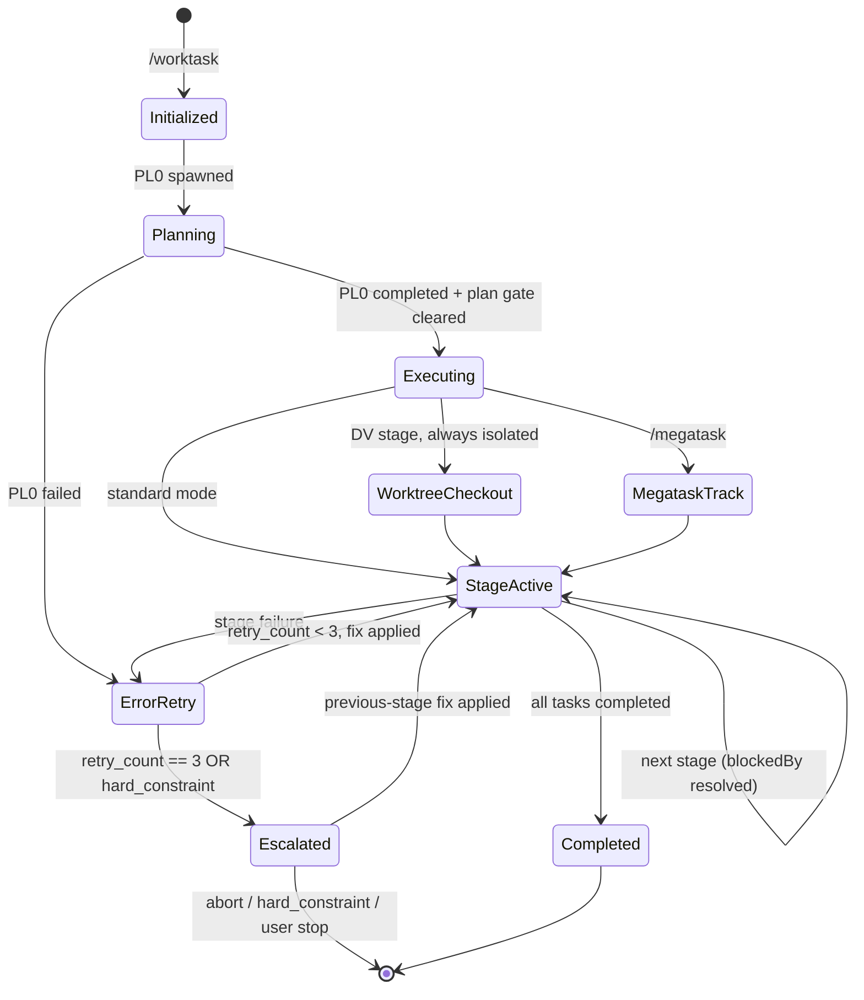
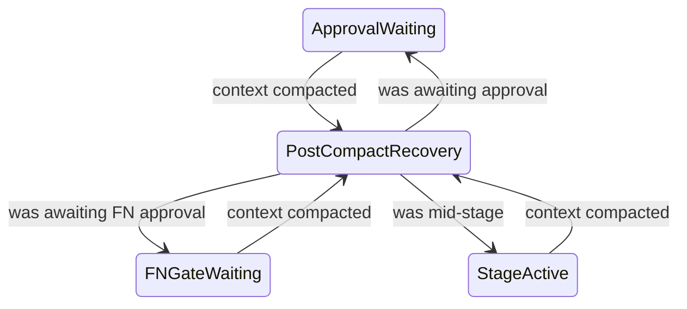

> **INVOCATION GATE**: If you are reading this skill because the orchestrator delegated directly
> (e.g., a Read/Task/Grep on this file) instead of launching via `Skill({skill:"company-workflow:worktask"})`
> or the `/worktask` command, the BLOCKING rule in `../shared/worktask-invocation.md § BLOCKING` was
> violated. Do NOT silently continue — surface the error to the user, then restart through the
> canonical entry point.

# Worktask System

Single source of truth for task worktask management using the Task System.

## Pipelines

```
9-stage:   PL → AR → TL → DV → DR → QA → DC → FN → ST
11-stage:  PL → AR → TL → DV → DR → SR → QA → DC → RE → FN → ST
                              ↑              ↑
                        Developer Review  Security Review (optional)
```

AR and TL are optional: AR is a tier default PL0 may override in either direction, and TL runs
only when PL0 splits the work across ≥2 developers. See `skills/estimation-methodology/SKILL.md
§ Stage Inclusion Criteria (PL0 authority)`.

### State Machine



#### Post-compact recovery states



#### State-machine references

**Stage codes and invocation**: See `${CLAUDE_SKILL_DIR}/../shared/stage-codes.md` and `${CLAUDE_SKILL_DIR}/../shared/worktask-invocation.md`

**Task System integration**: See `${CLAUDE_SKILL_DIR}/../shared/task-system.md`

## Dynamic Worktask Sizing

PL0 assesses complexity and creates only the stages needed. No pre-creation or deletion — PL builds the task list from scratch.

### Complexity Assessment

| Factor | Low (0-2) | Medium (3-5) | High (6-10) |
|--------|-----------|--------------|-------------|
| **New patterns** | None | 1-2 new | 3+ new |
| **Integration points** | 1-2 | 3-5 | 6+ |
| **Cross-cutting concerns** | None | 1 area | Multiple |
| **Risk level** | Minimal | Moderate | High |
| **Documentation needs** | Inline | README | ADR + API docs |

**Scoring**: Sum factor scores (0-50 total)

### Decision Rules

| Score | Complexity | PL0 Creates |
|-------|------------|-------------|
| 0-10 | Low | DV0, DR0, QA0 |
| 11-20 | Medium | AR0 (default — PL0 may override per Stage Inclusion Criteria), DV0, DR0, QA0 |
| 21-30 | Moderate | AR0 (default — PL0 may override per Stage Inclusion Criteria), DV0, DR0, QA0 |
| 31-40 | High | AR0 (default — PL0 may override per Stage Inclusion Criteria), DV0, DR0, QA0, DC0, FN0, ST0 |
| 41-50 | Critical | AR0 (default — PL0 may override per Stage Inclusion Criteria), DV0, DR0, SR0, QA0, DC0, RE0, FN0, ST0 |

+ TL0 — only when PL0 splits the work across ≥2 developers (see Stage Inclusion Criteria)

Criteria canon: `skills/estimation-methodology/SKILL.md § Stage Inclusion Criteria (PL0 authority)`.

#### Recording skipped and added stages

**Record both directions**: whenever the resolved stage set omits any stage of the full 9-stage
pipeline (`PL→AR→TL→DV→DR→QA→DC→FN→ST`), PL0 MUST stamp its own `metadata.skipped_stages` — a
list of `{ "stage": "<CODE>", "reason": "<short reason>" }` — and MUST stamp the symmetric
`metadata.added_stages` (identical `{stage, reason}` shape) for every stage included beyond the
tier default, so `state.json` is self-documenting in both directions.

**Security-sensitive features** auto-include SR0:
- Authentication/authorization, payment processing, PII handling
- Cryptographic operations, external API secrets, file uploads

Each task includes `metadata.agent` for executor resolution. See `initialization-patterns.md § PL Creates Subsequent Tasks`.

## Workspace Mode

Megatask (per-issue) tickets run in isolated workspaces. `.context/` base path by mode (resolve via `task.metadata.workspace_path` + `metadata.isolation`):

| Mode | `.context/` base |
|------|------------------|
| Standard | `.context/` (main checkout — orchestrator + non-isolated stages) |
| Worktree | `.worktrees/milestone-{N}/{issue#}/.context/` |

**WHEN in megatask per-issue/worktree mode, inside a Conductor workspace clone, or on any cwd↔workspace_path mismatch: Read `references/workspace-modes.md`** (detection snippet, Conductor sibling-repo rule, task-ID namespacing). Binding enforcement (workspace-root cross-check + `WORKSPACE_ROOT` banner injection) lives in `commands/worktask.md` Phase 2. Full megatask docs: `../megatask/SKILL.md`.

## Parallel Execution

### DC + QA Parallel (Default)

```typescript
TaskUpdate({ taskId: "5", addBlockedBy: ["4"] });  // DR ← DV
TaskUpdate({ taskId: "6", addBlockedBy: ["5"] });  // QA ← DR
TaskUpdate({ taskId: "7", addBlockedBy: ["5"] });  // DC ← DR
TaskUpdate({ taskId: "8", addBlockedBy: ["6", "7"] });  // FN ← QA AND DC
```

Use `--sequential` when DC requires test results.

### Monitor Tool Integration

Use the `Monitor` tool to stream events from background processes during worktask stages. Replaces polling patterns for build output, test progress, and log streaming. Available to any agent with Bash access. Persist raw stream output to `.context/logs/<kind>-<scope>-<timestamp>.log` per the `logging-conventions` skill.

### Never Parallelize

Rows apply only to stages present in the plan; a stage PL0 excluded imposes no ordering constraint.

- AR before PL (needs requirements)
- DV before TL (needs coordination)
- DR before DV (can't review unwritten code)
- QA before DR (DR must review code before QA tests)

## Error Handling

### Retry Logic

Each stage: max 3 retries. Track via `metadata.retry_count` (per-task) and append a narrative entry to `.context/errors/<agent>.md` (per-agent — see `task-folder-organization` skill § Per-Agent Error Files). Raw stdout/stderr goes to `.context/logs/retry-<stage>-<ts>.log` per `logging-conventions`.

### Escalation Chains

```
11-stage: ST → FN → RE → DC → QA → SR → DR → DV → TL → AR → PL → USER
9-stage:  ST → FN → DC → QA → DR → DV → TL → AR → PL → USER
Emergency: FN → RE → QA → DR → DV → IR → USER
```

Stages absent from the plan drop out of the chain — escalation from DV goes to TL if TL ran, else
AR if AR ran, else PL.

Document errors in `.context/errors/<agent>.md` (per-agent, append-only; one `## Retry N — <ts>` section per failure) with problem, classification, root cause, attempted solutions. Raw captures belong in `.context/logs/` per `logging-conventions`.

## Rule Checks

| Rule | Required Before |
|------|-----------------|
| Test Strategy | PL → AR (when AR runs; else PL owns it) |
| Test Architecture | AR → TL when both run; AR → DV when TL is excluded (the default shape at every tier — see Stage Inclusion Criteria); PL → DV when AR is excluded too |
| Code Format | DV complete |
| Build Pass | DV → DR |
| Unit Tests Written + Pass | DV → DR |
| Developer Review Pass | DR → QA |
| All Tests Pass (Unit + Integration + E2E) | QA → DC |

## Optimization Hooks

### Pre-Stage

| Check | Threshold | Action |
|-------|-----------|--------|
| Context size | > 50% window (standard) or > 30% (1M window) | Compress previous stages |
| Budget usage | > 75% | Alert user |
| Free disk space | < 5 GB before a build stage (AR/DV/QA/SR/RE) | Halt with remediation — see § Pre-Stage Disk Guard |
| Free disk space | < 8 GB before a build stage | Warn; run `swift package clean` hygiene before delegating |

### Pre-Stage Disk Guard (ENOSPC)

Stages that invoke `swift build` / `xcodebuild` — **AR, DV, QA, SR, RE** — accumulate `.build/` and DerivedData artifacts across runs. With no pre-flight disk check, an exhausted filesystem kills the build harness mid-stage (precedent: `tokamak-reconciler-unification` run #14 — ENOSPC killed the harness twice, AR partially and SR fully). Before delegating any of those five stages, assert free space on the workspace filesystem:

#### Disk guard — thresholds

```bash
# Threshold is configurable via DISK_MIN_GB (hard halt, default 5) and
# DISK_WARN_GB (hygiene warn, default 8).
MIN_GB="${DISK_MIN_GB:-5}"; WARN_GB="${DISK_WARN_GB:-8}"
AVAIL_GB=$(df -Pg "${WORKSPACE_ROOT:-.}" 2>/dev/null | awk 'NR==2 {print $4+0}')
```

#### Disk guard — halt / warn decision

```bash
# …continued: halt/warn decision on AVAIL_GB (thresholds set above)
if [ -n "$AVAIL_GB" ] && [ "$AVAIL_GB" -lt "$MIN_GB" ]; then
  appendAudit action=pre_stage_disk_halt result=blocked \
    metadata="{\"stage\":\"$CODE\",\"avail_gb\":$AVAIL_GB,\"min_gb\":$MIN_GB}"
  echo "HALT: only ${AVAIL_GB} GB free (< ${MIN_GB} GB) before $CODE." \
       "Reclaim space, then resume:" \
       "  swift package clean   # drops .build/" \
       "  rm -rf ~/Library/Developer/Xcode/DerivedData/*   # drops DerivedData" >&2
  # Do NOT delegate the stage — return to the user for remediation.
elif [ -n "$AVAIL_GB" ] && [ "$AVAIL_GB" -lt "$WARN_GB" ]; then
  appendAudit action=pre_stage_disk_warn result=ok \
    metadata="{\"stage\":\"$CODE\",\"avail_gb\":$AVAIL_GB,\"warn_gb\":$WARN_GB}"
  # Optional hygiene before DV: swift package clean to reclaim build artifacts.
fi
```

#### Disk guard — semantics

- **Hard halt** (< `DISK_MIN_GB`, default 5): do NOT delegate; surface the remediation and return — a halted run is recoverable, an ENOSPC-killed harness mid-stage is not.
- **Warn** (< `DISK_WARN_GB`, default 8): proceed, but run `swift package clean` as a pre-DV hygiene step to reclaim `.build/` first.
- `df -Pg` (`-g` = whole GiB blocks; `-P` = portable single-line rows) is POSIX-portable on macOS and Linux; the guard degrades to a no-op (skips the check, proceeds) if `df` output is unparseable, so it never blocks a run on a measurement failure.
- **Canonical implementation**: this guard is folded into `scripts/state-patch.sh --disk-check <root>`. The shell snippet above is the spec; invoke the script for the executable form.

### Post-Stage

- Compress context for handoff (50-100 tokens)
- Log token usage in task metadata
- Validate artifacts created
- `PostCompact` hook fires after auto-compaction — use to re-inject critical worktask state

> On Opus 5, Sonnet 5, and Fable 5 the context window is 1M tokens. Compression still recommended at stage boundaries for cost efficiency even with larger windows.

See references/ for initialization code, stage details, and agent teams integration.

## Pre-Stage Validation

Before executing any worktask stage, the orchestrator MUST validate:

### Validation checks 1–5

1. **TaskList check**: Call `TaskList()` and verify at least one task exists with `metadata.worktask_id` matching the current worktask
2. **PL0 exists**: Verify a task with subject starting with `PL0:` exists
3. **Stage tasks exist**: After PL0 completes, verify PL0 created subsequent stage tasks (at minimum DV0, DR0, and QA0 for any complexity level)
3b. **Inclusion decisions are reasoned**: every entry in PL0's `metadata.skipped_stages` and `metadata.added_stages` carries a non-empty, decision-shaped `reason`; a bare score restatement or an entry with no reason fails the check
4. **Stage contract check**: Verify upstream outputs match the next stage's Required Inputs per `shared/stage-contracts.md` (file exists + required sections present)
5. **Metadata schema check**: Validate next task's metadata against `shared/task-system.md` § JSON Schema (non-PL tasks require `stage`, `agent`, `model`, `error_file`)
### Validation checks 6–7

6. **Model alias check**: `metadata.model ∈ {fable, opus, sonnet, haiku}` — reject unknown aliases before `Task()` delegation. Caveat: under a managed `availableModels` allowlist (applied to subagent model overrides too) or `enforceAvailableModels`, a *valid* alias may silently resolve to a different model at dispatch — emit a `model_resolution_constrained` audit row when a managed allowlist is in effect; do NOT hard-block
7. **Workspace existence** (megatask per-issue/worktree mode only): verify `metadata.workspace_path` directory exists and `workspace.json` is readable
### Validation check 8

8. **Artifact path resolution check** (non-blocking): for the next task's `metadata.run_index`, resolve the upstream artifact via the `stageArtifactPath()` helper below. Emit one `artifact_path_resolved` audit row with `result ∈ {ok, fallback_glob, miss}` and `metadata.resolved_path`. A `miss` result means the upstream stage produced no artifact and is treated by F3 in `references/handoff-protocol.md#fallback-paths` — warn but proceed. Catches run_index drift early (off-by-one between PL0 and stage tasks) before downstream stages burn tokens on fallback reads.
### Validation check 9

9. **Hook installation check** (first stage only): Verify `state-merge.sh` SubagentStop hook is operational. Check: (a) `.claude/hooks/state-merge.sh` exists and is executable, OR (b) the plugin's `plugin.json` registers the SubagentStop hook entry. If neither is true, emit a warning: `"⚠ state-merge.sh hook not installed — run hook-install.sh"`. Do NOT block — the orchestrator's Step 6.5 provides Layer 3 coverage. See `references/initialization-patterns.md#hook-installation`.
### Validation check 10

10. **Branch naming** (first stage only, after the state.json seed and before `TaskCreate` PL0): run `bash skills/worktask/scripts/branch-name.sh --goal "<concise imperative title>"` — the ONLY point in the pipeline a worktask branch is ever renamed (once-only rule, `skills/shared/git-conventions.md § Branch Naming`). **Unconditional**: the script's "already conventional" arm is a no-op, so running it always is free and is the only correct way to decide — never skip it because the current branch looks fine, and never judge conventionality by eye (the sole authority is `branch_is_conventional()`, queryable as `--check <name>`). A branch created outside the pipeline is covered by exactly this rule. Every outcome exits 0 and the step self-disables under `/megatask`/`--emergency` routing.

### Validation check 10 — pass a title, preview freely

**Pass a title, never the raw task description**: the goal text becomes a 48-character slug and the overflow is dropped silently, so a multi-sentence description yields a name that ends mid-phrase (`commands/worktask.md § Step 3c — the input is a title`). Preview it first with `BRANCH_NAME_PRINT=1`, which renames nothing and writes no audit row; the query modes `--check`/`--print-types`/`--print-target` are free for the same reason. The *planned* name on the ledger may later be refined once, without any git mutation — `commands/worktask.md § Step A.4b`.

### Validation check 10 — stamping and post-check

Capture **both** stdout key=value lines — `target_branch=<name>` (the name the PR head should carry) and the final `branch=<name>` line (the local branch as it stands) — **verify the value matches `^[A-Za-z0-9._/-]+$` before stamping** (a failing value is stamped empty, not as-is), and stamp `facts.branch` on the ledger (the script itself never writes state.json — see `references/handoff-protocol.md § branch`).

### Validation check 10 — which name, and the host rule

**When `branch=` is empty or fails `--check` but `target_branch=` is non-empty, stamp the target** — the local name may be blocked from changing (upstream tracked, target exists) while the PR head is still ours to name. Then run the non-blocking post-check (`commands/worktask.md § Step 3c — post-check`): a stamped name failing `--check` emits one `branch_convention_check` warning row naming the actual and derived target, and never blocks planning. Invoking `/worktask` authorizes the rename against a host's no-rename session rule — never revert it, never re-ask (`references/workspace-modes.md § Host session authorization`).

### On validation failure

If validation fails:
- No tasks exist → Worktask not initialized. Re-run initialization (TaskCreate PL0)
- PL0 exists but no subsequent tasks → PL0 did not complete properly. Re-run PL0
- Tasks exist but are orphaned (no worktask_id) → Log warning and attempt to match by subject pattern
- Contract violation → Do NOT transition. Append `missing_input` entry to next stage's `.context/errors/<agent>.md` and block.

## Orchestrator Execution Loop

> **This loop dispatches one `Task()` per ready stage in-process.** It runs the full pipeline from the
> PL0 precondition (below) through the FN gate (§ FN Gate), advancing stages as their `blockedBy`
> dependencies resolve.

> **Figma asset persistence is NOT an orchestrator step.** Figma screenshots are captured AND persisted to
> the canonical `.context/designs/` directory entirely within the PL turn (Phase 1) by the product-manager
> via its narrowly-scoped `Bash(curl:*)` tool — `get_screenshot` returns a short-lived URL that must be
> fetched while still valid, during the PL turn. The orchestrator MUST NOT add a post-PL0 download step
> (it would collide with the Phase-1 Bash prohibition in `commands/worktask.md` and race the expiring URL).
> See `agents/product-manager.md § Capture Workflow`.

### Cache-Friendly Prompt Layout & state.json (handoff-protocol)

The orchestrator builds every delegation prompt in a **binding** order so consecutive `Task()` calls within the same `worktask_id` share a byte-identical prefix and benefit from Anthropic's prompt cache. Spec source: `skills/worktask/references/handoff-protocol.md#cache-prefix`.

#### Preamble layout (binding)

```
[1] Plugin/agent contract reminder         ← stable across ALL stages (cacheable)
[2] Worktask header (id, plan, exploration)← stable across ALL stages (cacheable)
[3] state.json blob (inlined JSON)         ← evolves per stage
[4] Stage contract excerpt                 ← stable WITHIN stage type (cacheable)
─────── (cache prefix boundary) ───────
[5] task.description                       ← dynamic per delegation
[6] retry hints + gate remediation (if retry_count > 0) ← dynamic per delegation
[7] Stage-specific banners (DR Skill, FN Conductor, MCP fallback) ← SUFFIX, dynamic
```

#### Step 0 (NEW) — Read state.json before each delegation

```typescript
const stateRaw = fs.existsSync(".context/state.json")
  ? fs.readFileSync(".context/state.json", "utf8")
  : null;
// stateRaw goes inline into preamble section [3] as a fenced JSON code block.
// If null, F1 fallback applies: orchestrator uses metadata.context_files only,
// no cache-friendly preamble (`context_files` mode).
```

#### Artifact path helper

Resolves the numbered artifact path with fallback:

```typescript
const ARTIFACT_BASE: Record<string, string> = {
  PL: "planning", AR: "architecture", TL: "coordination",
  DV: "development", DR: "developer-review", SR: "security-review",
  QA: "testing", DC: "documentation", RE: "release",
  FN: "complete-summary", ST: "retrospective", IR: "incident",
  ET: "ethics-review",
};
```

##### stageArtifactPath()

```typescript
// …continued: uses ARTIFACT_BASE above
function stageArtifactPath(code: string, runIndex: number): string {
  const base = ARTIFACT_BASE[code];
  const numbered = `.context/${base}-${runIndex}.md`;
  if (fs.existsSync(numbered)) return numbered;
  // Newest-glob fallback (covers out-of-band writes)
  const matches = glob.sync(`.context/${base}-*.md`).sort((a, b) => {
    const n = (f: string) => parseInt(f.match(/-([0-9]+)\.md$/)?.[1] ?? "0", 10);
    return n(a) - n(b);
  });
  if (matches.length > 0) return matches.pop()!;
  // No artifact on disk: return the canonical numbered path so the
  // caller's existence check surfaces the miss at the expected location.
  return numbered;
}
```

#### Step 6.5 — After Task() returns, enforce state.json patch (MANDATORY)

After every `Task()` return and BEFORE `TaskUpdate(stage→completed)`, execute this three-layer check:

##### Completion signal (subagents run in the background by default)

> "`Task()` return" here means the **completed stage result**, not the launch acknowledgement. Under background-default dispatch the orchestrator keeps its turn while the stage runs and receives the result as a completion notification. Run Step 6.5 (and the `TaskUpdate(stage→completed)` that follows) only once that notification — or the stage's `subagent_stopped` audit row — has arrived. NEVER fire Layer 3 (F3) while the stage's `agent_id` is still live in `claude agents --json`: F3 would stamp `completed` over a still-running stage. Errored returns propagate honestly: a subagent cut off by a rate limit or API error reports the error (with any partial work preserved) instead of a successful-looking empty result — classify per `agent-coordination § Retry / Escalate Matrix` (`transient`) and do NOT run the completion patch on an errored return.

###### Layer check — Layers 1–2

```typescript
// Layer check: re-read state.json.
const statePost = JSON.parse(fs.readFileSync(".context/state.json", "utf8"));
const code = full.metadata.stage;
const runIndex = full.metadata.run_index ?? 0;
const artifactPath = stageArtifactPath(code, runIndex);

if (statePost.stages?.[code]?.status !== "completed") {
  // Layer 1 (agent self-patch) missed → invoke Layer 2 synchronously via the canonical script
  // (fires even if the SubagentStop hook event was not delivered):
  //   bash skills/worktask/scripts/state-patch.sh --stage <code> --artifact <path> --via step6_5
  // state-patch.sh is the single implementation (.claude/hooks/state-merge.sh is a thin wrapper);
  // `--via step6_5` stamps stages.<CODE>.completed_via=step6_5 vs the hook default ("hook"). (v1 additive.)
  runStateMergeHook(artifactPath, code, /* via */ "step6_5");
```

###### Layer 3 (F3) fallback

```typescript
  // …continued: re-read after the Layer-2 hook.
  const statePost2 = JSON.parse(fs.readFileSync(".context/state.json", "utf8"));
  if (statePost2.stages?.[code]?.status !== "completed") {
    // Layer 2 also missed (hook absent or artifact lacks frontmatter).
    // Layer 3: orchestrator derives minimal patch from agent return text (F3 fallback).
    // The F3 patch stamps completed_via:"f3" so the enforcement layer is observable.
    const handoff = parseFrontmatter(artifactPath);  // null if missing → F3
    const patch = handoff
      ? buildPatchFromHandoff(code, handoff)
      : { stages: { [code]: { status: "completed", artifact: artifactPath, verdict: "ok", completed_via: "f3" } } };
    if (handoff && !patch.stages[code].completed_via) patch.stages[code].completed_via = "f3";
    atomicMergeStateJson(patch);  // read → merge → temp → fsync → rename
  }
}
```

###### Dispatch-tracking helpers (steps 6a/6.5 — write only cache section [3])

```typescript
// markDispatchStatus — return the dispatched_agents[] array with the entry for task_id
// flipped to `status`, optionally backfilling model_resolved. Replace-array semantics
// (jq `. * $patch` overwrites arrays). Absent entry → array unchanged (defensive).
function markDispatchStatus(state, taskId, status, modelResolved) {
  return (state.facts?.dispatched_agents ?? []).map(a =>
    a.task_id === taskId
      ? { ...a, status, ...(modelResolved ? { model_resolved: modelResolved } : {}) }
      : a);
}
// classifyError — map an errored Task() return to the EXISTING retry taxonomy
// (agent-coordination § Retry / Escalate Matrix). No new vocabulary. A rate-limit /
// API cut-off is `transient`; other classes come from the artifact/return text.
// errorBasename — last ":"-segment of the subagent_type (e.g. company-workflow:developer → developer).
```

###### Banner relocation & cache-prefix hygiene

**Banner relocation (R3)**: stage-specific banners (DR Skill, FN Conductor, MCP fallback warning) are appended AFTER `full.description` (suffix), not prepended. Prefixes [1][2][3][4] stay byte-identical across stages so the cache prefix boundary stretches as far as possible.

The preamble assembler MUST exclude forbidden tokens from sections [1][2][4]: timestamps, ENV expansions that vary per call, random IDs, retry counters, file mtimes, agent names beyond `worktask_id`. CI lint (`skills/worktask/scripts/cache-lint.sh`) asserts byte-stability across consecutive stages of the same `worktask_id`.

### CRITICAL: Delegation-Only Rule

The orchestrator NEVER writes implementation code directly. ALL stage work is delegated to stage agents via the Agent tool. Using Edit/Write on source files, running build commands, or marking tasks completed without first delegating to an agent are all violations. The orchestrator's job is to manage the loop — read tasks, resolve agents, delegate, track status. If you find yourself editing source code, STOP — delegate to the stage agent instead.

### PRECONDITION CHECK
Before entering this loop, verify:

#### Signals 1–3 (incl. 2b)

- **Signal 1 (TaskList audit)**: Call `TaskList()`, find the PL0 task, verify its status is `completed`. If PL0 does not exist or is not completed, STOP — worktask not initialized or planning incomplete.

**Signal 2 (plan gate)**: Read `PL0.metadata.plan_gate` (via `TaskGet`; default `"checkpoint"`).
- `"checkpoint"` (default): require BOTH PL0 `completed` AND an `approval_received` audit line with
  `subject:"PL<run_index>"` in `.context/logs/audit.jsonl` before loop entry. If the line is
  absent, STOP — return to `commands/worktask.md § Step A.5` to fulfil the gate.
- `"bypass"` (`--auto=[plan]` / `--emergency`, or stamped directly per-issue by the `/megatask` batch orchestrator): PL0 `completed` alone is sufficient; no approval line — except when Signal 2b escalated items exist, whose `approval_received` row is still required.

##### Signal 2b (decision gate)

`PL0.metadata.decision_gate` (default `"user"`) selects WHO answers PL0's `open_questions[]` at
the plan gate. `"auto"` (stamped by `--auto=[decision]`) routes them through the Fable-model
auto-decision pre-pass — `commands/worktask.md § Step A.4` is canon. Verify before loop entry:
when `decision_gate == "auto"` and PL0's handoff carried a non-empty `open_questions[]`, an
`auto_decision_resolved` audit row with `subject:"PL<run_index>"` MUST exist (and any `escalate`
items MUST have an `approval_received` resolution) — if absent, STOP and return to Step A.4. The
carrier bypasses neither `plan_gate` nor `fn_gate`.

##### Signal 3 (FN gate)

FN dispatch is gated mid-loop on `PL0.metadata.fn_gate` (default `"checkpoint"`). The orchestrator STOPs immediately before the FN `Task()` delegation for finalization approval unless the carrier is `"bypass"` (`--auto=[finalization]` / `--emergency`, or stamped directly per-issue by the `/megatask` batch orchestrator). See loop step 4.9 and § FN Gate.

#### After PL0 — steps 1–3

After PL0 completes and creates stage tasks, the orchestrator MUST:

1. **Present PL0 results** to the user: complexity score, stages created (with agents), dependency chain, and key planning decisions (presented at the Step A.5 plan gate; on a `checkpoint` gate execution proceeds only after approval).
2. **Re-validate before executing**: Call `TaskList()` to get all stage tasks. For each task, verify `metadata.agent` and `metadata.model` are set. This checkpoint prevents drift — the orchestrator re-grounds itself in the delegation rules before touching any stage.
3. **Publish plan to GitHub** (before stage loop). Run:

##### Step 3 — publish snippet

     ```bash
     PLUGIN_ROOT="${CLAUDE_PLUGIN_ROOT}"  # CC substitutes on load; if empty resolve per skills/shared/plugin-root-resolution.md
     [ -d "$PLUGIN_ROOT" ] || PLUGIN_ROOT="<plugin-root>"
     HELPER="$PLUGIN_ROOT/skills/worktask/scripts/publish-pl-issue.sh"
     if [ -f "$HELPER" ]; then
       bash "$HELPER"; true
     ```

##### Step 3 — publish fallback (helper_not_found)

     ```bash
     # …continued: helper missing → audit one deferred github_issue_created row
     else
       LOG_DIR="${WORKSPACE_ROOT:-${CLAUDE_PROJECT_DIR:-.}}/.context/logs"
       mkdir -p "$LOG_DIR"
       STATE_FILE="${WORKSPACE_ROOT:-${CLAUDE_PROJECT_DIR:-.}}/.context/state.json"
       jq -cn --arg ts "$(date -u +%FT%TZ)" --arg dk "$(jq -r '.worktask_id // "unknown"' "$STATE_FILE" 2>/dev/null || echo unknown):$(jq -r '.run_index // 0' "$STATE_FILE" 2>/dev/null || echo 0):gh_issue" \
         '{ts:$ts, actor:"orchestrator", action:"github_issue_created", subject:"PL0", result:"deferred", task_id:"1", metadata:{via:"publish-pl-issue.sh", reason:"helper_not_found", dedupe_key:$dk}}' \
         >> "$LOG_DIR/audit.jsonl"; true
     fi
     ```

##### Step 3 — non-blocking & skip rules

     The trailing `; true` masks the helper's exit code — a helper failure (catastrophic exit 1, deferred exit 0, network error, etc.) MUST NEVER propagate as orchestrator failure. Skip entirely when `--no-gh-issue` was supplied on the CLI (PL0 sets `task.metadata.no_gh_issue: true`; the helper short-circuits internally and audits `deferred`/`opted_out`). Under megatask per-issue mode (`state.json:metadata.milestone` set, or `workspace.json` present), the helper exits `0` immediately with `reason: "milestone_mode"` — no `gh` API call of any kind is made. A **second or later worktask run in the same `.context/`** does NOT open a duplicate issue: the helper resolves the run-independent `.context/gh-issue.json` anchor and posts a follow-up comment instead (`metadata.mode: "comment"`; see `skills/gh-issue-dedup`). See `### PL Issue Publish` below for sanitiser rules and the non-blocking guarantee.

#### Steps 1–3

```typescript
// 1. Get all tasks for this worktask
let tasks = TaskList();
```

##### HANDOFF_SCHEMA

```typescript
// Typed-return schemas — SSOT: skills/worktask/references/handoff-protocol.md#handoff-schemas.
// Read the SSOT ONCE at loop entry and materialize the other 12 entries verbatim (PL is the exemplar).
// A missing key leaves stageSchema undefined → schema param omitted → today's frontmatter path.
const HANDOFF_SCHEMA: Record<string, object> = {
  PL: { $schema: "https://json-schema.org/draft/2020-12/schema", title: "PLHandoff", type: "object", required: ["verdict", "summary", "key_decisions", "next_stage_focus"], properties: { verdict: { type: "string", enum: ["ok", "blocked", "escalate"] }, summary: { type: "string", maxLength: 200 }, complexity: { type: "integer", minimum: 0, maximum: 50 }, key_decisions: { type: "array", items: { type: "string" } }, next_stage_focus: { type: "string" }, open_questions: { type: "array", items: { type: "string" } } } },
  // …AR TL DV DR SR QA DC RE FN ST IR ET: materialize verbatim from the SSOT above.
};
```

##### Steps 2–3 — completion loop & ready filter

```typescript
// 2. Loop until all tasks are completed
while (tasks.some(t => t.status !== "completed")) {
  // 3. Find unblocked pending tasks
  const ready = tasks.filter(t =>
    t.status === "pending" &&
    (t.blockedBy ?? []).every(dep => tasks.find(d => d.id === dep)?.status === "completed")
  );

  for (const task of ready) {
```

#### Step 4.0

```typescript
    // 4. Get full task details
    const full = TaskGet({ taskId: task.id });
    const agentType = full.metadata.agent;
    const model = full.metadata.model;

    // 4.0. Re-read the live ledger for this iteration (dispatched_agents[], last_error,
    //      facts.capabilities are all read below and evolve per stage). Cheap: state.json
    //      is ≤500 tokens. F1 (absent) → empty shape so the additive reads degrade to no-op.
    const state = fs.existsSync(".context/state.json")
      ? JSON.parse(fs.readFileSync(".context/state.json", "utf8"))
      : { stages: {}, facts: {} };
```

##### Agent-type resolution

```typescript
    // Resolve plugin: bare → "company-workflow:<name>"; 2-part "plugin:name" → as-is;
    //   3-part "a:b:c" → UNSUPPORTED, throw (message below). The .context/errors/<basename>.md
    //   basename is the last `:`-segment. Applies at every nesting depth (the runtime allows
    //   3-deep sub-agent spawning by default) — depth never legitimizes a 3-part name.
    //   CC also rejects a `:` in an agent file's own frontmatter `name:` (reserved for plugin
    //   namespacing), so the qualified form only ever appears at the call site, never in the file.
    const colonCount = (agentType.match(/:/g) ?? []).length;
    if (colonCount > 1) {
      throw new Error(`Invalid agent reference '${agentType}': only bare or plugin-qualified names supported.`);
    }
    const subagentType = colonCount === 1 ? agentType : `company-workflow:${agentType}`;
```

#### Step 4.5

```typescript
    // 4.5. Soft context_files validation — warn, don't abort
    //      Low-complexity worktasks legitimately skip upstream stages,
    //      so a missing listed file is a warning appended to the prompt.
    //      Exception: error_file absence is expected on first attempt
    //      (retry_count === 0) — suppress that specific warning.
    if (full.metadata.context_files) {
      const listed = full.metadata.context_files.split(',').map(s => s.trim());
      const retryCount = full.metadata.retry_count ?? 0;
      const missing = listed.filter(p =>
        !fs.existsSync(p) &&
        !(p === full.metadata.error_file && retryCount === 0)
      );
      if (missing.length > 0) {
        full.description =
          `NOTE: Expected context files missing: ${missing.join(', ')}. ` +
          `Proceed using what is available; do not fabricate content.\n\n` +
          full.description;
      }
    }
```

#### Step 4.6-pre

```typescript
    // 4.6-pre. last_error hint — on a retry, prepend one line summarizing the prior
    //          errored return (class + partial + ref) to prompt section [6] so the
    //          re-dispatch targets the recorded failure instead of re-inferring it.
    //          Reads stages.<CODE>.last_error written by Step 6.5a. (v1 additive; [6]
    //          is the dynamic retry-hint section — cache prefix [1][2][4] untouched.)
    if ((full.metadata.retry_count ?? 0) > 0) {
      const le = state.stages?.[full.metadata.stage]?.last_error;
      if (le) {
        full.description =
          `PRIOR ERROR (class=${le.class}` +
          `${le.partial ? ", partial work preserved" : ""}` +
          `${le.ref ? `, see ${le.ref}` : ""}). Resume/repair from that point.\n\n` +
          full.description;
      }
    }

```

#### Step 4.6

```typescript
    // 4.6. Gate-feedback injection — DR→DV / QA→DV loop-back (gate-feedback contract).
    //      Prior DR `verdict:fail` / QA `verdict:no-go` → re-dispatch DV (run_index bumped,
    //      retry_count++) carrying the upstream remediation VERBATIM so the re-run targets
    //      *those* findings. Hook surface: `hookSpecificOutput.additionalContext` — see
    //      skills/agent-coordination/references/hook-monitoring.md §"Gate-feedback contract";
    //      symmetric with dv-screenshot-gate.sh's block-path additionalContext.
    if (full.metadata.stage === "DV" && (full.metadata.retry_count ?? 0) > 0) {
      // Read the upstream gate handoff for this run: DR `.context/developer-review-N.md`
      // (DRHandoff.blockers[]) and/or QA `.context/testing-N.md` (QAHandoff.blocking_defects[]),
      // N = the failing upstream run_index. Embed whichever is present as a remediation block.
```

##### Step 4.6 — remediation injection & audit

```typescript
      // …continued: step 4.6 body
      const fromStage = full.metadata.gate_from_stage; // "DR" | "QA" (set by the loop-back)
      const blockers = full.metadata.gate_blockers ?? []; // blockers[] | blocking_defects[]
      if (fromStage && blockers.length > 0) {
        const remediation =
          `REMEDIATION (from ${fromStage} gate — fix these specific findings before re-stop):\n` +
          blockers.map((b, i) => `  ${i + 1}. ${b}`).join("\n");
        full.description = remediation + "\n\n" + full.description;
        appendAudit({
          actor: "orchestrator",
          action: "gate_remediation_injected",
          subject: full.metadata.stage,
          result: "ok",
          metadata: { from_stage: fromStage, to_stage: "DV", count: blockers.length }
        });
      }
    }

```

#### Step 4.7

```typescript
    // 4.7. DV checkpoint resume — restart DV from its last budget-aware checkpoint.
    //       A budget-exhausted DV run wrote a partial `development-N.md` (+ `## Blockers`)
    //       and recorded completed sub-batches at `state.json → stages.DV.progress`
    //       (agents/developer.md § Budget-Aware Checkpointing). On re-dispatch, carry the
    //       checkpoint forward so the re-run resumes from `next_batch` instead of redoing
    //       applied work. Friction precedent: tokamak-reconciler-unification (#14).
    if (full.metadata.stage === "DV") {
      const dvProgress = state.stages?.DV?.progress;  // {completed_batches, next_batch, updated_at}
      if (dvProgress && (dvProgress.completed_batches?.length ?? 0) > 0) {
```

##### Step 4.7 — resume injection & audit

```typescript
        // …continued: step 4.7 body
        const resume =
          `RESUME (DV checkpoint — prior run completed batches ` +
          `[${dvProgress.completed_batches.join(", ")}]; resume from ` +
          `${dvProgress.next_batch ?? "the next pending batch"}). Do NOT redo applied ` +
          `batches — read the partial development-N.md and continue forward.`;
        full.description = resume + "\n\n" + full.description;
        appendAudit({
          actor: "orchestrator",
          action: "dv_checkpoint_resume",
          subject: "DV",
          result: "ok",
          metadata: {
            completed: dvProgress.completed_batches,
            next_batch: dvProgress.next_batch ?? null
          }
        });
      }
    }

```

#### Step 4.8

```typescript
    // 4.8. DV worktree-isolation enforcement — isolation is ALWAYS expected.
    //       Every DV stage runs in an isolated worktree before writing files
    //       (see agents/developer.md § D0.0). Carry that requirement into the DV
    //       prompt so the agent confirms isolation, creates a worktree, or flags
    //       the deviation and returns — instead of silently editing the shared checkout.
    //       DR rejects a DV handoff carrying `worktree:false` unless an explicit waiver
    //       exists (`worktree_isolation_waived` audit / task.metadata.worktree_waived).
    //       Friction precedent: tokamak-reconciler-unification (#14, decision dv6).
    if (full.metadata.stage === "DV") {
```

##### Step 4.8 — enforcement banner

```typescript
      const enforce =
        `WORKTREE ISOLATION REQUIRED (always): ` +
        `confirm you are in an isolated worktree before any Edit/Write (D0.0). ` +
        `If not, EnterWorktree and proceed, or flag worktree_isolation_missing and ` +
        `return verdict:blocked. Set handoff frontmatter \`worktree: true\` (false is a hard DR fail).`;
      full.description = full.description + "\n\n" + enforce;
```

##### Step 4.8 — worktree audit

```typescript
      // …continued: step 4.8 body
      appendAudit({
        actor: "orchestrator",
        action: "dv_worktree_enforced",
        subject: "DV",
        result: "ok",
        metadata: { isolation: "worktree" }
      });
    }

```

#### Step 4.8a

```typescript
    // 4.8a. DV test-scope enforcement — DV-only, never QA (QA's full-suite run IS the
    //       sanctioned regression gate, see agents/qa-engineer.md § Q1 Three-Mode Dispatcher).
    //       The scoped-test rule already lived in agent prose and was still violated, because
    //       the composed DV prompt asked for full-suite reverification and overrode the agent
    //       file. Prose loses to the dispatch surface, so the rule is injected here — the same
    //       mechanism that makes worktree isolation (4.8) hold.
    if (full.metadata.stage === "DV") {
```

##### Step 4.8a — test-scope banner

```typescript
      const mode = full.metadata.test_mode ?? state.metadata?.test_mode ?? "scoped";
      const scope =
        `TEST SCOPE (mode: ${mode}): run ONLY \`Executed Tests (DV)\` per ` +
        `agents/developer.md D2. DO NOT re-run the full suite to reverify a fix between ` +
        `iterations — full-suite regression is QA's gate, not DV's. Apple test identifiers ` +
        `are suite-terminal (\`-only-testing:<Target>/<Suite>\`); per-function identifiers ` +
        `are forbidden — they select nothing and degrade to a full run. Record the resolved ` +
        `mode in \`development-N.md § Decisions\`.`;
      full.description = full.description + "\n\n" + scope;
```

##### Step 4.8a — scope audit

```typescript
      // …continued: step 4.8a body
      appendAudit({
        actor: "orchestrator",
        action: "dv_test_scope_enforced",
        subject: "DV",
        result: "ok",
        metadata: { test_mode: mode }
      });
    }

```

The audit row is what makes injection observable: its absence for a DV dispatch proves the loop
was bypassed. DR surfaces that as an **advisory** finding — never a hard fail, because the row is
produced by the orchestrator, so a stale version-keyed plugin cache serving the pre-4.8a loop
would otherwise block a blameless DV.

#### Step 4.8b

```typescript
    // 4.8b. Stage test-execution ban — mirrors 4.8a's mechanism for every stage
    //       that is NOT {DV, QA}. Authority is canonical in
    //       skills/shared/testing-strategy.md § Test-Execution Authority; DV/QA
    //       are exempt here because they hold execution authority (scoped/full).
    //       The `hooks/test-execution-gate.sh` PreToolUse hook is the mechanical
    //       backstop (covers delegation + the orchestrator's own shell); this
    //       banner is the F5-proven prose-at-the-dispatch-surface layer that
    //       also *teaches* — a blocked agent sees the rule instead of retrying.
    if (full.metadata.stage !== "DV" && full.metadata.stage !== "QA") {
```

##### Step 4.8b — ban banner

```typescript
      const ban =
        `NO TEST EXECUTION at this stage (${full.metadata.stage}): authority is stage-scoped, ` +
        `see \`skills/shared/testing-strategy.md § Test-Execution Authority\`. Build-only ` +
        `verification (\`/<plugin>:build-test --no-test\`) stays permitted. Need runtime ` +
        `evidence → record \`requests_test_evidence: <what and why>\` in this stage's artifact ` +
        `(non-blocking) or return \`verdict: blocked\` + \`error_escalated_to: "DV"\` (blocking, ` +
        `existing error-handling loop — no new machinery).`;
      full.description = full.description + "\n\n" + ban;
```

##### Step 4.8b — ban audit

```typescript
      // …continued: step 4.8b body
      appendAudit({
        actor: "orchestrator",
        action: "stage_test_ban_enforced",
        subject: full.metadata.stage,
        result: "ok",
        metadata: { stage: full.metadata.stage }
      });
    }

```

Same observability property as 4.8a: a missing `stage_test_ban_enforced` row for a non-DV/QA
dispatch proves the loop was bypassed. This banner covers the dispatched agent's own prose context;
`hooks/test-execution-gate.sh` is the only layer that also covers a nested delegate's leaf `Bash`
call and the orchestrator's own shell (`architecture-1.md § layering`, AR-7).

#### Step 4.9

```typescript
    // 4.9. FN gate — read PL0.metadata.fn_gate (default "checkpoint"). The gate
    //      sits BEFORE the FN Task() delegation so nothing remote happens pre-approval.
    //      N = state.json.run_index (default 0). See § FN Gate below — Read
    //      references/fn-gate.md at FN time for the full procedure.
    if (full.metadata.stage === "FN") {
      const fnGate = pl0.metadata.fn_gate ?? "checkpoint";  // TaskGet PL0
      const N = state.run_index ?? 0;

      // (a) Run the Pre-gate Conductor-attachments writer (checkpoint path only).
      //     (references/fn-gate.md § Pre-gate Conductor-attachments writer) —
      //     local-only writes, no remote ops. Bypass path falls through to
      //     FN-agent Writer 2 inside the FN stage.
```

##### Step 4.9 — checkpoint path

```typescript
      if (fnGate === "checkpoint") {
        // (b) Emit `fn_gate_waiting subject:"FN<N>"`.
        appendAudit({ actor: "orchestrator", action: "fn_gate_waiting",
                      subject: `FN${N}`, result: "ok" });
        // (c) Present the pre-FN summary: branch, resolved base branch, commit
        //     type, changed-file count, DR/QA verdicts, PR target + Closes #<issue>.
        // (d) AskUserQuestion: approve to finalize (commit/push/PR), or stop.
        //     On approval → append `approval_received subject:"FN<N>"`, then
        //     fall through to delegate FN.
        // appendAudit({ ...action:"approval_received", subject:`FN${N}`, result:"ok" });
```

##### Step 4.9 — checkpoint path, reject arm

```typescript
        //     On reject → append `approval_rejected subject:"FN<N>"` and STOP
        //     (do NOT delegate FN). Surface the feedback, then resume per
        //     § FN gate rejection — resume path: route the fix to its owning
        //     stage, run_index frozen, re-present this gate on completion.
        // appendAudit({ ...action:"approval_rejected", subject:`FN${N}`, result:"rejected" }); // STOP
```

##### Step 4.9 — bypass path

```typescript
      } else {  // "bypass" — stamped by --auto=[finalization] / --emergency, or directly per-issue by /megatask
        // (e) Emit `fn_gate_bypass subject:"FN<N>"` (reason: "unattended") and
        //     fall through to delegate FN — commit/push/PR unattended.
        appendAudit({ actor: "orchestrator", action: "fn_gate_bypass",
                      subject: `FN${N}`, result: "ok", reason: "unattended" });
      }
    }

```

#### Steps 5–5a

```typescript
    // 5. Mark in_progress
    TaskUpdate({ taskId: task.id, status: "in_progress" });

    // 5a. Resolve embedded commands for DV stages
    //     If worktask has embedded_commands metadata, inject Skill invocation into DV prompt
    if (full.metadata.stage === "DV" && worktask_embedded_commands) {
      const skillInvocation = `IMPORTANT: Before implementing, invoke the embedded command via Skill tool: Skill("${embedded_cmd}", args="${embedded_args}")`;
      full.description = skillInvocation + "\n\n" + full.description;
    }

```

#### Step 5b

```typescript
    // 5b. Inject dev-code-review Skill invocation for DR stages.
    //     handoff-protocol: APPEND as suffix (section [7]) so the preamble
    //     prefix [1][2][3][4][5] stays byte-identical with neighbour stages
    //     and the prompt cache prefix boundary is preserved.
    if (full.metadata.stage === "DR") {
      const runIndex = full.metadata.run_index ?? 0;
      const reviewInvocation = `IMPORTANT: Execute developer code review via Skill tool: Skill("dev-code-review"). Save findings summary to .context/developer-review-${runIndex}.md`;
      full.description = full.description + "\n\n" + reviewInvocation;
    }

```

#### Step 5c

```typescript
    // 5c. Platform tooling is the dev plugin's concern, not the orchestrator's.
    //     company-workflow holds no platform build/test tool grants: DV/DR/QA delegate to
    //     `/<plugin>:build-test`, and each plugin owns its own toolchain lifecycle,
    //     including MCP cold-start and any raw-CLI fallback. Nothing to warm here.
    //     Plugin resolution: skills/shared/compatible-plugins.md § Registry.

```

#### Step 5d

```typescript
    // 5d. Conductor-attachments for FN stages — project-manager always creates .context/attachments/
    //     files regardless of PL0's FN-task wording. Mirrors 5b; templates: references/conductor-attachments.md
    if (full.metadata.stage === "FN") {
      const fnInjection = [
        "IMPORTANT — Conductor attachments (FN-stage requirement, non-optional):",
        "Before running `gh pr create`, write both files per",
        "`skills/worktask/references/conductor-attachments.md`:",
        "  • `.context/attachments/PR instructions.md`",
        "  • `.context/attachments/Review request.md`",
        "Run `mkdir -p .context/attachments` first.",
        "Also write `.context/complete-summary-N.md` (worktask summary + Stage Timings; N = task.metadata.run_index).",
        "Then read `PR instructions.md` and follow it as the PR-creation script.",
      ].join("\n");
      full.description = full.description + "\n\n" + fnInjection;
    }

```

#### Step 5e

```typescript
    // 5e. Permission-Mode Pinning (honour task.metadata.permission_mode).
    //     When PL0 set `permission_mode: "default"` (typically SR/FN under --secure/--full),
    //     the orchestrator MUST NOT propagate --dangerously-skip-permissions into descendant
    //     Task()/Bash calls for this stage, and MUST audit the boundary. Subagents natively
    //     inherit the parent session's permission mode (Task()'s deprecated `mode` param is
    //     ignored), so pinning = not widening the inherited mode; the audit row records that
    //     the boundary held. See
    //     skills/agent-coordination/references/headless-dispatch.md § Permission-Mode Pinning.
    if (full.metadata.permission_mode === "default") {
      appendAudit({
        action: "permission_mode_pinned",
        subject: task.id,
        result: "ok",
        metadata: { stage: full.metadata.stage, mode: "default" }
      });
    }

```

#### Step 6 — typed-schema dispatch (P0-1)

```typescript
    // 6. Delegate to stage agent.
    //     Typed-schema dispatch (P0-1): the orchestrator SHOULD pass the stage's typed-return
    //     schema (the `<CODE>Handoff` schema from
    //     `skills/worktask/references/handoff-protocol.md#handoff-schemas`) as a Task() ARGUMENT.
    //     When the runtime honors it, the validated typed return is mapped onto state.json via
    //     `handoff-protocol.md#schema-to-state-map` and SUPERSEDES the post-hoc frontmatter grep
    //     (stage-contracts.md § Validation Protocol step 2 + Step 6.5 below).
    //
```

##### Step 6 — degrade path (binding)

```typescript
    //     STRICT-SUPERSET / DEGRADE (binding): the `schema` is OPTIONAL on the wire. When the
    //     runtime Task() primitive does NOT accept a `schema` param, behavior degrades to EXACTLY
    //     today's: the agent still writes its artifact with `handoff:` frontmatter, the Step-6.5
    //     frontmatter scrape runs, and F3 remains the fallback — no migration, no breakage. The
    //     artifact + frontmatter are ALWAYS written either way (on-disk durability/compression +
    //     F4 source); the typed return never replaces them.
    //     Runtime note: structured-output dispatch is reliable (no indefinite
    //     StructuredOutput re-call after success; schema-validation failures abort after 5
    //     attempts instead of looping forever).
    //
```

##### Step 6 — cache-prefix (binding)

```typescript
    //     CACHE-PREFIX (binding, PRESERVE §4.1): `schema` is a Task() ARGUMENT, NOT preamble text.
    //     It is NOT inserted into sections [1][2][4] (nor anywhere in `full.description`), so the
    //     cache-prefix byte-identity of [1][2][4] is untouched and no per-call varying token is
    //     introduced into the cacheable prefix.
```

##### Step 5f — model resolution

```typescript
    // 5f. Model resolution — consult facts.capabilities BEFORE a fable-tier dispatch (v1 additive).
    //     Fable 5 dispatch fails hard without 1M credits (observed live per
    //     model-selection.md). A prior hard-fail is cached in facts.capabilities — skip re-hitting
    //     the same error and fall back to the auto-mode best-Opus target ("opus" = Opus 5: 1M,
    //     ungated), recording model_requested/model_resolved on the dispatch entry below.
    const modelRequested = model;
    let effectiveModel = model;
    if (model === "fable" && state.facts?.capabilities?.fable_dispatch === "credit_blocked") {
      effectiveModel = "opus";
      appendAudit({
        actor: "orchestrator", action: "model_resolution_constrained", subject: task.id,
        result: "ok",
        metadata: { requested: "fable", resolved: "opus", reason: "capabilities.fable_dispatch=credit_blocked" }
      });
    }

```

##### Step 6 — Task() dispatch

```typescript
    const stageSchema = HANDOFF_SCHEMA[full.metadata.stage];  // from handoff-protocol.md#handoff-schemas; may be undefined
    const launchAck = Task({
      subagent_type: subagentType,
      model: effectiveModel,
      prompt: full.description,
      ...(stageSchema ? { schema: stageSchema } : {}),  // omitted entirely when the runtime lacks schema support → exactly today's path
    });

```

#### Step 6a

```typescript
    // 6a. dispatched_agents[] — record/replace the entry keyed by task_id (v1 additive,
    //     writer = orchestrator ONLY). status:"launched" now; Step 6.5 flips it to
    //     completed/failed. No dispatch-timestamp field is stored (no consumer). agent_id/name populated when
    //     the runtime surfaces them (bg-default launch-ack; named spawns
    //     via metadata.spawn_name). Consumed by resume.md step 0. Cache section [3].
    if (fs.existsSync(".context/state.json")) {
      const entry = {
        stage: full.metadata.stage,
        task_id: task.id,
        subagent_type: subagentType,
        ...(launchAck?.agent_id ? { agent_id: launchAck.agent_id } : {}),
        ...(full.metadata.spawn_name ? { name: full.metadata.spawn_name } : {}),
        model_requested: modelRequested,
        ...(effectiveModel !== modelRequested ? { model_resolved: effectiveModel } : {}),
        status: "launched",
      };
```

##### Step 6a — replace-array merge

```typescript
      // Replace any prior entry for this task_id (re-dispatch); history stays in audit.jsonl.
      // dispatched_agents is a REPLACE-array: jq `. * $patch` overwrites arrays (deep-merges
      // only objects), so this swaps in the filtered+appended list. See handoff-protocol.md#atomic-write.
      atomicMergeStateJson({
        facts: {
          dispatched_agents:
            [...(state.facts?.dispatched_agents ?? []).filter(a => a.task_id !== task.id), entry],
        },
      });
    }

```

#### Step 6.5

```typescript
    // 6.5. handoff-protocol: patch state.json from artifact frontmatter if the
    //      agent didn't already do so. Belt-and-suspenders layer #3 (after
    //      in-agent atomic write and the optional SubagentStop hook).
    //      See handoff-protocol.md#fallback-paths F2/F3.
    if (fs.existsSync(".context/state.json")) {
      const post = JSON.parse(fs.readFileSync(".context/state.json", "utf8"));
      const code = full.metadata.stage;

```

##### Step 6.5a — errored return

```typescript
      // 6.5a. Errored return (errors propagate with partial work).
      //       Classify per agent-coordination § Retry / Escalate Matrix, write
      //       stages.<CODE>.last_error, flip the dispatch entry to "failed", and route
      //       to the retry matrix — do NOT run the completion patch. (v1 additive.)
      if (launchAck?.result === "error" || launchAck?.errored) {
        const cls = classifyError(launchAck);  // existing taxonomy, no new vocabulary
        const runIndex = full.metadata.run_index ?? 0;
        const stateForFailed = JSON.parse(fs.readFileSync(".context/state.json", "utf8"));
```

##### Step 6.5a — last_error patch

```typescript
        // …continued: step 6.5a body
        atomicMergeStateJson({
          stages: {
            [code]: {
              last_error: {
                class: cls,                              // transient|logic|missing_input|…|exhausted
                partial: Boolean(launchAck?.partial),    // partial work preserved
                at: new Date().toISOString(),
                ref: `.context/errors/${errorBasename(subagentType)}.md#retry-${runIndex}`,
              },
            },
          },
          facts: {
            dispatched_agents: markDispatchStatus(stateForFailed, task.id, "failed"),
          },
        });
        routeToRetryMatrix(code, cls);  // never falls through to completion
        continue;
      }

```

##### Step 6.5 — Layer 2 (synchronous patch)

```typescript
      if (post.stages?.[code]?.status !== "completed") {
        const runIndex = full.metadata.run_index ?? 0;
        const artifactPath = stageArtifactPath(code, runIndex);  // e.g. ".context/development-0.md"
        // Layer 2 (synchronous): delegate to state-patch.sh with --via step6_5 so
        // completed_via distinguishes this path from the SubagentStop hook default ("hook").
        //   bash skills/worktask/scripts/state-patch.sh --stage <code> --artifact <path> --via step6_5
        // (equivalently: STATE_MERGE_VIA=step6_5 bash .claude/hooks/state-merge.sh)
        runStateMergeHook(artifactPath, code, /* via */ "step6_5");
```

##### Step 6.5 — Layer 3 (F3)

```typescript
        const post2 = JSON.parse(fs.readFileSync(".context/state.json", "utf8"));
        if (post2.stages?.[code]?.status !== "completed") {
          // Layer 3 (F3): derive a minimal patch and stamp completed_via:"f3".
          const handoff = parseFrontmatter(artifactPath);  // null → F3 fallback
          const patch = handoff
            ? buildPatchFromHandoff(code, handoff)
            : { stages: { [code]: { status: "completed", artifact: artifactPath, verdict: "ok", completed_via: "f3" } } };
          if (handoff && !patch.stages[code].completed_via) patch.stages[code].completed_via = "f3";
          atomicMergeStateJson(patch);
        }
      }

```

##### Step 6.5b — dispatch entry completed

```typescript
      // 6.5b. Flip the dispatch entry to "completed" and backfill model_resolved from the
      //       F3 liveness read when the runtime surfaced the resolved model. Re-read state
      //       here (not the stale step-4.0 snapshot) so this maps over the fresh
      //       dispatched_agents[] that step 6a already appended the `launched` entry to.
      const stateForDispatch = JSON.parse(fs.readFileSync(".context/state.json", "utf8"));
      atomicMergeStateJson({
        facts: {
          dispatched_agents: markDispatchStatus(stateForDispatch, task.id, "completed", launchAck?.model_resolved),
        },
      });
    }

```

#### Step 7

```typescript
    // 7. Mark completed
    TaskUpdate({ taskId: task.id, status: "completed" });
  }

  // Refresh task list
  tasks = TaskList();
}
```

#### Key rules

- NEVER skip TaskUpdate calls (both in_progress and completed)
- NEVER execute a stage without checking blockedBy dependencies are completed
- ALWAYS pass `model` from task metadata to the Agent tool (e.g. `model: opus` → `model: "opus"`); omitting/mismatching is a violation. Do NOT rely on frontmatter inheritance
- `metadata.agent`: always fully-qualified `plugin:agent` (`company-workflow:developer`, `apple-developer:ios-developer`)
- If a stage agent fails after 3 retries, escalate per the error handling chain

##### Key rules — completion & tooling

- NEVER mark a task `completed` without first delegating and receiving results — the most common violation. Launch-ack ≠ results: with background-default subagents the completion notification (or `subagent_stopped` audit row) is the "results received" signal; an errored return (rate-limit/API error — propagated with partial work) routes to the retry/escalate matrix, never to completion
- The orchestrator uses ONLY TaskCreate, TaskUpdate, TaskGet, TaskList, and Agent tools — Edit/Write/Bash on source files belong to stage agents. It owns the loop; stage agents own their stage's work
- Prefer in-memory task tracking over `TaskList()` polling. Call `TaskList()` only on first loop entry, after TL/DV stages (which may create sub-tasks), and every 3rd iteration as a consistency check. For linear pipelines, update the local task array from `TaskUpdate` results instead of re-fetching all tasks

### PL Issue Publish

Step 6.5 invokes `skills/worktask/scripts/publish-pl-issue.sh` between PL0 completion and the stage-loop entry.

#### Outcome & audit vocabulary

The helper is **non-blocking by contract** (default): orchestrator wraps it in a `; true` so a non-zero exit is never propagated, and the helper itself returns `0` for every operational outcome (success, deferred, network error, sanitiser abort) — only catastrophic bugs (`jq` missing, `audit_dir_unwritable`, `state_corrupt`, `plan_unreadable`) raise `1`. Each outcome is recorded as one `github_issue_created` row in `.context/logs/audit.jsonl` with `result ∈ {ok, deferred, failed, error}` and `metadata.reason` from the table below. On success `metadata.mode ∈ {create, comment}`: the FIRST run in a `.context/` creates the issue, a LATER run comments on it (cross-run dedup — see `skills/gh-issue-dedup`; milestone-mode still skips both). Dedupe-key shape: `<worktask_id>:<run_index>:gh_issue`.

#### Reason enum

| `metadata.reason` | Notes |
|---|---|
| `gh_not_installed`, `auth_missing`, `no_remote` | environment preflight failures |
| `network_error` | reserved for genuine transport-failure stderr (`could not resolve host`, `connection refused`, `timeout`); label/auth/api failures are mapped to their specific reason instead of being bucketed as network errors |
| `sanitiser_aborted` | >50% strip-ratio abort (see § Strip-ratio abort) |
| `already_published`, `comment_already_present` | cross-run dedup outcomes |
| `opted_out` | `--no-gh-issue` |
| `milestone_mode` | megatask per-issue skip |
| `helper_not_found` | not raised by the helper itself — the orchestrator emits this directly when the helper file is unreachable |
| `label_create_failed`, `gh_api_error`, `gh_timeout`, `permission_denied`, `repo_not_found` | `gh`-side failures |

##### Reason enum — advisory rows

`title_fallback_worktask_id` is advisory, not an outcome (see § Title and Summary resolution): every prose title source was empty, so the published title is the kebab worktask id. It carries `metadata.title_source`, uses the `<dedupe_key>:title_source` suffix so it never masks the canonical outcome row, and never blocks.

#### Strict mode

**Strict mode opt-in.** Passing `--strict` to the helper, or stamping `metadata.gh_issue.strict: true` on the state.json, flips operational failures from non-blocking `result: "deferred"` to blocking `result: "failed"` with `exit 1`. Use when an unpublished issue is unacceptable (e.g., compliance-tracked runs). Default behaviour stays unchanged so the existing fixture corpus and casual runs are unaffected.

#### Title and Summary resolution

`facts.goal` is OPTIONAL in the handoff protocol — it exists only once the PM agent patches state.json, so an orchestrator-inline seed, a hand-authored `.context/`, or a regenerated state leaves it unset. It used to be the ONLY source for both the issue title and the `## Summary` body, so one missing field degraded both at once (issue #375: title `OV-164 ov-164-catalog-image-blinking`, empty Summary). The two now resolve independently, first non-empty wins:

| | Chain |
|---|---|
| **Title** | `facts.goal` → plan frontmatter `title:` → plan first `# ` H1 → first sentence of `## summary`/`## problem` → `worktask_id` |
| **Summary** | `facts.goal` → `## summary` → `## problem` |

##### Title and Summary resolution — invariants

`worktask_id` is deliberately absent from the Summary chain — an empty section is honest, a slug posing as prose is not. Reaching the `worktask_id` title rank emits the advisory `title_fallback_worktask_id` row, so the degradation is visible rather than silent; it never blocks. The `head -1 | cut -c1-100 | sanitise_body` pipeline applies to every rank, so a multi-line frontmatter value cannot break the title.

##### Recovery-search compatibility

`resolve_context_issue_search()` recovers a lost `.context` ↔ issue binding by exact-title search against the current title, so changing title generation orphans issues published under an older title scheme.

#### External-ticket extraction

The helper extracts a `^[A-Z][A-Z0-9]+-[0-9]+` prefix from `facts.goal`, then the winning title source, then the plan frontmatter's `issue:`, then upper-cased `worktask_id`. On match it (a) ensures the issue title starts with the prefix without double-prefixing, (b) appends a `ticket:<PREFIX>` label (auto-provisioned via the same `ensure_labels()` path as the canonical set), (c) persists the prefix to `state.json:metadata.external_ticket`, (d) includes `external_ticket` in the success audit row. When `ensure_labels()` cannot create one of the canonical or ticket labels, the offending label is dropped from the `--label` argument and recorded in the audit row under `metadata.labels_dropped` (array).

#### Sanitiser pass 1 — line drops (L1–L9)

Pass 1 drops entire lines matching any of nine rules (L1–L9): `.context/` paths, absolute filesystem paths (`/Users/`, `/home/`, `/tmp/`, `/var/`, `/opt/`, `/etc/`, `/root/`), `~/`-prefixed paths, `conductor/workspaces/<id>` directories, the literal tokens `workspace_path`/`plan_file`/`run_index`/`artifact_path`, every numbered artifact filename (`planning-N.md`, `architecture-N.md`, `coordination-N.md`, `development-N.md`, `developer-review-N.md`, `testing-N.md`, `documentation-N.md`, `release-N.md`, `complete-summary-N.md`, `retrospective-N.md`, `incident-N.md`, `ethics-review-N.md`), and `./` / `../` relative paths.

#### Sanitiser pass 2 — filename tokens (A1–A5)

Pass 2 strips filename-shaped tokens like `MyClass.swift` UNLESS at least one allow-list rule fires (A1: token is inside a fenced code block; A2: token is inside inline-code backticks; A3: token follows a `symbol:` prefix; A4: token sits on a narrative-bullet line labelled `class`/`type`/`protocol`/`struct`/`enum`/`function`/`fn`/`func`/`method`; A5: extension is outside the deny-list `.md/.json/.jsonl/.swift/.ts/.py/.yml/.yaml/.sh/.bash/.go/.rs/.kt/.java/.rb/.cpp/.c/.h/.hpp/.m/.mm`). The full grammar lives in `analyzing-0.md#sanitiser-regex` (per-release plan history).

#### Strip-ratio abort

If sanitiser removes more than 50% of the body length, the helper refuses to publish, persists the (still partially-sanitised) body to `.context/logs/issue-body-<run_index>.aborted.tmp` for operator inspection, and audits `result: "deferred"`, `reason: "sanitiser_aborted"`, `metadata.strip_ratio: <int>`. Operators investigate the aborted body and amend the plan's `## requirements`/`## acceptance-criteria`/`## scope`/`## complexity` anchors to reduce path-like noise.

#### Opt-out: `--no-gh-issue`

When the CLI invocation carries `--no-gh-issue`, PL0 stamps `metadata.no_gh_issue: true` on its own task and propagates the field through. The helper exits `0` immediately with `result: "deferred"`, `reason: "opted_out"` — no `gh` API call is issued. The state-loop entry proceeds unchanged.

#### Dedup & milestone behavior

##### Megatask per-issue skip

When the worktask runs under a `/megatask` batch (state.json `metadata.milestone` set, or a `workspace.json` exists at `$PWD`/`$WORKSPACE_ROOT`), the helper exits `0` immediately with `result: "deferred"`, `reason: "milestone_mode"` — **no `gh issue create`, no `gh issue comment`, no API call of any kind**. Rationale: the parent milestone issue is the canonical record; auto-posting plan-approval comments fragments the review surface. PR linkage (FN stage or manual) ties the implementation back to the milestone. Detection signals (highest priority first): `MILESTONE_MODE=1` env override (tests), `state.json:metadata.milestone` non-empty, `workspace.json` present at either discovery path.

##### Cross-run dedup (one `.context/` ↔ one issue)

`state.json` is re-seeded on every fresh `/worktask` (its `metadata` is wiped), so the canonical issue reference is persisted to the run-independent `.context/gh-issue.json` anchor instead. Guard order: opt-out → **cross-run resolve** → milestone skip → `gh`/auth/remote. The helper resolves the anchor (or, if the anchor is lost, an exact-title **single-hit** `gh issue list --state open --search` — disable with `GH_ISSUE_SEARCH=0`, ambiguous multi-hit results are refused): created **this** run → `already_published`; created in an **earlier** run → posts one marker-deduped follow-up comment (`result: "ok"`, `metadata.mode: "comment"`, `metadata.resolved_via ∈ {anchor, search}`) instead of a duplicate, and re-posting the same run defers `comment_already_present`. Full protocol: `skills/gh-issue-dedup`.

#### Hard guarantee

**HARD GUARANTEE** — the published GitHub issue contains **no local-file paths**, no `.context/` references, no `planning-N.md` or any other artifact filename, no absolute or relative source paths, no Conductor workspace IDs, and no `workspace_path`/`plan_file`/`run_index`/`artifact_path` literals are EVER written to the published GitHub issue body, under any circumstances. The sanitiser is defence-in-depth: PL0 authoring hygiene is the primary defence (see `agents/product-manager.md § Anchor-content hygiene`), the two-pass sanitiser is the runtime safety net, and the >50% strip-ratio abort is the final brake when both fail.

#### Non-blocking guarantee

Helper exit 1 (catastrophic), exit 0 with `result: "deferred"` (any reason), `gh` hang past `GH_TIMEOUT` (default 30s), or `state.json` write failure after a successful `gh` call — none of these cause the orchestrator to halt, retry the publish step, or branch to a different code path. After the helper returns, the orchestrator's only post-helper action is to read one optional `published_url=<url>` line from helper stdout (for terminal UX) and unconditionally continue to the stage-loop entry. See `analyzing-0.md#sequence-diagram` for the canonical sequence.

### Platform tooling ownership

The orchestrator holds **no platform build or test tooling**. DV, DR, and QA each delegate to the
detected platform's `/<plugin>:build-test`, and every dev plugin owns its own toolchain: build-system
detection, MCP servers, cold-start handling, and the raw-CLI fallback when its MCP server is absent.
Plugin resolution: `skills/shared/compatible-plugins.md § Registry`.

#### Why the orchestrator no longer pre-warms

A lazy-spawn stdio MCP server (`npx -y …`) is only inherited by a subagent if it is **already
running** in the parent at delegation time (`agent-coordination § MCP Tool Inheritance`); inheritance
alone does not trigger a spawn. The orchestrator used to warm XcodeBuildMCP itself so Apple DV/DR/QA
children would inherit a live server.

That warm-up required the orchestrator to hold Apple tool grants, which made one platform structurally
privileged inside a platform-neutral pipeline. The grants are gone, so the warm-up cannot and should
not live here. Cold-start is now absorbed where the tooling is owned: each plugin's `build-test`
retries its own MCP server and falls back to the raw CLI, reporting which path it took.

#### Consequence to expect

The first delegated build in a worktask may pay a cold-start retry inside the plugin, or take the
plugin's CLI fallback path. Both are reported by the plugin in its own output; neither aborts the
stage. If a plugin is missing entirely, the stage agent falls back to the project's own build command
and records a `plugin_unavailable` audit row.

### DV Batch Checkpointing

When a single DV agent executes multiple non-separable batches in one run (a
multi-batch coordination plan with no separable file ownership — e.g. a 6-batch
/ 49-file refactor delegated to one DV), the DV agent MUST append a one-line
checkpoint to its `development-N.md` artifact (or a scratch
`.context/dv-checkpoint-N.log`) immediately after EACH completed batch, BEFORE
starting the next: batch id, files-touched count, and the gate result if one ran
(e.g. a residual-grep). The line is append-only — one entry per batch boundary.

#### Checkpoint rationale

Rationale: if the DV agent dies or stalls mid-run (e.g. an API ConnectionRefused
or a stream-watchdog timeout *after* the edit batches are applied but before the
completion protocol), orchestrator F3 recovery (§ Step 6.5 Layer 3) resumes
verification from the last checkpointed batch boundary instead of re-deriving the
entire diff from scratch. Pairs with the orchestrator-side loop step 4.7 DV
checkpoint resume, which carries a recorded checkpoint forward on re-dispatch.

## Auto-Decision Delegation (decision_gate)

Carried by `PL0.metadata.decision_gate` — `"user"` (default) or `"auto"` (stamped by
`--auto=[decision]`, or directly per-issue by the `/megatask` batch orchestrator). On `"auto"`,
PL0's `open_questions[]` are not held for the user: the
orchestrator re-dispatches the PM as a decision delegate on `model: "fable"` (Fable 5; loop step
5f capability fallback to `"opus"` applies). The carrier bypasses no gate. Canonical procedure:
`commands/worktask.md § Step A.4`; precondition check: § PRECONDITION CHECK Signal 2b.

### Delegate duties

The delegate decides each question default-biased, applies the amendments to the plan's EXISTING
mandatory anchors (`## requirements` / `## acceptance-criteria` / `## scope`) in one batch pass,
and returns each call as a typed-return `key_decisions[]` entry prefixed `(auto-decided)`. It never
adds a `## decisions` anchor to `planning-N.md` — the PL anchor set is exact
(`references/handoff-protocol.md#anchor-allow-list`) — and never re-runs `state-patch.sh`, since
PL0 is already `completed`; the plan amendments are its only writes.

### Orchestrator ledger merge

On the delegate's return the ORCHESTRATOR atomic-merges the ledger: decided items appended to
`state.json facts.decisions[]` marked `(auto-decided)`, resolved entries dropped from
`facts.open_questions[]`. That merge is what makes the decisions visible to AR/TL/DV, which read
those two fields on stage entry (`skills/shared/stage-contracts.md`). Audit rows:
`auto_decision_dispatched` → `auto_decision_resolved` (`subject:"PL<N>"`), the latter carrying each
question's rationale in `metadata.decisions[]` (`{question, answer, rationale}` one-liners).

### Escalation class

Escalation-class questions (irreversible/destructive, scope-expanding, security-posture-weakening,
spend-authorizing) are NEVER auto-decided — they return as `escalate` items and force a user stop
even under `plan_gate: "bypass"`, resolved by an `approval_received subject:"PL<N>"` row. Under an
unattended `/megatask` per-issue run there is no user: the issue PARKS instead — settled
`execution.status: "failed"` + `execution.reason: "parked_escalation"` with an `escalation_parked`
audit row (`commands/worktask.md § Step A.4 Escalation guard`).

## FN Gate

The FN gate is the **pre-finalization human checkpoint**. Carried by `PL0.metadata.fn_gate`, default `"checkpoint"`. It sits **before the FN `Task()` delegation**, so nothing remote (commit/push/PR) happens before approval. `N = state.json.run_index` (default `0`).

### FN gate paths

- **`checkpoint`** (default): loop step 4.9 runs the Pre-gate Conductor-attachments writer (local-only), emits `fn_gate_waiting subject:"FN<N>"`, presents the pre-FN summary (branch, resolved base branch, commit type, changed-file count, DR/QA verdicts, PR target + `Closes #<issue>`), and calls `AskUserQuestion`. On approval → append `approval_received subject:"FN<N>"` then delegate FN (commit/push/PR). On reject → append `approval_rejected subject:"FN<N>"` and STOP (do NOT delegate FN), then resume per § FN gate rejection — resume path.
- **`bypass`** (stamped only by `--auto=[finalization]` or `--emergency`, or directly per-issue by the `/megatask` batch orchestrator): loop step 4.9 runs the writer, emits `fn_gate_bypass subject:"FN<N>"` (`reason: "unattended"`), then delegates FN unattended. In dynamic mode the same bypass path applies on workflow return.

### FN gate rejection — resume path

A rejection at the FN gate is a **fix round inside the run in flight**, symmetric with the plan
gate's revision path (`commands/worktask.md § Plan-revision re-dispatch`) — not a new run and not
a restart. Surface the user's feedback verbatim, then route each item to the stage that owns it:

| Feedback is about | Route to | Shape |
|---|---|---|
| Code / tests / missing edits | DV | Fix round on the existing DV task (`retry_count++`), feedback embedded as a remediation block per loop step 4.6 |
| Docs, README, changelog wording | DC | Re-stamp on the existing DC task |
| Scope, ACs, or the plan itself | PL | Plan revision per § Plan-revision re-dispatch — the plan gate is re-presented first |

### FN gate rejection — invariants

`run_index` and `plan_file` stay frozen throughout; completed stages are never re-run wholesale —
only the owning stage's task is reopened (`TaskUpdate` to `in_progress`), and stages that were
already green stay green. Increment `metadata.revision_count` on the FN task (absent → `1`) and
append one `fn_revision_dispatched subject:"FN<N>"` audit row per fix round. When the routed stage
completes, re-run the pre-FN summary and re-present the FN gate — approval is per presentation,
never inherited from an earlier one.

### At the FN stage

**At the FN stage — Read `references/fn-gate.md`** for the full procedure: the Pre-gate Conductor-attachments writer (run on both paths so Conductor's *Create PR* / *Request Review* actions inherit worktask context) and the five audit lines.

## Post-capture issue update (Visual evidence)

After the execution loop exits (all stage tasks completed — this runs whether or not the stage set includes FN, and after the FN push when it does so the raw asset tier sees a reachable ref): post the DV screenshot captures to the GitHub issue as a marker-deduped comment. Mirrors Step 6.5's invocation discipline exactly — **non-blocking by contract** (`; true`; helper exits 0 on every operational outcome):

### Post-capture publish snippet

```bash
PLUGIN_ROOT="${CLAUDE_PLUGIN_ROOT}"  # CC substitutes on load; if empty resolve per skills/shared/plugin-root-resolution.md
[ -d "$PLUGIN_ROOT" ] || PLUGIN_ROOT="<plugin-root>"
HELPER="$PLUGIN_ROOT/skills/worktask/scripts/attach-visual-evidence.sh"
if [ -f "$HELPER" ]; then
  bash "$HELPER" --post issue; true
```

### Post-capture fallback audit (helper_not_found)

```bash
# …continued: helper missing → audit one deferred row
else
  LOG_DIR="${WORKSPACE_ROOT:-${CLAUDE_PROJECT_DIR:-.}}/.context/logs"
  mkdir -p "$LOG_DIR"
  STATE_FILE="${WORKSPACE_ROOT:-${CLAUDE_PROJECT_DIR:-.}}/.context/state.json"
  jq -cn --arg ts "$(date -u +%FT%TZ)" --arg dk "$(jq -r '.worktask_id // "unknown"' "$STATE_FILE" 2>/dev/null || echo unknown):$(jq -r '.run_index // 0' "$STATE_FILE" 2>/dev/null || echo 0):visual_evidence:issue" \
    '{ts:$ts, actor:"orchestrator", action:"visual_evidence_issue_commented", result:"deferred", metadata:{via:"attach-visual-evidence.sh", reason:"helper_not_found", dedupe_key:$dk}}' \
    >> "$LOG_DIR/audit.jsonl"; true
fi
```

### Post-capture self-gating & dedup

The helper self-gates: it skips silently when `metadata.requires_screenshots == false` or no captures exist, defers when `metadata.github_issue_url` is absent (publish deferred / failed at Step 6.5) or under megatask per-issue mode, and dedupes on the HTML marker `<!-- visual-evidence:<worktask_id>:<run_index> -->` so a retry never double-posts. Each outcome is one `visual_evidence_issue_commented` audit row (`result ∈ {ok, skipped, deferred}`). The PR-body counterpart (`--emit pr`) is owned by the FN stage during PR composition, not here — see `agents/project-manager.md` and `references/conductor-attachments.md`.

## Post-merge completion comment

After the post-capture issue update above (and after FN has created/merged the PR so the closing refs are real — "when the PR closes"): post a work-summary + screenshot completion comment to every related issue the PR closes. Same **non-blocking by contract** discipline (`; true`; helper exits 0 on every operational outcome):

### Completion snippet

```bash
PLUGIN_ROOT="${CLAUDE_PLUGIN_ROOT}"  # CC substitutes on load; if empty resolve per skills/shared/plugin-root-resolution.md
[ -d "$PLUGIN_ROOT" ] || PLUGIN_ROOT="<plugin-root>"
HELPER="$PLUGIN_ROOT/skills/worktask/scripts/attach-visual-evidence.sh"
if [ -f "$HELPER" ]; then
  bash "$HELPER" --post completion; true
```

### Completion fallback audit (helper_not_found)

```bash
# …continued: helper missing → audit one deferred row
else
  LOG_DIR="${WORKSPACE_ROOT:-${CLAUDE_PROJECT_DIR:-.}}/.context/logs"
  mkdir -p "$LOG_DIR"
  STATE_FILE="${WORKSPACE_ROOT:-${CLAUDE_PROJECT_DIR:-.}}/.context/state.json"
  jq -cn --arg ts "$(date -u +%FT%TZ)" --arg dk "$(jq -r '.worktask_id // "unknown"' "$STATE_FILE" 2>/dev/null || echo unknown):$(jq -r '.run_index // 0' "$STATE_FILE" 2>/dev/null || echo 0):completion:all" \
    '{ts:$ts, actor:"orchestrator", action:"completion_summary_commented", result:"deferred", metadata:{via:"attach-visual-evidence.sh", reason:"helper_not_found", dedupe_key:$dk}}' \
    >> "$LOG_DIR/audit.jsonl"; true
fi
```

### Completion resolver & summary sourcing

The helper resolves related issues from PR-body keywords (`Closes`/`Fixes`/`Resolves #N`, case-insensitive) unioned with `gh pr view --json closingIssuesReferences`, deduped to integers (so no untrusted PR-body text reaches a `gh` argv). It posts one comment per issue carrying the work summary (sourced from `.context/complete-summary-<run_index>.md`, else `state.json` `facts.goal`, else PR title+body — sanitised) plus the visual-evidence block when `requires_screenshots == true` and captures exist (summary-only otherwise).

### Completion dedup, audit rows & timing

Per-issue HTML-marker dedup (`<!-- completion-summary:<worktask_id>:<run_index>:<issue_n> -->`) means a retry never double-posts; a partially-failed prior run re-posts only the missing issues. It defers under megatask per-issue mode (parent milestone issue is canonical) and audits `no_related_issues` when the PR closes nothing. Each issue yields one `completion_summary_commented` audit row (`result ∈ {ok, skipped, deferred}`); a single `gh` failure on one issue is audited and the loop continues to the rest (overall exit 0). The `FN` agent is NOT modified — it continues to own only `--emit pr` for the PR body. Timing note: at post-loop time the PR is created with its closing refs (populated at PR creation from the body keywords) even if the merge is a local fast-forward/push — so the resolver works; a later real merge re-running this step is a marker no-op.

## Post-Worktask Self-Improvement

After the execution loop exits (all tasks completed, including ST): if `.context/learnings.md` exists, Read `references/fn-gate.md § Post-Worktask Self-Improvement` and follow the Post-ST procedure (surface learnings → user checks boxes → delegate checked items to prompt-engineer → audit → terminate). Absent → worktask complete. Never apply unchecked proposals.

## Resume After Interruption

The orchestrator loop is restartable. **WHEN reattaching** (PostCompact, session crash, `--resume`, or stale `in_progress` tasks found at session start): **Read `references/resume.md` FIRST** — it maps TaskList shape + audit tail → exact action, including the live-agent `claude agents --json --all` pre-check that forbids blind re-delegation of a live, busy, or parked subagent. Never re-delegate before consulting it. Compaction-specific flow: `context-compression.md § PostCompact Recovery`.

## FN Finalization Gate

The FN gate defaults to `"checkpoint"` (see § FN Gate): PL0 stamps `metadata.fn_gate = "checkpoint"`, so the orchestrator STOPs before the FN delegation, presents the pre-FN summary, and waits for `AskUserQuestion` approval before any commit/push/PR. The two human checkpoints are the PL gate (`commands/worktask.md § Step A.5` and § PRECONDITION CHECK Signal 2) and this FN gate (Signal 3). All file-writing work is worktree-isolated, so finalization is reviewable as a PR.

### FN Finalization Gate — bypass and audit rows

`--auto=[finalization]` and `--emergency` (and the `/megatask` batch orchestrator, per-issue) stamp `fn_gate: "bypass"` to finalize unattended (`--auto=[plan]` never bypasses FN — it is orthogonal to the plan gate; `--auto=[decision]` bypasses no gate — see § Auto-Decision Delegation). On the checkpoint path the orchestrator writes `fn_gate_waiting` then `approval_received`/`approval_rejected`; on bypass it writes a single `fn_gate_bypass` audit line (`reason: "unattended"`) — all with `subject:"FN<run_index>"` (see § FN Gate).

## Scripts

Executable helpers (never read into context — invoke via `bash`):

| Script | One-line invocation | Purpose |
|--------|---------------------|---------|
| `scripts/state-patch.sh` | `--stage <CODE> --prev <PREV>` | **Canonical** state.json patch; `.claude/hooks/state-merge.sh` delegates here. Self-test: `--self-test`. |

Exits **3** (Layer-1 self-patch signature) when unresolved AND `--prev` given AND `--via` absent;
otherwise exits 0. `--allow-missing-artifact` silences that but writes **nothing**. Contract:
`references/handoff-protocol.md#layer-1-fallback`.

## Related

- `references/fn-gate.md` - FN gate full procedure + post-worktask self-improvement (Read at gate time)
- `references/resume.md` - Resume-after-interruption state table + procedure (Read on reattach)
- `references/workspace-modes.md` - Megatask per-issue/worktree/Conductor workspace rules (Read in workspace modes)
- `../megatask/SKILL.md` - GitHub milestone batch execution
- `agent-coordination.md` - Multi-agent coordination
- `cost-optimization.md` - Budget management
- `context-compression.md` - Context compression
