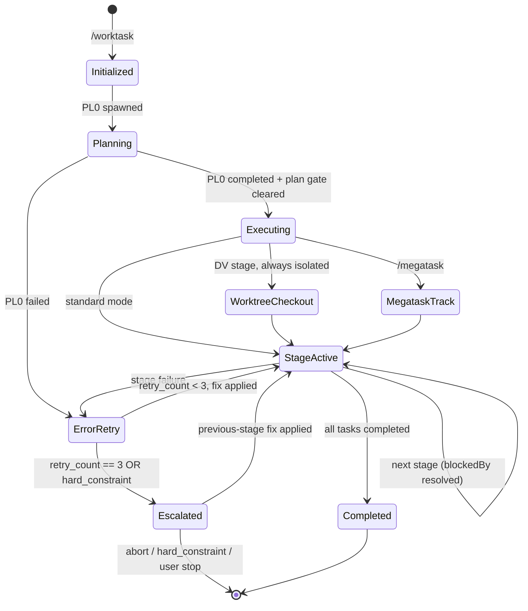
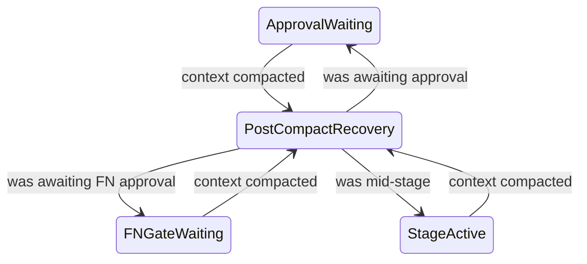

> **INVOCATION GATE**: reaching this file by a direct Read/Task/Grep instead of
> `Skill({skill:"corpflow:worktask"})` or `/worktask` violates the BLOCKING rule in
> `../shared/worktask-invocation.md § BLOCKING`. Do NOT silently continue — surface the error to
> the user, then restart through the canonical entry point.

# Worktask System

Single source of truth for task worktask management using the state ledger.

## Pipelines

```
9-stage:   PL → AR → TL → DV → DR → QA → DC → FN → ST
11-stage:  PL → AR → TL → DV → DR → SR → QA → DC → RE → FN → ST
                              ↑              ↑
                        Developer Review  Security Review (optional)
```

AR and TL are optional: AR is a tier default PL0 may override in either direction; TL runs only
when PL0 splits the work across ≥2 developers. Criteria canon:
`skills/estimation-methodology/SKILL.md § Stage Inclusion Criteria (PL0 authority)`.

### State Machine



#### Post-compact recovery states



#### State-machine references

Stage codes + invocation: `../shared/stage-codes.md`, `../shared/worktask-invocation.md`. State
ledger: `../shared/state-ledger.md`.

## Dynamic Worktask Sizing

PL0 assesses complexity and creates only the stages needed. No pre-creation or deletion — PL builds the task list from scratch.

### Complexity Assessment

| Factor | Low (0-2) | Medium (3-5) | High (6-10) |
|--------|-----------|--------------|-------------|
| **New patterns** | None | 1-2 new | 3+ new |
| **Integration points** | 1-2 | 3-5 | 6+ |
| **Cross-cutting concerns** | None | 1 area | Multiple |
| **Risk level** | Minimal | Moderate | High |
| **Documentation needs** | Inline | README | ADR + API docs |

**Scoring**: Sum factor scores (0-50 total)

### Decision Rules

| Score | Complexity | PL0 Creates |
|-------|------------|-------------|
| 0-10 | Low | DV0, DR0, QA0 |
| 11-20 | Medium | AR0*, DV0, DR0, QA0 |
| 21-30 | Moderate | AR0*, DV0, DR0, QA0 |
| 31-40 | High | AR0*, DV0, DR0, QA0, DC0, FN0, ST0 |
| 41-50 | Critical | AR0*, DV0, DR0, SR0, QA0, DC0, RE0, FN0, ST0 |

`AR0*` = tier default, PL0 may override in either direction. `+ TL0` only when PL0 splits the work
across ≥2 developers. Criteria canon: `skills/estimation-methodology/SKILL.md § Stage Inclusion
Criteria (PL0 authority)`.

#### Recording skipped and added stages

**Record both directions**: whenever the resolved stage set omits any stage of the full 9-stage
pipeline (`PL→AR→TL→DV→DR→QA→DC→FN→ST`), PL0 MUST stamp `metadata.skipped_stages` — a list of
`{ "stage": "<CODE>", "reason": "<short reason>" }` — and MUST stamp the symmetric
`metadata.added_stages` (identical shape) for every stage included beyond the tier default, so
`state.json` is self-documenting in both directions.

**Security-sensitive features** auto-include SR0:
- Authentication/authorization, payment processing, PII handling
- Cryptographic operations, external API secrets, file uploads

Each task includes `metadata.agent` for executor resolution. See `initialization-patterns.md § PL Creates Subsequent Tasks`.

#### Mid-run escalation — the orchestrator is the consumer

A stage may return `requests_stage_escalation` in its artifact `handoff:` frontmatter, and
**nothing else reads it**. At Step 6.5, after `Task()` returns and before the `completed` patch,
the orchestrator MUST: read the object; validate it against the four fire conditions, the
stage-validity list, and the structural caps — canonical in
`skills/estimation-methodology/SKILL.md § Mid-run re-sizing`, never restated here; on accept,
create the stage with `state-patch.sh --task-create` / `--task-block` and record `{stage, reason}`
in the existing `metadata.added_stages`; on reject, name the failed condition and continue the run
unchanged. **One accepted per run** — a second means the plan itself is wrong, so stop at the
human gate instead of growing the pipeline. ST0 audits `added_stages` for escalation entries.

## Workspace Mode

Megatask (per-issue) tickets run in isolated workspaces. `.context/` base by mode (resolve via `task.metadata.workspace_path` + `metadata.isolation`):

| Mode | `.context/` base |
|------|------------------|
| Standard | `.context/` (main checkout — orchestrator + non-isolated stages) |
| Worktree | `.worktrees/milestone-{N}/{issue#}/.context/` |

**WHEN in megatask per-issue/worktree mode, inside a Conductor workspace clone, or on any cwd↔workspace_path mismatch: Read `references/workspace-modes.md`** (detection snippet, Conductor sibling-repo rule, task-ID namespacing). Binding enforcement (workspace-root cross-check + `WORKSPACE_ROOT` banner injection) lives in `commands/worktask.md` Phase 2. Full megatask docs: `../megatask/SKILL.md`.

## Parallel Execution

### DC + QA Parallel (Default)

```bash
state-patch.sh --task-block DR0 --on DV0   # DR ← DV
state-patch.sh --task-block QA0 --on DR0   # QA ← DR
state-patch.sh --task-block DC0 --on DR0   # DC ← DR
state-patch.sh --task-block FN0 --on QA0,DC0   # FN ← QA AND DC
```

Use `--sequential` when DC requires test results.

### Monitor Tool Integration

`Monitor` streams events from background processes (build output, test progress, logs) instead of polling — available to any agent with Bash access. Persist raw stream output to `.context/logs/<kind>-<scope>-<timestamp>.log` per the `logging-conventions` skill.

### Never Parallelize

Rows apply only to stages present in the plan; a stage PL0 excluded imposes no ordering constraint.

- AR before PL (needs requirements)
- DV before TL (needs coordination)
- DR before DV (can't review unwritten code)
- QA before DR (DR must review code before QA tests)

## Error Handling

### Retry Logic

Each stage: max 3 retries, tracked in `metadata.retry_count`. Append one `## Retry N — <ts>` section per failure to `.context/errors/<agent>.md` (per-agent, append-only — `task-folder-organization` skill § Per-Agent Error Files) with problem, classification, root cause, attempted solutions. Raw stdout/stderr goes to `.context/logs/retry-<stage>-<ts>.log` per `logging-conventions`.

### Escalation Chains

```
11-stage: ST → FN → RE → DC → QA → SR → DR → DV → TL → AR → PL → USER
9-stage:  ST → FN → DC → QA → DR → DV → TL → AR → PL → USER
Emergency: FN → RE → QA → DR → DV → IR → USER
```

Stages absent from the plan drop out of the chain — escalation from DV goes to TL if TL ran, else
AR if AR ran, else PL.

## Rule Checks

| Rule | Required Before |
|------|-----------------|
| Test Strategy | PL → AR (when AR runs; else PL owns it) |
| Test Architecture | AR → TL when both run; AR → DV when TL is excluded (the default shape at every tier — see Stage Inclusion Criteria); PL → DV when AR is excluded too |
| Code Format | DV complete |
| Build Pass | DV → DR |
| Unit Tests Written + Pass | DV → DR |
| Developer Review Pass | DR → QA |
| All Tests Pass (Unit + Integration + E2E) | QA → DC |

## Optimization Hooks

### Pre-Stage

| Check | Threshold | Action |
|-------|-----------|--------|
| Context size | > 50% window (standard) or > 30% (1M window) | Compress previous stages |
| Budget usage | > 75% | Alert user |
| Free disk space | < 5 GB before a build stage (AR/DV/QA/SR/RE) | Halt with remediation — see § Pre-Stage Disk Guard |
| Free disk space | < 8 GB before a build stage | Warn; run `swift package clean` hygiene before delegating |

### Pre-Stage Disk Guard (ENOSPC)

Build stages — **AR, DV, QA, SR, RE** — accumulate `.build/` and DerivedData across runs, and an
exhausted filesystem kills the build harness mid-stage. Assert free space before delegating any of
the five. Canonical implementation: `scripts/state-patch.sh --disk-check <root>`; the snippet is
the spec.

```bash
MIN_GB="${DISK_MIN_GB:-5}"; WARN_GB="${DISK_WARN_GB:-8}"   # hard halt / hygiene warn
AVAIL_GB=$(df -Pg "${WORKSPACE_ROOT:-.}" 2>/dev/null | awk 'NR==2 {print $4+0}')
```

#### Disk guard — semantics

- **Hard halt** (`AVAIL_GB < MIN_GB`): audit `pre_stage_disk_halt result=blocked` with
  `metadata={"stage":"$CODE","avail_gb":…,"min_gb":…}`, print the remediation (`swift package
  clean`; `rm -rf ~/Library/Developer/Xcode/DerivedData/*`), do NOT delegate — a halted run is
  recoverable, an ENOSPC-killed harness is not.
- **Warn** (`AVAIL_GB < WARN_GB`): audit `pre_stage_disk_warn result=ok` with the same shape
  (`warn_gb` instead of `min_gb`), proceed, run `swift package clean` as pre-DV hygiene.
- `df -Pg` is POSIX-portable (macOS + Linux); unparseable output degrades to a no-op, so a
  measurement failure never blocks a run.

### Post-Stage

- Compress context for handoff (50-100 tokens)
- Log token usage in task metadata
- Validate artifacts created
- `PostCompact` hook fires after auto-compaction — use to re-inject critical worktask state

> Opus 5 / Sonnet 5 / Fable 5 carry a 1M context window; compress at stage boundaries anyway for cost efficiency.

## Pre-Stage Validation

Before executing any worktask stage, the orchestrator MUST validate:

### Validation checks 1–5

1. **Ledger check**: `.context/state.json` is `version: 2` and holds ≥1 `tasks{}` entry whose `metadata.worktask_id` matches this worktask
2. **PL0 exists**: a task with subject starting `PL0:`
3. **Stage tasks exist**: after PL0 completes, it created subsequent stage tasks (minimum DV0, DR0, QA0 at any complexity)
3b. **Inclusion decisions are reasoned**: every `metadata.skipped_stages` / `metadata.added_stages` entry carries a non-empty, decision-shaped `reason`; a bare score restatement or a missing reason fails
4. **Stage contract check**: upstream outputs match the next stage's Required Inputs per `shared/stage-contracts.md` (file exists + required sections present)
5. **Metadata schema check**: next task's metadata validates against `shared/state-ledger.md` § JSON Schema (non-PL tasks require `stage`, `agent`, `model`, `error_file`)

### Validation checks 6–7

6. **Model alias check**: `metadata.model ∈ {fable, opus, sonnet, haiku}` — reject unknown aliases before `Task()` delegation. Caveat: under a managed `availableModels` allowlist (it constrains subagent model overrides too) or `enforceAvailableModels`, a *valid* alias may silently resolve to a different model at dispatch — emit a `model_resolution_constrained` audit row when a managed allowlist is in effect; do NOT hard-block
6a. **Effort tier check**: `metadata.effort ∈ EFFORT_ENUM` (`scripts/effort-ladder.sh`), which `state-patch.sh` enforces at the write. Absent is NOT fatal — Step C.0a skips the stage (`resolver_skipped`/`effort_unstamped`), costing a round-trip rather than the run
7. **Workspace existence** (megatask per-issue/worktree mode only): `metadata.workspace_path` directory exists and `workspace.json` is readable

### Validation check 8

8. **Artifact path resolution** (non-blocking): resolve the upstream artifact for the next task's `metadata.run_index` via `stageArtifactPath()` below. Emit one `artifact_path_resolved` audit row with `result ∈ {ok, fallback_glob, miss}` and `metadata.resolved_path`. `miss` = upstream produced no artifact, handled by F3 in `references/handoff-protocol.md#fallback-paths` — warn but proceed. Catches run_index drift (PL0 ↔ stage-task off-by-one) before downstream stages burn tokens on fallback reads.

### Validation check 9

9. **Hook installation** (first stage only): either `.claude/hooks/state-merge.sh` exists and is executable, or the plugin's `plugin.json` registers the SubagentStop hook entry. Neither → warn `"⚠ state-merge.sh hook not installed — run hook-install.sh"`. Do NOT block — Step 6.5 provides Layer 3 coverage. See `references/initialization-patterns.md#hook-installation`.

### Validation check 10

10. **Branch naming** (first stage only, after the state.json seed and before seeding PL0): run `bash skills/worktask/scripts/branch-name.sh --goal "<concise imperative title>"` — the ONLY point in the pipeline a worktask branch is ever renamed (once-only rule, `skills/shared/git-conventions.md § Branch Naming`). **Unconditional**: the "already conventional" arm is a no-op, so always running it is free and is the only correct way to decide — never skip because the branch looks fine, never judge conventionality by eye (sole authority: `branch_is_conventional()`, queryable as `--check <name>`). A branch created outside the pipeline is covered by exactly this rule. Every outcome exits 0; the step self-disables under `/megatask`/`--emergency` routing.

### Validation check 10 — pass a title, preview freely

**Pass a title, never the raw task description**: the goal becomes a 48-character slug and the overflow is dropped silently, so a multi-sentence description ends mid-phrase (`commands/worktask.md § Step 3c — the input is a title`). Preview with `BRANCH_NAME_PRINT=1` — renames nothing, writes no audit row; `--check`/`--print-types`/`--print-target` are free for the same reason. The *planned* ledger name may later be refined once, without any git mutation (`commands/worktask.md § Step A.4b`).

### Validation check 10 — stamping and post-check

Capture **both** stdout key=value lines — `target_branch=<name>` (the name the PR head should carry) and the final `branch=<name>` (the local branch as it stands) — **verify the value matches `^[A-Za-z0-9._/-]+$` before stamping** (a failing value is stamped empty, not as-is), and stamp `facts.branch` on the ledger (the script never writes state.json — `references/handoff-protocol.md § branch`). **When `branch=` is empty or fails `--check` but `target_branch=` is non-empty, stamp the target** — the local name may be blocked from changing (upstream tracked, target exists) while the PR head is still ours to name.

### Validation check 10 — post-check and the host rule

Run the non-blocking post-check (`commands/worktask.md § Step 3c — post-check`): a stamped name failing `--check` emits one `branch_convention_check` warning row naming the actual and derived target, and never blocks planning. Invoking `/worktask` authorizes the rename against a host's no-rename session rule — never revert it, never re-ask (`references/workspace-modes.md § Host session authorization`).

### Validation check 11

11. **Dispatch-depth projection** (non-blocking): project the deepest dispatch chain the next stage will open against `CLAUDE_CODE_MAX_SUBAGENT_SPAWN_DEPTH` (default 3) — `/megatask`'s R1 projection applied per-stage instead of once per batch. `skills/megatask/SKILL.md § Nesting-depth budget` holds the canonical level table both must agree with:

```
projected_depth = orchestrator_offset      # 1 under /megatask (it spends a level), else 0
                + 1                        # the stage agent itself
                + 1 if that agent routes through a platform router
                + 1 if the router dispatches a Tier-2 specialist
headroom = cap - projected_depth
```

Emit one `dispatch_depth_projected` audit row with `metadata: {projected_depth, cap, headroom, chain}` — `chain` naming the agents level by level, so a later `dispatch_flattened` row can be read against the forecast.

### Validation check 11 — what warns, and what stays quiet

**Warn on the console only when `headroom < 0`.** At `headroom >= 0` the row is written and nothing prints. Deliberate: the canonical DV chain — session → `developer` (1) → platform router (2) → Tier-2 specialist (3) — lands on **exactly** the cap with zero headroom, so warning at `headroom == 0` would fire on every DV stage and teach the operator to skip the line that matters. The zero-headroom fact still reaches `metadata.headroom`, where incident review looks. A projection that does not compute `3` for that chain is wrong regardless of whether it prints.

#### Never blocks; forecast, not observation

A hard gate would fail that same legal chain (precedent: check 8's `artifact_path_resolved`, and `commands/megatask.md § R1 spawn-budget projections` — "warn-and-continue, never a hard gate"). When it warns, name megatask's two remediations: raise the env var, or flatten Tier-2 dispatch (`skills/megatask/SKILL.md § Depth remediations`). An unanticipated hop lands past the cap unseen by this check and is caught after the fact by the refused agent's own `dispatch_flattened` row (`agent-coordination § Depth-refusal self-report`) — complements, not redundancy.

### Validation check 12 — Routing resolution

12. **Routing resolution** (first stage only, after the state.json seed): read `CORPFLOW.md § Routing` at the project root, if present, and merge its `| Alias | Target |` rows over the defaults in `skills/shared/routing-matrix.md § Matrix`. Stamp the resolved map on the ledger as `state.routing: {"<alias>": "<plugin:agent>", …}` (only aliases that differ from the default need stamping; an absent map means all-default) plus `state.routing_source: "matrix" | "project-override"`. Emit one `routing_override` audit row per overridden alias, `metadata: {alias, default_target, override_target}`; when an entry alias is overridden but its platform's role aliases are not, add one `routing_override_partial` row. Stages resolve through `state.routing` first (`routing-matrix.md § Resolution`), so a mid-worktask edit of the project file never splits routing across stages. No `CORPFLOW.md` or no `## Routing` heading → all-default, no rows, no warning.

### On validation failure

- No tasks exist → not initialized. Re-run initialization (seed PL0)
- PL0 exists but no subsequent tasks → PL0 did not complete. Re-run PL0
- Tasks orphaned (no worktask_id) → log a warning, match by subject pattern
- Contract violation → do NOT transition. Append a `missing_input` entry to the next stage's `.context/errors/<agent>.md` and block.

## Orchestrator Execution Loop

> **This loop dispatches one `Task()` per ready stage in-process.** It runs the full pipeline from the
> PL0 precondition (below) through the FN gate (§ FN Gate), advancing stages as their `blockedBy`
> dependencies resolve.

> **Figma asset persistence is NOT an orchestrator step.** Screenshots are captured AND persisted to
> `.context/designs/` inside the PL turn (Phase 1) by the product-manager via its narrowly-scoped
> `Bash(curl:*)` grant, because `get_screenshot` returns a short-lived URL. NEVER add a post-PL0
> download step — it collides with the Phase-1 Bash prohibition in `commands/worktask.md` and races
> the expiring URL. See `skills/shared/figma-capture.md § Capture Workflow`.

### Cache-Friendly Prompt Layout & state.json (handoff-protocol)

Every delegation prompt is built in a **binding** order so consecutive `Task()` calls within one `worktask_id` share a byte-identical prefix and hit the prompt cache. Spec source: `references/handoff-protocol.md#cache-prefix`.

#### Preamble layout (binding)

```
[1] Plugin/agent contract reminder         ← stable across ALL stages (cacheable)
[2] Worktask header (id, plan, exploration)← stable across ALL stages (cacheable)
[3] state.json blob (inlined JSON)         ← evolves per stage
[4] Stage contract excerpt                 ← stable WITHIN stage type (cacheable)
─────── (cache prefix boundary) ───────
[5] task.description                       ← dynamic per delegation
[6] retry hints + gate remediation (if retry_count > 0) ← dynamic per delegation
[7] Stage-specific banners (DR Skill, FN Conductor, MCP fallback) ← SUFFIX, dynamic
```

#### Step 0 (NEW) — Read state.json before each delegation

```typescript
const stateRaw = fs.existsSync(".context/state.json")
  ? fs.readFileSync(".context/state.json", "utf8")
  : null;
// stateRaw goes inline into preamble section [3] as a fenced JSON code block.
// The ledger is mandatory: a null here is a hard failure, not a degraded mode.
```

#### Artifact path helper

Resolves the numbered artifact path with fallback:

```typescript
const ARTIFACT_BASE: Record<string, string> = {
  PL: "planning", AR: "architecture", TL: "coordination",
  DV: "development", DR: "developer-review", SR: "security-review",
  QA: "testing", DC: "documentation", RE: "release",
  FN: "complete-summary", ST: "retrospective", IR: "incident",
  ET: "ethics-review",
};
```

##### stageArtifactPath()

```typescript
// …continued: uses ARTIFACT_BASE above
function stageArtifactPath(code: string, runIndex: number): string {
  const base = ARTIFACT_BASE[code];
  const numbered = `.context/${base}-${runIndex}.md`;
  if (fs.existsSync(numbered)) return numbered;
  // Newest-glob fallback (covers out-of-band writes)
  const matches = glob.sync(`.context/${base}-*.md`).sort((a, b) => {
    const n = (f: string) => parseInt(f.match(/-([0-9]+)\.md$/)?.[1] ?? "0", 10);
    return n(a) - n(b);
  });
  if (matches.length > 0) return matches.pop()!;
  // No artifact on disk: return the canonical numbered path so the
  // caller's existence check surfaces the miss at the expected location.
  return numbered;
}
```

#### Step 6.5 — After Task() returns, enforce state.json patch (MANDATORY)

After every `Task()` return and BEFORE the `completed` patch, first read any
`requests_stage_escalation` in the artifact frontmatter (§ Mid-run escalation — the orchestrator
is the consumer), then run the three-layer check: Layer 1 (agent self-patch) → Layer 2
(`state-patch.sh --via step6_5`) → Layer 3 (F3 derivation). Code and semantics: loop § Step 6.5
below.

##### Completion signal (subagents run in the background by default)

> "`Task()` return" means the **completed stage result**, not the launch acknowledgement. Under background-default dispatch the orchestrator keeps its turn while the stage runs and receives the result as a completion notification. Run Step 6.5 (and the `completed` patch that follows) only once that notification — or the stage's `subagent_stopped` audit row — has arrived. NEVER fire Layer 3 (F3) while the stage's `agent_id` is still live in `claude agents --json`: F3 would stamp `completed` over a still-running stage. Errored returns propagate honestly — a rate-limit or API cut-off reports the error with any partial work preserved, never a successful-looking empty result: classify per `agent-coordination § Retry / Escalate Matrix` (`transient`) and do NOT run the completion patch.

###### Dispatch-tracking helpers (steps 6a/6.5 — write only cache section [3])

```typescript
// markDispatchStatus — dispatched_agents[] with the task_id entry flipped to `status`,
// optionally backfilling model_resolved. Replace-array semantics (jq `. * $patch` overwrites
// arrays). Absent entry → array unchanged (defensive).
function markDispatchStatus(state, taskId, status, modelResolved) {
  return (state.facts?.dispatched_agents ?? []).map(a =>
    a.task_id === taskId
      ? { ...a, status, ...(modelResolved ? { model_resolved: modelResolved } : {}) }
      : a);
}
// classifyError — map an errored Task() return onto the EXISTING retry taxonomy
// (agent-coordination § Retry / Escalate Matrix); no new vocabulary. Rate-limit / API
// cut-off = `transient`; other classes come from the artifact or return text.
// errorBasename — last ":"-segment of subagent_type (corpflow:developer → developer).
```

###### Banner relocation & cache-prefix hygiene

**Banner relocation (R3)**: stage-specific banners (DR Skill, FN Conductor, MCP fallback warning) are appended AFTER `full.description` (suffix), never prepended, so prefixes [1][2][3][4] stay byte-identical across stages and the cache prefix boundary stretches as far as possible.

The preamble assembler MUST exclude forbidden tokens from sections [1][2][4]: timestamps, per-call ENV expansions, random IDs, retry counters, file mtimes, agent names beyond `worktask_id`. `scripts/cache-lint.sh` asserts that byte-stability across consecutive stages of one `worktask_id`. CI runs it in `--self-test` mode on every PR (`.github/workflows/test.yml`); asserting a real captured prompt-log is still a manual run.

### CRITICAL: Delegation-Only Rule

The orchestrator NEVER writes implementation code. ALL stage work is delegated to stage agents via the Agent tool; Edit/Write on source files, running build commands, or marking a task completed without delegating are violations. Its job is the loop — read tasks, resolve agents, delegate, track status. Editing source code → STOP and delegate to the stage agent.

### PRECONDITION CHECK
Before entering this loop, verify:

#### Signals 1–3 (incl. 2b)

- **Signal 1 (ledger audit)**: `tasks.PL0` in `.context/state.json` has status `completed`. Missing or incomplete → STOP: worktask not initialized, or planning incomplete.

**Signal 2 (plan gate)**: `PL0.metadata.plan_gate` (default `"checkpoint"`).
- `"checkpoint"` (default): require BOTH PL0 `completed` AND an `approval_received` audit line with
  `subject:"PL<run_index>"` in `.context/logs/audit.jsonl` before loop entry. Line absent → STOP,
  return to `commands/worktask.md § Step A.5` to fulfil the gate.
- `"bypass"` (`--auto=[plan]` / `--emergency`, or stamped per-issue by the `/megatask` batch orchestrator): PL0 `completed` alone suffices, no approval line — except for Signal 2b escalated items, whose `approval_received` row is still required.

##### Signal 2b (decision gate)

`PL0.metadata.decision_gate` (default `"user"`) selects WHO answers PL0's `open_questions[]` at the
plan gate; `"auto"` (stamped by `--auto=[decision]`) routes them through the Fable-model
auto-decision pre-pass (`commands/worktask.md § Step A.4` is canon). Verify before loop entry: when
`decision_gate == "auto"` and `facts.open_questions[]` holds any `sw-PL<N>-*` item with
`status != "resolved"`, an `auto_decision_resolved` audit row with `subject:"PL<run_index>"` MUST
exist, and any `escalate` items MUST have an `approval_received` resolution — absent → STOP and
return to Step A.4. The
carrier bypasses neither `plan_gate` nor `fn_gate`.

##### Signal 3 (FN gate)

FN dispatch is gated mid-loop on `PL0.metadata.fn_gate` (default `"checkpoint"`): STOP immediately before the FN `Task()` delegation for finalization approval unless the carrier is `"bypass"` (`--auto=[finalization]` / `--emergency`, or stamped per-issue by the `/megatask` batch orchestrator). See loop step 4.9 and § FN Gate.

#### After PL0 — steps 1–3

After PL0 completes and creates stage tasks, the orchestrator MUST:

1. **Present PL0 results** to the user: complexity score, stages created (with agents), dependency chain, key planning decisions (at the Step A.5 plan gate; on a `checkpoint` gate execution proceeds only after approval).
2. **Re-validate before executing**: re-read `tasks{}`; verify `metadata.agent` and `metadata.model` are set on each. This re-grounds the orchestrator in the delegation rules before any stage runs.
3. **Publish plan to GitHub** (before stage loop). Run:

##### Step 3 — publish snippet

     ```bash
     PLUGIN_ROOT="${CLAUDE_PLUGIN_ROOT}"  # CC substitutes on load; if empty resolve per skills/shared/plugin-root-resolution.md
     [ -d "$PLUGIN_ROOT" ] || PLUGIN_ROOT="<plugin-root>"
     HELPER="$PLUGIN_ROOT/skills/worktask/scripts/publish-pl-issue.sh"
     if [ -f "$HELPER" ]; then
       bash "$HELPER"; true
     ```

##### Step 3 — publish fallback (helper_not_found)

     ```bash
     # …continued: helper missing → audit one deferred github_issue_created row
     else
       LOG_DIR="${WORKSPACE_ROOT:-${CLAUDE_PROJECT_DIR:-.}}/.context/logs"
       mkdir -p "$LOG_DIR"
       STATE_FILE="${WORKSPACE_ROOT:-${CLAUDE_PROJECT_DIR:-.}}/.context/state.json"
       jq -cn --arg ts "$(date -u +%FT%TZ)" --arg dk "$(jq -r '.worktask_id // "unknown"' "$STATE_FILE" 2>/dev/null || echo unknown):$(jq -r '.run_index // 0' "$STATE_FILE" 2>/dev/null || echo 0):gh_issue" \
         '{ts:$ts, actor:"orchestrator", action:"github_issue_created", subject:"PL0", result:"deferred", task_id:"1", metadata:{via:"publish-pl-issue.sh", reason:"helper_not_found", dedupe_key:$dk}}' \
         >> "$LOG_DIR/audit.jsonl"; true
     fi
     ```

##### Step 3 — non-blocking & skip rules

     The trailing `; true` masks the helper's exit code — a helper failure (catastrophic exit 1, deferred exit 0, network error) MUST NEVER propagate as orchestrator failure. Skip the step entirely when `--no-gh-issue` was supplied (PL0 stamps `task.metadata.no_gh_issue: true`; the helper also short-circuits internally). The helper self-gates the rest: megatask per-issue mode skips every `gh` call, and a second-or-later run in the same `.context/` comments instead of opening a duplicate. Semantics, sanitiser rules and the non-blocking guarantee: § PL Issue Publish.

#### Steps 1–3

```typescript
// 1. Read the ledger — tasks{} keyed by stage id (PL0, DV0, DV1…).
let state = JSON.parse(fs.readFileSync(".context/state.json", "utf8"));
if (state.version !== 2) throw new Error(`state.json version ${state.version}; expected 2`);
let tasks = Object.entries(state.tasks).map(([id, t]) => ({ id, ...t }));
```

##### HANDOFF_SCHEMA

```typescript
// Typed-return schemas — SSOT: references/handoff-protocol.md#handoff-schemas.
// Read that SSOT ONCE at loop entry and materialize all 13 entries VERBATIM, keyed by stage code:
//   const HANDOFF_SCHEMA: Record<string, object> = { PL: {…PLHandoff}, AR: …, TL, DV, DR, SR,
//                                                    QA, DC, RE, FN, ST, IR, ET };
// A missing key leaves stageSchema undefined → schema param omitted → today's frontmatter path.
```

##### Steps 2–3 — completion loop & ready filter

```typescript
// 2. Loop until every task has settled ("skipped" is terminal, like "completed")
const SETTLED = new Set(["completed", "skipped"]);
while (tasks.some(t => !SETTLED.has(t.status))) {
  // 3. Find unblocked pending tasks
  const ready = tasks.filter(t =>
    t.status === "pending" &&
    (t.blocked_by ?? []).every(dep => SETTLED.has(state.tasks[dep]?.status))
  );

  for (const task of ready) {
```

#### Step 4.0

```typescript
    // 4.0. Re-read the live ledger every iteration — dispatched_agents[], last_error and
    //      facts.capabilities evolve per stage. state.json is ≤500 tokens; an unreadable
    //      ledger is a hard failure, never a degraded mode.
    state = JSON.parse(fs.readFileSync(".context/state.json", "utf8"));

    // 4. Full task details come from the ledger entry itself.
    const full = state.tasks[task.id];
    const agentType = full.metadata.agent;
    const model = full.metadata.model;
```

##### Agent-type resolution

```typescript
    // bare → "corpflow:<name>"; "plugin:name" → as-is; 3-part "a:b:c" → UNSUPPORTED, throw.
    //   .context/errors/<basename>.md basename = the last `:`-segment. Depth never legitimizes
    //   a 3-part name, and CC rejects `:` in an agent file's own frontmatter `name:` — the
    //   qualified form exists only at the call site, never in the file.
    const colonCount = (agentType.match(/:/g) ?? []).length;
    if (colonCount > 1) {
      throw new Error(`Invalid agent reference '${agentType}': only bare or plugin-qualified names supported.`);
    }
    const subagentType = colonCount === 1 ? agentType : `corpflow:${agentType}`;
```

#### Step 4.5

```typescript
    // 4.5. Soft context_refs validation — warn, don't abort: low-complexity worktasks
    //      legitimately skip upstream stages, and error_file absence on the first
    //      attempt (retry_count === 0) is expected, not a warning.
    if (full.metadata.context_refs) {
      const listed = JSON.parse(full.metadata.context_refs)
        .map(r => r.split('#')[0].trim());
      const retryCount = full.metadata.retry_count ?? 0;
      const missing = listed.filter(p =>
        !fs.existsSync(p.startsWith('.context/') ? p : `.context/${p}`) &&
        !(p === full.metadata.error_file && retryCount === 0)
      );
      if (missing.length > 0) {
        full.description =
          `NOTE: Expected context files missing: ${missing.join(', ')}. ` +
          `Proceed using what is available; do not fabricate content.\n\n` +
          full.description;
      }
    }
```

#### Step 4.6-pre

```typescript
    // 4.6-pre. last_error hint — on a retry, prepend one line summarizing the prior errored
    //          return (class + partial + ref) so the re-dispatch targets the recorded failure
    //          instead of re-inferring it. Reads tasks.<ID>.last_error written by Step 6.5a.
    if ((full.metadata.retry_count ?? 0) > 0) {
      const le = state.tasks?.[task.id]?.last_error;
      if (le) {
        full.description =
          `PRIOR ERROR (class=${le.class}` +
          `${le.partial ? ", partial work preserved" : ""}` +
          `${le.ref ? `, see ${le.ref}` : ""}). Resume/repair from that point.\n\n` +
          full.description;
      }
    }

```

#### Prompt-injection steps 4.6–4.8b — shared rules

These steps mutate ONLY `full.description`: remediation/resume blocks are PREPENDED (dynamic
section [6]), enforcement banners APPENDED (suffix [7]) — cache prefix [1][2][4] is never touched.
Each fires one `appendAudit` row, and that row is what makes the injection observable: its absence
for a dispatch proves the loop was bypassed. Readers (DR, TL) surface a missing row as an
**advisory** finding, never a hard fail — the orchestrator writes it, so a stale version-keyed
plugin cache serving an older loop would otherwise block a blameless DV. The banners exist because
prose loses to the dispatch surface: every rule here already lived in an agent file and was still
violated until it was injected at dispatch.

#### Step 4.6

```typescript
    // 4.6. Gate-feedback injection — DR→DV / QA→DV loop-back. A prior DR `verdict:fail` /
    //      QA `verdict:no-go` re-dispatches DV (run_index bumped, retry_count++) carrying the
    //      upstream remediation VERBATIM. Source for N = the failing upstream run_index:
    //      `.context/developer-review-N.md` (DRHandoff.blockers[]) and/or `.context/testing-N.md`
    //      (QAHandoff.blocking_defects[]). Hook surface: hookSpecificOutput.additionalContext —
    //      skills/agent-coordination/references/hook-monitoring.md §"Gate-feedback contract".
```

##### Step 4.6 — remediation injection & audit

```typescript
    if (full.metadata.stage === "DV" && (full.metadata.retry_count ?? 0) > 0) {
      const fromStage = full.metadata.gate_from_stage;    // "DR" | "QA" (set by the loop-back)
      const blockers = full.metadata.gate_blockers ?? []; // blockers[] | blocking_defects[]
      if (fromStage && blockers.length > 0) {
        full.description =
          `REMEDIATION (from ${fromStage} gate — fix these specific findings before re-stop):\n` +
          blockers.map((b, i) => `  ${i + 1}. ${b}`).join("\n") + "\n\n" + full.description;
        appendAudit({ actor: "orchestrator", action: "gate_remediation_injected",
                      subject: full.metadata.stage, result: "ok",
                      metadata: { from_stage: fromStage, to_stage: "DV", count: blockers.length } });
      }
    }
```

#### Step 4.7

```typescript
    // 4.7. DV checkpoint resume — a budget-exhausted DV run left a partial development-N.md
    //      (+ `## Blockers`) and completed sub-batches at tasks.DV0.progress
    //      (agents/developer.md § Budget-Aware Checkpointing). Carry it forward so the re-run
    //      resumes from next_batch instead of redoing applied work.
```

##### Step 4.7 — resume injection & audit

```typescript
    if (full.metadata.stage === "DV") {
      const dvProgress = state.tasks?.[task.id]?.progress;  // {completed_batches, next_batch, updated_at}
      if (dvProgress && (dvProgress.completed_batches?.length ?? 0) > 0) {
        full.description =
          `RESUME (DV checkpoint — prior run completed batches ` +
          `[${dvProgress.completed_batches.join(", ")}]; resume from ` +
          `${dvProgress.next_batch ?? "the next pending batch"}). Do NOT redo applied ` +
          `batches — read the partial development-N.md and continue forward.` +
          "\n\n" + full.description;
        appendAudit({ actor: "orchestrator", action: "dv_checkpoint_resume", subject: "DV",
                      result: "ok",
                      metadata: { completed: dvProgress.completed_batches,
                                  next_batch: dvProgress.next_batch ?? null } });
      }
    }
```

#### Step 4.8

Two banners, because isolation and assignment are two claims: a stale worktree of a *different*
clone is perfectly isolated, satisfies D0.0, and still cannot receive a single edit.
`dv-tree-preflight.sh` exists for exactly that case.

```typescript
    // 4.8. DV worktree-isolation enforcement — isolation is ALWAYS expected: every DV stage
    //      runs in an isolated worktree before writing files (agents/developer.md § D0.0), so
    //      the agent confirms isolation, creates a worktree, or flags the deviation and returns
    //      instead of silently editing the shared checkout. DR rejects a DV handoff carrying
    //      `worktree:false` absent an explicit waiver (`worktree_isolation_waived` audit /
    //      task.metadata.worktree_waived).
```

##### Step 4.8 — isolation banner

```typescript
    if (full.metadata.stage === "DV") {
      const enforce =
        `WORKTREE ISOLATION REQUIRED (always): ` +
        `confirm you are in an isolated worktree before any Edit/Write (D0.0). ` +
        `If not, EnterWorktree and proceed, or flag worktree_isolation_missing and ` +
        `return verdict:blocked. Set handoff frontmatter \`worktree: true\` (false is a hard DR fail).`;
      full.description = full.description + "\n\n" + enforce;
```

##### Step 4.8 — assigned-tree banner & audit

```typescript
      // …continued: step 4.8 body
      const assigned = state.metadata?.workspace_path ?? full.metadata.workspace_path;
      const assertTree =
        `ASSIGNED TREE REQUIRED: before your first Edit/Write run ` +
        `\`bash skills/worktask/scripts/dv-tree-preflight.sh --assigned "$WORKSPACE_ROOT"\` ` +
        `(WORKSPACE_ROOT = ${assigned ?? "the banner value below"}). ` +
        `Exit 1 is BLOCKING: do not edit, log workspace_path_mismatch, return verdict:blocked ` +
        `quoting both paths it printed. Warnings are advisory. Isolation (above) is a different ` +
        `claim — a stale worktree passes it and is still the wrong tree.`;
      full.description = full.description + "\n\n" + assertTree;
      appendAudit({ actor: "orchestrator", action: "dv_worktree_enforced", subject: "DV",
                    result: "ok", metadata: { isolation: "worktree" } });
    }
```

#### Step 4.8a

```typescript
    // 4.8a. DV test-scope enforcement — DV-only, never QA (QA's full-suite run IS the sanctioned
    //       regression gate, agents/qa-engineer.md § Q1 Three-Mode Dispatcher).
    if (full.metadata.stage === "DV") {
      const mode = full.metadata.test_mode ?? state.metadata?.test_mode ?? "scoped";
      const scope =
        `TEST SCOPE (mode: ${mode}): run ONLY \`Executed Tests (DV)\` per ` +
        `agents/developer.md D2. DO NOT re-run the full suite to reverify a fix between ` +
        `iterations — full-suite regression is QA's gate, not DV's. Apple test identifiers ` +
        `are suite-terminal (\`-only-testing:<Target>/<Suite>\`); per-function identifiers ` +
        `are forbidden — they select nothing and degrade to a full run. Record the resolved ` +
        `mode in \`development-N.md § Decisions\`.`;
```

##### Step 4.8a — inject & audit

```typescript
      // …continued: step 4.8a body
      full.description = full.description + "\n\n" + scope;
      appendAudit({ actor: "orchestrator", action: "dv_test_scope_enforced", subject: "DV",
                    result: "ok", metadata: { test_mode: mode } });
    }
```

#### Step 4.8b

```typescript
    // 4.8b. Stage test-execution ban — every stage NOT in {DV, QA}, which are exempt because
    //       they hold execution authority (scoped/full). Canon:
    //       skills/shared/testing-strategy.md § Test-Execution Authority. This banner teaches
    //       (a blocked agent sees the rule instead of retrying); hooks/test-execution-gate.sh
    //       is the mechanical backstop and the ONLY layer covering a nested delegate's leaf
    //       Bash call and the orchestrator's own shell.
```

##### Step 4.8b — ban banner & audit

```typescript
    if (full.metadata.stage !== "DV" && full.metadata.stage !== "QA") {
      const ban =
        `NO TEST EXECUTION at this stage (${full.metadata.stage}): authority is stage-scoped, ` +
        `see \`skills/shared/testing-strategy.md § Test-Execution Authority\`. Build-only ` +
        `verification (\`/<plugin>:build-test --no-test\`) stays permitted. Need runtime ` +
        `evidence → record \`requests_test_evidence: <what and why>\` in this stage's artifact ` +
        `(non-blocking) or return \`verdict: blocked\` + \`error_escalated_to: "DV"\` (blocking, ` +
        `existing error-handling loop — no new machinery).`;
      full.description = full.description + "\n\n" + ban;
      appendAudit({ actor: "orchestrator", action: "stage_test_ban_enforced",
                    subject: full.metadata.stage, result: "ok",
                    metadata: { stage: full.metadata.stage } });
    }
```

#### Step 4.9

```typescript
    // 4.9. FN gate — PL0.metadata.fn_gate (default "checkpoint"). The gate sits BEFORE the FN
    //      Task() delegation so nothing remote happens pre-approval. N = state.json.run_index
    //      (default 0). § FN Gate below; Read references/fn-gate.md at FN time for the procedure.
    if (full.metadata.stage === "FN") {
      const fnGate = pl0.metadata.fn_gate ?? "checkpoint";
      const N = state.run_index ?? 0;
      // (a) Run the Pre-gate Conductor-attachments writer (checkpoint path only;
      //     references/fn-gate.md § Pre-gate Conductor-attachments writer) — local writes only.
      //     The bypass path falls through to FN-agent Writer 2 inside the FN stage.
```

##### Step 4.9 — sweep collection and classification (a1)(a2)

```typescript
      // …continued: step 4.9, after (a)
      // (a1) Collect the closing elicitation sweep: read facts.open_questions[] and keep the
      //      class-bearing items whose status != "resolved". Status is the WHOLE filter —
      //      items answered at their own boundary (step 6.6) or at the plan gate are already
      //      resolved. Never filter on stage: under blocks_next_stage any stage can be
      //      answered at its own boundary. Resolve each item's `ref` anchor to its full
      //      options[] body. Stage comes from the id's pinned sw-<TASK_ID>-<n> prefix and is
      //      used for GROUPING only; an explicit `stage` field wins when present, but it is
      //      optional, so never require it.
```

##### Step 4.9 — classify, then auto-answer (a2)

```typescript
      // …continued: step 4.9, after (a1)
      // (a2) Classify, then auto-answer. The raise-only guard runs FIRST, on every item
      //      (commands/worktask.md § Escalation guard — raise-only self-labels); only then,
      //      and only when decision_gate == "auto", does the Fable delegate answer the
      //      effective-decision items. No item reaches the delegate un-reclassified.
```

##### Step 4.9 — checkpoint and bypass paths

```typescript
      if (fnGate === "checkpoint") {
        // (b) fn_gate_waiting subject:"FN<N>".
        appendAudit({ actor: "orchestrator", action: "fn_gate_waiting",
                      subject: `FN${N}`, result: "ok" });
        // (c) Present the pre-FN summary: branch, resolved base branch, commit type,
        //     changed-file count, DR/QA verdicts, PR target + Closes #<issue>.
```

##### Step 4.9 — sweep render, then the unmoved STOP (c+)(d)

```typescript
      // …continued: step 4.9 checkpoint arm, after (c)
        // (c+) Render the collected sweep, grouped by originating stage, in AskUserQuestion
        //      calls of <=4 questions each (the tool's per-call ceiling). These PRECEDE the
        //      approve/reject call below and never merge into it: merging would overflow at
        //      4+ items and entangle sweep answers with the gate's reject/resume path.
        //      Question text comes from the resolved ref anchor body, not the stub (which
        //      carries no summary). Record each answer into the item itself — status =
        //      "resolved" plus resolution = "<answer>" — and append a sweep_resolved audit
        //      row (subject: `FN<N>`). NOT facts.decisions[] — stage-contracts.md
        //      § Closing Elicitation Sweep states why that destination is refused.
```

##### Step 4.9 — the approve/reject STOP (d), unmoved

```typescript
      // …continued: step 4.9 checkpoint arm, after (c+)
        // (d) AskUserQuestion: approve → append `approval_received subject:"FN<N>"` and fall
        //     through to delegate FN. Reject → append `approval_rejected subject:"FN<N>"`,
        //     result:"rejected", and STOP (do NOT delegate FN); surface the feedback, then
        //     resume per § FN gate rejection — resume path (fix routed to its owning stage,
        //     run_index frozen, this gate re-presented on completion).
```

##### Step 4.9 — bypass path

```typescript
      // …continued: step 4.9 else-arm
      } else {  // "bypass" — --auto=[finalization] / --emergency, or per-issue by /megatask
        // (e0) Record-only sweep: audit `sweep_recorded` for the collected items and, for any
        //      effective-escalate item, `sweep_escalation_unprompted`. NEVER prompt here —
        //      recording never stops, only prompting does.
        // (e) fn_gate_bypass, then delegate FN unattended (commit/push/PR).
        appendAudit({ actor: "orchestrator", action: "fn_gate_bypass",
                      subject: `FN${N}`, result: "ok", reason: "unattended" });
      }
    }
```

#### Steps 5–5a

```typescript
    // 5. Mark in_progress. hooks/test-execution-gate.sh resolves the acting stage from this one
    //    write (never agent_type or an env var, so nested delegates inherit it).
    sh(`state-patch.sh --task-status ${task.id} in_progress`);

    // 5a. Embedded commands (DV) — PREPEND the Skill invocation when the worktask carries
    //     embedded_commands metadata.
    if (full.metadata.stage === "DV" && worktask_embedded_commands) {
      const skillInvocation = `IMPORTANT: Before implementing, invoke the embedded command via Skill tool: Skill("${embedded_cmd}", args="${embedded_args}")`;
      full.description = skillInvocation + "\n\n" + full.description;
    }
```

#### Step 5b

```typescript
    // 5b. tech-code-review invocation (DR) — APPENDED as suffix [7] so the prefix
    //     [1][2][3][4][5] stays byte-identical with neighbour stages. The review is a
    //     COMMAND, not a skill: there is no skills/tech-code-review/ to invoke, so name
    //     the file and let the stage read it.
    if (full.metadata.stage === "DR") {
      const runIndex = full.metadata.run_index ?? 0;
      const reviewInvocation = `IMPORTANT: Execute developer code review per commands/tech-code-review.md (plugin-root-relative). Save findings summary to .context/developer-review-${runIndex}.md`;
      full.description = full.description + "\n\n" + reviewInvocation;
    }
```

#### Step 5c — no platform warm-up

Nothing to warm: corpflow holds no platform build/test grants — DV/DR/QA delegate to `/<plugin>:build-test` and each plugin owns its toolchain lifecycle (§ Platform tooling ownership).

#### Step 5d

```typescript
    // 5d. Conductor-attachments for FN stages — project-manager always creates .context/attachments/
    //     files regardless of PL0's FN-task wording. Mirrors 5b; templates: references/conductor-attachments.md
    if (full.metadata.stage === "FN") {
      const fnInjection = [
        "IMPORTANT — Conductor attachments (FN-stage requirement, non-optional):",
        "Before running `gh pr create`, write both files per",
        "`skills/worktask/references/conductor-attachments.md`:",
        "  • `.context/attachments/PR instructions.md`",
        "  • `.context/attachments/Review request.md`",
        "Run `mkdir -p .context/attachments` first.",
        "Also write `.context/complete-summary-N.md` (worktask summary + Stage Timings; N = task.metadata.run_index).",
        "Then read `PR instructions.md` and follow it as the PR-creation script.",
      ].join("\n");
      full.description = full.description + "\n\n" + fnInjection;
    }

```

#### Step 5e

```typescript
    // 5e. Permission-Mode Pinning — when PL0 set `permission_mode: "default"` (typically SR/FN
    //     under --secure/--full), NEVER propagate --dangerously-skip-permissions into this
    //     stage's descendant Task()/Bash calls, and audit the boundary. Subagents natively
    //     inherit the parent session's mode (Task()'s deprecated `mode` param is ignored), so
    //     pinning = not widening the inherited mode and the row records that it held. See
    //     skills/agent-coordination/references/headless-dispatch.md § Permission-Mode Pinning.
    if (full.metadata.permission_mode === "default") {
      appendAudit({ action: "permission_mode_pinned", subject: task.id, result: "ok",
                    metadata: { stage: full.metadata.stage, mode: "default" } });
    }
```

#### Step 6 — typed-schema dispatch (P0-1)

```typescript
    // 6. Delegate to the stage agent. Pass the stage's `<CODE>Handoff` schema
    //     (references/handoff-protocol.md#handoff-schemas) as a Task() ARGUMENT. When the runtime
    //     honors it, the validated typed return maps onto state.json via
    //     `handoff-protocol.md#schema-to-state-map` and SUPERSEDES the post-hoc frontmatter grep
    //     (stage-contracts.md § Validation Protocol step 2 + Step 6.5 below).
```

##### Step 6 — degrade path & cache-prefix (binding)

```typescript
    //     STRICT-SUPERSET / DEGRADE (binding): `schema` is OPTIONAL on the wire. If the runtime
    //     Task() primitive does not accept it, behavior degrades to EXACTLY today's — the agent
    //     still writes its artifact with `handoff:` frontmatter, the Step-6.5 scrape runs, F3
    //     remains the fallback; no migration, no breakage. Artifact + frontmatter are ALWAYS
    //     written either way (durability/compression + F4 source); the typed return never
    //     replaces them. Structured-output dispatch is reliable: no indefinite StructuredOutput
    //     re-call after success, and schema-validation failures abort after 5 attempts.
    //     CACHE-PREFIX (binding, PRESERVE §4.1): `schema` is a Task() ARGUMENT, NOT preamble text
    //     — never in [1][2][4] nor in `full.description` — so byte-identity of the cacheable
    //     prefix is untouched and no per-call varying token enters it.
```

##### Step 5f — model resolution

```typescript
    // 5f. Model resolution — consult facts.capabilities BEFORE a fable-tier dispatch. Fable 5
    //     dispatch fails hard without 1M credits (model-selection.md); a prior hard-fail is
    //     cached there, so skip re-hitting it and fall back to "opus" (Opus 5: 1M, ungated),
    //     recording model_requested/model_resolved on the dispatch entry below.
    const modelRequested = model;
    let effectiveModel = model;
    if (model === "fable" && state.facts?.capabilities?.fable_dispatch === "credit_blocked") {
      effectiveModel = "opus";
      appendAudit({ actor: "orchestrator", action: "model_resolution_constrained",
                    subject: task.id, result: "ok",
                    metadata: { requested: "fable", resolved: "opus", reason: "capabilities.fable_dispatch=credit_blocked" } });
    }
```

##### Step 6 — Task() dispatch

```typescript
    const stageSchema = HANDOFF_SCHEMA[full.metadata.stage];  // from handoff-protocol.md#handoff-schemas; may be undefined
    const launchAck = Task({
      subagent_type: subagentType,
      model: effectiveModel,
      prompt: full.description,
      ...(stageSchema ? { schema: stageSchema } : {}),  // omitted entirely when the runtime lacks schema support → exactly today's path
    });

```

#### Step 6a

```typescript
    // 6a. dispatched_agents[] — record/replace the entry keyed by task_id; writer = orchestrator
    //     ONLY. status:"launched" now, flipped to completed/failed by Step 6.5. No dispatch
    //     timestamp (no consumer). agent_id/name populated when the runtime surfaces them
    //     (bg-default launch-ack; named spawns via metadata.spawn_name). Read by resume.md
    //     step 0. Cache section [3].
    if (fs.existsSync(".context/state.json")) {
      const entry = {
        stage: full.metadata.stage,
        task_id: task.id,
        subagent_type: subagentType,
        ...(launchAck?.agent_id ? { agent_id: launchAck.agent_id } : {}),
        ...(full.metadata.spawn_name ? { name: full.metadata.spawn_name } : {}),
        model_requested: modelRequested,
        ...(effectiveModel !== modelRequested ? { model_resolved: effectiveModel } : {}),
        status: "launched",
      };
```

##### Step 6a — replace-array merge

```typescript
      // Replace any prior entry for this task_id (re-dispatch); history stays in audit.jsonl.
      // dispatched_agents is a REPLACE-array: jq `. * $patch` overwrites arrays (deep-merges
      // only objects), so this swaps in the filtered+appended list. See handoff-protocol.md#atomic-write.
      atomicMergeStateJson({
        facts: {
          dispatched_agents:
            [...(state.facts?.dispatched_agents ?? []).filter(a => a.task_id !== task.id), entry],
        },
      });
    }

```

#### Step 6.5

```typescript
    // 6.5-pre. Read handoff.requests_stage_escalation from the artifact frontmatter BEFORE any
    //          completed stamp lands (Layer 2/3 below patch unconditionally) — validate, then
    //          accept (--task-create/--task-block + metadata.added_stages) or reject naming the
    //          failed condition. Semantics: § Mid-run escalation — the orchestrator is the consumer.
    // 6.5. Patch state.json from artifact frontmatter if the agent didn't — layer #3 after the
    //      in-agent atomic write and the optional SubagentStop hook.
    //      See handoff-protocol.md#fallback-paths F2/F3.
    if (fs.existsSync(".context/state.json")) {
      const post = JSON.parse(fs.readFileSync(".context/state.json", "utf8"));
      const code = full.metadata.stage;

```

##### Step 6.5a — errored return

```typescript
      // 6.5a. Errored return (errors propagate with partial work): classify per
      //       agent-coordination § Retry / Escalate Matrix, write tasks.<ID>.last_error, flip the
      //       dispatch entry to "failed", route to the retry matrix — never the completion patch.
      if (launchAck?.result === "error" || launchAck?.errored) {
        const cls = classifyError(launchAck);  // existing taxonomy, no new vocabulary
        const runIndex = full.metadata.run_index ?? 0;
        const stateForFailed = JSON.parse(fs.readFileSync(".context/state.json", "utf8"));
```

##### Step 6.5a — last_error patch

```typescript
        // …continued: step 6.5a body
        atomicMergeStateJson({
          tasks: {
            [task.id]: {
              last_error: {
                class: cls,                              // transient|logic|missing_input|…|exhausted
                partial: Boolean(launchAck?.partial),    // partial work preserved
                at: new Date().toISOString(),
                ref: `.context/errors/${errorBasename(subagentType)}.md#retry-${runIndex}`,
              },
            },
          },
          facts: {
            dispatched_agents: markDispatchStatus(stateForFailed, task.id, "failed"),
          },
        });
        routeToRetryMatrix(code, cls);  // never falls through to completion
        continue;
      }

```

##### Step 6.5a2 — why a mid-stage yield needs its own arm

An agent that yields mid-sentence with budget remaining has **not** errored, so 6.5a does not fire
and control falls through to Layer 3, whose fallback hard-codes `status:"completed", verdict:"ok"`
over a stage that never finished — corrupting the ledger in the one direction nothing downstream
re-checks. This arm keys on *evidence* (artifact absent, or present with no `handoff.verdict`),
never on the shape of the return message, so a normally-completed stage still takes Layer 2.

##### Step 6.5a2 — incomplete return (mid-stage yield)

```typescript
      // 6.5a2. The stage yielded without finishing its handoff. Precondition — the agent is NOT
      //        live (Step 6.5's liveness rule forbids this block while agent_id is live).
      const incArtifact = stageArtifactPath(code, full.metadata.run_index ?? 0);
      const incHandoff = fs.existsSync(incArtifact) ? parseFrontmatter(incArtifact) : null;
      const selfPatched = post.tasks?.[task.id]?.status === "completed"
                          && Boolean(post.tasks[task.id].verdict);
      // Incomplete even WITH a verdict: a maxTurns stop can land after the frontmatter is
      // written. Field name unconfirmed — read defensively, re-check at the next /cc-update.
      const maxTurnsPartial = Boolean(launchAck?.partial);
      const incomplete = maxTurnsPartial || (!selfPatched && !incHandoff?.verdict);
```

##### Step 6.5a2 — mark & audit

```typescript
      // …continued: step 6.5a2 body
      if (incomplete) {
        atomicMergeStateJson({ tasks: { [task.id]: { status: "in_progress" } } });
        appendAudit({
          actor: "orchestrator", action: "stage_returned_incomplete", subject: code,
          result: "blocked",
          metadata: {
            artifact: incArtifact,
            artifact_present: fs.existsSync(incArtifact),
            reason: maxTurnsPartial ? "max_turns_partial"
                    : fs.existsSync(incArtifact) ? "handoff_verdict_missing" : "artifact_absent",
          },
        });
```

##### Step 6.5a2 — resume, never re-delegate

The agent holds the half-done work; a fresh dispatch would redo it against a tree it already
edited. Same branch as a parked agent in `references/resume.md § State → Action Table`.

```typescript
        // …continued: step 6.5a2 body
        SendMessage({ to: dispatchEntry(state, task.id).agent_id ?? subagentType,
                      message: `Stage ${code} returned without a completed handoff. Finish the work, write ${incArtifact} with a handoff verdict, and return. Do not restart from scratch.` });
        continue;   // never falls through to the completion patch
      }
```

##### Step 6.5a3 — why a cross-session ask needs its own arm

A stage that needs another **session's** answer cannot get it: a subagent's `SendMessage` to a
session delivers the reply into the *parent* conversation, so a stage agent that sent its own ask
would wait for something that structurally never arrives. The stage therefore returns
`verdict:"blocked"` naming who to ask and what, and the orchestrator — which *is* the session that
receives the reply — sends on its behalf. Without this arm the return reads as an ordinary blocked
verdict and burns a retry on a stage that never failed.

##### Step 6.5a3 — cross-session ask (blocked-on-peer return)

```typescript
      // …continued: after the 6.5a2 block
      const ask = incHandoff?.cross_session_ask;
      if (!incomplete && incHandoff?.verdict === "blocked" && ask) {
        atomicMergeStateJson({ tasks: { [task.id]: { status: "in_progress" } } });
        // notify_when_idle: one-shot wake instead of polling `claude agents --json`.
        // Same-machine peers only; a remote peer simply never wakes us and the row stays deferred.
        SendMessage({ to: ask.to, notify_when_idle: true, message: ask.question });
        appendAudit({
          actor: "orchestrator", action: "cross_session_ask", subject: task.id,
          result: "deferred",
          metadata: { to: ask.to, question: ask.question, leg: "ask" },
        });
        continue;   // siblings keep moving; this stage is parked, not failed
      }
```

##### Step 6.5a3 — relaying the answer

The reply arrives in the orchestrator's own conversation on a later turn. Relay it and log the
second leg; the `deferred`/`ok` pair is what `references/resume.md § Reply routing` branches on.

```typescript
        SendMessage({ to: dispatchEntry(state, task.id).agent_id ?? subagentType, message: reply });
        appendAudit({
          actor: "orchestrator", action: "cross_session_ask", subject: task.id,
          result: "ok", metadata: { to: ask.to, leg: "relay" },
        });
```

Check the send result on both legs (`references/resume.md § Reattach rows — the SendMessage has a
result too`): anything but delivered leaves the stage parked rather than awaiting an answer that
was never asked for.

##### Step 6.5 — Layer 2 (synchronous patch)

```typescript
      if (post.tasks?.[task.id]?.status !== "completed") {
        const runIndex = full.metadata.run_index ?? 0;
        const artifactPath = stageArtifactPath(code, runIndex);  // e.g. ".context/development-0.md"
        // Layer 2 (synchronous): state-patch.sh is the single implementation (hooks/state-merge.sh
        // is a thin wrapper); `--via step6_5` stamps completed_via=step6_5 vs the hook default:
        //   bash skills/worktask/scripts/state-patch.sh --stage <code> --task-id ${task.id} --artifact <path> --via step6_5
        // (equivalently: STATE_MERGE_VIA=step6_5 bash hooks/state-merge.sh)
        runStateMergeHook(artifactPath, code, /* via */ "step6_5");
```

##### Step 6.5 — Layer 3 (F3)

```typescript
        const post2 = JSON.parse(fs.readFileSync(".context/state.json", "utf8"));
        if (post2.tasks?.[task.id]?.status !== "completed") {
          // Layer 3 (F3): derive a minimal patch and stamp completed_via:"f3".
          const handoff = parseFrontmatter(artifactPath);  // null → F3 fallback
          const patch = handoff
            ? buildPatchFromHandoff(code, handoff)
            : { tasks: { [task.id]: { status: "completed", artifact: artifactPath, verdict: "ok", completed_via: "f3" } } };
          if (handoff && !patch.tasks[task.id].completed_via) patch.tasks[task.id].completed_via = "f3";
          atomicMergeStateJson(patch);
        }
      }

```

##### Step 6.5b — dispatch entry completed

```typescript
      // 6.5b. Flip the dispatch entry to "completed", backfilling model_resolved when the runtime
      //       surfaced it. Re-read state here (not the stale step-4.0 snapshot) so this maps over
      //       the fresh dispatched_agents[] that step 6a appended the `launched` entry to.
      //       Two paths make resolved differ from requested: a managed-allowlist step-down, and a
      //       first-call 404 falling through the session's fallback-model chain. Attribute this
      //       stage's cost to model_resolved, never to model_requested.
      const stateForDispatch = JSON.parse(fs.readFileSync(".context/state.json", "utf8"));
      atomicMergeStateJson({
        facts: {
          dispatched_agents: markDispatchStatus(stateForDispatch, task.id, "completed", launchAck?.model_resolved),
        },
      });
    }
```

#### Step 6.5c — sweep checks, before anything reads the sweep

```typescript
    // 6.5c. After 6.5b and BEFORE 6.6: run the handoff harness on this stage's artifact with
    //       --state (commands/worktask.md § Step B.1). It hard-fails a class-bearing stub with
    //       no ref, a dangling ref anchor, a stub absent from facts.open_questions[] — the
    //       transport 6.6 and step 4.9(a1) read — and an unreadable ledger. Exit 0 → audit
    //       `sweep_check` ok. Non-zero with a `fail:` line → audit `sweep_check` fail and treat
    //       it as a missing_input contract violation on this stage: skip 6.6, do NOT dispatch
    //       the next stage, re-dispatch this stage with the fail line verbatim. For DV this is
    //       the same call as § Step B (the AR-reference arm rides on it); run it once.
```

#### Step 6.6 — blocking sweep items, before the next dispatch

```typescript
    // 6.6. After the completed patch lands and BEFORE the next stage is dispatched, deal with
    //      this stage's blocking sweep items: facts.open_questions[] entries this stage wrote
    //      with blocks_next_stage == true and status != "resolved". Two passes, in order.
```

##### Step 6.6a — resolve

```typescript
    // 6.6a RESOLVE (commands/worktask.md § Step C.0a). Skipped for PL/FN/ST/IR, and when
    //      decision_gate != "auto". Otherwise run C.2's raise-only join FIRST, then hand the
    //      surviving effective_class == "decision" items to the emitting stage's OWN agent on
    //      its OWN model, at effort_for_resolver(metadata.effort, metadata.model) from
    //      scripts/effort-ladder.sh. One dispatch for the whole set. No metadata.effort on the
    //      row => audit resolver_skipped/effort_unstamped and fall through; never guess a tier.
    //      The bump is a dispatch flag headlessly, advisory in-process: audit effort_transport
    //      either way, and never swap in a higher-frontmatter agent to make the tier real.
```

##### Step 6.6b — render the remainder

```typescript
    // 6.6b RENDER (commands/worktask.md § Step C.0) whatever 6.6a left: every escalate item,
    //      everything the resolver declined, and every item on the four exception stages. It
    //      reuses C.2-C.5 verbatim, audit subject `<CODE><N>` rather than `FN<N>`.
    //      Not a gate: the same render, moved earlier for items whose answers the next
    //      stage needs. Bypassed lanes record and never prompt, so nothing can deadlock.
```

#### Step 7

```typescript
    // 7. Mark completed
    sh(`state-patch.sh --task-status ${task.id} completed`);
  }

  // Refresh from the ledger — TL/DV may have added tasks since the last read.
  state = JSON.parse(fs.readFileSync(".context/state.json", "utf8"));
  tasks = Object.entries(state.tasks).map(([id, t]) => ({ id, ...t }));
}
```

#### Key rules

- NEVER skip a status patch (both in_progress and completed)
- NEVER execute a stage before its `blocked_by` dependencies have settled
- ALWAYS pass `model` from task metadata to the Agent tool (`model: opus` → `model: "opus"`); omitting or mismatching is a violation — never rely on frontmatter inheritance
- ALWAYS stamp `metadata.effort` on the task row even though `Task()` takes no effort argument: it is the ledger record the Step C.0a resolver bumps, and the only place a per-stage override (DV at `xhigh`) is recoverable. Headless dispatch turns it into `--effort`; in-process it stays advisory
- `metadata.agent`: always fully-qualified `plugin:agent` (`corpflow:developer`, `apple-developer:ios-developer`)
- A stage agent failing after 3 retries escalates per the error handling chain

##### Key rules — completion & tooling

- NEVER mark a task `completed` without first delegating and receiving results — the most common violation. Launch-ack ≠ results: with background-default subagents the completion notification (or `subagent_stopped` audit row) is the "results received" signal; an errored return (rate-limit/API error, propagated with partial work) routes to the retry/escalate matrix, never to completion
- Drive the loop with the `state.json` ledger (read directly, written only via `state-patch.sh`) and the Agent tool — Edit/Write/Bash on source files belong to stage agents
- Re-read the ledger at loop entry, after TL/DV stages (which may add tasks), and every 3rd iteration: at ≤500 tokens a re-read beats reasoning about staleness

###### Do not reintroduce the Task System

- corpflow does NOT use `TaskCreate`/`TaskUpdate`/`TaskGet`/`TaskList`. Those tools are absent on every model this plugin dispatches — see `skills/shared/state-ledger.md` for why.

### PL Issue Publish

`scripts/publish-pl-issue.sh` runs between PL0 completion and stage-loop entry (§ After PL0 — steps 1–3, step 3).

#### Outcome & audit vocabulary

**Non-blocking by contract** (default): the orchestrator wraps the call in `; true`, and the helper itself returns `0` for every operational outcome (success, deferred, network error, sanitiser abort) — only catastrophic bugs (`jq` missing, `audit_dir_unwritable`, `state_corrupt`, `plan_unreadable`) raise `1`. Each outcome writes one `github_issue_created` row to `.context/logs/audit.jsonl` with `result ∈ {ok, deferred, failed, error}`, `metadata.reason` from the table below, and dedupe key `<worktask_id>:<run_index>:gh_issue`. On success `metadata.mode ∈ {create, comment}`: the FIRST run in a `.context/` creates the issue, a LATER run comments on it (cross-run dedup — `skills/gh-issue-dedup`; milestone mode skips both).

#### Reason enum

| `metadata.reason` | Notes |
|---|---|
| `gh_not_installed`, `auth_missing`, `no_remote` | environment preflight failures |
| `network_error` | genuine transport-failure stderr only (`could not resolve host`, `connection refused`, `timeout`); label/auth/api failures map to their specific reason instead |
| `sanitiser_aborted` | >50% strip-ratio abort (§ Strip-ratio abort) |
| `already_published`, `comment_already_present` | cross-run dedup outcomes |
| `opted_out` | `--no-gh-issue` |
| `milestone_mode` | megatask per-issue skip |
| `helper_not_found` | emitted by the orchestrator, not the helper, when the helper file is unreachable |
| `label_create_failed`, `gh_api_error`, `gh_timeout`, `permission_denied`, `repo_not_found` | `gh`-side failures |

##### Reason enum — advisory rows

`title_fallback_worktask_id` is advisory, not an outcome (§ Title and Summary resolution): every prose title source was empty, so the published title is the kebab worktask id. It carries `metadata.title_source`, uses the `<dedupe_key>:title_source` suffix so it never masks the canonical outcome row, and never blocks.

#### Strict mode

`--strict`, or `metadata.gh_issue.strict: true` on state.json, flips operational failures from non-blocking `result: "deferred"` to blocking `result: "failed"` with `exit 1`. Use when an unpublished issue is unacceptable (compliance-tracked runs). Default behaviour is unchanged.

#### Title and Summary resolution

`facts.goal` is OPTIONAL — it exists only once the PM agent patches state.json, so an orchestrator-inline seed, a hand-authored `.context/`, or a regenerated state leaves it unset. Title and Summary therefore resolve independently, first non-empty wins:

| | Chain |
|---|---|
| **Title** | `facts.goal` → plan frontmatter `title:` → plan first `# ` H1 → first sentence of `## summary`/`## problem` → `worktask_id` |
| **Summary** | `facts.goal` → `## summary` → `## problem` |

##### Title and Summary resolution — invariants

`worktask_id` is deliberately absent from the Summary chain — an empty section is honest, a slug posing as prose is not. Reaching the `worktask_id` title rank emits the advisory `title_fallback_worktask_id` row, so the degradation is visible rather than silent; it never blocks. The `head -1 | cut -c1-100 | sanitise_body` pipeline applies at every rank, so a multi-line frontmatter value cannot break the title. `resolve_context_issue_search()` recovers a lost `.context` ↔ issue binding by exact-title search against the current title, so changing title generation orphans issues published under an older title scheme.

#### External-ticket extraction

The helper extracts a `^[A-Z][A-Z0-9]+-[0-9]+` prefix from `facts.goal`, then the winning title source, then the plan frontmatter's `issue:`, then upper-cased `worktask_id`. On match it (a) ensures the issue title starts with the prefix without double-prefixing, (b) appends a `ticket:<PREFIX>` label (auto-provisioned via the same `ensure_labels()` path as the canonical set), (c) persists the prefix to `state.json:metadata.external_ticket`, (d) includes `external_ticket` in the success audit row. A canonical or ticket label `ensure_labels()` cannot create is dropped from the `--label` argument and recorded in `metadata.labels_dropped` (array).

#### Sanitiser pass 1 — line drops (L1–L9)

Drops entire lines matching any of nine rules: `.context/` paths; absolute paths (`/Users/`, `/home/`, `/tmp/`, `/var/`, `/opt/`, `/etc/`, `/root/`); `~/`-prefixed paths; `conductor/workspaces/<id>` directories; the literal tokens `workspace_path`/`plan_file`/`run_index`/`artifact_path`; every numbered artifact filename (`planning-N.md`, `architecture-N.md`, `coordination-N.md`, `development-N.md`, `developer-review-N.md`, `testing-N.md`, `documentation-N.md`, `release-N.md`, `complete-summary-N.md`, `retrospective-N.md`, `incident-N.md`, `ethics-review-N.md`); `./` and `../` relative paths.

#### Sanitiser pass 2 — filename tokens (A1–A5)

Strips filename-shaped tokens (`MyClass.swift`) UNLESS an allow-list rule fires — A1: inside a fenced code block; A2: inside inline-code backticks; A3: follows a `symbol:` prefix; A4: on a narrative-bullet line labelled `class`/`type`/`protocol`/`struct`/`enum`/`function`/`fn`/`func`/`method`; A5: extension outside the deny-list `.md/.json/.jsonl/.swift/.ts/.py/.yml/.yaml/.sh/.bash/.go/.rs/.kt/.java/.rb/.cpp/.c/.h/.hpp/.m/.mm`.

#### Strip-ratio abort

If the sanitiser removes more than 50% of the body length, the helper refuses to publish, persists the (still partially-sanitised) body to `.context/logs/issue-body-<run_index>.aborted.tmp` for operator inspection, and audits `result: "deferred"`, `reason: "sanitiser_aborted"`, `metadata.strip_ratio: <int>`. Operators amend the plan's `## requirements`/`## acceptance-criteria`/`## scope`/`## complexity` anchors to reduce path-like noise.

#### Skip paths: opt-out and megatask

- **`--no-gh-issue`**: PL0 stamps `metadata.no_gh_issue: true` on its own task and propagates it. The helper exits `0` immediately with `result: "deferred"`, `reason: "opted_out"` — no `gh` API call. Stage-loop entry proceeds unchanged.
- **Megatask per-issue**: exits `0` immediately with `result: "deferred"`, `reason: "milestone_mode"` — **no `gh issue create`, no `gh issue comment`, no API call of any kind**, because the parent milestone issue is the canonical record and auto-posted plan comments fragment the review surface; PR linkage ties the implementation back. Detection (highest priority first): `MILESTONE_MODE=1` env override (tests), non-empty `state.json:metadata.milestone`, `workspace.json` present at `$PWD` or `$WORKSPACE_ROOT`.

#### Cross-run dedup (one `.context/` ↔ one issue)

`state.json` is re-seeded on every fresh `/worktask` (its `metadata` is wiped), so the canonical issue reference lives in the run-independent `.context/gh-issue.json` anchor. Guard order: opt-out → **cross-run resolve** → milestone skip → `gh`/auth/remote. The helper resolves the anchor, or — anchor lost — an exact-title **single-hit** `gh issue list --state open --search` (`GH_ISSUE_SEARCH=0` disables; ambiguous multi-hit results are refused): created **this** run → `already_published`; created in an **earlier** run → one marker-deduped follow-up comment (`result: "ok"`, `metadata.mode: "comment"`, `metadata.resolved_via ∈ {anchor, search}`) instead of a duplicate; re-posting in the same run defers `comment_already_present`. Full protocol: `skills/gh-issue-dedup`.

#### Hard guarantee

**HARD GUARANTEE** — no local-file paths, no `.context/` references, no `planning-N.md` or any other artifact filename, no absolute or relative source paths, no Conductor workspace IDs, and no `workspace_path`/`plan_file`/`run_index`/`artifact_path` literals are EVER written to the published GitHub issue body, under any circumstances. Defence-in-depth: PL0 authoring hygiene is primary (`references/pl0-procedure.md § Anchor-content hygiene`), the two-pass sanitiser is the runtime safety net, the >50% strip-ratio abort is the final brake.

#### Non-blocking guarantee

Helper exit 1 (catastrophic), exit 0 with `result: "deferred"` (any reason), a `gh` hang past `GH_TIMEOUT` (default 30s), or a `state.json` write failure after a successful `gh` call — none cause the orchestrator to halt, retry the publish step, or branch. Its only post-helper action is to read one optional `published_url=<url>` line from stdout (terminal UX) and continue unconditionally to stage-loop entry.

### Platform tooling ownership

The orchestrator holds **no platform build or test tooling**. DV, DR, and QA each delegate to the
detected platform's `/<plugin>:build-test`, and every dev plugin owns its own toolchain: build-system
detection, MCP servers, cold-start handling, and the raw-CLI fallback when its MCP server is absent.
Plugin resolution: `skills/shared/compatible-plugins.md § Registry`.

#### No pre-warm, and what to expect

The orchestrator used to warm XcodeBuildMCP so Apple DV/DR/QA children would inherit a live server
(a lazy-spawn stdio server is inherited only if already running at delegation time —
`agent-coordination § MCP Tool Inheritance`). That required Apple tool grants at the orchestrator,
making one platform structurally privileged inside a platform-neutral pipeline; the grants are gone
and the warm-up with them.

Consequence: the first delegated build may pay a cold-start retry inside the plugin or take its CLI
fallback path — both reported by the plugin, neither aborts the stage. A missing plugin falls back
to the project's own build command with a `plugin_unavailable` audit row.

### DV Batch Checkpointing

When one DV agent executes multiple non-separable batches in a single run (a multi-batch
coordination plan with no separable file ownership — e.g. a 6-batch / 49-file refactor), it MUST
append a one-line checkpoint to `development-N.md` (or a scratch `.context/dv-checkpoint-N.log`)
immediately after EACH completed batch and BEFORE starting the next: batch id, files-touched count,
and the gate result if one ran (e.g. a residual-grep). Append-only, one entry per batch boundary.

Why: a DV agent that dies or stalls *after* the edits are applied but before the completion protocol
(API ConnectionRefused, stream-watchdog timeout) leaves F3 recovery (§ Step 6.5 Layer 3) able to
resume verification from the last checkpointed boundary instead of re-deriving the whole diff. Pairs
with loop step 4.7, which carries the recorded checkpoint forward on re-dispatch.

## Auto-Decision Delegation (decision_gate)

Carried by `PL0.metadata.decision_gate` — `"user"` (default) or `"auto"` (`--auto=[decision]`, or
per-issue by `/megatask`). Bypasses no gate. Drives **three** delegations:

| Items | Delegate | Procedure |
|---|---|---|
| PL0's, at the plan gate | PM on `model: "fable"` (loop step 5f's `"opus"` capability fallback applies) | `commands/worktask.md § Step A.4` |
| any other stage's **blocking** `decision` items, at that stage's own boundary | that stage's own agent and model, at `effort_for_resolver(metadata.effort, metadata.model)` | `§ Step C.0a`, loop step 6.6a |
| the non-blocking batch, at the FN gate | same rule as C.0a, grouped by originating stage | `§ Step C.3` |

PL keeps its own delegate because it is an exception stage (`stage-contracts.md § Exceptions — PL,
FN, ST, IR`) whose boundary *is* the plan gate. Precondition: § PRECONDITION CHECK Signal 2b.

### decision_gate — what none of the three may touch

Escalation-class items reach no delegate — `commands/worktask.md § Escalation guard (BINDING)`.
Unchanged by the C.0a work, and what keeps `--auto=[decision]` from widening what a run may do
unattended.

### Delegate duties

The delegate decides each question default-biased, applies the amendments to the plan's EXISTING
mandatory anchors (`## requirements` / `## acceptance-criteria` / `## scope`) in one batch pass, and
returns each call as a typed-return `key_decisions[]` entry prefixed `(auto-decided)`. It never adds
a `## decisions` anchor to `planning-N.md` (the PL anchor set is exact —
`references/handoff-protocol.md#anchor-allow-list`) and never re-runs `state-patch.sh`, since PL0 is
already `completed`; the plan amendments are its only writes.

### Orchestrator ledger merge

On the delegate's return the ORCHESTRATOR atomic-merges the ledger: each answered
`facts.open_questions[]` item marked `status: "resolved"` with its `resolution` — never dropped —
and decided items also appended to `state.json facts.decisions[]` marked `(auto-decided)`, which is
what makes them visible to AR/TL/DV, which read those two fields on stage entry
(`skills/shared/stage-contracts.md`). Audit rows:
`auto_decision_dispatched` → `auto_decision_resolved` (`subject:"PL<N>"`), the latter carrying each
question's rationale in `metadata.decisions[]` (`{question, answer, rationale}` one-liners).

### Sweep items at the FN gate

The same delegate — one auto-answer authority, not a second — answers `class: decision` closing-sweep
items at loop step 4.9(a2), after the raise-only guard has reclassified them. Audit vocabulary is
reused with an FN subject: `auto_decision_dispatched` → `auto_decision_resolved`, `subject:"FN<N>"`.

### Escalation class

Escalation-class questions (irreversible/destructive, scope-expanding, security-posture-weakening,
spend-authorizing) are NEVER auto-decided — they return as `escalate` items and force a user stop
even under `plan_gate: "bypass"`, resolved by an `approval_received subject:"PL<N>"` row. An
unattended `/megatask` per-issue run has no user, so the issue PARKS instead: settled
`execution.status: "failed"` + `execution.reason: "parked_escalation"` with an `escalation_parked`
audit row (`commands/worktask.md § Step A.4 Escalation guard`).

## FN Gate

The **pre-finalization human checkpoint**, carried by `PL0.metadata.fn_gate` (default `"checkpoint"`). It sits **before the FN `Task()` delegation**, so nothing remote (commit/push/PR) happens before approval. `N = state.json.run_index` (default `0`). With the PL gate (`commands/worktask.md § Step A.5`, § PRECONDITION CHECK Signal 2) it forms the pipeline's two human checkpoints; all file-writing work is worktree-isolated, so finalization is reviewable as a PR.

### FN gate paths

- **`checkpoint`** (default): loop step 4.9 runs the Pre-gate Conductor-attachments writer (local-only), emits `fn_gate_waiting subject:"FN<N>"`, presents the pre-FN summary (branch, resolved base branch, commit type, changed-file count, DR/QA verdicts, PR target + `Closes #<issue>`), renders the batched closing sweep — the items NOT marked `blocks_next_stage`, which were answered at their own boundary in loop step 6.6 — in calls of ≤4 questions (`skills/shared/stage-contracts.md § Closing Elicitation Sweep`), and then calls `AskUserQuestion` for approve/reject — the sweep precedes that call and never merges into it. Approve → `approval_received subject:"FN<N>"`, then delegate FN (commit/push/PR). Reject → `approval_rejected subject:"FN<N>"` and STOP (do NOT delegate FN), then resume per § FN gate rejection — resume path.

#### FN gate paths — bypass

- **`bypass`** (stamped only by `--auto=[finalization]` or `--emergency`, or per-issue by the `/megatask` batch orchestrator): loop step 4.9 runs the writer, emits a single `fn_gate_bypass subject:"FN<N>"` (`reason: "unattended"`), then delegates FN unattended; dynamic mode takes the same path on workflow return. `--auto=[plan]` never bypasses FN — it is orthogonal to the plan gate — and `--auto=[decision]` bypasses no gate at all (§ Auto-Decision Delegation).

### FN gate rejection — resume path

A rejection is a **fix round inside the run in flight**, symmetric with the plan gate's revision
path (`commands/worktask.md § Plan-revision re-dispatch`) — not a new run, not a restart. Surface
the feedback verbatim, then route each item to the stage that owns it:

| Feedback is about | Route to | Shape |
|---|---|---|
| Code / tests / missing edits | DV | Fix round on the existing DV task (`retry_count++`), feedback embedded as a remediation block per loop step 4.6 |
| Docs, README, changelog wording | DC | Re-stamp on the existing DC task |
| Scope, ACs, or the plan itself | PL | Plan revision per § Plan-revision re-dispatch — the plan gate is re-presented first |

### FN gate rejection — invariants

`run_index` and `plan_file` stay frozen throughout; completed stages are never re-run wholesale —
only the owning stage's task is reopened (patched back to `in_progress`), already-green stages stay
green. Increment `metadata.revision_count` on the FN task (absent → `1`) and append one
`fn_revision_dispatched subject:"FN<N>"` row per fix round. When the routed stage completes, re-run
the pre-FN summary and re-present the gate — approval is per presentation, never inherited.

### At the FN stage

**At the FN stage — Read `references/fn-gate.md`** for the full procedure: the Pre-gate Conductor-attachments writer (run on both paths so Conductor's *Create PR* / *Request Review* actions inherit worktask context) and the five audit lines.

## Post-capture issue update (Visual evidence)

After the execution loop exits (all stage tasks completed — this runs whether or not the stage set includes FN, and after the FN push when it does, so the raw asset tier sees a reachable ref): post the DV screenshot captures to the GitHub issue as a marker-deduped comment. **Non-blocking by contract**, same invocation discipline as the PL publish helper (`; true`; the helper exits 0 on every operational outcome):

### Post-capture publish snippet

```bash
PLUGIN_ROOT="${CLAUDE_PLUGIN_ROOT}"  # CC substitutes on load; if empty resolve per skills/shared/plugin-root-resolution.md
[ -d "$PLUGIN_ROOT" ] || PLUGIN_ROOT="<plugin-root>"
HELPER="$PLUGIN_ROOT/skills/worktask/scripts/attach-visual-evidence.sh"
if [ -f "$HELPER" ]; then
  bash "$HELPER" --post issue; true
```

### Post-capture fallback audit (helper_not_found)

```bash
# …continued: helper missing → audit one deferred row
else
  LOG_DIR="${WORKSPACE_ROOT:-${CLAUDE_PROJECT_DIR:-.}}/.context/logs"
  mkdir -p "$LOG_DIR"
  STATE_FILE="${WORKSPACE_ROOT:-${CLAUDE_PROJECT_DIR:-.}}/.context/state.json"
  jq -cn --arg ts "$(date -u +%FT%TZ)" --arg dk "$(jq -r '.worktask_id // "unknown"' "$STATE_FILE" 2>/dev/null || echo unknown):$(jq -r '.run_index // 0' "$STATE_FILE" 2>/dev/null || echo 0):visual_evidence:issue" \
    '{ts:$ts, actor:"orchestrator", action:"visual_evidence_issue_commented", result:"deferred", metadata:{via:"attach-visual-evidence.sh", reason:"helper_not_found", dedupe_key:$dk}}' \
    >> "$LOG_DIR/audit.jsonl"; true
fi
```

### Post-capture self-gating & dedup

The helper self-gates: skips silently when `metadata.requires_screenshots == false` or no captures exist; defers when `metadata.github_issue_url` is absent (publish deferred/failed) or under megatask per-issue mode; dedupes on the HTML marker `<!-- visual-evidence:<worktask_id>:<run_index> -->` so a retry never double-posts. Each outcome is one `visual_evidence_issue_commented` audit row (`result ∈ {ok, skipped, deferred}`). The PR-body counterpart (`--emit pr`) belongs to the FN stage during PR composition — `agents/project-manager.md`, `references/conductor-attachments.md`.

## Post-merge completion comment

After the post-capture issue update above (and after FN has created/merged the PR so the closing refs are real — "when the PR closes"): post a work-summary + screenshot completion comment to every related issue the PR closes.

### Completion snippet

Run § Post-capture publish snippet and § Post-capture fallback audit (helper_not_found) verbatim with three substitutions — `--post completion` instead of `--post issue`, `action:"completion_summary_commented"` instead of `action:"visual_evidence_issue_commented"`, and the dedupe-key suffix `completion:all` instead of `visual_evidence:issue`. Same **non-blocking by contract** discipline (`; true`; the helper exits 0 on every operational outcome).

### Completion resolver & summary sourcing

Related issues resolve from PR-body keywords (`Closes`/`Fixes`/`Resolves #N`, case-insensitive) unioned with `gh pr view --json closingIssuesReferences`, deduped to integers so no untrusted PR-body text reaches a `gh` argv. One comment per issue carries the work summary (`.context/complete-summary-<run_index>.md`, else `state.json facts.goal`, else PR title+body — sanitised) plus the visual-evidence block when `requires_screenshots == true` and captures exist (summary-only otherwise).

### Completion dedup, audit rows & timing

Per-issue HTML-marker dedup (`<!-- completion-summary:<worktask_id>:<run_index>:<issue_n> -->`) means a retry never double-posts; a partially-failed prior run re-posts only the missing issues. It defers under megatask per-issue mode (parent milestone issue is canonical) and audits `no_related_issues` when the PR closes nothing. Each issue yields one `completion_summary_commented` audit row (`result ∈ {ok, skipped, deferred}`); a single `gh` failure on one issue is audited and the loop continues (overall exit 0). FN still owns only `--emit pr` for the PR body. Timing: closing refs are populated at PR creation from the body keywords, so the resolver works at post-loop time even when the merge is a local fast-forward/push; a later real merge re-running this step is a marker no-op.

## Post-Worktask Self-Improvement

After the execution loop exits (all tasks completed, including ST): if `.context/learnings.md` exists, Read `references/fn-gate.md § Post-Worktask Self-Improvement` and follow the Post-ST procedure (surface learnings → user checks boxes → delegate checked items to prompt-engineer → audit → terminate). Absent → worktask complete. Never apply unchecked proposals.

## Resume After Interruption

The orchestrator loop is restartable. **WHEN reattaching** (PostCompact, session crash, `--resume`, or stale `in_progress` tasks found at session start): **Read `references/resume.md` FIRST** — it maps ledger shape + audit tail → exact action, including the live-agent `claude agents --json --all` pre-check that forbids blind re-delegation of a live, busy, or parked subagent. Never re-delegate before consulting it. Compaction-specific flow: `context-compression.md § PostCompact Recovery`.

## Scripts

Executable helpers (never read into context — invoke via `bash`):

| Script | One-line invocation | Purpose |
|--------|---------------------|---------|
| `scripts/state-patch.sh` | `--stage <CODE> --prev <PREV>` | **Canonical** state.json patch; `hooks/state-merge.sh` delegates here. Self-test: `--self-test`. |

Exits **3** (Layer-1 self-patch signature) when unresolved AND `--prev` given AND `--via` absent;
otherwise exits 0. `--allow-missing-artifact` silences that but writes **nothing**. Contract:
`references/handoff-protocol.md#layer-1-fallback`.

## Related

- `references/fn-gate.md` - FN gate full procedure + post-worktask self-improvement (Read at gate time)
- `references/resume.md` - Resume-after-interruption state table + procedure (Read on reattach)
- `references/workspace-modes.md` - Megatask per-issue/worktree/Conductor workspace rules (Read in workspace modes)
- `../megatask/SKILL.md` - GitHub milestone batch execution
- `agent-coordination.md` - Multi-agent coordination
- `cost-optimization.md` - Budget management
- `context-compression.md` - Context compression
